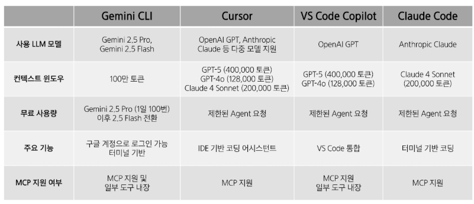

# AI 코딩 어시스턴트 - Day 1
# AI 코딩 어시스턴트 이해
## 생성형 AI 작동 원리
- 인터넷 상에 돌아다니는 방대한 언어 데이터에서 패턴 학습
  - GPT-3 기준 10만 자 책, 수백만 권 학습
- 확률에 따라 단어(토큰)을 하나씩 선택하며 답변 생성
- 생성형 AI는 사칙연산을 할 수 없음
### Chat CPT
- 토큰을 하나씩 선택사며 답변을 생성하는 GPT에 여러 도구(사칙 연산, 웹 검색, 코드 실행)을 연결한 챗봇 서비스
- GPT != Chat GPT
## AI 코딩 어시스턴트 발전
- GPT의 발전 + 여러 도구(파일 작성 및 수정, 브라우저 조작)
- 보조(Assistant)에서 대리인(Agent)으로 발전
### AI 시대, 코딩의 진화
- AI 이전 시대
  - 개발자가 직접 코드 작성
  - 에러 발생 시 공식 문서, Stack Overflow 참고해 직접 에러 해결
- 초기 AI 코딩 어시스턴트(ChatCPT, Claude, Gemini)
  - 개발자가 직접 코드 작성(GPT 도움)
  - 에러 발생 시 GPT의 답변을 참고해 직접 에러 해결
- 최근 AI 코딩 어시스턴트(CursorAI, VS Code Copilot, Gemini CLI)
  - 대부분의 코드를 AI가 작성
  - 개발자는 AI에게 작업을 지시(임무 지시) -> AI 코드 작성(임무 수행) -> 개발자의 검수
#### ※ AI의 발전으로 인해 점점 더 많은 영역이 자동화
### 바이브 코딩
- 바이브(Vibe, 직관)에 따라서 지시하고, AI가 만든 많은 코드를 받아들이고, 실제로 코드가 존재한다는 사실조차 잊어버리는 것
## AI 코딩 어시스턴트를 통한 개발 생산성 향상
- 고객
  - 빠른 MVP(Minimum Viable Product, 최소 기능 제품) 개발
  - 고객과의 원활한 의사 소통
  - 빠른 의사 결정
- 동료 개발자
  - 개발자-기획자-디자이너 간 원활한 소통과 협업
  - 리스크 조기 발견
- 시장
  - 빠르게 변하는 기술 환경에서 민첩하게 대응 가능
  - 제품-시장 적합성(Product-Market Fit) 확보 가능성 높아짐
## AI 코딩 어시스턴트 서비스 비교
#### 
# Gemini CLI 활용 기초 웹 페이지 구현 실습
## Gemini CLI 기초 사용법
- '/tools': 도구 목록 출력
### 코드 작성 및 실행
1. 사용자: 프롬프트 입력
2. AI: 인덱스 페이지 코드 작성
3. AI: WriteFile 도구로 파일 작성
4. AI: ReadFile 도구로 파일 조회
5. AI: Edit 도구로 파일 수정
6. AI: Edit 도구로 파일 수정(동일 디자인 적용)
## HTML, CSS 기반 웹 페이지 구현
# 참고
## 기타 Gemini CLI 단축키
- 대화 요약
  - '/compress'
  - 효율적인 토큰 관리
- 대화 저장
  - '/chat save + \<tag>'
  - \<tag>라는 이름의 대화를 저장(checkpoint 생성)
- 대화 목록 조회
  - '/chat list'
- 대화 불러오기
  - '/chat resume + \<tag>'
  - 저장한 대화 불러와 이어서 대화 가능
- 대화 삭제
  - '/chat deledte + \<tag>'
  - 저장한 대화 삭제