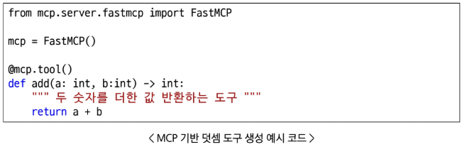

# AI 코딩 어시스턴트 - Day 3
# What & Why is MCP?
## MCP(Model Context Protocol)
- Model(AI 모델)이 다양한 Context(문맥)을 받아 활용할 수 있도록 약속된 Protocol(규칙)
### 도구를 이용한 컨텍스트 생성
- AI 기반 챗봇 서비스의 메시지 종류
  - system Message: 개발자가 사전에 작성한 프롬프트
- Human Message: 사용자가 입력한 프롬프트
- AI Message : AI가 생성한 답변
---
1. 도구와 도구 스키마 작성
   - 도구 이름
   - 도구 역할
   - 입력 파라미터
2. AI 모델 - 도구 연결(Tool Binding)
   - 서비스 시작 시 도구 스키마가 System Message와 함께 전달
3. 사용자 입력 밑 도구 호출
   - 사용자 입력(쿼리) 입력
   - 도구 스키마 기반 AI Message 생성 - 도구 호출
   - 도구가 게산한 결과 반환(Tool Message)
4. 결과 생성
   - System Message, Human Message, AI Message, Tool Message 기반 최종 답변을 AI Message에 생성
### MCP 프로토콜 기반 도구화
- 입력 파라미터, 반환 값의 타입을 명시(타입 힌팅)
- 함수 첫번째 줄에 문자열로 해당 도구 역할 묘사
- 함수 로직 작성 후 @mcp.tool 데코레이터 작성
#### 
- 도구를 MCP 프로토콜에 맞춰 개발 -> Gemini CLI, Cursor, VS Code Copilot에 쉽게 연결 가능
- MCP Host: LLM 기반 서비스(GeminiCLI, Claude, Cursor 등)
- MCP Server: 도구 모음(Gmail, Notion, GitHub, MS Word 등)
- MCP Client: Host와 Server를 연결하는 다리
## 코딩 특화 MCP
- Playwright: 브라우저 자동화 및 테스트
- Sequential Thinking: 단계별 사고 및 구조화된 문제 해결
- Context7: 최신 라이브러리 정보 제공
- Magic-mcp: 프런트엔드 템플릿 코드 제공
- GitHub: 코드, 이슈 PR 관리
  - 이슈 체크 -> 이슈 분석 -> 이슈 해결 -> 커밋
- Figma: 디자인 - 개발 연동 및 UI 구현
  - 프롬프트 -> Figma 화면 정의서 작성
  - Figma 화면 정의서 -> 코드 변환
- Notion: 노션 워크스페이스 연동
- Jira: 프로젝트 관리 및 이슈 트래킹
# 코딩 특화 MCP 활용 챗봇 서비스 개발
## Playwright MCP
- 브라우저 기반 웹 서비스 테스트 및 웹 크롤링 도구 Playwright

## 단위 테스트 with Playwright
## 문서 자동화 with Notion
## 단계적 계획 수립 with Sequential Thinking