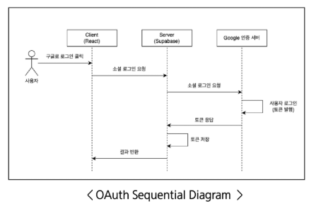
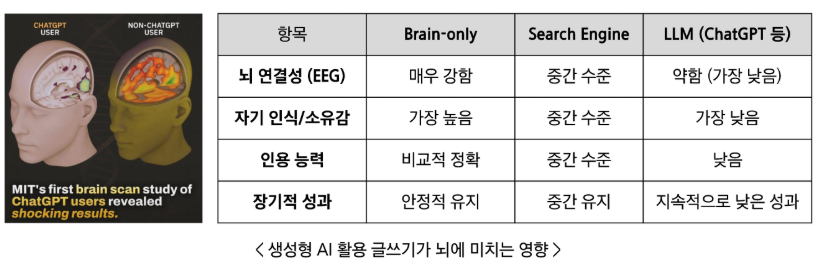
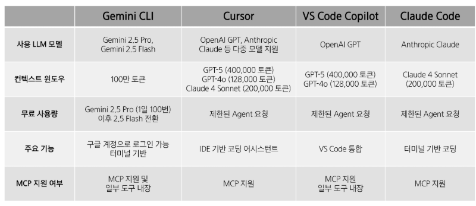

# AI 코딩 어시스턴트 - Day 4
# 인증 및 데이터베이스 구현
## Supabase
- PostgreSQL 기반 오픈소스 백엔드 플랫폼
- 데이터베이스, 인증, 파일 저장 등 제공
- Supabase MCP 서버 - 자연어로 데이터베이스 생성, 수정, 삭제 가능
- Supabase로 비교적 쉽게 OAuth(구글로 로그인) 구현 가능
## OAuth
- Open Authorization
- 사용자가 개인 정보를 직접 제공하지 않고 다른 서비스에서 해당 정보를 접근할 수 있도록 권한을 위임하는 프로토콜
- OAuth 순서도
  1. 구글로 로그인 클릭(Frontend)
  2. Frontend -> Backend 요청 전달
  3. Backend -> Google 인증 서버 요청 전달
  4. 사용자 로그인
   - 토큰 발행
  5. Google 인증 서버 -> Backend 토큰 응답
  6. 토큰 저장(Backend)
  7. Backend -> Frontend 응답 전달
- OAuth 구현 순서
  1. Superbase 서버 생성
  2. Google 인증 서버 생성
  3. Superbase - Google 연결
  4. Client - Server 연결
   - AI 코딩 어시스턴트와 Sequential Thinking MCP 서버를 활용해 구현
### Supabase를 통한 OAuth 구현
  -> 교안 찾아보기!!!
#### 
## Database
# AI 코딩 어시스턴트의 한계와 윤리, 그리고 미래
## AI 코딩 어시스턴트의 한계 및 주의사항
### AI 코딩 어시스턴트의 한계
- 한계: 코딩 지식 없는 바이브 코딩시 디버깅 어려움
- 의존성: 생성형 AI(Gemini), MCP 서버, Supabase가 멈춘다면?
### AI 코딩 어시스턴트 사용 시 주의사항
#### 
- 로그인 방법에 따른 개인정보 수집 여부(Gemini CLI)
  - 개인 Google 계정 -> 수집
    - 프롬프트, 답변, 관련 코드 모두 수집
    - Google 제품 개선 및 모델 훈련에 사용 가능
  - Gemini API 키(무료 서비스) -> 수집
    - 프롬프트, 답변, 관련 코드 모두 수집
    - 모델 개선 목적으로 사용 가능
  - 비즈니스/Enterprise 계정 -> 수집 안됨
    - 기밀 정보로 취급
    - 모델 훈련에 사용하지 않음
  - Gemini API 키(유료 서비스) -> 수집 안됨
    - 기밀 정보로 취급
    - 모델 훈련에 사용하지 않음
- 개인정보 유출 가능성(MCP)
  - MCP 사용 간 개인 정보 유출 가능
## AI 코딩 어시스턴트의 미래
- 기업들의 변화
  - AI 어시스턴트
    - 개발자: "React로 Todo App 만드는 코드 알려줘."
    - AI: 코드 블록만 제공. 개발자가 직접 붙여 넣고 실행해야 함
  - AI 에이전트
    - 개발자: "React + Node.js로 Todo App 프로젝트 개발해줘."
    - AI: 여러 도구를 호출해서 작업을 수행. 개발자는 결과물을 실행 및 검수
  - Agentic AI
    - 개발자: "Todo 앱이 필요해. 만들어줘."
    - 사용자가 구체적 지시 안 해도 AI 스스로 설계 -> 코딩 -> 실행 -> 개선(디버깅)까지 혼자 진행
  - AGI
    - AI: "일정 관리 앱 필요하실 것 같아서 만들었어요."
    - 사용자가 지시를 안 해도 AI 스스로 제안해 개발
#### 