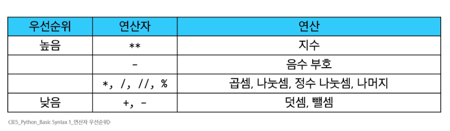
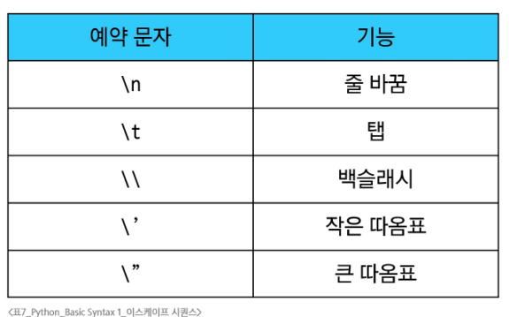

# 프로그래밍
- 프로그램: 컴퓨터에게 내리는 명령어 집합
- 프로그래밍: 그 명령어 묶음을 만드는 과정
- 프로그래밍 언어: 컴퓨터에게 작업을 지시하고 문제를 해결하는 도구
# Phthon
## 특징
- 쉽고 간결한 문법
- 풍부한 온라인 포럼 및 커뮤니티의 지원
- 웹 개발, 데이터 분석, 인공지능등 광범위한 응용 분야
- 전세계적으로 많이 사용되는 프로그래밍 언어(AI와 ML에서도)
  - TensorFlow, Pytorch 등 전문 라이브러리
  - 쉬운 문법과 높은 생산성
  - 강력한 커뮤니티와 생태계
## 표현식과 값
### 표현식: 하나의 값으로 평가될 수 있는 모든 코드
- 3 + 5
- x > 10
- 5 * 4
### 값: 표현식이 평가된 결과, 프로그램의 가장 기본적인 데이터 조각
- 숫자 값: 10.3
- 문자열 값: '안녕'
- 불리언 값: True, False
#### ※ 모든 값은 그 자체로 가장 단순한 형태의 표현식이지만, 모든 표현식이 값은 아니다. 평가를 거쳐야 값이 되는 경우도 존재
## 변수와 메모리
### 변수: 객체를 '재사용'하기 위해 특정 객체를 가리키는 이름표
### 변수명 규칙
- 영문 알파벳, 언더스코어(_), 숫자로 구성
- 숫자로 시작할 수 없음
- 대소문자 구분
- 기존 예약어 사용은 불가
#### ※ 재할당: 이미 값이 할당된 변수에 새로운 값을 다시 할당하는 것
# Data Types
- 변수나 값이 가질 수 있는 데이터의 종류
- 값/값에 적용할수 있는 연산
1. Numeric Types
- int: 정수
- float: 실수
#### ※ 지수 표현법: 1.23 * 10^9 -> 1.23e9
#### ※ 연산자 우선순위

2. Sequence Type
- 여러 데이터를 순서대로 나열하여 저장
- 인덱스를 통해 데이터에 접근
## 특징
1. 순서: 값들이 순서대로 저장(정렬X)
2. 인덱싱: 각 값에 고유 번호를 가지고 있으며, 인덱스를 사용하여 특정 위치의 값을 선택하거나 수정할 수 있음
3. 슬라이싱: 인덱스 범위를 조절해 전체 데이터 중 원하는 부분만 값을 잘라내서 사용할 수 있음
4. 길이: len() 함수를 사용하여 저장된 값의 개수를 구할 수 있음
5. 반복: 반복문을 사용하여 각 값을 하나씩 순서대로 꺼내 사용할 수 있음
## str
- 문자들의 순서가 있는 변경 불가능한 시퀀스 자료형
### 이스케이프 시퀀스 예약문자

# 참고
## 정수형의 진법 표현
- 2진수(binary): 0b
- 8진수(octal): 0o
- 16진수(hexadecimal): 0x
## 실수형의 부동소수점 오차
### 발생 원인
1. 컴퓨터는 2진법 사용
2. 무한 소수의 발생과 근사값 저장
### 해결책
- Decimal(): 실수를 2진수로 변화하지 않고 10진수 자체로 정확하게 연산할 수 있게 해줌
## 표현식과 문장
### 문장: 특정 '동작'을 지시하는 실행 가능한 코드의 최소 단위
## Style Guide
- https://peps.python.org/pep-0008/
## Python tutor
- https://pythontutor.com/