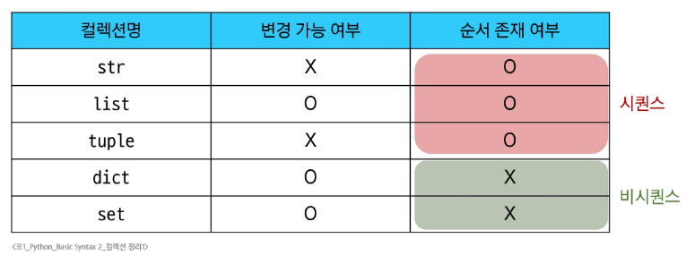
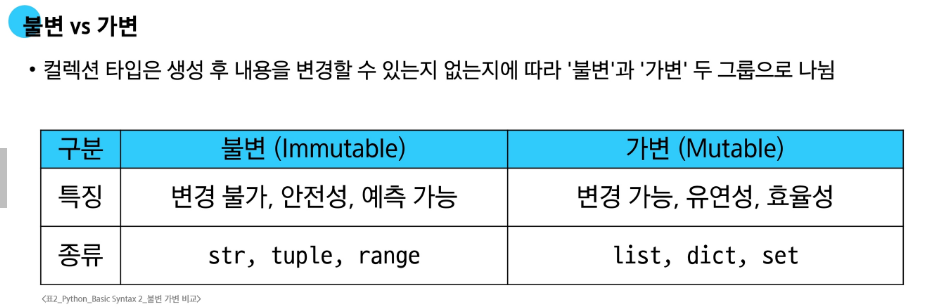
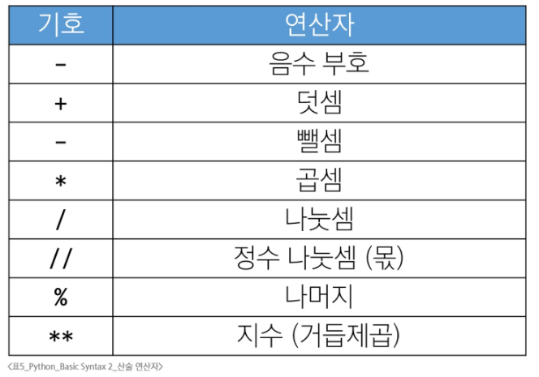
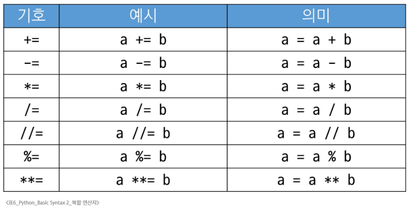
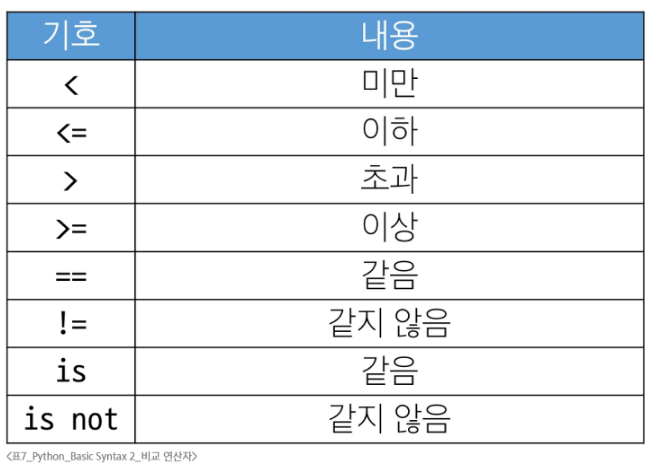
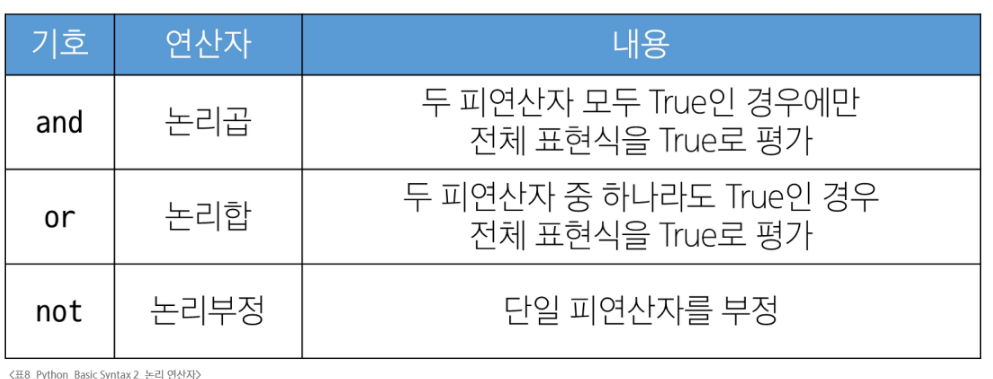

# Python - Basic Syntax 2
# list
- 순서대로 여러 개의 값 저장
- 변경가능한 시퀀스 자료형(수정, 추가, 삭제) ≠ 문자열(불변)
- 인덱싱, 슬라이실, 길이 확인, 반복 가능
# tuple
- 순서대로 여러 개의 값 저장
- 변경 불가능한 시퀀스 자료형
- 소괄호 없이 만들 수 있음
  - my_tuple = 1, 'hello', 3.14, True
- 단일 요소 튜플 생성시 반드시 후행 쉼표(Trailing comma) 사용
  - my_tuple = (1,)
- 인덱싱, 슬라이싱, 길이 확인, 반복 가능
- 데이터의 안정성과 무결성 보장
- 개발자가 직접 관여하기 보다는 파이썬 내부동작 목적. > 할당, 교환, 반환값
# range
- 연속된 정수 시퀀스를 생성
- 변경 불가능
### 규칙
1. 값의 범위 규칙
   - stop 값은 생성되는 시퀀스에 절대 포함되지 않음
2. 증가/감소 값(step) 규칙
   - step 양수: 증가, step 음수: 감소
### ※ 주로 반복문과 함께 사용
# dict
- key-value 쌍
- 순서와 중복이 없는 변경가능(non-sequence)한 자료형
- index가 없고 key로 접근
- 존재하지 않는 Key로 접근하면 KeyError 발생
### ※ 파이썬 3.7 이상에서는 입력 순서 출력시 보장되지만 순서는 없다!!!!!
## 규칙
- Key의 규칙
1. 고유한 값
   - Key는 중복될 수 없음
2. 변경불가능한 자료형만 사용가능
   - str, int, floar, tuple 가능
   - list, dict 불가능
- Value의 규칙
1. 어떤 자료형이든 자유롭게 사용할 수 있음
# set
- 순서와 중복이 없는 변경가능한 자료형
- 주로 집합연산에서 사용
- 빈 세트를 생성할 때는 반드시 set() 함수로 생성
## set의 집합 연산
- 합집합 |
- 차집합 -
- 교집합 &
# Other Types
1. None: 값이 존재하지 않음, 아직 정의되지 않음
2. Boolean: True / False
# Collection
- 여러개의 값을 하나로 묶어 관리
- ex) str, lisr, tuple, range, set, dict
# 
#### ※ 불변인 경우, 주소를 가지지 않고 데이터 자체가 저장됨

# 형변환
1. 암시적 형변환: 파이썬이 연산중에 자동으로 데이터 타입을 변환
- 정수&실수 연산에서 정수가 실수로 변환됨
- 불리언&정수 연산에서 불리언이 정수로 변환됨
2. 명시적 형변환: 개발자가 변환하고 싶은 타입을 직접 함수로 지정하여 변환
- 서로 다른 타입의 데이터를 호환되도록 맞추는 과정
# 
# 연산자
1. 산술 연산자: 수학적 계산을 위해 사용되는 연산자
# 
2. 복합 연산자: 연산과 할당이 함께 이루어짐\
# 
3. 비교 연산자: 두 값을 비교하여 True/False로 반환
# 
## == 과 is
### == 연산자
- 값이 같은지 비교
- 동등성
### is 연산자
- 객체 자체가 같은지 비교
- 식별성
- 같은 메모리 주소를 가리키는지 확인
- 주로 싱글턴 객체 비교에 사용
#### ※ Singleton 객체: 특정 값에 대해 파이썬 전체에서 단 하나의 객체만 생성되어 재사용, 항상 같은 메모리 주소(None, True, False)
4. 논리 연산자
# 
5. 단축 평가: 논리 연산에서 두 번째 피연산자를 평가하지 않고 결과를 결정, 똑똑한 게으름
- 코드 실행을 최적화하고, 불필요한 연산을 피할 수 있도록 함
- 단순히 True/False 논리 연산을 넘어, 코드의 흐름을 제어하고, 오류를 방지하며, 간결한 코드를 작성하는데 유용하게 사용
6. 멤버십 연산자
- 특정 값이 '컬렉션' 안에 특정 값이 포함되어 있는지 확인
- in/not in
7. 시퀀스형 연산자
- 시퀀스끼리의 연산에서 특별한 의미로 사용
- +(결합) / *(반복)
## ※ 연산자 우선순위
# 
# 참고
## Trailing Comma
- 컬렉션의 마지막 요소 뒤에 붙는 쉼표
- 일반적으로는 선택사항이지만, 하나의 요소로 구성된 튜플을 만들 때는 필수
- 규칙
  - 각 요소를 별도의 줄에 작성
  - 마지막 요소 뒤에 trailing comma 추가
  - 닫는 괄호는 새로운 줄에 배치
- 장점
1. 가독성 향상
   - 각 줄이 동일한 패턴을 가짐
   - 코드 리뷰가 용이
2. 유지보수 용이성
   - 항목 추가/제거가 간단
   - 실수로 인한 구문 오류 방지