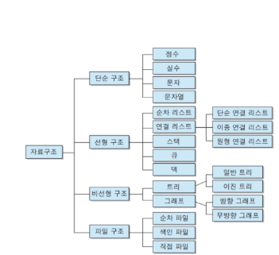
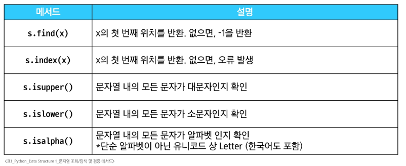
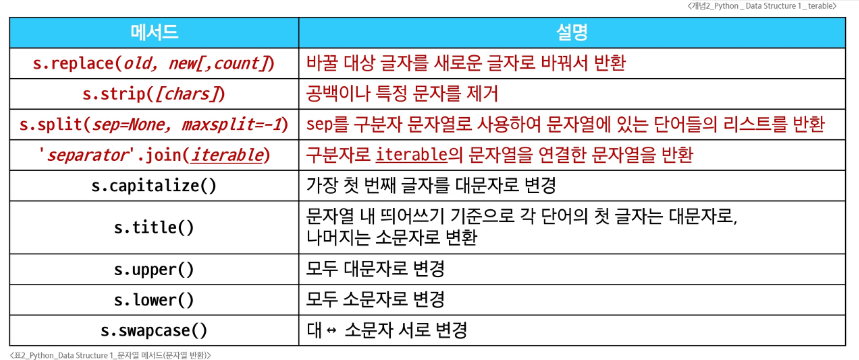
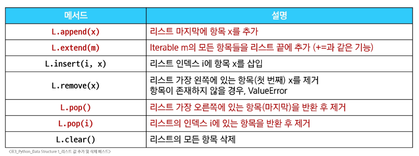
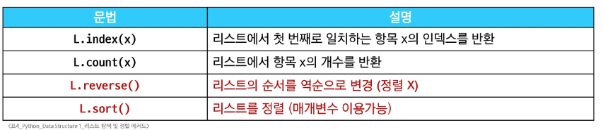
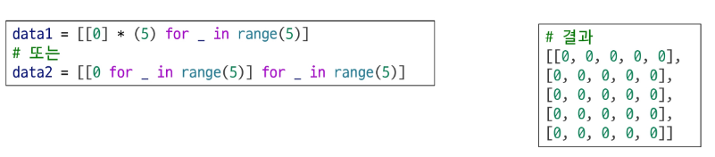

# Data Structure
- 각 데이터의 효율적인 저장, 관리를 위한 구조
- 프로그램의 성능과 효율성, 유지보수성에 영향
### (CS관점 자료구조)

## 메서드
- 객체에 속한 함수/객체가 특정 작업을 수행하도록 정의된 함수
- 클래스 내부에 정의되는 함수
- 클래스는 파이썬에서 '타입을 표현하는 방법'
- 각 데이터 타입별로 다양한 기능을 가진 메서드가 존재
- 함수의 범주 안에 속하기 때문에 반환값이 존재
### 메서드 호출
- 데이터 타입 객체.메서드()
#### ※ capitalize(): 문자열의 첫번째 알파벳을 대문자로 변환하는 메서드
# 시퀀스 데이터 구조
## 문자열
### 문자열 조회/탐색 및 검증 메서드

#### ※'is'로 시작하는 메서드는 반환값이 boolean
### 문자열 조작 메서드(새로운 문자열 반환)

#### ※ 문자열은 불변이라 사실 조작은 불가/원본을 조작하는 것이 아닌 새로운 문자열을 반환
##### ※ .split(sep=None)일때는 공백기준으로 구분자 처리
## 리스트
### 리스트 값 추가 및 삭제 메서드
#### ※ 리스트는 가변 객체이기 때문에 원본 자체를 조작/때문에 소수의 메서드를 빼면 반환값이 없다.(ex: print())/원본을 써야한다.

#### ※ .append()는 여러개 불가/.extend는 이터러블만 받아 여러개 가능
#### ※ .pop(i)는 제거한 값을 반환, 미지정 경우에는 마지막 항목을 제거
### 리스트 탐색 및 정렬 메서드

#### ※ .index()와 .count()는 반환값이 있다.
#### ※ .reverse는 원본 리스트를 역순으로 정렬한다>(X) 정렬은 안함, 반환값도 없다
.sort()
# 복사
## 객체와 참조
1. Mutable(가변객체)
- ex) list, dict, set
- 생성 후에도 내용 수정 가능
- 객체의 내용이 변경되어도 같은 메모리 주소 유지
- 기존 객체를 직접 수정하여 객체 생성 및 삭제에 드는 비용절감, 성능 향상
- 크기가 큰 데이터를 효율적으로 수정 가능
2. Immutable(불변객체)
- ex) int, float, str, tuple
- 생성 후 값을 변경할 수 없음
- 새로운 값을 할당하면 새 객체가 생성되고, 변수는 새 객체를 참조
- 여러 변수가 동일한 객체를 안전하게 공유 가능
- 동일값의 여러 변수가 같은 객체를 참조할 수 있어 메모리 사용을 최소화
### 파이썬에서 변수 할당은 객체를 메모리에 생성, 변수는 메모리를 참조
- 할당 시 새로운 객체 생성 후 변수가 참조 or 이미 메모리에 존재하는 객체를 할당 시 새 객체를 만들지 않고 참조만 생성
## Shallow Copy(얕은 복사)
- 객체의 최상위 요소만 새 메모리에 복사, 내부에 중첩된 객체가 있다면 그 객체의 참조만 복사됨
1. 리스트 슬라이싱
2. copy() 메서드
3. list() 메서드
## Deep Copy(깊은 복사)
- 객체의 모든 수준의 요소를 새로운 메모리에 복사, 중첩된 객체까지 모두 새 객체로 생성
- 완전한 독십성 보장, 원본 객체에 영향 X
- copy 모듈의 deepcopy() 함수 사용
# 참고
## List Comprehension
- Pythonic한 코드, 간결하고 효율적인 리스트 생성 방법
- 코드 길이가 더 길다고 해서 더 가독성이 좋은건 아니다. Comprehension을 남용하지 말자
#### ※ 인접행렬 생성

#### ※ 리스트를 생성하는 방법
1. for 문
2. List Comprehension
3. map
##### ※ 성능 비교
1. list comprehension
- 가장 'Pythonic'하고 대부분의 경우 우수한 성능을 보임
2. map
- 특정 상황(int, str 등 내장 함수와 함께 사용할 때)에서 가장 빠름
- 사용자가 직접 만든 함수나 lambda와 함께 사용될 때는 list comprehension과 성능이 비슷하거나 약간 느릴 수 있음
3. for loop
- 일반적으로 가장 느리다고 알려져 있지만, python 버전이 올라가면서 다른 방식과 비슷하거나 때로는 더 나은 결과를 보이기도 함
- 하지만, 여러 줄에 걸친 복잡한 조건문이나 예외 처리 등이 필요할 때는 유일한 선택지이며, 그 자체로 매우 유용함
##### 결론
- 성능 차이는 대부분의 경우 마이크로초 단위로 미미하므로, 코드의 가독성과 유지보수성을 최우선으로 고려하여 상황에 맞는 가장 명확한 방법을 선택하는 것을 권장
## Method Chaining
- 여러 메서드를 연속해서 호출하는 방식
##### ※메서드().메서드() >>> 반환값.메서드()
- 앞쪽에 반환값이 없다면 None.메서드()가 되므로 사용할 수 없다.
##### ※ .sort(): 리스트의 정렬 메서드, 반환값 없음 / sorted(): 내장함수, 반환값 존재
## 문자 유형 판별 메서드
- isdecimal() / isdigit() / isnumeric()