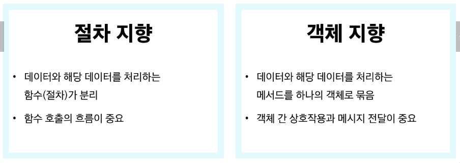
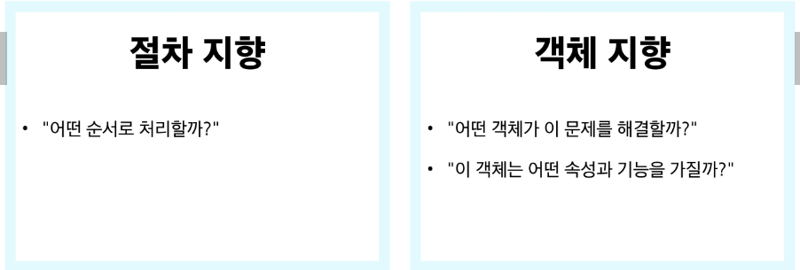
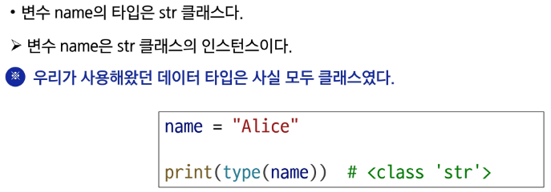
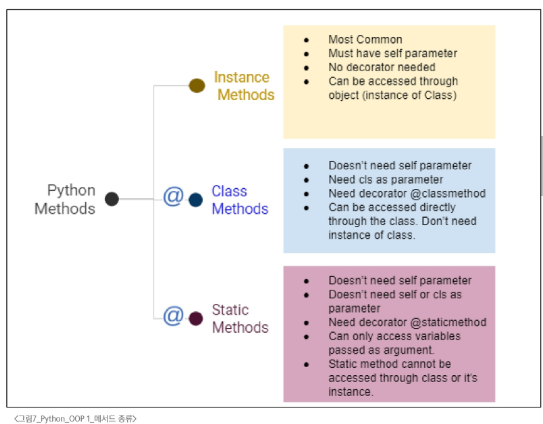
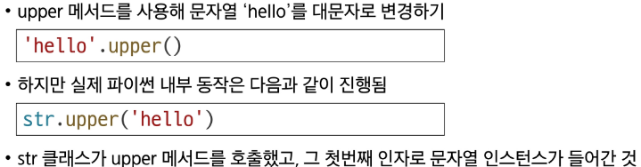

# 프로그래밍 패러다임
## 절차 지향과 객체 지향

### 절차 지향 프로그래밍
- 함수와 로직 중심 작성, 데이터를 순차적으로 처리
- 변수와 함수를 별개로 다룸
### 특징
1. 입력을 받고, 처리하고, 결과를 내는 과정이 위에서 아래로 순차적으로 흐르는 형태
2. 순차적인 명령어 실행
3. 데이터와 함수(절차)의 분리
4. 함수 호출의 흐름이 중요
#### ※ 데이터를 다시 재사용하기보다는 처음부터 끝까지 실행되는 결과물이 중요
### 한계
1. 복잡성 증가
- 프로그램 규모가 커질수록 데이터와 함수의 관리가 어려움
- 전역 변수의 증가로 인한 관리의 어려움
2. 유지보수 문제
- 코드 수정 시 영향 범위 파악이 어려움
### 객체 지향 프로그래밍
- 클래스는 설계도(Blueprint),인스턴스는 실제 물건
- 공통의 속성을 가지고 있지만 그외의 속성은 서로 다른 속성을 가질 수 있다.
- 객체들은 서로 독립적이다.
- 객체(클래스) 안에 기능(메서드)를 포함
- 객체가 스스로 기능을 수행하는 능동적 존재
- 실제 세계의 모델링 방식과 더 유사한 프로그래밍
### 특징
- 프로그램을 데이터(변수)와 그 데이터를 처리하는 함수(메서드)를 하나의 단위(객체)로 묶어서 조직적으로 관리
- 데이터와 메서드의 결합
#### ※ 절차 지향과 객체 지향은 대조되는 개념이 아니다. 객체 지향은 기존의 절차 지향을 기반으로 둔 보완적인 패러다임
## 객체와 클래스
### 객체
- 실제 존재하는 사물을 추상화 한것
- '속성'과 '동작'을 가짐
- 특징
  - Attribute: 객체의 상태/데이터
  - Method: 객체의 행동/기능
  - 고유성: 각 객체는 고유한 특성을 가짐(각 객체는 독립적)
### 클래스
- 객체를 만들기 위한 설계도
- 데이터와 기능을 함께 묶는 방법을 제공
- 파이썬에서 타입을 표현하는 방법
# 클래스 기초
## 클래스
- 클래스는 하나의 구조 안에 변수와 함수를 함께 정의하는 설계도
- 클래스 이름은 Pascal Case 방식으로 작성
- __init__메서드: 생성자 메서드
## 인스턴스
- 클래스를 통해 생성된 객체
- 각 인스턴스는 클래스 구조를 따라 동작하지만, 인스턴스 간 서로 독립적
## 클래스와 인스턴스
- 클래스를 정의한다는 것은 공통된 특성과 기능을 가진 틀을 만드는 것
- 실제 활동하는 개별 객체들은 이 틀에서 생성된 인스턴스
- 공통된 특성과 기능을 가진 틀(Structure)을 만드는 것은 곧 새로운 타입을 만드는 행위
  - '아이유는 인스턴스다.'라는 표현이 모호한 이유 역시 마찬가지
  - '무슨 타입의 인스턴스'인지를 알 수 없기 때문
- 하나의 객체는 특정 클래스의 인스턴스이다.

## 클래스 구성요소
- 생성자 메서드
  - 인스턴스 생성 시 자동 호출되는 특별한 메서드
  - __init__이라는 이름의 메서드로 정의
  - 인스턴스 변수의 초기화 담당
- 인스턴스 변수(속성)
  - 각 인스턴스별 고유한 속성
  - self.변수명 형태로 정의
  - 인스턴스마다 독립적인 값 유지
- 클래스 변수(속성)
  - 모든 인스턴스가 공유하는 속성
  - 클래스 내부에서 직접 정의
## 클래스 변수와 인스턴스 변수
- 클래스 변수와 동일한 이름으로 인스턴스 변수 생성 시 클래스 변수가 아닌 인스턴스 변수를 먼저 참조하게 됨
# 메서드
- 클래스 내부에 정의된 함수로, 해당 객체가 어떻게 동작할 지를 정의

## 인스턴스 메서드
- 인스턴스의 상태를 조작하거나 동작을 수행
- 인스턴스마다 독립적으로 행동할 숭 있게 만들어 놓은 것
- 클래스 내부에 정의되는 메서드의 기본
- 반드시 첫번째 인자로 인스턴스 자신(self)을 받음
- 인스턴스의 속성에 접근하거나 변경 가능
#### ※ self는 매개변수 이름일 뿐이며 다른 이름으로 설정 가능하지만, 다른 이름을 사용하지 않을 것을 강력히 권장
## ※ self 동작 원리

- 인스턴스 메서드의 첫번째 인자가 반드기 인스턴스 자기 자신인 이유(그래야 호출하는 해당 인스턴스에 독립적으로 적용)
- 객체 지향 방식의 메서드로 호출하는 표현(단축형 호출)
- 생성자 메서드도 큰 범주에서는 결국 인스턴스 메서드에 속함
## 생성자 메서드
- 인스턴스 객체가 생성될 때 자동으로 호출되는 메서드 > 인스턴스 변수들의 초기값을 설정
- 초기값이 없을 때 생성자 메서드를 생략해도 내부적으로 생성되며 작동되지만, 빈 생성자 메서드라도 쓰는걸 권장(확장성의 관점)
## 클래스 메서드
- 클래스 변수(공통 속성)를 조작하거나 클래스 레벨의 동작을 수행합니다.
- 공통 속성은 인스턴스가 아닌 클래스가 컨트롤하도록 작성하는 것이 좋은 코드
- @classmethod 데코레이터를 사용하여 정의(함수의 기능을 확장)
- 호출시, 첫번째 인자로 해당 메서드를 호출하는 클래스(cls)가 전달됨(자기 자신 클래스)
- 클래스를 인자로 받아 클래스 속성을 변경하거나 읽는데 사용
#### ※ cls는 매개변수 이름일 뿐이며 다른 이름으로 설정 가능하지만, 다른 이름을 사용하지 않을 것을 강력히 권장
## 스태틱 메서드
- 클래스, 인스턴스와 상관없이 독립적으로 동작하는 메서드
- @staticmethod 데코레이터를 사용하여 정의
- 호출 시 자동으로 전달 받는 인자가 없음(ex: self, cls)
- 인스턴스나 클래스 속성에 직접 접근하지 않는, '도우미 함수'와 비슷한 역할

인스턴스 > 인스턴스 메서드
클래스 > 클래스 메서드, 스태틱 메서드
파이썬에서는 기능적으로 막혀있지 않다. 세개 다 호출 가능 그러나 그렇게 설계하면 안된다
## 메서드 활용
## 메서드 정리
# 참고
## 클래스와 인스턴스 간 이름 공간
## 매직 메서드
## 데코레이터