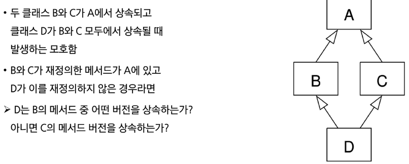

# ㅇㅇㅇㅇ
# 상속
- 한 클래스(부모)의 속성과 메서드를 다른 클래스(자식)가 물려받는 것
- 부모와 자식 클래스 간의 상하관계가 형성, 부모가 본인의 속성과 메서드를 자식에게 넘겨주는 것
## 상속이 필요한 이유
1. 코드 재사용
- 상속을 통해 기존 클래스의 속성과 메서드를 재사용할 수 있음
- 기존 클래스를 수정하지 않고도 기능을 확장할 수 있음
2. 계층 구조
- 상속을 통해 클래스들 간의 계층 구조를 형성할 수 있음
- 부모 클래스와 자식 클래스 간의 관계를 표현하고, 더 구체적인 클래스를 만들 수 있음
3. 유지 보수의 용이성
- 상속을 통해 기존 클래스의 수정이 필요한 경우, 해당 클래스만 수정하면 되므로 유지 보수가 용이해짐
- 코드의 일관성을 유지하고, 수정이 필요한 범위를 최소화할 수 있음
## Method Overriding
- 부모 클래스의 메서드를 같은 이름, 같은 파라미터 구조로 재정의하는 것
- 자식 클래스에서 메서드를 다시 정의하면, 부모 클래스 대신 자식 클래스의 메서드가 실행
- 오버라이딩은 동일한 이름과 매개변수를 사용하지만, 내부 동작을 원하는 대로 바꿀 수 있게 해줌
- 부모 클래스의 기능을 유지하면서도 일부 동작을 맞춤형으로 바꾸고 싶을 때 유용
## ※ Overloading
- 같은 이름, 다른 파라미터를 가진 여러 메서드를 정의하는 것(파이썬은 미지원)
- 파이썬은 실제로 하나의 메서드만 인식하며, 인자의 형태가 다르다는 이유로 메서드를 여러 개 구분하여 불러주지 않음
- 파이썬은 마지막으로 선언된 메서드만 인식함
## 다중 상속
- 둘 이상의 상위 클래스로부터 여러 행동이나 특징을 상속받을 수 있음
- 상속받은 모든 클래스의 요소를 활용 가능
- 중복된 속성이나 메서드가 있는 경우 상속 순서에 의해 결정
### The diamond problem

- 파이썬에서는 해결책으로 MRO 알고리즘을 사용하여 클래스 목록을 생성
### MRO(Method Resolution Order)
- 파이썬이 메서드를 찾는 순서에 대한 규칙, 메서드 결정 순서
- 부모 클래스로부터 상속된 속성을 정해진 내부 알고리즘에 따라 검색
- 이 순서는 기본적으로 왼쪽에서 오른쪽으로 진행되며, 계층 구조에서 중복되는 클래스는 한 번만 확인
- 그래서, [class D(B, C): pass]의 경우, 속성이 D에서 발견되지 않으면, B에서 찾고, 거기서도 발견되지 않으면, C에서 찾는 식
## super() 메서드
- MRO에 따라, 현재 클래스의 부모 클래스의 메서드나 속성에 접근할 수 있게 해주는 내장 함수
---------
추가추가추가
# 에러외 예외

# 예외 처리

# 참고

