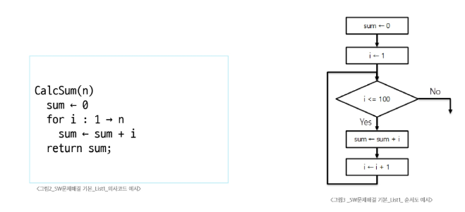
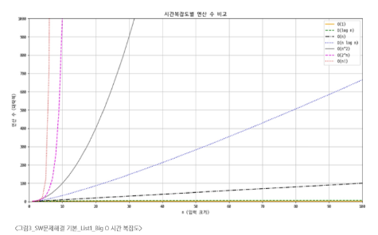

# List
## Algorithm
  문제를 해결하기 위한 절차나 방법
### ※ Pseudocode: 컴퓨터 분야에서 알고리즘을 표현하는 방법
# 
## 알고리즘의 성능
- 정확성: 얼마나 정확하게 동작하는가
- 작업량: 얼마나 적은 연산으로 원하는 결과를 얻어내는가
- 메모리 사용량: 얼마나 적은 메모리를 사용하는가
- 단순성: 얼마나 단순한가
- 최적성: 더 이상 개선할 여지없이 최적화되었는가
## 알고리즘의 시간 복잡도
- 알고리즘의 작업량을 표현
- Time Complexity
  - 실제 걸리는 시간을 측정
  - 실행되는 명령문의 개수를 계산
## ※ Big-O Notation
- 시간복잡도 함수 중에서 가장 큰 영향력을 주는 n에 대한 항만을 표시
- 계수는 생략하여 표시
# 
## 배열(Array)
  일정한 자료형의 변수들을 하나의 이름으로 열거하여 사용하는 자료구조
### ※ 실제 메모리 안에서 연속된 공간을 사용
## 배열의 필요성
- 프로그램 내에서 여러 개의 변수가 필요할 때
- 배열을 사용하면 하나의 선언을 통해서 둘 이상의 변수를 선언
  - 일일이 다른 변수명을 이용하여 자료에 접근하는 것은 매우 비효율적일 수 있음
- 단순히 다수의 변수 선언을 의미하는 것이 아님
  - 다수의 변수로는 하기 힘든 작읍을 배열을 활용해 쉽게 할 수 있음
    ※ 크기가 정해진 배열을 사용하는 것이 좋음(.append(): 크기가 작을 때는 괜찮지만 계속 반복시 시간이 오래 걸림)
---
    정수 N 입력 -> N = int(input())
    공백으로 구분된 정수들을 리스트로 입력 받는 코드 -> arr = list(map(int, input().split()))
---
## 정렬(Sort): 2개 이상의 자료를 키에 의해 오름차순 혹은 내림차순으로 재배열하는 알고리즘
## 버블정렬(Bubble Sort)
- 인접한 두 개의 원소를 비교하며 자리를 계속 교환하는 방식
- O(n²)
- 과정
  1. 첫 번째 원소부터 인접한 원소끼리 계속 자리를 교환하면서 맨 마지막 자리까지 이동
  2. 한 단계가 끝나면 가장 큰 원소가 마지막 자리로 정렬됨