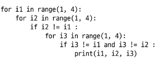

## 카운팅 정렬(Counting Sort)
- 항목들의 순서를 결정하기 위해 집합에 각 항목이 몇 개씩 있는지 세는 작업을 하여, 선형 시간에 정렬하는 효율적인 방식
- 정수나 정수로 표현할 수 있는 자료에 대해서만 적용가능
  - 각 항목의 발생 횟수를 기록하기 위해, 정수 항목으로 인덱스 되는 카운트들의 배열을 사용하기 때문
- 카운트들을 위한 충분한 공간을 할당하려면 집합 내의 가장 큰 정수를 알아야 함
- 시간 복잡도: O(n+k)    (n:리스트 길이, k: 정수의 최댓값)
## 완전 검색(Exaustive Search)
- 문제의 해법으로 생각할 수 있는 모든 경우의 수를 나열해보고 확인하는 기법
- Brute-force 혹은 generate-and-test
- 경우의 수가 상대적으로 작을 때 유용
- 모든 경우의 수를 생성하고 테스트하기 때문에 수행 속도는 느리지만, 해답을 찾아내지 못할 확률이 적다.
- 우선 완전 검색으로 접근하여 해답을 도출한 후 , 성능 개선을 위해 다른 알고리즘을 사용하고 해답을 확인하는 것이 바람직
## 순열(Permutation)
- 서로 다른 n개 중 t개를 택해서 한 줄로 나열하는 것
- {1, 2, 3}을 포함하는 모든 순열을 생성하는 함수
#### 
## 탐욕 알고리즘(Greedy)
- 여러 경우 중 하나를 결정해야 할 때마다 그 순간에 최적이라고 생각되는 것을 선택해 나가며 최종 해답에 도달하는 방식
- 최적해를 구하는 근시안적 방법
- 각 선택의 시점에서 이루어지는 결정은 지역적으로는 최적이지만, 그 선택들을 계속 수집하여 최종적인 해답을 만들었다고 하여, 그것이 최적이라는 보장은 없음
- 일반적으로, 머릿속에 떠오르는 생각을 검증 없이 바로 구현하면 Greedy 접근
## 탐욕 알고리즘 과정
1. 해 선택: 현재 상태에서 부분 문제의 최적해를 구한 뒤, 이를 부분 해 집합(Solution Set)에 추가
2. 실행 가능성 검사: 새로운 부분 해 집합이 실행 가능한지 확인. 곧, 문제의 제약 조건을 위반하지 않는지 검사
3. 해 검사: 새로운 부분 해 집합이 문제의 해가 되는지 확인. 아직 전체 문제의 해가 완성되지 않았다면 ①의 해 선택부터 다시 시작

float('inf') 무한 양수

# 2차원 List

## 2차원 배열

## 델타

# 검색과 정렬

## 순차검색

## 이진검색(Binary Search)

## 선택정렬(Selection Sort)

## Selection Algorithm
