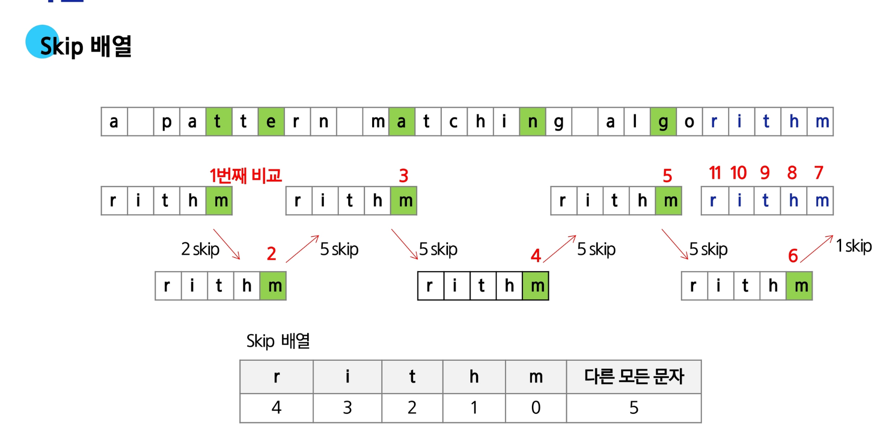

# SW 문제해결 기본 - String
# 문자열
## 코드체계
## 문자열
## 연산
- 문자열 뒤집기
  - 문자열을 역순으로 재정의
```python
s = 'Reverse this strings'
s = s[::-1]
```
  - 리스트로 변환 후 다시 문자열로 변환
```python
s = 'abcd'
s = list(s)
s.reverse()
s = ''.join(s)
```
- 회문
```python
# 코드 재확인 필요!!!
is_palindrome(txt):
  for i in range(len(txt) / 2 - 1)
    if txt[i] != txt[len(txt) - 1 - i]
      return False
  return True
```
- 문자열 비교
  - == 연산자
    - 값이 같은지 비교
    - 내부적으로 특수 매서드 __eq__() 를 호출
  - is 연산자
    - 객체의 정체성, 즉 같은 객체(메모리 주소)d인지 비교
## C와 Java에서의 문자열 비교
- C
  - strcmp() 함수를 사용해 문자열의 내용을 비교
- Java
  - == 연산자는 개체의 주소(참조)를 비교(python 의 is 연산자 역할)
  - equals() 메소드는 객체의 내용을 비교(python 의 == 역할)
## 사전 순서 비교
- 비교 연산자 < 사용 -> 유니코드를 비교
```python
def my_strcmp(s1, s2):
  if s1 < s2:
    return -1       # s1이 s2보다 사전 순서상 앞서는 경우
  elif s1 > s2:
    return 1        # s1이 s2보다 사전 순서상 나중인 경우
  else:
    return 0        # s1과 s2 문자열의 내용이 같은 경우
```
## 문자열 숫자를 숫자로 변환
1. 문자열을 숫자로 변환
```python
a = int('123')
b = float('3.14')
c = int('A0', 16)
```
2. 숫자를 문자열로 변환
```python
a = str(123)
b = str(3.14)
```
# 페턴매칭
## 고지식한 패턴 검색(Brute Force)
1. i, j 모두 증가, 실패시 i: 이전 시작 다음부터 j:0부터 ->
2. t[i+j]와 p[j] 비교
  >>>> 공유 코드 확인!
- 시간 복잡도
  - 최악의 경우 텍스트의 모든 위치에서 패턴을 비교해야 하므로 O(MN)
  - ex) 길이가 10,000인 문자열에서 길이 80인 패턴을 찾는 경우
    - 최악의 경우 약 10,000 * 80 = 800,000 번의 비교가 필요
## KMP 알고리즘
- 연구자인 Knuth, Morris, Pratt 세 사람의 이름에서 유래
- 패턴의 각 위치에서 매칭에 실패했을 때 돌아갈 위치를 미기 계산
  - 불일치가 발생한 글자의 앞 부분에 어떤 문자가 있는지를 미리 알고 있게 됨
  - 조건에 따라, 불일치가 발생한 앞 부분에 대하여 다시 비교하지 않을 수 있음
  - 불일치가 발생했을 경우 이동할 다음 위치를 계산하는 '전처리'가 필요
- 시간 복잡도
  - 패턴의 길이가 M일 때 전처리에 걸리는 시간은 O(M)
  - 텍스트의 길이가 N일 때 검색은 최악의 경우 O(N)
  - 결과적으로 O(M + N)
  - 만약 M이 고정된 값으로 매우 짧다면 평균적으로 θ(N)
## LPS(Longest Prefix which is also Suffix) 베얄
- 접두사이자 접미사인 문자열의 최대 길이
- 일치하지 않을 때 비교할 인덱스
- 구현에 따라 next, pi 배열로도 불림
## 보이어-무어 알고리즘
- 상용 소프트웨어에서 채택하고 있는 알고리즘
- 실제 검색에서 매우 빠른 성능
  - 패턴 오른쪽 끝의 문자가 불일치하고 이문자가 패턴내에 존재하지 않는 경우, 이동 거리는 패턴의 길이가 됨
### 물일치 문자 유리스틱(Bad-Characrter)
- 오른쪽 끝에 있는 문자가 불일치하고 이 문자가 패턴 내에 존재할 경우
  - 불일치 문자 오른쪽에서 일치한 부분을 고려해 점프
### Skip 배열
)
## 문자열 암호화
### 시저암호