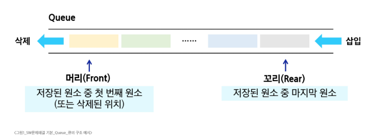
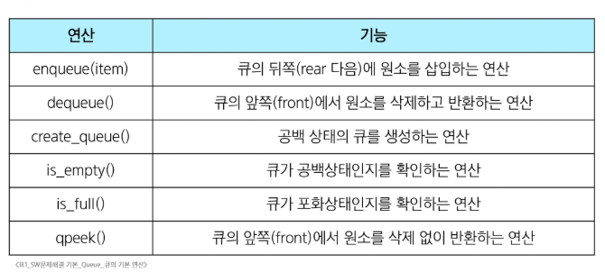
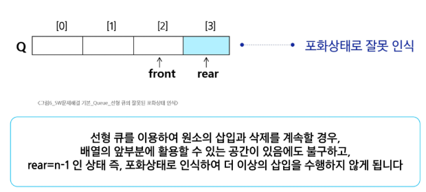
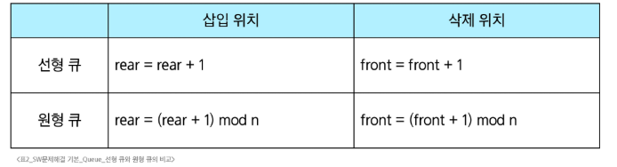

# SW 문제해결 기본 - Queue
# Queue
## 큐
- 먼저 들어온 데이커가 먼저 나가는 선형 자료구조
  - FIFO(First In First Out)
- 스택과 마찬가지로 삽입과 삭제의 위치가 제한적인 자료구조
- 큐의 뒤에서는 삽입만, 앞에서는 삭제만 이루어지는 구조
#### 
- 큐의 기본 연산
#### 
## 선형 큐(Linear Queue)
- 데이터를 일렬로 저장하며, 앞에서 꺼내고 뒤에 넣는 기본 큐 구조
- 구현
  - 배열이나 연결 리스트로 구현 가능
  - 큐의 크기는 배열의 크기와 동일
  - front: 가장 최근에 삭제된 원소의 인덱스
  - rear: 마지막으로 저장된 원소의 인덱스
- 상태 표현
  - 초기 상태: front = rear = -1
  - 공백 상태: front == rear
  - 포화 상태: rear == n - 1 (n: 배열의 크기, n - 1: 배열의 마지막 인덱스)
- 선형 큐의 구현
  1. 초기 공백 큐 생성: create_queue()
       - 크기 n인 1차원 배열 생성
       - front와 rear를 -1로 초기화
  2. 삽입: enqueue(item)
       - 마지막 원소 뒤에 새로운 원소를 삽입하기 위해
         1. rear 값을 하나 증가시켜 새로운 원소를 삽입할 자리를 지정
         2. 그 인덱스에 해당하는 배열원소 Q[rear]에 item 저장
  3. 삭제: dequeue()
       - 가장 앞에 있는 원소를 삭제하기 위해
         1. front 값을 하나 증가시켜 뮤에 남아있는 첫번째 원소 이동
         2. 새로운 첫번쨰 원소를 리턴함으로써 삭제와 동일한 기능
  4. 공백상태 및 포화상태 검사: is_empty(), is_full()
       - 공백상태: front == rear
       - 포화상태: rear == n - 1
  5. 검색: qpeek()
       - 가장 앞에 있는 원소를 검색하여 반환하는 연산
       - 현재 front의 한자리 뒤(front + 1)에 있는 원소, 즉 큐의 첫번째에 있는 원소 반환
## 원형 큐(Circular Queue)
- 선형 큐의 공간 낭비를 막기 위해 처음과 끝이 연결된 구조
- 선형 큐 이용시 문제점
  - 잘못된 포화상태 인식
#### 
  - 해결방법 1
    - 매 연산이 이루어질 때마다 저장된 원소들을 배열의 앞부분으로 모두 이동
    - 그러나, 이 방법은 원소 이동에 많은 시간이 소요되어 큐의 효율성이 급격히 떨어짐
  - 해결방법 2
    - 1차원 배열을 사용해 논리적으로 배열의 처음과 끝이 연결되어 원형 형태를 이룬다고 가정하고 사용
- 원형 큐의 구조
  - 초기 공백상태: front = rear = 0
  - 공백상태: front == rear
  - 포화상태: 삽입할 rear의 다음 위치 == 현재 front
  - Index의 순환
    - front와 rear의 위치가 배열의 마지막 인덱스인 n - 1을 가리킴
    - 그 다음에는 논리적 순환을 이루어 배열의 처음 인덱스인 0으로 이동해야 함
    - 이를 위해 나머지 연산자 mod를 사용
  - front 변수
    - 공백 상태와 포화 상태 구분을 쉽게 하기 위해 front가 있는 자리는 사용하지 않고 항상 빈자리로 둠
- 선형 큐와 원형 큐 비교
#### 
## 연결 큐(Linked Queue)
- 연결 리스트를 이용해 구현한 큐
- 연결 큐의 구조
  - 단순 연결 리스트(Linked List)를 이용한 큐
    - 큐의 원소: 단순 연결 리스트의 노드
    - 큐의 원소 순서: 노드의 연결 순서. 링크로 연결되어 있음
    - front: 첫번째 노드를 가리키는 링크
    - rear: 마지막 노드를 가리키는 링크
  - 상태 표현
    - 초기 상태: front = rear = null
    - 공백 상태: front = rear = null
- deque(Double-Ended Queue)
  - 컨테이너 자료형 중 하나로 양쪽 끝에서 빠르게 추가와 삭제를 할 수 있는 리스트류 컨테이너
    - 연결 리스트를 직접 만들지 않아도 됨
- deque의 연산
  - append(x): 오른쪽에 x 추가
  - popleft(): 왼쪽에서 요소를 제거하고 반환. 요소가 없으면 IndexError
  - 'from collections import deque' 필수
## 우선순위 큐(Priority Queue)
- 우선순위를 가진 항목들을 저장하는 큐
- FIFO 순서가 아닌, 우선순위가 높은 순서대로 먼저 나감
- 적용 분야: 시뮬레이션 시스템, 네트워크 트래픽제어, 운영체제의 테스크 스케줄링
- 우선순위 큐의 구현
  - 배열을 이용한 우선순위 큐
    - 원소를 삽입하는 과정에서 우선순위를 비교하여 적절한 위치에 삽입하는 구조
    - 가장 앞에 최고 우선순위의 원소가 위치
    - 문제점
      - 배열을 사용하므로, 삽입이나 삭제 연산시 원소의 재배치 발생
      - 이에 소요되는 시간이나 메모리 낭비가 큼
  - 리스트를 이용한 우선순위 큐
# 큐의 활용
## 버퍼
- 데이터를 한곳에서 다른 한 곳으로 전송하는 동안 일시적으로 그 데이터를 보관하는 메모리의 영역
- 버퍼링: 버퍼를 활용하는 방식 or 버퍼를 채우는 동작
- 버퍼의 자료 구조
  - 버퍼는 일반적으로 입출력 및 네트워크와 관련된 기능에서 이용
  - 순서대로 입력/출력/전달되어야 하므로 FIFO방식의 자료구조인 큐가 활용됨
- ex) 키보드 버퍼
## BFS