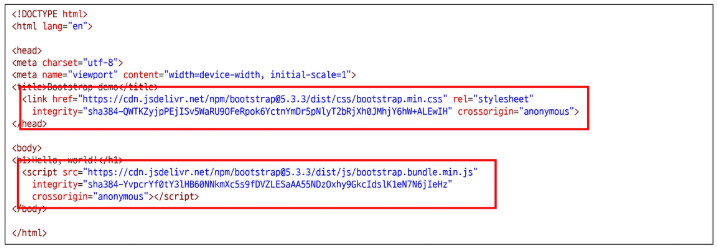
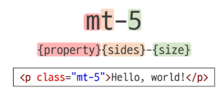
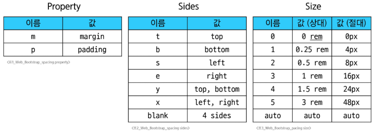
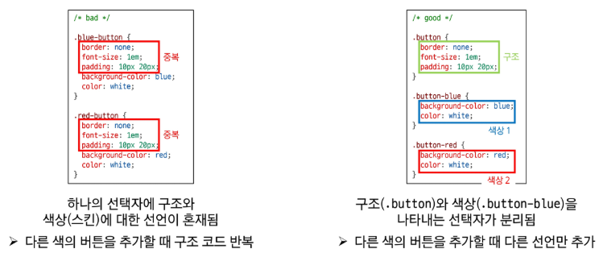

# Web - Bootstrap
# Bootstrap
- CSS 프로트엔드 프레임워크(Toolkit, 도구상자)
  - 미리 만들어진 다양한 디자인 요소들을 제공하여 웹 사이트를 빠르고 쉽게 개발할 수 있도록 함
  - 생산성을 위함(빠르게)
- 현재 가장 인기있는 프론트엔드 프레임워크
  - https://gitstar-ranking.com/repositories
### Bootstrap 사용해보기
- Bootstrap 설치
  - https://getbootstrap.com/ 접속 후 Read the docs
  - 또는 구글 검색 후 Get started with Bootstrap
  - "2. Include Bootstrap's CSS and JS." 코드 복사
#### 
  - Bootstrap은 CSS와 JavaScript로 만들어져 있음
    - link와 script 요소로 HTML에 추가
### CDN(Content Delivery Network)
- 서버와 사용자 사이의 물리적인 거리를 줄여 콘텐츠 로딩에 소요되는 시간을 최소화
  - 웹 페이지 로드 속도를 높임
- 지리적으로 사용자와 가까운 CDN이 서버에 콘텐츠를 저장해서 사용자에게 전달
- 전세계에 위탁
### Bootstrap CDN
1. Bootstrap 홈페이지 - Docs - Download - "Compiled CSS and JS" 다운로드
2. bootstrap.css, bootstrap.js 파일 참고
   - 온라인 CDN에 업로드 된 CSS 및 JS 파일을 불러와서 사용하는 것
## Bootstrap 사용 가이드
### Bootstrap 기본 사용법
- Bootstrap에는 특정한 규칙이 있는 클래스 이름으로 스타일 및 레이아웃이 미리 작성되어 있음
- Spacing을 표현하는 방법
  - property: margin 또는 padding
  - sides 방향(top, left, x, y 등)
  - size: Spacing의 상대적 너비
#### 
### Bootstrap에서 클래스 이름으로 Spacing을 표현하는 방법
#### 
- https://getbootstrap.com/docs/5.3/utilities/spacing/#margin-and-padding
# Reset CSS
- 모든 HTML 요소 스타일을 일관된 기준으로 재설정하는 간결하고 압축된 규칙 시트
- HTML Element, Table, List 등의 요소들에 일관성있게 스타일을 적용시키는 기본 단계
## Bootstrap 적용 전/후 비교
- Bootstrap을 HTML에 반영하면 일부 스타일이 바뀜
  - h1 요소의 폰트 변경됨
  - body와의 여백 사라짐
## Reset CSS 사용 배경
- 모든 브라우저는 각자의 'user agent stylesheet'를 가지고 있음
  #### ※ User-agent stylesheets: 모든 문서에 기본 스타일을 제공하는 기본 스타일 시트
  - 웹 사이트를 보다 읽기 편하게 하기 위해
- 문제는 이 설정이 브라우저마다 상이하다는 것
- 모든 브라우저에서 웹 사이트를 동일하게 보이게 만들어야 하는 개발자에겐 매우 골치 아픈 일
- 해결책: 모두 똑같은 스타일 상태로 만들로 스타일 개발을 시작(표준에 근거해 최소화)
## Normalize CSS
- Reset CSS 방법 중 대표적인 방법
- 웹 표준 기준으로 브라우저 중 하나가 불일치 한다면 차이가 있는 브라우저를 수정하는 방법
  - 경우에 따라 IE 또는 EDGE 브라우저는 표준에 따라 수정할 수 없는 경우도 있는데, 이 경우 IE 또는 EDGE의 스타일을 나머지 브라우저에 적용시킴
## Bootstrap에서의 Reset CSS
- Bootstrap은 bootstrap-reboot.css라는 파일명으로 normalize.css를 자체적으로 커스텀해서 사용하고 있음
# Bootstrap 활용
## Typography
- 제목, 본문 텍스트, 목록 등
## Colors
## Component
### Bootstrap Component
- Bootstrap에서 제공하는 UI 관련 요소(버튼, 네비게이션 바, 카드, 폼, 드랍다운 등)
- 이점: 일관된 디자인을 제공하여 웹 사이트의 구성 요소를 구축하는데 유용하게 활용
nodeal도  darousel과 마찬가지로 
# Semantic Web
- 웹 데이터를 의미론적으로 구조화된 형태로 표현하는 방식
- 요소의 시각적 측면이 아닌 요소의 목적과 역할에 집중하는 방식
## Semantic in HTML
### HTML 요소가 의미를 가진다는 것
- 외형 보다는 요소 자체의 의미에 집중하는 것
### HTML Semantic Element
- 기본적인 모양과 기능 이외의 의미를 가지는 HTML 요소
- 검색엔진 및 개발자가 웹 페이지의 콘텐츠를 이해하기 쉽게 해줌
### HTML Semantic Element 예시
- header
  - 소개 및 탐색에 도움을 주는 콘텐츠
- nav
  - 현재 페이지 내, 또는 다른 페이지로의 링크를 보여주는 구획
- main
  - 문서의 주요 콘텐츠
- article
  - 독립적으로 구분해 배포하거나, 될 수 있는 구성의 콘텐츠 구획
- secrion
  - 문서의 독립적인 구획
  - 더 적합한 요소가 없을 때 사용
- aside
  - 문서의 주요 내용과 간접적으로만 연관된 부분
- footer
  - 가장 가까운 조상 구획(main, article 등)의 작성자, 저작권 정보, 관련 문서
#### ※ Sematic 요소가 브라우저에 보여질 때는 div 요소와 똑같이 나오게 됨
## Semantic in CSS
### CSS 방법론
- CSS를 효율적이고 유지 보수가 용이하게 작성하기 위한 일련의 가이드라인
### OOCSS(Object Oriented CSS)
- 객체 지향적 접근법을 적용하여 CSS를 구성하는 방법론
  1. 구조와 스킨을 분리
    - 구조와 스킨을 분리함으로써 가능성을 높임
#### 
  2. 컨테이너와 콘텐츠를 분리
    - 객체에 직접 적용하는 대신 객체를 둘러싸는 컨테이너에 스타일을 적용
    - 스타일을 정의할 때 위치에 의존적인 스타일을 사용하지 않도록 함
    - 콘텐츠를 다른 컨테이너로 이동시키거나 재배치할 때 스타일이 깨지는 것을 방지
#### ※ Bootstrap의 미디어 객체(Utilities > Flex > Media object)는 컨테이너와 콘텐츠 분리 원칙을 잘 보여주는 예시
# 참고
## Bootstrap을 사용하는 이유
## CDN 없이 사용하기
## 의미론적 마크업