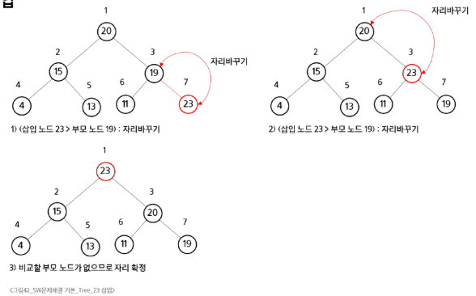

# SW 문제해결 기본 - Tree
# 트리
## 이진 트리의 표현 2
## 이진 탐색 트리
- BST(Binary Search Tree)
- Data들을 빠르게 검색할 수 있도록 체계적으로 저장해 두고, 최대 O(log n)의 빠른 속도로 값을 검색할 수 있는 자료구조
- 탐색 작업을 효율적으로 하도록, 특정 규칙을 갖는 이진트리 형태로 값을 저장
- 모든 원소는 서로 다른 유일한 키를 가짐
- key(왼쪽 서브트리) < key(루트 노드) < key(오른쪽 서브트리)
- 왼쪽 서브트리와 오른쪽 서브트리도 이진 탐색 트리
- 중위 순회하면 오름차순으로 정렬된 값을 얻을 수 있음
### 리스트 vs BST
- BST는 리스트보다 더 빠른 삽입/삭제/탐색이 가능
- 리스트 성능
  - 삽입: O(n), 단 맨 끝 삽입은 O(1)
  - 삭제: O(n), 단 맨 끝 삭제는 O(1)
  - 탐색: O(n)
- BST 성능
  - 삽입: 평균 O(log n)
  - 삭제: 평균 O(log n)
  - 탐색: 평균 O(log n)
### 탐색연산
- 루트에서 시작
- 탐색할 키 값 x를 루트 노드의 키 값과 비교
  - (키 값 x = 루트노드의 키 값)인 경우: 원하는 원소를 찾았으므로 탐색 연산 성공
  - (키 값 x < 루트노드의 키 값)인 경우: 루트노드의 왼쪽 서브트리에 대해서 탐색연산 수행
  - (키 값 x > 루트노드의 키 값)인 경우: 루트노드의 오른쪽 서브트리에 대해서 탐색연산 수행
- 서브트리에 대해서 순환적으로 탐색 연산 반복
### 삽입 연산
1. 먼저 탐색 연산 수행
   - 삽입할 원소와 같은 원소가 트리에 있으면 삽입할 수 없으므로, 같은 원소가 트리에 있는지 탐색하여 확인
   - 탐색에서 탐색 실패가 결정되는 위치가 삽입 위치
2. 탐색 실패한 위치에 원소를 삽입
### 삭제 연산
1. 먼저 탐색 연산 수행
   - 삭제할 원소와 같은 원소가 트리에 없으면 삭제할 수 없음
2. 검색 성공시 자식이 없는 노드의 경우는 바로 삭제
3. 오른쪽 서브트리만 존재하는 경우
   - 오른쪽 서브트리를 삭제할 노드의 부모노드의 서브트리로 지정
4. 삭제할 원소가 빠지면 트리가 분리될 경우(루트노드 or 서브노드의 루트노드)
   - 가장 오른쪽 끝 자손을 루트노드로 지정
- 균형을 맞추는 알고리즘 존재
### 이진 탐색 트리의 성능
- 탐색, 삽입, 삭제 시간은 트리의 높이만큼 시간이 걸림
  - O(h), h: BST의 깊이
- 평균의 경우
  - 이진트리가 균형적으로 생성되어 있는 경우
  - O(log n)
- 최악의 경우
  - 한쪽으로 치우친 경사 이진트리의 경우
  - O(n)
  - 순차탐색과 시간 복잡도가 같음
- 검색 알고리즘의 비교
  - 배열에서의 순차 검색: O(n)
  - 정렬된 배열에서의 순차 검색: O(n)
  - 정렬된 배열에서의 이진탐색 : O(log n)
    - 고정 배열 크기와 삽입, 삭제 시 추가 연산 필요
  - 이진 탐색트리에서의 평균: O(log n)
    - 최악의 경우: O(n)
    - 완전 이진 트리 또는 균형 트리로 바꿀 수 있다면 최악의 경우를 없앨 수 있음
      - 새로운 원소를 삽입할 때 삽입 시간을 줄임
      - 평균과 최악의 시간이 동일, O(log n)
  - 해쉬 검색: O(1)
## 힙
- 완전 이진 트리에 있는 노드 중에서 키 값이 가장 큰 노드나 키 값이 가장 작은 노드를 찾기 위해서 만든 자료 구조
- max heap
  - 키 값이 가장 큰 노드를 찾기 위한 완전 이진 트리
  - 부모노드의 키 값 > 자식노드의 키 값
  - 푸트 노드: 키 값이 가장 큰 노드
- min heap
  - 키 값이 가장 작은 노드를 찾기 위한 완전 이진 트리
  - 부모노드의 키 값 < 자식노드의 키 값
  - 루트 노드: 키 값이 가장 작은 노드
### 힙 연산 - 삽입
#### 
### 힙 연산 - 삭제
- 힙에서는 루트 노드의 원소만을 삭제할 수 있음
- 루트 노드의 원소를 삭제하여 반환
- 오른쪽 자식 노드와 비교하며 자리 교환
- 더이상 자식이 없거나 자식노드가 더 작은 경우 중지
- 힙의 종류에 따라 최대값 또는 최소값을 구할 수 있음
#### 
### 힙을 이용한 우선순위 큐
- 완전 이진 트리로 구현된 자료구조로써, 키 값이 가장 큰 노드나 가장 작은 노드를 찾기에 적합한 자료구조
- 최소 힙: 작은 키의 우선순위가 높음
- 최대 힙: 큰 키의 우선순위가 높음
- 힙의 키를 우선순위로 활용하여 우선순위 큐를 규현