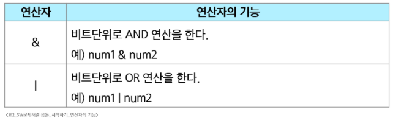
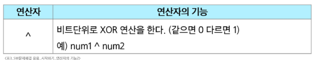
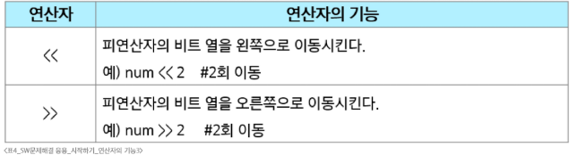

# SW 문제해결 응용 - 시작하기
# 시작하기
## SW 문제해결
## 복잡도 분석
## 표준 입출력 방법
# 진법과 연산
## 진법
## 진법 변환
## 비트 연산
### 비트와 바이트
- 1bit: 0과 1을 표현하는 정보의 단위
- 1 Byte: 8-bit를 묶어 1 Byte라고 함(메모리 주소가 부여되는 단위)
### 비트의 연산
- 컴퓨터의 CPU 내부적으로 비트 연산을 사용하여 덧셈, 뺄셈, 곱셈 등을 계산함
---
- a AND b: a, b 둘다 1일 때만 결과가 1, 그 외에는 0
- a OR b: a, b 둘 중 하나라도 1이면 결과가 1, 그 외에는 0
#### 
- a XOR b: a, b가 같으면 0 다르면 1
  - 어떤 수든 특정 수로 2회 XOR하면 원래 수로 돌아옴 -> 암호화에 사용
#### 
### 비트 연산자
- a << n: n 만큼 비트를 왼쪽으로 밀어냄
- a >> n: n 만큼 비트를 오른쪽으로 밀어냄(우측 비트들은 제거됨)
#### 
### 비트 연산의 응용
1. 1 << n
   - 2**n
   - 임베디드 분야에서 계산을 빠르게 하기 위해 사용
2. i & (1 << n)
   - i의 n번째 비트가 1인지 아닌지 확인
   - ex) 1101 & (1 << 2)
     - 1101에서 2번 bit가 1인지 확인 가능(결과값 = 0100)
     - 결과값이 0보다 크면 n번째 비트는 1임이 확정
### 음수 표현 방법
- 컴퓨터는 음수를 '2의 보수'로 관리
  - 맨 앞자리 비트(MSB)는 음수 or 양수를 구분하는 비트
- 컴퓨터가 2의 보수를 사용하여 음수를 관리하는 이유는 뺄셈의 연산속도를 올릴 수 있으며, +0과 -0을 따로 취급하지 않기 위함
- 2의 보수를 취한 수를 한번 더 2의 보수를 취하면 원래의 값으로 돌아옴
### Bitwise NOT(complement) 연산자
- ~ 연산자: 모든 비트를 반전시킴
- 파이썬에서는 ~4를 수행하면 -5가 출력됨
  - 4는 0b0100(MSB: 양수이므로 0)
  - NOT 연산자로 뒤집으면 1011
  - MSB는 1이 되었고(음수), 나머지 비트는 011
  - 나머지 비트에 대해 2의 보수를 취하면 100 + 1 = 101이므로 5
  - 따라서 -5
## 실수
### 파이썬에서의 실수 표현
- {t2:.2f} -> t2 값을 소수점 셋째자리에서 반올림하여 표현
- 64비트 부동소수점으로 실수 표현
  - 15~17자리 정밀도와 ± 1.8e308 범위를 가짐
- 최대 표현할 수 있는 값은 약 1.8 * 10**308이고 이 이상은 inf로 표현
- 최소로 표현할 수 있는(0에 가장 가까운) 값은 약 5.0 * 10**-324이며 이 이하는 0으로 표현
- 컴퓨터는 실수를 내부적으로 근사치로 관리
  - 실수는 정확한 값이 아니라 근사 값으로 저장되는데 이때 생기는 작은 오차가 계산 과정에서 다른 결과를 가져옴
### 실수의 표현
- 컴퓨터는 실수를 표현하기 위해 부동소수점(floating-point) 표기법을 사용
  - 이 표기법은 IEEE 754라는 컴퓨터에서 부동소수점을 표기하는 국제 표준
- 부동 소수점 표기법은 소수점의 위치를 고정시켜 표현하는 방식
- 소수점의 위치를 왼쪽의 가장 유효한 숫자 다음으로 고정시키고 밑 수의 지수승으로 표현
#### 
### 실수 저장 위한 형식(IEEE 754, 32bits-Single Precision 표기법 기준)
- 32-bit 구조
#### 
- 부호 1비트: 0이면 양수, 1이면 음수
- 지수부(exponent): 부동소수점의 크기 + bias값
- 가수부(mantissa): 실질적 수
## 연습문제