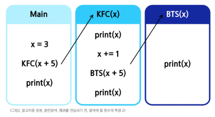
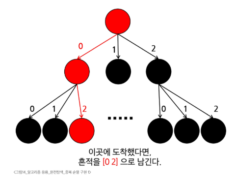

# SW 문제해결 응용 - 완전 탐색
# 완전 탐색
#### ※ 알고리즘은 어떤 순서로 고민해야 할까?
1. 완전 탐색 + 가지치기(경우의 수 줄이기)
   - 전체 경우를 모두 돌아보는 경우
   - 시간 복잡도가 높을 가능성 큼
2. 규칙 찾기(Greedy)
   - 그리디로 해결할 수 없는 경우?
3. 동적 계획법(DP)
   - 점화식
4. 다른 효과적인 알고리즘
## 반복과 재귀
### 반복
- 수행하는 작업이 완료될 때까지 계속 반복
- 루프(for, while 구조)
- 반복문은 코드를 n번 반복시킬 수 있음
### 재귀
- 주어진 문제의 해를 구하기 위해 동일하면서 더 작은 문제의 해를 이용하는 방법
- 하나의 큰 문제를 해결할 수 있는(해결하기 쉬운) 더 작은 문제로 쪼개고 결과들을 결합
- 재귀호출은 n 중 반복문과 같은 효과
#### ※ 반복(Iteration)과 재귀(Recursion)는 유사한 작업을 수행할 수 있음
### 함수의 특징
1. 함수를 호출할 때, int 타입 객체를 전달하면 값만 복사됨
   - 이터러블 전달하면 안됨
2. BTS 함수가 끝나면 Main으로 돌아오는 것이 아니라 해당 함수를 호출했던 곳으로 돌아옴
#### 
3. 기저조건(base case)
   - 무한 재취호출을 방지
### 재귀 함수 특징
1. 함수 안 재귀 호출 개수 == 가지(Branch) 개수
2. 종료 조건에 따라 깊이가 달라짐
## 순열
- 서로 다른 N개에서, R개를 중복 없이, 순서를 고려하여 나열하는 것(중복 허용 X)
### 중복 순열
- 서로 다른 N개에서 R개를 중복을 허용하고, 순서를 고려하여 나열하는 것
- 구현 원리
  1. 재귀 호출을 할 때마다, 이동 경로를 흔적으로 남김
  2. 가장 마지막 레벨에 도착했을 때, 이동 경로를 출력
#### 
### 순열의 구현
1. 중복 순열 코드를 작성
2. 중복을 제거하는 코드를 추가
   - 전역 리스트를 사용하여 이미 선택했던 숫자인지 구분(used or visited 배열)
#### ※ in 리스트: O(n)을 전부 순회하며 검사하기 때문에 for문과 동일한 시간 복잡도
- 대신 고를 수 있는 수만큼 T/F 리스트를 만들며 사용 체크
## 완전 탐색
- Brute-Force
- 모든 가능한 경우를 모두 시도해 정답을 찾아내는 알고리즘
- 단순 반복문으로 구현 가능하면 best
- N중 for문이면 재귀호출