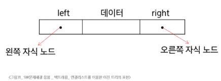

# SW 문제해결 응용 - 백트래킹
# 백트래킹
- 여러가지 선택지(옵션)들이 존재하는 상황에서 한가지를 선택
- 선택이 이루어지면 새로운 선택지들의 집합이 생성
- 이런 선택을 반복하며 최종 상태에 도달
  - 올바른 선택을 계속하면 목표 상태(goal state)에 도달
- 루트 노드에서 리프 노드까지의 경로는 해답후보가 되는데 DFS를 적용하여 그 해답 후보 중에서 해답을 찾을 수 있음
- 그러니 이 방법은 해답이 될 가능성이 전혀 없는 노드의 후손 노드들도 모두 탐색해야 하므로 비효율적
## 백트래킹 응용
### N-Queen 문제
- n * n 체스판에서 배치한 퀸들이 서로 위협하지 않도록 n개의 퀸을 배치하는 문제
  - 어떤 두 퀸도 서로를 위협하지 않아야 함
  - 퀸을 배치한 n개의 위치는?
### 당첨 리프 노드 찾기
- 루트에서 갈 수 있는 노드 선택
- 꽝 노드까지 도달하면 최근의 선택으로 되돌아와서 다시 시작
- 더 이상의 선택지가 없다면 이전의 선택지로 돌아가서 다른 선택
- 루트까지 돌아갔을 경우 더 이상 선택지가 없다면 찾는 답이 없음
### 백트래킹과 DFS의 차이
- 어떤 노드에서 출발하는 경로가 해결책으로 이어질 것 같지 않으면 더 이상 그 경로를 따라가지 않음으로써 시도 횟수 줄임(가지치기: Pruning)
- DFS가 모든 경로를 추적하는데 비해 백트래킹은 불필요한 경로 조기 차단
- DFS를 적용하기에는 경우의 수가 너무 많은 경우. 즉, N!가지의 경우의 수를 가진 문제에 대해 DFS를 적용하면 당연히 처리 불가능한 문제가 됨
- 백트래킹 알고리즘을 적용하면 일반적으로 경우의 수가 줄어들지만, 이 역시 최악의 경우에는 여전히 지수 함수 시간(Exponential Time)을 요하므로 처리 불가능
### 백트래킹 기법
- 어떤 노드의 유망성을 점검한 후 유망(promising)하지 않다고 결정되면 그 노드의 부모로 돌아가 다음 자식 노드 탐색
- 어떤 노드를 방문하였을 때 그 노드를 포함한 경로가 해답이 될 수 없으면 그 노드는 유망하지 않다고 하며, 반대로 해답의 가능성이 있으면 유망하다고 함
- pruning(가지 치기): 유망하지 않은 노드가 포함되는 경로는 더 이상 고려하지 않음
### 알고리즘 절차
1. 상태 공간 트리의 DFS 실시
2. 각 노드의 유망성 점검
3. 유망하지 않다면 부모 노드로 돌아가 검색을 계속 함
## 연습문제
# 트리
- 사이클이 없는 무향 연결 그래프
  - 두 노드 사이에는 유일한 경로 존재
  - 각 노드는 최대 하나의 부모 노드가 존재할 수 있음
  - 각 노드는 자식 노드가 없거나 하나 이상 존재할 수 있음
- 비선형 구조
  - 원소들 간 1:n 관계를 가지는 자료구조
  - 원소들 간 계층 관계를 가지는 계층형 자료구조
- 한 개 이상의 노드로 이루어진 유한 집합
## 트리 개요
### 트리의 용어
- node: 트리의 원소, 정점(vertex)
- edge: 노드를 연결하는 선, 간선
- root node: 트리의 시작 노드
- leat node: 자식 노드가 없는 노드, 차수가 0인 노드
- sibling node: 같은 부모 노드의 자식 노드들, 형제 노드
- 조상 노드: 간선을 따라 루트 노드까지 이르는 경로에 있는 모든 노드들
- subtree: 부모 노드와 연결된 간선을 끊었을 때 생성되는 트리
- 자손 노드: 서브 트리에 있는 하위 레벨의 노드들
- 노드의 차수: 노드에 연결된 자식 노드의 수
- 트리의 차수: 트리에 있는 노드의 차수 중에서 가장 큰 값
- 노드의 높이: 루트에서 노드에 이르는 간선의 수, 노드의 레벨
- 트리의 높이: 트리에 있는 노드의 높이 중에서 가장 큰 값, 최대 레벨
## 이진 트리
- 모든 노드들이 최대 2대의 서브트리를 갖는 특별한 형태의 트리
- 각 노드가 자식 노드를 최대 2개까지만 가질 수 있는 트리
### 이진 트리의 특성(레벨이 0부터 시작하는 경우 기준)
- 레벨 i에서 노드의 최대 개수는 2 ** i - 1개, 최소 개수는 i + 1개
- 높이가 h인 이진 트리가 가질 수 있는 노드의 최소 개수는 h + 1개, 최대 개수는 2**(h+1) - 1개
### 이진 트리의 종류
- 포화 이진 트리(Full Binary Tree)
  - 모든 레벨에 노드가 포화 상태로 차 있는 이진 트리
- 완전 이진 트리(Complete Binary Tree)
  - 높이가 h이고 노드 수가 n개 일때, 포화 이진 트리의 노드 번호 1번 부터 n번까지 빈 자리가 없는 이진 트리
- 편향 이진 트리(Skewed Binary Tree)
  - 높이 h에 대한 최소 개수의 노드를 가지면서 한쪽 방향의 자식 노드만을 가진 이진 트리
### 순회(traversal)
- 트리의 각 노드를 중복되지 않게 전부 방문하는 것
  - 트리는 비선형 구조이기 때문에 선형구조에서와 같이 선후 연결 관계를 알 수 없음
- 전위 / 중위 / 후위
### 노드 번호의 성질
- 노드 번호가 i인 노드의 부모 노드 번호: i//2
- 노드 번호가 i인 노드의 왼쪽 자식 노드 번호: 2*i
- 노드 번호가 i인 노드의 오른쪽자식 노드 번호: 2*i + 1
- 레벨 n의 노드 번호 시작 번호: 2ⁿ
### 이진 트리의 표현
- 배열 이용
  - 편향 이진 트리의 경우, 사용하지 않는 배열 원소에 대한 메모리 공간 낭비 발생
  - 트리의 중간에 새로운 노드를 삽입하거나 기존의 노드를 삭제할 경우 배열의 크기 변경이 어려워 비효율적
  - 해당 단점을 보완하기 위해 연결리스트 이용
- 연결리스트 이용
#### 
## 이진탐색트리(Binary Search Tree)
- 탐색 작업을 효율적으로 하기 위한 자료 구조
- 모든 원소는 서로 다른 유일한 키를 가짐
- 왼쪽 서브 트리 key <  루트 노드 key < 오른쪽 서브트리 key
- 왼쪽 서브트리와 오른쪽 서브트리도 이진 탐색 트리
- 중위 순회하면 오름차순으로 정렬된 값을 얻을 우 있음
## 힙
- 완전 이진 트리에 있는 노드 중 키 값이 가장 큰 노드나 키 값이 가장 작은 노드를 찾기 위해 만든 자료 구조