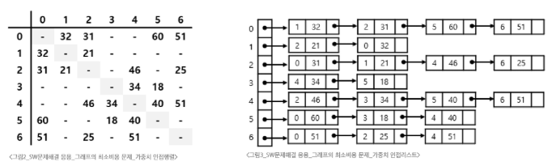
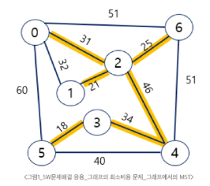
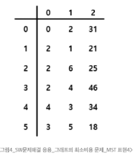
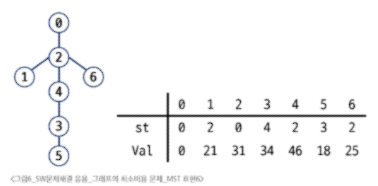

# SW 문제해결 응용 - 그래프의 최소 비용 문제
# 최소 비용 신장 트리
## 최소 비용 신장 트리(MST)
### 대표적인 트리의 종류
- 그래프에서 최소 비용 문제
  - 모든 정점을 연결하는 간선들의 가중치의 합이 최소가 되는 트리를 찾기
  - 두 정점 사이의 비용이 최소인 경로 찾기
- 신장 트리
  - N개의 정점으로 이루어진 무방향 그래프에서 N개의 정점과 N-1개의 간선으로 이루어진 트리
- 최소 신장 트리(MST, Minimum Spanning Tree)
  - 무방향 가중치 그래프에서 신장 트리를 구성하는 간선들의 가중치 합이 최소인 신장 트리
### 그래프의 표현
- 인접 행렬
- 인접 리스트
#### 
### MST 표현
- 그래프
#### 
- 간선들의 배열
  - 변경할 일이 없을 때이므로 리스트와 튜플 모두 가능하지만 튜플이 속도 면에서 유리
#### 
- 인접 리스트
- 트리
- 부모 자식 관계와 가중치에 대한 배열
#### 
### MST 찾기
- Prim 알고리즘
- Kruskal 알고리즘
## Prim 알고리즘
- 하나의 정점에서 연결된 간선들 중에 하나씩 선택하며 MST를 만들어 가는 방식
  1. 임의 정점을 하나 선택해서 시작
  2. 선택한 정점과 인접하는 정점들 중 최소 비용의 간선이 존재하는 정점 선택
  3. 모든 정점이 선택될 때까지 1, 2과정을 반복
- 서로소인 2개의 집합 정보를 유지
  - 트리 정점들(tree vertices): MST를 만들기 위해 선택된 정점들
  - 비트리 정점들(nontree vertices): 선택되지 않은 정점들
- 구현시에는 가중치가 적은 노드를 먼저 꺼내야하기 때문에 우선순위 큐를 사용(heapq)
- 정점을 기준으로 선택하기에 간선이 많을 수록 유리
## Kruskal 알고리즘
- 간선을 하나씩 선택해서 MST를 찾는 알고리즘
  1. 최초, 모든 간선을 가중치에 따라 오름차순으로 정렬
  2. 가중치가 가장 낮은 간선부터 선택하면서 트리를 증가시킴
      - 사이클이 존재하면 다음으로 가중치가 낮은 간선 선택
  3. n - 1개의 간선이 선택될 때까지 2를 반복
- 간선을 기준으로 선택, 보통은 크루스칼 사용
# 최단 경로
- 간선의 가중치가 있는 그래프에서 두 정점 사이의 경로들 중에 간선의 가중치의 합이 최소인 경로(3개를 거치던 5개를 거치던 상관없고 비용이 최소가 되기만 하면 됨)
- 최단 경로의 종류
  1. 단일 출발 최단 경로(Single-Source Shotest Path): 하나의 시작 정점에서 끝 정점까지의 최단 경로
    - 다익스트라(Dijkstra) 알고리즘: 음의 가중치를 허용하지 않음
    - 벨만-포드(Bellman-Ford) 알고리즘: 음의 가중치 혀용
  2. 모든 쌍 최단 경로(All-Pairs Shortest Path): 모든 정점들에 대한 최단 경로
    - 플로이드-워샬(Floyd-Warshall) 알고리즘
## Dijkstra 알고리즘
- 시작 정점에서 거리가 최소인 정점을 선택해 나가면서 최단 경로를 구하는 방식
- 시작 정점(s)에서 끝 정점(t)까지의 최단 경로에 정점 x가 존재함
- 이때, 최단 경로는 s에서 x까지의 최단 경로와 x에서 t까지의 최단 경로로 구성됨
- 담욕 기법을 사용한 알고리즘으로 MST의 Prim 알고리즘과 유사
#### ※ Heap
- 최댓값이나 최솟값을 빠르게 찾기 위해 고안된 완전 이진 트리 기반 자료 구조
- 핵심 연산(연산 마다 재배치가 일어남)
  - 삽입(Push)
  - 삭제(Pop)
- 부모-자식 인덱스 관계 (0-based index)
  - 부모 인덱스: `(자식 인덱스 - 1) // 2`
  - 왼쪽 자식 인덱스: `(부모 인덱스 * 2) + 1`
  - 오른쪽 자식 인덱스: `(부모 인덱스 * 2) + 2`
  - 예시: `[1, 3, 2, 4, 5, 8]` 리스트를 트리 구조로 읽기
    - 루트 `1` (index 0)의 자식:
      - 왼쪽: `(0 * 2) + 1 = 1` → `heap[1]`은 `3`
      - 오른쪽: `(0 * 2) + 2 = 2` → `heap[2]`은 `2`
    - 노드 `3` (index 1)의 자식:
      - 왼쪽: `(1 * 2) + 1 = 3` → `heap[3]`은 `4`
      - 오른쪽: `(1 * 2) + 2 = 4` → `heap[4]`은 `5`
- heappush() 반복 vs heapify()
  - heappush() 반복: 새로운 원소를 맨 끝에 추가한 뒤, 부모와 비교하며 위로 올라가는(sift-up)*과정을 반복합니다. 삽입 순서에 따라 내부 구조가 달라집니다.
  - heapify(): 모든 원소를 일단 배열에 넣고, 뒤쪽의 부모 노드들부터 차례대로 아래로 내려보내며(sift-down) 전체 구조를 한 번에 맞춥니다.
  - 문제에서 "가장 마지막에 추가된 원소가 어떤 경로를 통해 자신의 위치를 찾아가는가"와 같이 삽입 과정 자체가 중요한 경우에는, 실제 삽입 과정을 모사하는 heappush() 반복 방식을 사용해야 합니다.
- 튜플간의 값비교는 0부터, 만약 같다면 두번째 요소를 본다