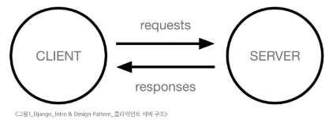
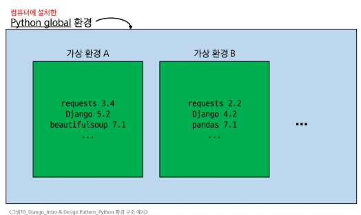
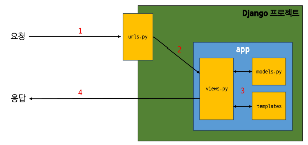
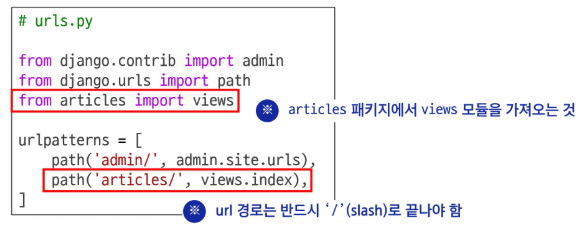
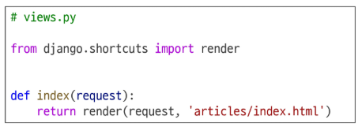
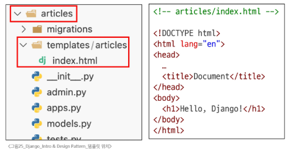
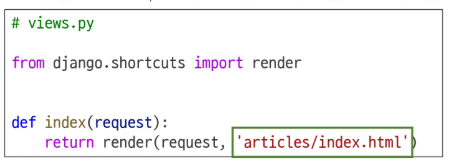
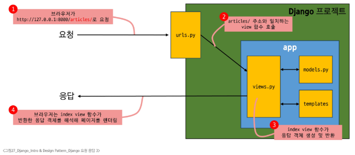

# Django - Intro & Design Pattern
# Web Application
- Web Application(Web Service) 개발
  - 인터넷을 통해 사용자에게 제공되는 소프트웨어 프로그램을 구축하는 과정
  - 다양한 디바이스에서 웹 브라우저를 통해 접근하고 사용할 수 있음
## 클라이언트와 서버
### 웹의 동작 방식
- 클라이언트 - 서버 구조
  - Client: 서비스를 요청하는 주체
    - 사용하는 웹 브라우저, 모바일 앱
  - Server: 클라이언트의 요청에 응답하는 주체
    - 웹 서버, 데이터베시스 서버
- 일반 적인 웹 서비스에서는 클라이언트가 페이지를 달라고 요청할 경우 서버가 페이지를 응답
#### 
1. 웹 브라우저(클라이언트)에서 URL 입력 후 Enter -> 서버에 요청
2. 웹 브라우저는 인터넷에 연결된 전세계 어딘가에 있는 컴퓨터(서버)에게 '메인 홈페이지.html' 파일을 달라고 요청
3. 요청을 받은 구글 컴퓨터는 데이터베이스에서 '메인 홈페이지.html' 파일을 찾아 응답
4. 웹 브라우저는 전달받은 '메인 홈페이지.html' 파일을 사람이 볼 수 있도록 해석해주고 사용자는 구글의 메인 페이지를 보게 됨
## Frontend & Backend
### 웹 개발에서의 Frontend & Backend
- Frontend
  - 사용자 인터페이스(UI)를 구성하고, 사용자가 애플리케이션과 상호작용할 수 있도록 함
    - HTML, CSS, JavaScript, 프론트엔드 프레임워크 등
    - Vue.js: 프론트엔드로 활용되는 대표적인 프레임 워크
- Backend
  - 서버 측에서 동작하며, 클라이언트의 요청에 대한 처리와 데이터베이스와의 상호작용 등을 담당
    - 서버 언어(Python, Java 등) 및 백엔드 프레임워크, 데이터베이스, API, 보안 등
    - Django: 백엔드로 활용되는 대표적인 프레임워크
# Framework
## Web Framework
- 웹 애플리케이션을 빠르게 개발할 수 있도록 도와주는 도구
- 개발에 필요한 기본 구조, 규칙, 라이브러리 등을 제공(로그인/로그아웃, 회원관리, 데이터베이스, 보안 등)
- 일반적인 '웹 서비스'에 필요한 다양한 보편적인 기능들이 존재. 이런 기능을 전부 혼자 개발하기 보다 이미 만들어진 도구를 효과적으로 활용하는 능력이 현대 웹 개발의 핵심
## Django Framework
### Django
- Python 기반의 대표적인 웹 프레임워크
- 클라이언트 - 서버 구조의 서버를 구현하는 것이 Django를 배우는 목적
- 특징
  - 다양성
    - Python 기반으로 웹
  - 확장성
  - 보안
  - 커뮤니티 지원
### 검증된 웹 프레임워크
- 대규모 트래픽 서비스에서도 안정적인 서비스 제공
- Spotify, Instagram, Dropbox, Delivery Hero
# 가상 환경(Virtual Environment)
- 하나의 컴퓨터 안에서 또 다른 '독립된' 파이썬 환경
  - 마치 작은 컴퓨터를 하나 더 생성하는 것과 유사
- 두 개의 프로젝트를 진행하며, 서로 다른 패키지를 필요로 할 때(파이썬 환경에서 패키지는 한 개의 버전만 존재할 수 있음)
- 가상 환경 비유
  - 같은 집(컴퓨터) 안에, 방(가상 환경)을 따로 만들어 두고,
  - 필요한 물건(라이브러리, 패키지 등)을 그 방에만 들여놓는 것과 유사
  - 방이 다르면 들여놓은 물건이 달라도 서로 간섭하지 않음
#### 
## 가상 환경 생성 및 활성화
### 1. 가상 환경 생성
- $ python -m venv venv(가상환경 이름, 변경가능)
  - 현재 디렉토리 안에 venv라는 폴더가 생성됨
  - venv 폴더 안에는 파이썬 실행 파일, 라이브러리 등을 담을 공간이 마련됨
  - venv라는 이름의 가상 환경을 생성한 것
#### ※ 임의의 이름으로 생성이 가능하나 관례적으로 venv 이름을 사용, venv 폴더의 내용은 직접 수정 금지
### 2. 가상 환경 활성화
- $ source venv/Scripts/activate
  - 활성화 후, 프롬프트 압에 (venv)와 같이 표시된다면 성공한 것
  - Mac/Linux에서는 명령어가 다르니 주의
    - $ source venv/bin/activate
  - ON/OFF의 개념이므로 폴더 이동은 상관없음(상위 폴더로 이동해도 여전히 활성화 되어있음)
### 3. 가상 환경 종료
- $ deactivate
  - 활성화한 상태에서 deactivate 명령을 입력하면, 다시 Python Global 환경으로 돌아옴
## 의존성 패키지
### 의존성(Dependencies)
- 하나의 소프트웨어가 동작하기 위해 필요로 하는 다른 소프트웨어나 라이브러리
- 컴퓨터가 잘 작동하기 위해서는 CPU, GPU, RAM 등이 필요. 이들은 컴퓨터 입장에서 의존성이라 볼 수 있음
### 의존성 패키지
- 프로젝트가 의존하는 개별 라이브러리(프로젝트가 실행되기 위해 필요한 각각의 패키지)
- 컴퓨터의 의존성인 CPU, GPU, RAM 등을 각각 의존성 패키지라고 할 수 있음
---
1. 패키지 목록 확인
   - $ pip list
     - 현재 가상 환경에 설치된 라이브러리 목록을 확인
     - 갓 생성된 가상 환경은 별도의 패키지가 없음
       - 기본 환경 구성을 위한 pip, setuptools 정도만 존재
2. 의존성 기록
   -  $ pip freeze > requirements.txt
      -  가상 환경에 설치된 모든 패키지를 버전과 함께 특정한 형식으로 출력
      -  이를 requirements.txt라는 파일로 저장하면 나중에 동일한 환경을 재현할 때 유용
      -  협업 시에도 팀원들이 똑같은 버전의 라리브러리를 설치하도록 공유 가능
      -  한 패키지 설치시 그 패키지가 필요로하는 의존성들이 존재하기 때문에 1개의 패키지만 설치되지 않음
#### ※ 다른 파일명으로도 가능하나 관례적으로 requirements.txt를 사용
#### ※ '>'는 pip 명령어가 아닌 CLI(Shell)의 Redirection operator로, 이전 명령어의 출력을 파일로 redirect, 즉 생성하고 작성함. 같은 명령어를 다시 사용할 경우 이전 파일의 내용을 덮어 씀
### 의존성 패키지 관리가 필요한 이유
- 패키지마다 버전이 다름
  - 버전이 다른 경우 함수명이나 동작이 달라질 수 있음
- 프로젝트가 커질수록 사용하는 패키지의 개수도 늘어나게 됨
  - 어떤 버전을 쓰고 있는지 기록 및 공유가 필수적
- 다른 PC나 팀원들이 같은 환경을 구성할 때 의존성 리스트가 반드시 필요
## 의존성 패키지 기반 설치
- requirements.txt를 활용하여 다른 환경(혹은 팀원의 PC에서도 동일한 패키지 버전을 설치하는 방법)
1. 가상 환경 준비(새로운 가상 환경을 생성 및 활성화)
   - $ python -m venv venv
   - $ source venv/Scripts/activate
2. requirements.txt로부터 패키지 설치(requirements.txt에 기록된 패키지 버전을 읽어와 같은 환경으로 설치)
   - pip install -r requirements.txt
## 가상 환경 주의사항
### 가상 환경 주의사항 및 권장사항
1. 가상 환경에 들어가고 나오는 것이 아니라 사용할 Python 환경을 On/Off로 전환하는 개념(켜는 위치 중요)
   - 가상 환경 활성화는 현재 터미널 환경에만 영향을 끼침
   - 새 터미널 창을 열면 다시 활성화 해야함
2. 프로젝트마다 별도의 가상 환경을 사용
3. 일반적으로 가상 환경 폴더 venv는 관련된 프로젝트롸 동일한 경로에 위치시킴
4. 폴더 venv는 .gitignore파일에 작성되어 원격 저장소에 공유하지 않음
   - 저장소 크기를 줄여 효율적인 협업과 배포를 가능하게 하고
   - OS 별 차이점으로 인한 문제를 방지하기 위함
   - 대신 requirements.txt를 공유하여 각자의 가상 환경을 구성
### 가상 환경이 필요한 이유
1. 프로젝트 마다 다른 버전의 라이브러리 사용
   - 한 프로젝트에서는 Django 4.2를 다른 프로젝트에서는 Django 5.2를 사용해야 할 수도 있음
   - 가상 환경을 사용하면 서로 다른 버전을 동시에 설치해도 충돌없이 각각의 프로젝트를 유지할 수 있음
2. 의존성 충돌 방지
   - 프로젝트 별로 라이브러리를 독립적으로 관리하게 해줌
   - 여러 프로젝트가 동시에 같은 라이브러리를 쓰더라도 버전 충돌 문제를 예방
3. 팀원 간 협업
   - 누구든지 동일한 방식으로 가상 환경을 만들어서, 똑같은 버전의 라이브러리를 설치하면 에러 가능성을 줄일 수 있음
### 요약
1. 가상 환경 생성 (python -m venv venv)
2. 가상 환경 활성화 (source venv/Scripts/activate)
3. 필요한 의존성 패키지 설치 (pip install)
4. 현재 환경의 패키지 목록을 pip freeze > requirements.txt로 저장하여 의존성을 관리
5. 다른 컴퓨터나 팀원도 같은 환경이 필요하다면, pip install -r requirements.txt로 동일한 버전의 라이브러리를 설치
6. 작업이 끝나면 deactivate로 가상 환경을 비활성화
# Django 프로젝트
## 프로젝트 생성 및 서버 실행
1. Django 설치
   - $ pip install django
     - 현재 환경에 Django 패키지를 설치
2. 프로젝트 생성
   - $ django-admin startproject firstpjt .
     - 'firstpjt'라는 이름의 django 프로젝트 생성
3. 서버 실행
   - $ python manage,py runserver
     - 'manage.py'와 동일한 위치에서 명령어 진행
4. 서버 확인
- http://127.0.0.1:8000/ 접속 후 확인 : 요청
- 로켓 페이지 : 응답
#### ※ Ctrl + c 서버 종료
# Django Design Pattern
## Design Pattern
- 소프트웨어 설계에서 반복적으로 발생하는 문제에 대한, 검증되고 재사용 가능한 일반적인 해결책
- '애플리케이션의 구조는 이렇게 구성하자' 라는 모범 답안 또는 관행(ex: MVC)
### MVC 디자인 패턴
- 하나의 애플리케이션을 구조화하는 대표적인 구조적 디자인 패턴
- Model: 데이터 및 비즈니스 로직을 처리
- View: 사용자에게 보이는 화면을 담당
- Controller: 사용자의 입력을 받아 Model과 View를 제어
- 시각적 요소와 뒤에서 실행되는 로직을 서로 영향없이, 독립적이고 쉽게 유지 보수할 수 있는 애플리케이션을 만들기 위함
### MTV 디자인 패턴
- Django에서 애플리케이션을 구조화하는 디자인 패턴
- Model, Template: View, View: Controller(기존 MVC 패턴과 동일하나 단순히 명칭을 다르게 정의한 것)
## 프로젝트와 앱
- Django project: 애플리케이션의 집합
  - DB 설정, URL 연결, 전체 앱 설정 등을 처리
- Django application: 독립적으로 작동하는 기능 단위 모듈
  - 각자 특정한 기능을 담당
  - 다른 앱들과 함께 하나의 프로젝트를 구성
  - DB, 인증, 화면 등
---
1. 앱 생성
   - $ python manage.py startapp articles
     - 'articles'라는 폴더와 내부에 여러 파일이 새로 생성됨(앱 이름은 복수형으로 지정 권장)
     - 물리적인 폴더의 상하관계를 나타내지 않기 때문에 프로젝트 폴더 안에 앱 폴더가 있지 않고 같은 위치에 생성됨
2. 앱 등록
   - 프로젝트의 setting.py에 INSTALLED_APPS(기본 동작을 위한 내장 앱 6개 존재)에 추가
     - 사용자가 생성한 앱은 상단부터 작성하는 것을 권장, django의 내부 구동 순서 때문
     - 반드시 앱을 생성한 후에 등록해야함(등록 후 생성 불가. 생성을 위한 명령 실행 중 아직 존재하지 않는 앱을 찾으려다 실패하기 때문)
## 프로젝트 및 앱 구조
### 프로젝트 구조
- **setting.py**
  - 프로젝트의 모든 설정을 관리
- **urls.py**
  - 요청 들어오는 URL에 따라 이에 해당하는 적절한 views를 연결
- `__init__.py`
  - 해당 폴더를 패키지로 인식하도록 설정하는 파일
- asgi.py
  - 비동기식 웹 서버와의 연결 관련 설정
- wsgi.py
  - 웹 서버와의 연결 관련 설정
- manage.py
  - Django 프로젝트와 다양한 방법으로 상호작용하는 커맨드라인 유틸리티
### 앱 구조
- **admin.py**
  - 관리자용 페이지 설정
- **models.py**
  - DB와 관련된 모델을 정의
  - MTV 패턴의 M
- **views.py**
  - HTTP 요청을 처리하고 해당 요청에 대한 응답을 반환
    - url, model, template과 연동
  - MTV 패턴의 V
  - 수많은 뷰 함수가 존재 -> 리턴이 응답(클라이언트에 전달)
#### ※ 장고는 풀스택 프레임워크지만 기본적으로 백엔드 기반이기 때문에 T는 없음(직접 생성해야함)
- apps.py
  - 앱의 정보가 작성된 곳
- tests.py
  - 프로젝트 테스트 코드를 작성하는 곳
# 요청과 응답
## Django에서의 요청과 응답
- 사용자가 서버에 접속하는 과정
#### 
---
1. URLs
   - http://127.0.0.1:8000/articles/로 요청이 왔을 때
   - request 객체를 views 모듈의 index view 함수에 전달하며 호출
#### 
2. View
   - view 함수가 정의 되는 곳
     - 특정 경로에 있는 template과 request 객체를 결합해 응답 객체를 반환
   - url로 articles/까지 일치되었을때 두번째 인자에 뷰함수를 호출
   - 메인페이지를 응답하는 함수
   - 모든 view 함수는 첫번째 인자로 요청 객체를 필수적으로 받음
   - render 함수가 첫번째 인자로 request를 받는 것으로 이미 작성되어 있음
   - 매개변수 이름은 request가 아니어도 되지만 관례적으로 request로 작성
#### 
3. Template
   1. articles 앱 폴더 안에 templates 폴더 생성(폴더명은 반드시 templates. 개발자가 직접 생성해야 함)
   2. templates 폴더 안에 articles 폴더 생성(필수는 아님)
   3. articles 폴더 안에 템플릿 파일 생성
#### 
### Django에서 template을 인식하는 경로 규칙
- app폴더 / templates / articles / index.html
- app폴더 / templates / examples.html
- templates 까지 기본 경로로 인식
  - view 함수에서 template 경로 작성 시 해당 지점 이후의 경로를 작성해햐 함
#### 
- 요청 후 응답 페이지 확인
  - http://127.0.0.1:8000/articles/
#### 
### 데이터 흐름에 따른 코드 작성
- 사용자의 요청에서부터 데이터 흐름은 URLs -> Views -> Template
- 코드의 작성도 마찬가지로 데이터의 흐름을 따라 작성할 것
- URLs
```python
path('articles/', view.index),
```
- View
```python
def index(request):
  return render(request, 'articles/index.html')
```
- Template
```python
articles/templates/articles/index.html
```
# 참고
## 가상 환경 생성 루틴
## Django 관련
### LTS(Long-Term Support)
- 프레임워크나 라이브러리 등의 소프트웨어에서 장기간 지원되는 안정적인 버전을 부를 때 사용
- 기업이나 대규모 프로젝트에서는 소프트웨어 업그레이드에 많은 비용과 시간이 필요하기 때문에 안정적이고 장기간 지원되는 버전이 필요
- django의 경우 X.2
- 지원하는 python 버전 확인도 필요
## Python 패키지 설치법
## render 함수
- render(request, template_name, context)
- 주어진 템플릿을 주어진 컨텍스트 데이터와 결합하고 렌더링 된 텍스트와 함께 HttpResponse 응답 객체를 반환하는 함수
1. request
   - 응답을 생성하는 데 사용되는 요청 객체
2. template_name
   - 템플릿 이름의 경로
3. context
   - 템플릿에서 사용할 데이터(생략 가능)
   - 딕셔너리 타입으로 작성
## MTV 디자인 패턴 정리
## Trailing Comma
## 프레임워크의 규칙 및 설계 철학
### Django의 규칙
1. urls.py에서 각 url 문자열 경로는 반드시 '/'로 끝남
2. views.py에서 모든 view 함수는 첫번째 인자로 요청 객체를 받음
   - 매개변수 이름은 반드시 request로 지정
3. Django는 특정 경로에 있는 template 파일만 읽어올 수 있음
   - 특정 경로: app 폴더/templates
### 프레임워크의 규칙
- 프레임워크를 사용할 때는 일정한 규칙을 따라야 하며 이는 저마다의 설계 철학이나 목표를 반영하고 있음
  - 일관성 유지, 보안 강화, 유지보수성 향상, 최적화 등과 같은 이유
- 프레임워크는 개발자에게 도움을 주는 도구와 환경을 제공하기 위해 규칙을 정해놓은 것이며 우리는 이를 잘 활용하여, 특정 기능을 구현하는 방법을 표준화하고 개발 프로세스를 단순화할 수 있도록 해야함
#### ※ .gitignore, venv 둘다 프로젝트 최상단에 만들자