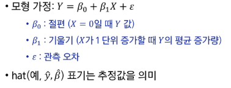
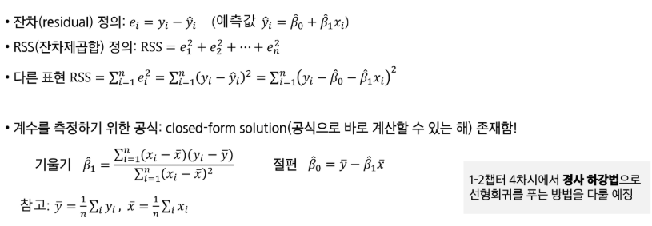
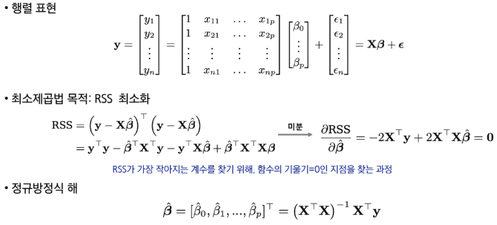

# AI & 기계학습 기초 1 - AI와 ML은 무엇인가?
# AI, ML, DL의 정의
- AI
  - 주어진 환경/데이터를 인지, 학습, 추론을 통해 목표 달성을 하도록 예측, 행동  선택, 계획하는 시스템
- ML
  - AI 범주 내에서 데이터로부터 학습하여 목적을 달성하는 접근 방법론
  - 예: 언어모델, 이미지 분류 모델, 추천 시스템
- DL
  - ML 범주 내에서 신경망 함수를 사용한 학습 방법론
- AI - ML의 예
  - 규칙 기반 시스템
  - 휴리스틱 기반 (최적화) 알고리즘
# 데이터와 학습의 이해
## 데이터 구성 요소
- 데이터가 왜 중요한가?
  - 머신러닝은 규칙을 직접 코딩하지 않고,데이터에서 규칙을 학습
  - 데이터의 분포와 관계가 머신러닝 학습 결과를 결정
- 피처
  - 모델이 예측에 사용하는 입력정보
  - 예측, 판단의 근거/단서
- 라벨
  - 모델이 예측하려는 정답
  - 학습의 목표값
## ML 실생활 예시
- 유튜브 추천
- 스팸메일 분류
# 단일 피쳐기반 학습
## 1D 피쳐 기반 학습
- 1차원, 피쳐가 하나일 때 머신러닝이 학습하는 가장 단순한 형태
- yi = f*xi + ei
- 미지의 참함수(f*)
## 모델과 가설 공간
- 학습
  - 입력 -> 출력 관계를 찾는 과정
  - 평균 관계를 하나의 함수로 표현함
  - 하지만 관계를 표현할 수 있는 함수는 무수히 많음
- 가설 공간
  - 관계를 표현할 수 있는 모든 후보 함수들의 모음
  - 피쳐 공간과 라벨 공간위에서 정의된 함수들의 집합
- 모델
- 가설공간 에 속한 특정함수 f
- 
## 학습이란?
- 주어진 데이터와 성능 척도를 바탕으로 가설공간 F의 후보들 중 최적의 모델을 선택하는 과정
- 데이터 D -> 가설 공간 F -> 선택된 모델 f
# 복수 피쳐 기반 학습
## 2D 피쳐 기반 학습
## 일반적 용어 정리 및 모델 가정
- Income: 우리가 예측하려는 라벨(반응/목표) 변수 -> Y로 표기
- Years of Education: 첫번째 피쳐(입력/예측) 변수 -> X1로 표기
- Seniority: 두번째 피쳐(입력/예측) 변수 -> X2로 표기
- 다른 i번째 피처가 있다면 역시 Xi로 표기
- 일반적인 p차원 피쳐 벡터: X[]
- 측정오차 ε: ε은 피터 X와 독립 및 E[ε] = 0으로 가정
## 왜 f(x)를 학습하는가?

# AI & 기계학습 기초 2 - 지도학습은 무엇인가?
# 지도학습의 개념
- 데이터: 입력(특성)과 정답(라벨)이 쌍으로 있는 데이터
- 목표: 새 입력이 들어오면 정답을 잘 맞추는 규칙을 학습
- 지도학습의 종류
  - 회귀: 예측값이 숫자
  - 분류: 예측값이 범주
## 지도학습 용어
- 특성(Feature, x)
  - 예측에 쓰는 설명 변수
- 라벨(Label, y)
  - 맞춰야하는 정답
- 예측값
  - 모델이 내놓은 결과
- 오류(Error)
  - 예측값과 라벨의 차이
# 회귀
- 입력으로부터 숫자를 얼마나 정확히 예측할까?
  - Feature: 면적, 방수, 연식 -> Label: 집값
  - Feature: 매체별 광고비 -> Label: 매출액
- 라벨 및 예측 모델의 출력
  - 연속적인 수치
## 회귀 오류: 평균제곱오류(MSE)
- 각 데이터에서 정답과 예측의 평균 제곱 차이값
- 해석: 큰 오류를 더 크게 벌주므로, 전체 오류 수준을 한눈에 봄
- 데이터와 같은 단위를 쓰고 싶르면 RMSE(MSE의 제곱근)도 사용
## 회귀 설명력: R²(결정계수)
- 라벨의 분산 중에서 특성으로 설명되는 비율
- 평균만 쓰는 단순한 예측보다 얼마나 더 잘 맞추는지를 0~1 사이로 나타낸 값
- 해석: 1에 가까울 수록 설명력이 높고, 낮을수록 설명력이 낮음
- R²가 음수가 나올 수 있음(예측값들이 평균값보다도 못한다면)
# 분류
- 입력으로부터 범주는 얼마나 정확히 가려낼까?
  - Feature: 메일 내용, 보낸이 이메일 주소 -> Label: 스팸/정상
  - Feature: 종양 반경, 면적 -> Label: 악성/양성
- 라벨: 범주 라벨(이진/다중)
## 분류 정확도(Accuracy)
- 전체 중 맞춘 비율
- 정확도만 보면 불균형 데이터(양성 1%, 음성 99%)에서는 전부 음성이라 해도 정확도가 99%로 보일 수 있음
- 정확도만 보지말고 다른 지표도 함께 봐야 안전
## 혼동행렬(Confusion Matrix)
- 예측과 실제 값 사이의 관계를 행렬 형태로 표현
- TP: 실제 양성, 예측도 양성
- TN: 실제 음성, 에측도 음성
- FP: 실제는 음성인데 양성이라 함(오탐)
- FN: 실제는 양성인데 음성이라 함(누락)
- 정밀도(Precision)
  - 양성이라 판정한 것 중 진짜 양성의 비율
- 재현율(Sensitivity or Recall)
  - 진짜 양성 가운데 잡아낸 예측 양성 비율
- F1-score
  - 정밀도와 재현율의 조화 평균
# 학습의 목적
- 학습의 목적은 테스트 예측(일반화)
  - 학습 모델의 성능 평가는 모델이 처음보는(학습에 사용되지 않은) 데이터로 평가
    - 일반화 오류의 최소화 지향
  - 훈련데이터에서 성능이 아무리 좋아도, 새로운 데이터에서 성능이 떨어지면 실전엔 사용할 수 없음
## 오버피팅
- 훈련 데이터의 우연한 패턴/잡음까지 외워버려서 훈련에서는 잘 맞지만 테스트에서는 성능이 나빠지는 현상
- 훈련 오류 급격히 낮음, 테스트 오류 높음/요동
- 오버피팅이 안 좋은 이유
  - 표본 의존.불안정: 훈련 데이터는 모집단의 일부 표본이라 우연한 잡음이 섞임. 이것에만 과하게 맞추어 학습하면 샘플 몇개만 바꿔도 예측이 크게 흔들림(분산 증가)
  - 일반화 실패: 보지 못한 데이터(테스트) 오류가 커짐, 모집단 성능과 격차가 벌어짐
- 오버피팅 != 분포 변화로 인한 에러 증가
  - 분포 변화로 인한 오류: 훈련 데이터 분포와 테스트 분포가 다름으로(환경.계절.센서 변경 등) 성능이 떨어지는 현상
  - 분포 변화로 인한 에러 증가는 모델이 과적합하지 않아도 발생 가능
### 오버피팅 vs 언더 피팅(균형 잡기)
- 오버피팅: 모델이 너무 복잡 -> 잡음까지 학습(테스트 성능 나쁨)
- 언더피팅: 모델이 단순하거나 학습이 완료되지 않음 -> 중요한 패턴을 놓침(오류 큼)
- 더 많은 데이터, 테스트 데이터를 활용한 모델 선정, 교차 검증

# AI & 기계학습 기초 3 - 교차 검증
# 테스트 성능 평가
## 훈련 오류 vs 테스트 오류
- 훈련 오류: 모델을 학습시킨 같은 데이터에 다시 적용해 계산한 오류
- 테스트 오류: 학습에 쓰지 않은 새 관측치에 대해 모델을 적용했을 때의 평균 예측 오류
- 보통 훈련 오류는 테스트 오류와 다르며, 특히 훈련 오류는 테스트 오류를 과소평가하는 경우가 많음
- 목적: 테스트 오류의 U자형의 바닥이 되도록하는 적절한 모델 찾기
- 테스트 예측 오류 계산
  - 이상적 케이스: 충분히 큰 별도 테스트 데이터셋 -> 현실에선 구하기 어려움
  - 현실에서는 테스트만을 위한 데이터를 갖기에 데이터 자체가 부족할 수 있음
- 대안: 재표본화를 통한 테스트 오류 추정
  - 데이터를 나눠 여러번 "훈련 -> 평가"를 반복해 테스트 오류를 가능
  - 방법: 검증셋, K겹 교차검증
  - 장점: 별도의 테스트 데이터 없이 데이터를 더 효율적으로 사용하여 일반화 오차 추정
# 검증셋 접근
- 가용 샘플들을 무작위로 훈련셋과 검증셋으로 분할
- 훈련셋으로 모델 적합. 검증셋으로 예측 후 검증 오류를 계산
- 검증 오류는 보통 정량 반응은 MSE, 범주 반응은 오분류율(또는 F1-score)을 측정
## 검증셋 절차
- 데이터 순서 무작위 셔플링 후 두 부분으로 분할
- 학습은 훈련셋에서, 성능 평가는 검증셋에서 수행
## 검증셋 접근의 한계
- 어떤 표본이 훈련/검증에 들어가느냐에 따라 검증 기반 테스트 오류 추정치가 매우 가변적
- 검증 접근에서는 훈련셋(=전체의 일부)만으로 모델을 적합하므로, 전체 데이터로 학습했을 때보다 성능이 낮게 추정(즉, 테스트 오류를 과대 추정)될 수 있음
- 전체 데이터로 학습한 모델보다 테스트 오류를 과대 추정하는 경향이 있는 이유
  - 학습에 데이터를 부분만 사용하기 때문
# K-겹 교차 검증
- 테스트 오류 추정의 표준적 접근
- 추정치는 모델 선택과 최종 모델의 테스트 오류 규모 파악에 활용
- 데이터 전체를 크기 동일한 
- K개 폴드로 무작위 분할 -> 폴드 k(1, 2, ..., K)를 검증, 나머지 K - 1개를 훈련에 사용
- k = 1, ..., K에 대해 반복 후, 평균 오류로 테스트 오류를 추정
## K-겹 교차검증 단계
- 데이터를 먼저 셔플링한 뒤, 총 n개의 데이터를 겹치지 않는 K개의 그룹으로 분할
- 각 그룹이 번갈아 검증셋, 나머지는 훈련셋
- K개의 MSE를 평균해 테스트 오류를 추정
- K = n이면 Leave-One-Out 교차검증(LOOCV)
## Leave-One-Out 교차검증
- 훈련셋: 관측치 하나만 제외한 나머지 전부
- 검증셋: 제외한 1개 관측치
- 이 과정을 n번 반복해 나온 n개의 MSE 평균으로 테스트 오류를 추정
## Leave-One-Out 교차검증 vs 10-겹 교차검증
- 자동차 데이터에서 LOOCV와 10-겹 CV 결과 비교(다항 차수에 따른 MSE 곡선)
- 두 방법의 경향과 최적 차수가 비슷

# AI & 기계학습 기초 4 - 비지도 학습은 무엇인가?
# 비지도 학습
- 정의: 레이블(정답)없이 데이터의 구조.패턴.집단(잠재 서브그룹)을 찾아내는 학슴
- 대표 과제: 군집화, 차원축소, 밀도추정/이상치 탐지
- 출력: 정답 예측이 아니라 구조/요약/표현
## 핵심 질문
- 무엇을 비슷함/다름으로 볼 것인가(거리.유사도 선택)
- 전처리(스케일 표준화 등)를 어떻게 할 것인가
- 출력: 정답 예측이 아니라 구조/요약/표현
## 비지도 vs 지도 학습
- 지도학습: 입력 + 라벨로 예측 모델 학습
- 비지도학습: 입력만으로 구조 학습
  - 예: 클러스터링 - 서로 비슷한 데이터끼리 묶어 동질 그룹 만들기
# 클러스터링
- 데이터 안에서 하위 집단(클러스터)을 찾는 기법들의 총칭
- 목표: 집단 내부는 서로 유사, 집단 간은 상이하도록 데이터를 분할
- 유사/상이 정도는 도메인 맥락에 따라 정의가 달라질 수 있음
- 문제: 데이터 특성에 의존
- 예시: 마케팅 세그먼테이션
## 대표 클러스터링 기법
- K-means: K(클러스터 수)를 미리 정해 분할
- 계층적 군집: K를 사전에 고정하지 않음
# K-means 클러스터링
- 클러스터 결과에서 특정 색상은 의미가 없고, 점들이 다른 색이라는 것은 서로 다른 클러스터에 속해있다는 의미
## K-means의 핵심 아이디어
- 좋은 군집화 = 클러스터 내부 변동이 작은 분할
- 목표: 클러스터 내부 변동의 합이 최소가 되도록 분할을 찾음
- 모든 클러스터 내부 흩어짐 총합이 가장 작은 분할
## K-means 알고리즘
1. 초기화: 관측치들에 무작위로 1 ... K 클러스터를 임시 부여
2. 반복(할당이 더 이상 바뀌지 않을 때까지)
   1. 각 클러스터의 중심 계산(특성 평균 벡터)
   2. 각 관측치를 가장 가까운 중심의 클러스터에 재할당(거리 예 = 유클리드)
## K-means 알고리즘 특성
- 위 반복은 매 단계 목표함수 값을 감소시킴(군집 내 평균 제곱거리의 성질 때문)
- 단, 전역 최솟값 보장은 아님 -> 초기값에 따라 지역 최솟값으로 수렴 가능
## K-means 클러스터링에서 초기값의 영향
- 서로 다른 초기 레이블에서 최종 분할과 목표값이 달라짐
- 초기화의 중요성: 여러번 시도 권장
# 계층적 군집(Hierarchical Clustering)
## K-means 클러스터링 vs 계층적 군집
- K-means는 클러스터 수 K를 미리 지정해야 하는 단점이 존재
- 계층적 군집은 K를 고정하지 않고 전체 구조를 덴드로그램으로 제공
- 이번 강의는 상향식을 다룸: 잎 -> 몸통으로 병합
## 계층적 군집 알고리즘
1. n개 관측에 대해 쌍별 비유사도 계산, 각 관측치를 하나의 클러스터로 시작
2. i개 클러스터 간 쌍별 비유사도를 모두 계산해 가장 유사한 두 클러스터를 병합
3. 병합 후 남은 i - 1개 클러스터 사이의 새 비유사도를 계산
4. i = n, n - 1, ..., 2에 대해 2~3번을 반복
## 계층적 군집 단계별 진행
- 계층적 군집 병합 진행
  - 데이터들이 점차 큰 클러스터로 합쳐지는 과정
  - 매 단계에서 클러스터들끼리의 병합이 이루어짐
  - 1개의 단일 클러스터가 될 때까지 진행
- 계층적 군집 계산량
  - 매 단계에서 모든 클러스터 쌍 간의 거리를 계산해야 함
  - 데이터의 수가 많은 경우 K-means에 비하여 계산량이 많음
## 계층적 군집의 링크 유형
- Single(최소 거리) 링크: 두개 클러스터 내 데이터 쌍별 거리 중 최소값을 군집 간 거리로
- Complete(최대 거리) 링크: 두개 클러스터 내 데이터 쌍별 거리 중 최대값을 군집 간 거리로
- Average(평균 거리) 링크: 두개 클러스터 내 데이터 쌍별 거리의 평균을 군집 간 거리로
## 링크 유형에 따른 계층적 군집 결과
- 같은 데이터라도 링크 선택에 따라 클러스터링 결과(덴드로그램)가 달라질 수 있음
- 하나의 링크만 시도하는 것이 아니라 다른 종류의 링크도 사용 권장
# 클러스터링 주의점
## 클러스터링 체크리스트
- 스케일링: 표준화가 필요?
  - 변수 단위 차이 영향이 크기 때문에 필요함
- 몇개의 클러스터가 적합?
  - K-means, 계층적 군집 모두 어려운 문제, 합의된 정답 없음
- 단일 시도가 아닌 여러번 시도 권장됨

# 선형 회귀 모델
# 머신러닝
## AI(Artificial Intelligence)
- 인간의 학습, 추혼, 지각 능력 등을 컴퓨터를 통해 구현하는 가장 포괄적인 분야
- AI의 최종 목표는 기계가 사람처럼 보고, 듣고, 말하고, 생각하게 만드는 것
- AI를 구현하는 두 가지 접근법
  - 규칙 기반
    - 전문가의 지식과 규칙을 사람이 직접 컴퓨터에 코드로 입력하는 방식
    - 한계: 세상의 모든 규칙을 만들 수 없고, 예외 상황에 대처하기 어려움
  - 학습 기반(머신러낭)
    - 컴퓨터에게 데이터를 주고, 그 데이터 안에서 규칙(패턴을 스스로 배우게 하는 방식)
    - 현대 AI의 핵심 동력이며, 우리가 배울 분야
## 머신 러닝: 데이터에서 패턴(관계)을 찾는 것
1. 산점도
   - 각각의 점은 수집된 데이터 하나하나(공부시간, 실제 성적)를 좌표 평면에 표시한 것
2. 최적선
   - 흩어져 있는 데이터 점들의 전반적인 경향을 가장 잘 나타내는 하나의 예측 직선
   - 우리가 찾으려는 모델에 해당
3. 오차
   - 각 데이터의 실제 성적과 우리가 예측한 직선위의 성적 사이의 거리
   - 오차들의 총합이 더 작을수록 더 좋은 모델이라고 할 수 있음
4. 방정식(y = wx + b)
   - 빨간색 예측선을 수학적으로 표현한 것
   - 머신러닝의 목표는 수많은 데이터(x, y)를 보고, 전체 오차를 가장 작게 만드는 최적의 w(가중치/기울기)와 b(편향/y절편)을 찾아내는 것
#### 
### 머신러닝 학습 종류
- 지도학습(Supervised Learning)
- 비지도 학습(Unsupervised Learning)
- 강화 학습(Reinforcement Learning)
- 일반적으로 비지도 -> 지도 -> 강화 학습으로 복합적인 학습으로 결과물 생성
#### 
## 지도학습: 회귀와 분류
- 정답(Label)이 있는 데이터(Feature)를 학습시키는 방법
- 우리가 맞춰야 할 정답에 따라 두 가지의 큰 유형으로 나뉨
- 지도학습 유형
  - 회귀(Regression)
    - 연속적인 숫자값을 예측하는 문제
    - Feature와 Label을 기반으로 학습한 모델이 새로운 Feature의 Label을 예측하는 것
    - 예: 공부한 시간에 따른 시험 점수 예측
  - 분류(Classification)
    - 주어진 Feature가 어떤 그룹에 속하는지 예측하는 문제
    - 예: 메일의 내용을 보고 스팸인지 정상인지 판단하기
# 선형 회귀(Linear Regression)
- 예측을 하나의 직선으로 하는 가장 간단하고 직관적인 방법(다차원일 경우 평면/초평면)
- 단순 선형 회귀: 하나의 Feature만 있을 때
  - 예: 공부한 시간(x)에 따른 시험점수(y) 예측
  - y = wx + b
  - w(가중치, Weight): 직선의 기울기, 공부 시간이 1시간 늘 때 점수가 몇점 오르는지를 나타냄
  - b(편향, Bias): y절편, 공부를 하나도 안 했을 때의 기본 점수를 의미
- 다중 선형 회귀: 여러 특성이 있을 때
  - 캐럿(x₁), 투명도(x₂), 깊이(x₃)를 모두 고려한 다이아몬드 가격(y) 예측
  - y = w₁x₁ + w₂x₂ + w₃x₃ + ... + b
  - 각각의 특성에 대한 최적의 가중치와 편향을 찾는 거싱 목표
#### 
## 모델(가설)
- 데이터를 설명하는 직선
- 실제 데이터들과의 거리(오차)가 가장 작은 직선이 좋은 모델
- 비용 함수: 좋음의 정도를 숫자로 나타낸 것
#### 
## 비용함수(Cost Function): 모델의 성적표
- 훈련된 머신러닝 모델이 전체 데이터에 대해 평균적으로 얼마나 잘 예측하는지를 나타내는 하나의 점수
- 점수가 낮을수록 모델의 성능이 좋음
- 마치 학생이 최종 시험을 본 후 총점 또는 평균 점수와 같음
- 각 문제(개별 데이터)에서 틀린 부분(Loss)들이 모여 최종 성적(Cost)이 결정됨
- 비용 함수가 하는 일
  1. 모델 평가: 현재 모델이 얼마나 좋은지 정량적인 점수로 알려줌
  2. 학습 방향 제시: 모델은 이 비용을 가장 낮추는 방향으로 자신의 파라미터를 계속해서 수정하며 학습을 진행(경사 하강법)
### 비용 함수 vs 손실함수
- 비용(Cost): 양궁 선수가 쏜 모든 화살들이 평균적으로 얼마나 중앙에서 벗어잤는지를 나타내는 최종 성적표
- 손실(Loss): 양궁 선수가 쏜 화살 하나가 과녁 중앙에서 얼마나 벗어났는지를 측정한 단일 오차
#### 
- 비용 함수는 전체 데이터 셋에 대한 모든 손실의 평균값
- 비용 함수(Cost) = 모든 데이터의 Loss의 합 / 전체 데이터 개수
- 혼용해서 사용하는 이유
  - 머신러닝의 최종 목표는 언제나 비용함수를 최소화하는 것이기 때문
  - '손실을 줄인다'할 때 보통 개별 데이터의 손실을 줄이는 과정을 통해, 결과적으로 전체 비용을 줄인다는 의미 내포
### 대표적인 비용함수 종류
- (회귀)평균 제곱 오차(MSE, Mean Squared Error)
  - 각 오차를 제곱하여 평균을 낸 값, 회귀문제에서 가장 널리 사용
- (회귀)평균 절대 오차(MAE, Mean Absolute Error)
- (분류)교차 엔트로피
  - 모델의 예측 확률이 실제 정답과 얼마나 다른지를 측정, 분류 문제의 표준 비용 함수
### MSE
- 모델의 예측값이 실제 정답과 얼마나 차이나는지 측정하는 방법
- 점수가 낮을수록 모델의 성능이 좋음
- 방법
  1. 각 데이터들의 실제값과 예측값의 차이(오차)를 구함
  2. 각 데이터들의 오차를 모두 제곱하여 양수로 만들고 더함
    - 제곱하는 이유: 양수 오차와 음수 오차의 상쇄 막기 + 큰 오차에 패널티 부여
  3. 제곱 총합을 데이터 개수로 나누어 평균을 구함
#### 
## 정규 방정식(해석적 해법)
## 경사 하강법(반복적 해법)
# 로지스틱 회귀
# 데이터 전처리

경사하강법 점진적으로 해를 찾아나가기 떄문에\
정규방정식보다 널리 사용