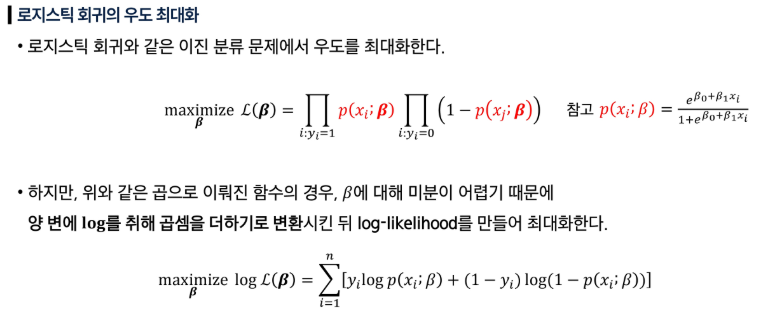
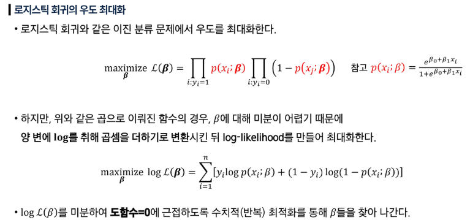
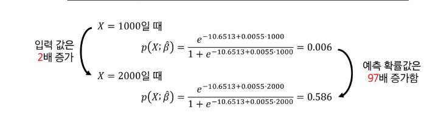

# AI & 기계학습 방법론 1 - 선형회귀(Linear Regression)
# 선형회귀: 입력과 출력의 선형 관계를 찾는 방법
- 입력 변수와 출력 변수 사이의 관계를 직선 형태로 근사하여, 예측하는 통계적 방법
- 지도학습의 가장 기초가 되는 접근 중 하나
- 단순해 보이나, 개념적으로도 실무 적으로도 매우 유용
## 선형회귀를 통해 대답할 수 있는 질문들
- 광고비와 매출 사이에 관계가 있는가?
- 그 관계의 강도는 어느 정도인가?
- 어떤 매체가 매출에 기여하는가?
- 미래 매출을 얼마나 정확히 예측할 수 있는가?
- 매체 간에 상호작용(시너지)이 있는가?
# 단순선형회귀(Simple Linear Regression)
- 한 개의 설명변수(X)와 하나의 반응변수(Y) 사이의 선형 관계를 찾는 방법
- 목표: 데이터를 가장 잘 설명하는 직선을 찾아 예측에 활용
- 단일 설명변수를 이용한 단순선형회귀
#### 
## 최소제곱법(Least squares)
- 실제 관측값과 예측값의 차이(잔차, residual)를 제곱해 합한 값(RSS, 잔차제곱합)을 최소화하는 방법
- 목표: 데이터를 가장 잘 설명하는 직선을 찾기 위해 계수 β0, β1을 추정
#### 
- 모델 적합도: R² 높을 수록, 1에 가까울 수록 좋음
# 다중선형회귀(Multiple Linear Regression)
- 독립 변수(설명 변수, Feature)가 여러 개 존재할 때 사용하는 회귀 분석 기법
- 단순 선형 회귀는 하나의 변수만 고려하지만 다중 선형회귀는 여러 독립 변수를 동시에 고려하여, 종속변수(Y)와의 관계를 구함
- 각 변수의 의미
#### 
## 다중선형회귀의 추정과 예측
#### 
## 다중선형회귀 계수 추정 유도(행렬 표현)
#### 
- 모형 적합도: R² 높을 수록, 1에 가까울 수록 좋음
# 선형회귀 주의사항: 변수 상관(다중공선성), 상관과 인과 구분
## 검증/테스트셋 데이터를 활용한 성능 평가
- 훈련 데이터에서의 성능
  - 회귀식을 만들 때 최소제곱 해는 훈련 데이터만 보고 계산됨
  - 학습에 사용된 훈련 데이터에서는(X와 Y의 평균적인 선형관계가 있다면) 적합이 잘 되어있을 것임
  - 그러나 이것은 테스트 성능을 과소평가할 가능성이 높음
- 테스트 성능 평가 필요
  - 선형회귀도 변일반화 성능을 확인하려면 훈련에 사용되지 않은 새로운 데이터에 적용해 봐야 함
  - 수가 많거나 고차항을 사용하면 과적합 문제가 여전히 발생할 수 있음
  - 검증/교차검증을 통해서 적절한 적합을 찾을 수 있음
## 다중선형회귀시 회귀계수 해석의 주의점
- 이상적 상황: 변수들이 연관(correlation)되지 않고, 독립적일 때 -> 계수 해석이 명확
- 문제 상황: 변수들이 서로 연관되어 있다면 -> 계수 추정이 불안정해지고 해석에 혼동이 발생할 수 있음
- 주의: 관찰 데이터의 상관관계로 인과관계를 주장해서는 안 됨

# AI & 기계학습 방법론 2 - 로지스틱회귀(Logistic Regression)
# 분류(Classification)
## 분류란?
- 정해진 범주 중 하나로 지정하는 것
- 범주형 변수: 수치의 크고 작음이 아니라 유한한 범주로 표현하는 변수
- 분류함수의 목표
#### 
## 예시: 신용카드 연체(Default)
## 분류 모델에서 선형 회귀의 한계
- 선형회귀는 분류 문제에 사용하기 부적절: 이진 분류 문제
  - 선형회귀는 선형함수를 계산하는 문제로 예측값이 제한된 값을 갖지 못하게 함
  - 따라서 예측 확률이 0보다 작거나 1보다 크게 예측될 수 있어 확률로 쓰기 부적절
- 다중범주 분류 문제
  - 선형회귀는 정수형 코딩에 따라 범주간 순서와 동일한 거리를 가정
  - 범주 변수는 순서가 없는 라벨이므로 부적절
- 분류문제에서 적합한 모델 - 로지스틱 회귀
  - 시그모이드 함수를 활용해 0 ~ 1 범위 내 확률값 예측 보장
  - 순서가 없는 범주를 확률로 직접 예측하는 적절한 문류 방법
# 로지스틱 회귀(Logistic Regression)
## 로지스틱 회귀의 모형식
#### 
#### 
## 로지스틱 회귀 모형 vs 선형 모형
#### 
#### 
## MLE 활용 모수 추정
### 우도(Likelihood)
- 확률을 추정하는 모델을 결정했으니, 모수를 추정하는 방법에 대해 알아보자
- 선형회귀에서 현재 함수가 데이터와 오차가 작은지를 평가하기 위해 MSE를 지표로 삽았든, 확률을 계산하는 함수를 평가하기 위해선 우도를 지표로 삼음
- 우도란 현재 확률 함수가 데이터를 얼마나 잘 설명하는지를 나타낸 지표
- 그러므로 모델의 학습은 우도값을 높여 최대화가 되도록하는 것이 목표이며 이를 MLE(Maximum Likelihood Estimation)이라 함
#### 
#### 
#### 
## 로지스틱 회귀 결과: 신용카드 연체 데이터
#### 
#### 
#### 

# AI & 기계학습 방법론 3 - 신경망 모델(Neural Network)
# Shallow Network
## 모수적 함수로서의 선형 모델
#### 
#### 
#### 
#### 
#### 
#### 
#### 
#### 
## 구조 및 활성화 함수
## 조각별 선형 표현
## 표현력/보편적 근사 정리(Universal approximation theorem)
- Hidden unit을 충분히 많이 갖는 다면, 얕은 신경망은 임의의 연속함수를 임의의 정밀도로 근사할 수 있음
# Deep Network
## 네트워크 합성과 층별 출력, 폴딩 직관
## Shallow vs Deep 비교
## 행렬.벡터 수식화와 도식


# 데이터 EDA
- 탐색적 데이터 분석
## EDA 진행 순서
1. 데이터 확인
2. 데이터 정제
3. 개별 변수 분석
4. 변수 간 관계 분석
## 상관 관계
- 하나의 변수가 증가/감소할 때, 다른 변수가 어떤 일정한 관련성을 띄며 함께 변화하는지를 나타내는 지표
- 일반적으로 -1 ~ 1 사이의 값(상관 계수)
#### ※ 상관관계가 높다고 해서 원인과 결과(인과관계)를 의미하는 것은 아님
## 데이터 시각화
- Matplotlib
  - 제목/축/라벨 등 추가
- Seaborn
  - 데이터를 그래프로 그림
## 개별 변수 분석(단변수 분석)
### 히스토그램
- 특정 수치형 변수 하나의 데이터 분포를 파악하기 위해 사용
- 데이터 전체 범위를 여러개의 동일한 구간(bin)으로 나눈 뒤, 각 구간에 속하는 데이터의 개수를 막대 그래프로 표현
- 목적
  - 데이터의 전체적인 분포를 확인
- 장점
  - 직관적인 분포 파악
  - 이상치 탐지 수월
- 단점
  - 구간 설정에 민감
### 박스 플롯
- 데이터의 사분위수 이용하여 분포 요약
- 이상치 탐지 유용
- 데이터 개수 파악 어려움
- 데이터의 구체적 분포 형태 파악 어려움
## 변수 간 관계 분석(다변수 분석)
### 산점도
- 두개의 수치형 변수 사이의 관계 파악
- 장점
  - 패턴이나 이상치 발견 쉬움
- 단점
  - 데이터가 너무 많으면 점들이 서로 겹쳐 분포 파악 어려움
  - 상관관계를 보여줄 뿐, 인과관계를 증명하지 않음
### 히트맵
- 여러 숫자형 변수들 간의 크기를 색상으로 변환하여 보여줌
- 주로 상관관계 분석에 많이 사용
- 수 많은 변수 간 관계를 한번에 살펴보고, 상관관계가 높은 변수 쌍을 찾아내기 유용
- 장점
  - 직관적, 다변량 관계 파악 가능
- 단점
  - 정확한 수치파악 어려움
  - 변수가 너무 많으면 히트맵이 지나치게 커지고 복잡해져서 한눈에 파악하기 어려워짐
### 페어 플롯
- 변수들 사이의 관계와 분포를 빠르게 훑어볼 때 좋은 도구
- 대각선(분포도)
  - 각 성분이 어떻게 분포 되어있는 지를 보여줌
- 대각선 외(산점도)
  - 두 성분 사이의 관계를 보여주는 산점도
- 장점
  - 짧은 코드로 모든 변수 간 관계와 분포를 동시에 탐색 가능
- 단점
  - 변수 개수가 많아지면 계산이 오래 걸림
  - 변수가 10개를 넘어가면 너무 복잡해짐(중요하다고 생각되는 몇 변수를 선택해서 그리는 것이 일반적)
# EDA 결과를 바탕으로 모델학습 준비하기
- EDA를 통해 데이터의 노이즈나 특이한 패턴을 미리 파악하고 처리하지 않으면, 모델이 이런 사쇼한 잡음까지 모두 외워버리는 "과적합"이 발생할 수 있음
## 과적합
- 머신러닝 모델이 훈련 데이터에만 너무 익숙해져서, 데이터의 중요한 패턴을 넘어 사소한 잡음까지 전부 외워버리는 현상
- 이미 학습한 훈련 데이터에서는 좋은 성능을 보이지만, 테스트 데이터에서는 낮은 성능을 보임
- 일반화를 하지 못하고 훈련 데이터에 따라 예측이 크게 흔들림
## 과소적합
- 모델이 너무 단순해서 훈련 데이터의 핵심적인 패턴조차 제대로 학습하지 못한 상태
- 모델의 성능은 훈련 데이터에서도 낮고, 테스트 데이터에서도 낮음
## 데이터 분리
- 데이터를 훈련 데이터와 테스트 데이터로 분리
- 목적: 처음보는 데이터에 대한 일반화 성능을 공정하게 평가하기 위함
- 훈련 데이터: 모델을 학습시키는 용도로 활용
- 테스트 데이터: 모델이 얼마나 새로운 데이터를 잘 예측하는지 일반화 성능을 최종 평가하는 용도
### 코드
- train_test_split(): 주어진 데이터를 훈련 데이터와 테스트 데이터로 분리하는 함수
- test_size=0.3: 전체 데이터 중 30%를 테스트용, 나머지 70%를 훈련용으로 나누겠다는 의미
- random_state=42: 이 숫자를 고정해놓으면 코드를 다시 시작해도 동일한 랜덤값이 배정됨(아무값이나 가능)
- stratify=y
  - 원본 데이터의 정답 비율을 분할된 데이터셋에 동일한 비율로 나눠주는 옵션
  - 훈련 데이터에 정상 메일만 들어가고 테스트 데이터에 스팸 메일만 들어가는 것을 방지할 수 있음
  - 분류 문제에서는 필수
## 스케일링
- 각 특성의 단위를 맞춰서 모델이 공평하게 학습하도록 만드는 과정
### 표준화
- 데이터를 평균 0, 표준편차 1인 분포로 변환
- 특징
  - 이상치에 상대적으로 덜 민감하고 정규분포를 따를 때 효과적
  - 모든 특성에 공평한 영향력 부여
  - 경사 하강법, SVM, 거리 기반 알고리즘의 성능 향상
```python
from sklearn.preprocessing import StandardScaler
scaler = StandardScaler()

# fit: 훈련 데이터의 평균과 표준편차 계산
# transform: 데이터를 표준화
scaler.fit(X_train)
X_train_norm = scaler.transform(X_train)

# or
# fit_transform: fit과 transform을 한 번에 수행
X_train_norm = scaler.fit_transform(X_train)

# 테스트 데이터는 훈련 데이터의 통계량을 사용하여 변환
X_test_norm = scaler.transform(X_test)
```
#### ※ 테스트 데이터의 표준화는 반드시 훈련 데이터의 평균, 표준편차를 활용해야 함
- 테스트 데이터는 아직 학습하지 않은 미래의 데이터
- 테스트 데이터의 평균, 표준편차를 scaler에 반영한다면 정답을 미리 훔쳐본 것과 같아짐
- 이렇게 유출된 정보로 학습한 모델은 실제 현실에서 제대로 된 성능이 나오지 않음
# 모델의 성적표 확인하기: 분류 모델 평가 지표
## 성능 평가
- 선형 회귀 모델은 MSE를 활용해서 모델을 평가
- 분류 모델은? -> 혼동 행렬 활용
  - 정확도
  - 정밀도
  - 재현율
  - 조화 평균
### 정확도(Accuracy)
- 맞은 예측 개수 / 전체 예측 개수
- 가장 이해하기 쉽고, 직관적
```python
from sklearn.metrics import accuracy_score

accuracy = accuracy_score(y_test, y_pred)
```
- 데이터의 정답 비율이 불균형할 때, 정확도는 모델의 성능을 심각하게 왜곡할 수 있음
- 혼동 행렬(Confusion Matrix) 활용
### 정밀도(Precision)
- 모델이 P라고 예측한 것즐 중 진짜 P인 비율
- 모델의 예측을 얼마나 믿을 수 있는가
- 모델의 예측이 얼마나 정교한지
- FP를 낮추는 것이 핵심
- 정밀도 = TP / (TP + FP)
- 모델의 예측을 진짜라고 믿을 수 있어야 할 때 유용
### 재현율(Recall)
- 실제 P중 모델이 P라고 예측 성공한 비율
- 모델이 얼마나 잘 찾아내는가
- 모델이 찾아야 할 것을 얼마나 빠짐없이 잘 찾아냈는지
- FN을 낮추는 것이 핵심
- 재현율 = TP / (TP + FN)
- 모델이 하나라도 놓치면 안될 때 유용
### 조화 평균(F1-Score)
- 데이터가 불균형하여 정밀도와 재현율 중 어떤 지표에 가중치를 둬야할 지 애매할 때
- 보통 정밀도와 재현율은 한쪽이 올라가면 다른 쪽이 내려가는 Trade_off 관계
- F1 = (2 * 정밀도 * 재현율) / (정밀도 + 재현율)
# 성능 검증
## 검증 데이터
- 모델을 훈련시키는 과정에서, 어떤 훈련 방법이 가장 좋은지 확인하고, 최고의 모델을 선택하기 위해 사용되는 데이터
## 교차 검증(Cross-Validation)
- 데이터를 여러 덩어리로 나누어, 여러번 테스트를 통해 모델의 성능을 더 안정적이고 신뢰성 있게 평가하는 방법
# 비지도 학습
## 머신러닝
- 컴퓨터에게 데이터를 주고, 그 데이터 안에서 규칙을 스스로 학습하게 하는 방식
- 학습 종류
  - 지도학습
  - 비지도 학습
  - 강화학습
- 일반적으로 비지도 -> 지도 -> 강화 학습 순으로 복합적인 학습으로 결과물 생성
## 비지도 학습
- 정답(Label)이 없는 데이터 속에 스스로 숨겨진 구조, 패턴, 관계를 찾아내는 머신러닝 방식
- 군집화 / 차원 축소
### 차원 축소(Dimensionality Reduction)
- 데이터의 특징(차원)이 너무 많아지면, 오히려 모델의 성능이 떨어지고 과적합이 발생하기 쉬워지는 문제 발생 -> 데이터의 중요한 정보는 최대한 유지하면서 불필요한 특징은 제거하자
- PCA(주성분 분석)
  - 정보 손실을 최소화 하면서, 여러 피처들을 가장 잘 설명하는 새로운 핵심 특징 몇 개로 압축하는 대표적 차원 축소 기법
  - 데이터가 가장 길게 늘어선 방향(분산이 가장 큰 방향)이 데이터의 정보를 가장 많이 포함하는 제1주성분
### 군집화(Clustering)
- 정답없는 데이터들을 유사한 특징을 가진 것끼리 하나의 그룹으로 묶는 비지도 학습 기법
- 레이블링 작업 불필요
- 사람이 파악하지 못한 숨겨진 패턴을 찾을 수 있음
- K-means
  - 데이터들이 가장 가까운 중심점을 기준으로 뭉치도록 그룹을 형성하도록 하는 알고리즘