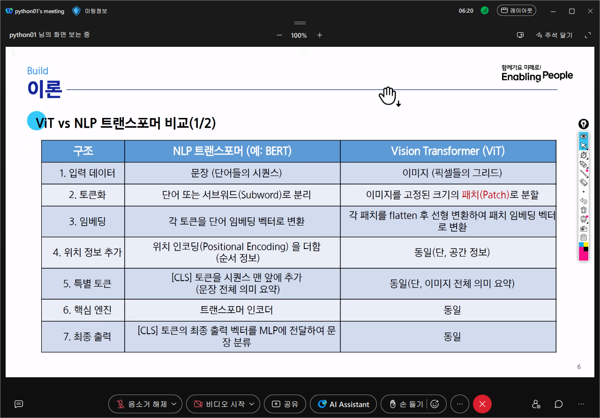
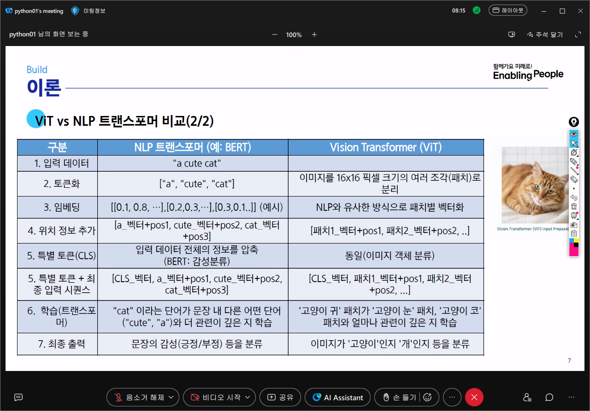

# AI 2 - 이미지 생성
# CLIP
#### 
#### 
- Contrastive Language-Image Pre-training
- 대조 목표를 사용하는 이미지 이해용 신경망 모델과 텍스트 이해용 신경망 모델을 쌍으로 훈력
- 하나의 이미지와 그 이미지를 설명하는 텍스트를 매칭시키는 모델
- 트랜스포머 구조(인코더 + 디코더) 중 인코더 구조만을 사용
  - 모델의 목적이 '이해'와 '표현'에 있기 때문
    - CLIP은 입력된 텍스트와 이미지를 각각 의미적으로 이해하고, 이들을 같은 임베딩 공간에서 표현하는데 목적이 있음 따라서 입력 전체의 의미를 압축하는 인코더 구조가 적합
  - 순차적인 생성 작업이 불필요하기 때문
    - CLIP은 텍스트를 생성하거나 이미지 설명을 만들어내는 모델이 아님
  - 두개의 독립적인 인코더로 충분하기 때문
    - CLIP은 이미지와 텍스트 각각에 대해 별도의 인코더를 사용하여 특징을 추출하고, 두 임베딩을 같은 벡터 공간으로 정렬(contrastive learning)함
- 다양한 이미지-자연어 쌍으로 학습
  - 텍스트 인코더: 트랜스포머 인코더 구조 기반
  - 이미지 인코더: Vit-B(또는 ResNet50)
# 실습 1 - 스테이블 디퓨전 이미지 생성 구현
## Stable Diffusion
- Stability AI에서 오픈소스 라이선스로 배포한 text-to-image 확산 모델
- Stable Diffusion 모델의 이미지 생성 아키텍처의 특징(확산 모델)
  - 잠재 공간(Latent Space) 활용: 고해상도 픽셀 이미지 대신 압축된 저차원 잠재 공간에서 노이즈를 추가하고 제거하여 계산 효율성을 극대화
  - 텍스트 조건부 안내: CLIP과 같은 텍스트 인코더를 사용하여 입력된 텍스트 프롬프트를 벡터로 변환하고, 이 정보를 노이즈 제거 과정에 반영하여 원하는 이미지를 생성하도록 유도
  - 오토인코더(VAE): 이미지를 효율적인 잠재 공간으로 압축(인코딩)하고, 생성이 완료된 잠재 공간의 벡터를 다시 최종 이미지로 복원(디코딩)하는 역할 수행
- 이미지 생성 옵션
  - guidance_scale: 생성된 이미지가 프롬프트를 얼마나 강하게 따를지 결정하는 값(값이 높을수록 프롬프트 내용을 충실히 반영하지만, 너무 높으면 부자연스러워질 수 있음)
  - num_inference_steps: 노이즈를 제거하는 단계 수(단계가 많을수록 이미지 품질이 높아지지만 생성 시간이 길어짐)
  - num_images_per_prompt: 한번의 요청으로 생성할 이미지 개수
## 실습 절차
1. GPU 장치 설정
2. HuggingFace에서 Stable Diffusion 모델 불러오기
3. 이미지 생성을 위한 Pipeline 객체 생성(데이터 준비 + 생성 모델 구조 준비)
   - 문제StableDiffusionPipeline을 호출하여 pipeline 객체를 생성
```python
# from_pretrained 메소드: 미리 학습된 모델을 다운로드하고 로드합니다.
# torch_dtype=torch.float16: 모델의 가중치를 16비트 부동소수점(float16) 형식으로 로드하여
# 메모리 사용량을 줄이고 계산 속도를 높입니다. (GPU에서 효과적)
pipe = StableDiffusionPipeline.from_pretrained(
    model_id, torch_dtype=torch.float16)
pipe = pipe.to(device)
print(pipe)
```
4. 프롬프트 설정
5. Pipeline 객체를 호출하여 이미지 생성
   - pipe 객체를 호출하여 이미지를 생성
```python
# 파이프라인 객체(pipe)를 호출하여 이미지를 생성합니다.
# 이미지를 2장 생성 (num_images_per_prompt 설정)하고 결과를 PIL 이미지 리스트로 반환
result = pipe(
    positive_prompt,                  # 위에서 정의한 긍정 프롬프트
    negative_prompt=negative_prompt,  # 위에서 정의한 부정 프롬프트

    # guidance_scale: 생성된 이미지가 프롬프트를 얼마나 강하게 따를지 결정하는 값.
    # 값이 높을수록 프롬프트 내용을 충실히 반영하지만, 너무 높으면 부자연스러워질 수 있습니다.
    guidance_scale=7.5,

    # num_inference_steps: 노이즈를 제거하는 단계 수.
    # 단계가 많을수록 이미지 품질이 높아지지만 생성 시간이 길어집니다.
    num_inference_steps=50,

    # num_images_per_prompt: 한 번의 요청으로 생성할 이미지의 개수입니다.
    num_images_per_prompt=2,
)
```
6. 생성된 이미지 확인
# 실습 2 - CLIP 모델 사용 생성 이미지 평가
- 생성된 이미지가 의도한 컨셉과 부합하는지 CLIP 모델을 사용하여 평가
  - 텍스트 레이블(평가 항목)에 스타일(수채화/유화/사진)과 객체(여우/개)를 혼합하였을 때 문맥을 이해하여 주어진 이미지를 가장 잘 설명하는 레이블을 선택할 수 있는지
## 실습 절차
1. 평가할 이미지 불러오기
2. 평가에 사용할 텍스트 문장 만들기
3. 이미지와 레이블을 임베딩 벡터로 변환
   - processor를 사용하여 이미지와 텍스트 레이블을 전처리
```python
# processor를 사용해 이미지와 텍스트 레이블들을 모델 입력 형식에 맞게 변환합니다.
# return_tensors="pt": 결과를 파이토치 텐서(Tensor)로 반환하라는 의미입니다.
# padding=True: 문장들의 길이를 맞추기 위해 짧은 문장 뒤에 특수 토큰을 추가합니다.

inputs = processor(text=labels, images=image, return_tensors="pt", padding=True).to(device)
```
### input_ids 값 해석
```python
# 이미지 데이터가 3채널(컬러), 가로(224), 세로(224), 1개임을 알 수있음
print("Shape of pixel_values:", inputs['pixel_values'].shape)
# Shape of pixel_values: torch.Size([1, 3, 224, 224])

# 레이블 데이터가 4개, 각각의 텍스트가 8개의 토큰으로 이루어짐을 알 수있음
print("Shape of input_ids:", inputs['input_ids'].shape)
# Shape of input_ids: torch.Size([4, 8])
```
4. 이미지와 레이블 간의 유사도 계산
   - CLIP 모델로 이미지-텍스트 유사도 계산
```python
# torch.no_grad(): 모델의 가중치를 업데이트하지 않도록 하여(학습이 아님) 순수 추론만 수행합니다.
# CLIP 모델로 이미지-텍스트 유사도 계산
with torch.no_grad():
    # 모델에 전처리된 데이터를 입력합니다. **inputs는 딕셔너리 형태의 입력을 풀어 전달합니다.
    outputs = model(**inputs)

    # logits_per_image: 이미지 한 장당 각 텍스트 레이블과의 유사도 점수를 담고 있습니다.
    logits_per_image = outputs.logits_per_image

    # .softmax(dim=1): 유사도 점수를 확률 값으로 변환합니다. 모든 확률의 합은 1이 됩니다.
    # dim=1은 각 텍스트 레이블에 대한 차원을 의미합니다.
    probs = logits_per_image.softmax(dim=1)
```
## 결과 해석
```python
# .cpu().numpy(): GPU에 있는 텐서를 CPU로 옮긴 후, NumPy 배열로 변환하여 출력합니다.
print("CLIP similarity scores:", logits_per_image.cpu().numpy())
print("CLIP predicted probabilities:", probs.cpu().numpy())

# .argmax(dim=1): 가장 높은 점수를 가진 레이블의 인덱스를 찾습니다.
# .item(): 텐서에서 숫자 값만 추출합니다.
best_idx = logits_per_image.argmax(dim=1).item()
print(f"CLIP 예측 결과: '{labels[best_idx]}' 라벨이 가장 타당하다고 예측되었습니다.")

# CLIP similarity scores: [[31.74538  23.896877 33.681904 29.229849]]
# CLIP predicted probabilities: [[1.24753445e-01 4.86957397e-05 8.65115345e-01 1.00825662e-02]]
# CLIP 예측 결과: 'an oil painting of a fox' 라벨이 가장 타당하다고 예측되었습니다.
```
# 실습 3 - ResNet50 모델 결과 비교
- 생성된 이미지가 의도한 컨셉과 부합하는지 ResNet50 모델을 사용하여 평가
  - 텍스트 레이블(평가 항목)에 스타일(수채화/유화/사진)과 객체(여우/개)를 혼합하였을 때 문맥을 이해하여 주어진 이미지를 가장 잘 설명하는 레이블을 선택할 수 있는지
## 실습 절차
1. 평가에 사용할 모델(ResNet50) 불러오기
   - 사전 학습된 ResNet-50 모델 로드
```python
# models.resnet50: ResNet-50 모델 구조를 가져옵니다.
# weights=models.ResNet50_Weights.IMAGENET1K_V2: ImageNet 데이터셋으로 학습된 가중치를 함께 로드합니다.
resnet50 = models.resnet50(weights=models.ResNet50_Weights.IMAGENET1K_V2).to(device)

# .eval(): 모델을 평가(evaluation) 모드로 설정합니다.
# 이 모드에서는 드롭아웃(Dropout)이나 배치 정규화(Batch Normalization) 등이 비활성화되어 일관된 예측 결과를 보장합니다.
resnet50.eval()
```
2. ResNet50 모델 입력에 적합하도록 이미지 전처리
3. ResNet50 모델에 실습 2와 동일한 이미지를 입력하고 응답 확인
   - ResNet50으로 예측
```python
with torch.no_grad(): # 추론이므로 가중치 업데이트를 비활성화합니다.
    # 모델에 전처리된 이미지 텐서를 입력하여 예측 결과를 얻습니다.
    output = resnet50(img_tensor)
# torch.nn.functional.softmax: 모델의 출력(logits)을 확률 값으로 변환합니다.
probs = torch.nn.functional.softmax(output, dim=1)[0]
```
4. CLIP 모델에 동일한 이미지를 입력한 결과와 비교 분석
# 실습 4 - 생성된 데이터로 ResNet18 모델 전이 학습
- 실습 1, 2에서 생성한 데이터로 기존 모델(ResNet18)의 새로운 클래스를 학습시킴
- 임의의 이미지를 대상으로 여우/개 중 한가지 클래스로 분류하는 인공지는 모델 구현
## 실습 절차
1. 전이 학습에 사용할 합성 이미지 데이터셋 구축
   - 두가지 동물에 대해 수패화 그림을 여러장 생성하기 위해 각각의 프롬프트를 정의
   - 각 클래스에 대해 Stable Diffusion 모델을 활용하여 이미지 생성
2. 데이터 셋을 전처리 한 후 학습 데이터와 테스트 데이터로 분리하고 데이터 로더에 준비
3. ResNet18 모델 로드 및 출력층 교체
   - 모델의 기존 가중치는 고정하고, 마지막 완전 연결층을 교체(2개의 클래스만 출력 가능)
4. 손실 함수, 옵티마이저 설정
5. 학습 수행
6. 테스트 데이터로 모델 평가