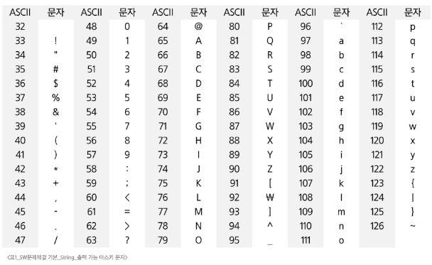
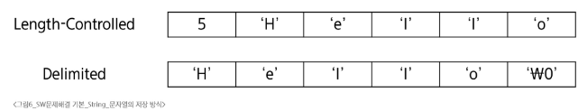

# SW 문제해결 기본 - String
# 문자열
## 코드체계
- 문자에 대응되는 숫자를 정한 것
- 알파벳은 대소문자 총 52자 이므로 6비트(64)면 저장할 수 있음
- 1964년, 미국, ASCII라는 문자 인코딩 표준 제정
- ASCII는 7비트 인코딩으로 128문자를 표현하며, 33개의 출력 불가능한 제어 문자들과 공백을 비롯한 95개의 출력 가능한 문자들로 이루어짐
### ASCII 코드
### 
### Extended ASCII
- 표준 문자 이외의 악센트 문자, 도형 문자, 특수 문자, 특수 기호 등 부가적인 문자를 128개 추가
### 유니코드
- 컴퓨터가 발전하며 미국 뿐 아니라 각 나라에서 컴퓨터가 발전
- 각 국가들이 자국의 문자를 표현하기 위해 코드체계를 만들어서 사용
  - 한국도 한글 코드체계를 만들어 사용했고 조합형, 완성형 두 종류를 가지고 있음
- 인터넷이 전 세계로 발전하면서 ASCII를 만들기 전과 같은 문제가 국가 사이에 정보를 주고 받을 때 발생
- 자국 코드체계를 타 국가가 가지고 있지 않으면 정보를 잘못 해석
- 다국어 처리를 위한 표준인 유니코드 만듦
  - 비영리 단체인 유니코드 컨소시엄에서 관리
  - 이모지도 유니코드 문자
- 'A'의 유니코드는 16진수(10진수)로 0041(65)
- print('\u0041) -> 'A'
### 유니코드 Character Set
- 유니코드도 다시 Character Set으로 분류
- UCS-2
- UCS-4
- 유니코드를 저장하는 변수의 크기를 정의
  - 그러나, 바이트 순서에 대해서는 표준화하지 못함
- 파일을 읽을 때 UCS-2, UCS-4인지 인식하고 각 경우를 구분해서 모두 다르게 구현해야 하는 문제가 발생
  - 그래서 유니코드의 적당한 외부 인코딩이 필요
### 바이트 단위 저장 순서
- Big-endian: 상위 바이트(MSB)를 가장 낮은 주소에 저장
- Little-endian: 하위 바이트(LSB)를 가장 낮은 주소에 저장
### 유니코드 인코딩(UTF: Unicode Transformation Format)
- UTF-8(in web)
  - MIN: 8-bit, MAX: 32-bit(1 Byte * 4)
- UTF-16(in windows, java)
  - MIN: 16-bit, MAX: 32-bit(2 Byte * 2)
- UTF-32(in unix)
  - MIN: 32-bit, MAX: 32-bit(4 Byte * 1)
### 인코딩
- 윈도우는 CR과 LF 두 글자, Unix와 macOS는 LF 한글자를 사용
- Python 인코딩
  - UTF-8
    - 2.x 버전은 기본 인코딩 방식이 ASCII로 UTF-8 사용시 코드 첫 줄에 다음 문장을 추가해야함
      - #-\*- coding: utf-8 -\*-
    - 다른 인코딩 방식으로 처리시 첫 줄에 작성하는 항목에 원하는 인코딩 방식을 지정
#### ※ 코드체계의 핵심: 전 세계의 모든 문자를 컴퓨터가 일관되게 표현하고 처리하는 것
---
000<CR><LF>

arr = list(map(int, input))
000<CR> -> <CR>???
Error!
---
## 문자열
- 문자들이순서대로 나열된 데이터
- 분류
  - Length-Controlled 문자열
    - 문자열의 길이 정보를 함께 저장해서, 그 길이만큼 문자 데이터를 읽는 방식
    - Java, Python, 네트워크 패킷에 사용
  - Delimited 문자열
    - 문자열의 끝을 나타내는 특정한 구분자(Delimiter)가 있어, 구분자가 나올 때까지 문자열로 인식
    - C언어는 널문자(sull, '\0')를 사용
# 
### 파이썬 str 클래스 구조
- PyObject_HEAD: 모든 파이썬 객체가 상속하는 공통 구조
- length: 문자열의 길이
- hash: 문자열의 해시값, 딕셔너리 키로 쓸 때 사용
- interned: 같은 문자열을 관리하는 플래그
- kind: 문자열 인코딩의 크기
- data: 문자열이 저장된 실제 메모리 주소를 가리키는 포인터
### C언어에서 문자열
- 문자열은 문자들의 배열 형태로 구현도니 응용 자료형
- 문자배열에 문자열을 저장할 때는 항상 마지막에 끝을 표시하는 널문자('\0') 필요
  - char ary[]="abc"; // char ary[]={'a', 'b', 'c', '\0'};
- 문자열 처리에 필요한 연산을 함수 형태로 제공
  - strlen(), strcpy(), strcmp(), ...
### Java에서의 문자열
- 문자열 데이터를 저장, 처리해주는 클래스 제공
- String 클래스
  - String str="abc"; //또는 String str=new String("abc")
- 문자열 처리에 필요한 연산을 연산자, 메소드 형태로 제공
  - +, length(). replace(), split(), substring(), ...
### Python3에서의 문자열
- 텍스트 데이터의 취급방법이 통일
  - python2와 달리 바이트 문자열과 유니코드 구분이 없음
  - 유니코드 기반이라 어떤 언어나 기호도 동일한 방식으로 처리
- 문자열 기호
  - ', ", ''', """
- 연산
  - \+ 연결(Concatenation)
    - 문자열 + 문자열: 이어 붙여주는 역할
    - ex) 'ab' + 'c'
  - \* 반복
    - 문자열 * 수: 수만큼 문자열이 반복
    - 'ab' * 3
- 문자열은 데이터의 순서가 구분되는 시퀀스 자료형으로 분류
  - 시퀀스 자료형에서 사용할 수 있는 인덱싱, 슬라이싱 연산들을 사용할 수 있음
- 문자열 클래스에서 제공되는 메소드
  - replace(), split(), isalpha(), find()
- 문자열은 튜플과 같이 요소값을 변경 할 수 없음(immutable)
#### ※ C는 아스키코드, Java는 유니코드(UTF=16, 2-Byte), Python3는 유니코드(UTF-8)로 저장
## 연산

# 패턴매칭
## 고지식한 패턴 검색
## KMP 알고리즘
## 보이어-무어 알고리즘
## 문자열 암호화
