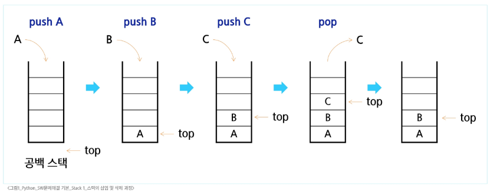
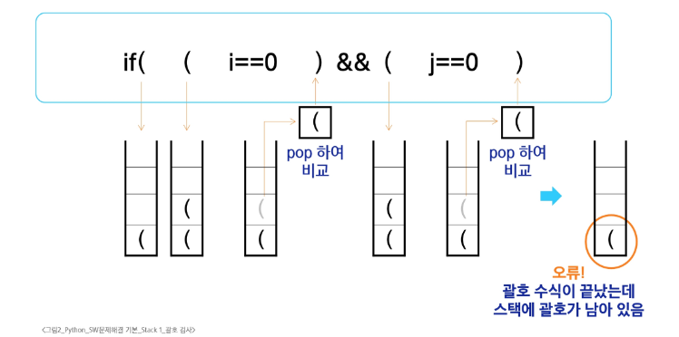
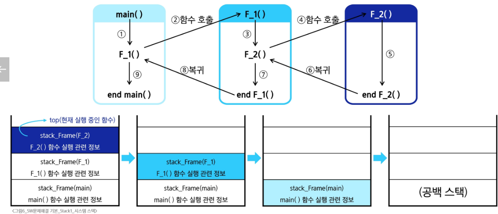
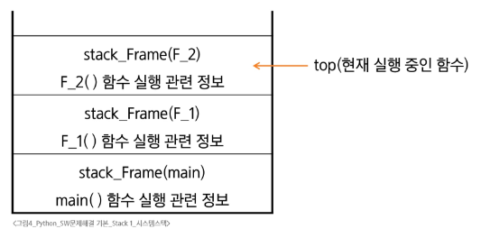

# SW 문제해결 기본 - Stack 1
# Stack 자료구조 이해
## Stack의 개념과 특성
### Stack
- 물건을 쌓아 올리듯 자료를 쌓아 올린 형태의 자료구조
- 선형 자료구조
- 후입선출, LIFO(Last-In-First-Out)
## Stack의 기본 연산
### 스택을 프로그램에서 구현하기 위해 필요한 자료구조와 연산
- 배열을 사용해 구현할 수 있음
  - 파이썬에서는 리스트를 사용해 구현 가능
- 저장소 자체를 스택이라 부르기도 함
  - 용도에 따라 메모리의 일부를 스택으로 부름
- 스택에서 마지막 삽입된 원소의 위치
  - 스택 포인터, top으로 부르며 데이터를 넣거나 뺄 때 기준이 되는 위치
### 스택의 연산
- push(삽입)
  - 저장소에 자료를 저장하는 연산
- pop(삭제)
  - 저장소에서 삽입한 자료를 역순으로 꺼내는 연산
- isEmpty(스택이 공백인지 아닌지를 확인하는 연산)
  - 스택이 비어 있으면 True, 아니면 False를 반환
- peek(스택의 top에 있는 item을 반환하는 연산)
  - 삭제는 하지 않고 반환
### 스택의 삽입/삭제 과정

## Stack 구현 실습
### push 연산
- append 메소드를 통해 리스트의 마지막에 데이터를 삽입
```python
def my_push(item):
  s.append(item)
```
- 인덱스 연산을 활용한 구현
```python
def my_push(item, size):
  global top
  top += 1
  if top == size:
    print('overflow!')
  else:
    stack[top] = item
```
### 단순한 push 연산
- 크기가 정해진 리스트와 인덱스 연산을 활용
```python
size = 10
stack = [0] * size
top = -1

push(10, size)
top += 1          # push(20)
stack[top] = 20
```
### pop 연산
- 남은 데이터 중 가장 늦게 저장된 데이터를 삭제하는 연산
```python
def my_pop():
  if len(s) == 0:
    # underflow
    return
  else:
    return s.pop()  # 리스트 s의 마지막 원소 삭제
```
### 인덱스 연산을 이용한 pop 연산
- 크기가 정해진 리스트와 인덱스 활용
```python
def my_pop():
  global top
  if top == -1:
    print('underflow!')
    return 0
  else:
    top -= 1
    return stack[top + 1]
print(pop())
```
```python
if top > -1:      # pop()
  top -= 1
  print(stack[top + 1])
```
### 스택 구현 고려사항
- 1차원 배열을 사용하여 구현할 경우
  - 장점: 구현이 용이
  - 단점: 스택의 크기를 변경하기 어려움
- 해결방법: 저장소를 동적으로 할당하여 스택을 구현(동적 연결리스트 이용)
  - 장점: 메모리의 효율적 사용
  - 단점: 구현이 복잡
# Stack 응용
## 괄호 검사
### 괄호의 종류
- 대괄호('[', ']'), 중괄호('{', '}'), 소괄호('(', ')')
### 조건
1. 왼쪽 괄호의 개수와 오른쪽 괄호의 개수가 같아야 함
2. 같은 괄호에서 왼쪽 괄호는 오른쪽 괄호보다 먼저 나와야 함
3. 괄호 사이에는 포함 관계만 존재
### 스택을 이용한 괄호 검사

### 괄호를 검사하는 알고리즘 개요
1. 문자열에 있는 괄호를 차례대로 검사하면서 왼쪽 괄호를 만나면 스택에 삽입, 오른쪽 괄호를 만나면 스택에서 top 괄호를 삭제할 후 오른쪽 괄호와 짝이 맞는지를 검사
2. 이 때, 스택이 비어 있으면 조건① 또는 조건②에 위해되고 괄호의 짝이 맞지 않으면 조건③에 위배
3. 마지막 괄호까지 조사한 후에도 스택에 괄호가 남아 있으면 조건①에 위배
## Function Call
- 프로그램에서의 함수 호출과 복귀에 따른 수행 순서를 관리
- 가장 마지막에 호출된 함수가 가장 먼저 실행을 완료하고 복귀하는 후입선출 구조이므로, 후입선출 구조의 스택을 이용하여 수행순서 관리
- 함수의 실행이 끝나면 시스템 스택의 top 원소(스택 프레임)를 삭제(pop)하면서 프레임에 저장되어 있던 복귀주소를 확인하고 복귀시킴
- 함수 호출과 복귀에 따라 이 과정을 반복하여 전체 프로그램 수행이 종료되면 시스템 스택은 공백 스택이 됨
#### 
- 시스템 스택
  - 함수 수행에 필요한 지역번수, 매개변수 및 수행 후 복귀할 주소 등의 정보 저장
  - 함수 호출이 발생하면 stack frame에 저장하여 시스템 스택에 삽입
#### 