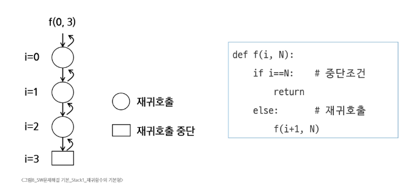
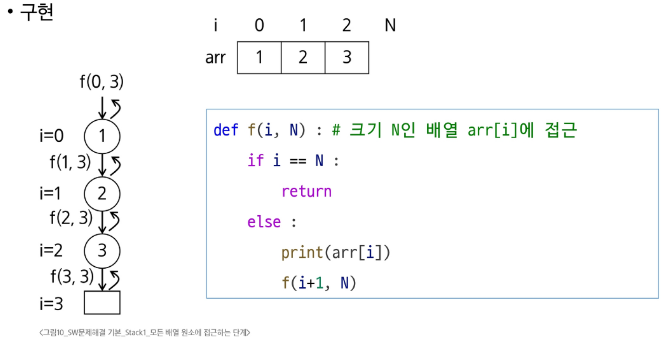
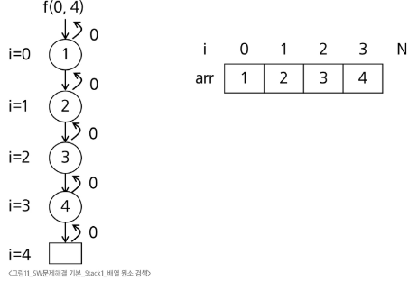
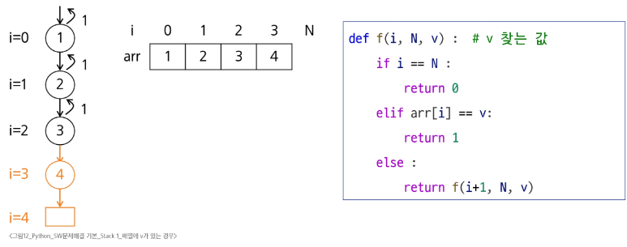
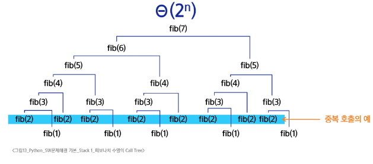
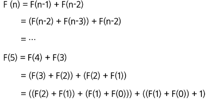

# SW 문제해결 기본 - Stack 1
# Stack 기반 문제 해결 기법
## 재귀호출
- 함수가 자신과 같은 작업을 반복해야 할 때, 자신을 다시 호출하는 구조
### n에 대한 factorial
- 1부터 n까지의 모든 자연수를 곱하여 구하는 연산
  - 마지막에 구한 하위 값을 이용하여 상위 값을 구하는 작업을 반복
```python
def fact(n):
  if n in 0, 1:
    return 1
  return n * fact(n-1)
```
### 피보나치 수열
- 0과 1로 시작하고 이전의 두 수 합을 다음항으로 하는 수열
```python
def fibo(n):
  if n < 2:
    return n
  else:
    return fibo(n - 2) + fibo(n - 1)
```
### 재귀함수의 기본형
- 현재 호출 단계와 목표 단계를 인자로 사용
  - 현재 단계 i, 목표 N을 일자로 갖는 재귀함수 f(i, N)이 기본형
#### 
### 모든 배열 원소에 접근하는 재귀함수
- 기본형을 활용해, 호출 단계 i에서 arr[i] 원소에 접근하고, i가 배열의 크기와 같아지면 재귀호출 중단
#### 
### 배열 원소 v 검색
- 배열에 v가 있으면 1, 없으면 0을 리턴하는 함수
- v = 5인 경우, arr에는 5가 없으므로 마지막 단계까지 호출하고 0을 리턴
#### 
- v = 3인 경우, 3을 찾은 경우에도 재귀호출 중단
#### 
## Memoization
- 컴퓨터 프로그램을 실행할 때 이전에 계산한 값을 메모리에 저장해서 매번 다시 계산하지 않도록 하여 전체적인 실행속도를 빠르게 하는 기술
- 동적 계획법의 핵심이 되는 기술
### 피보나치 재귀호출의 문제점
- 피보나치 수를 구하는 함수를 재귀함수로 구현한 알고리즘은 '엄청난 중복 호출이 존재한다'는 문제발생
- 피보나치 수열의 Call Tree
#### 
### Memoization을 적용한 피보나치
- 계산된 적이 있는 피보나치 수는 저장된 값을 리턴
- fibo(n)의 값을 계산하자마자 저장하면, 실행시간을 θ(n)으로 줄일 수 있음
```python
# memo 를 위한 배열을 할당하고, 모두 0으로 초기화
# memo[0]을 0으로, memo[1]은 1로 초기화

def fibo1(n):
  if n >= 2 and memo[n] == 0:
    memo[n] = fibo1(n - 1) + fibo1(n - 2)
  return memo[n]

memo = [0] * (n + 1)
memo[0] = 0
memo[1] = 1
```
## DP(Dynamic Programming, 동적계획법)
- 입력 크기가 작은 부분 문제들을 먼저 해결한 뒤, 그 결과를 바탕으로 더 큰 부분 문제를 순차적으로 해결해 나가며 최종적으로 전체 문제의 해답을 도출하는 알고리즘
- 그리디 알고리즘과 같이 최적화 문제를 해결하는 알고리즘
### 피보나치 수열의 DP 적용
- 문제의 최적해가 그 하위 문제의 최적해로부터 쉽게 구성될 수 있는 최적 부분 구조여야함
- 동일한 하위 문제가 여러번 반복되어 나타나는 중복 부분 문제여야함
  - 최적 부분구조 + 중복 부분 문제
#### 
- 피보나치 수열 함수의 중복 호출 제거
  - 부분 문제로 나누는 일을 끝냈으면 가장 작은 부분 문제부터 해 구하기
  - 그 결과는 테이블에 저장하고, 테이블에 저장된 부분 문제의 해를 이용하여 상위 문제의 해를 구하기
- 피보나치 수열을 DP로 구현한 코드
```python
def fibo2(n):
  f = [0] * (n + 1)
  f[0] = 0
  f[1] = 1
  for i in range(2, n + 1):
    f[i] = f[i - 1] + f[i - 2]

  return f[n]
```
### DP의 구현 방식
- Recursive 방식: fibo1()
- Iterative 방식: fibo2()
- 재귀 구조에 Menoization을 사용하는 것보다, 반복적인 구조로 DP를 구현하는 방식이 성능 면에서 더 효율적
- 재귀적 구조는 내부에 시스템 호출 스택을 사용하는 오버헤드가 발생하기 때문
## DFS(Depth First Search, 깊이 우선 탐색)
- 한 방향으로 가능한 한 깊게 탐색한 후, 더 이상 갈 곳이 없으면 되돌아와 다른 방향을 탐색
#### ※ 비선형구조인 그래프 구조는 그래프로 표현된 모든 자료를 빠짐없이 검색하는 것이 중요
1. DFS
2. BFS
---
### DFS의 동작 원리
1. 시작 정점의 한 방향으로 갈 수 있는 경로가 있는 곳까지 깊이 탐색
2. 더 이상 갈 곳이 없게 되면, 가장 마지막에 만났던 갈림길 간선이 있는 정점으로 되돌아와서 다른 방향의 정점으로 탐색을 계속 반복하여 결국 모든 정점을 방문하는 탐색 방법
   - 가장 마지막에 만났던 갈림길의 정점으로 되돌아가서 다시 깊이우선탐색을 반복해야하므오 후입선출 구조의 스택 사용
### DFS 알고리즘
```python
visited[], stack[] 초기화
DFS(v):
  시작점 v 방문
  visited[v] <- True
  while
    if v의 인접 정접 중 반문 안한 정점 w가 있으면:
      push(v)
      v <- w (w에 방문)
      visited[w] <- True
    else:
      if 스택이 비어있지 않으면
        v <- stack.pop()
      else:
        break
```