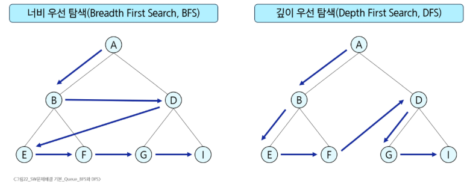

# SW 문제해결 기본 - Queue
# 큐의 활용
## BFS(Breadth First Search, 너비우선 탐색)
- 탐색 시작점의 인접한 정점들을 모두 차례로 방문한 후에, 방문했던 정점을 시작점으로 하여 다시 인접한 정점들을 차례로 방문하는 방식
- 인접한 정점들에 대해 탐색을 한 후, 차례로 다시 너비우선탐색을 진행해야 하므로, 선입선출 형태의 자료구조인 큐를 활용
### 그래프 탐색 방법
#### 
### BFS 알고리즘
```python
def bfs(G, v):              # 그래프 G, 탐색 시작점 v
  visited = [0] * (n + 1)   # n: 정점의 개수
  queue = []                # 큐 생성
  queue.append(v)           # 시작점 v를 큐에 삽입
  while queue:              # 큐가 비어있지 않은 경우
    t = queue.pop(0)        # 큐의 첫번째 원소 반환
    if not visited[t]:      # 방문하지 않은 곳이라면
      visited[t] = True     # 방문 표시
      visit(t)              # 정점 t에서 할 일
      for i in G[t]:        # t와 연결된 모든 정점에 대해 
        if not visited[i]:  # 방문하지 않은 곳이명
          queue.append(i)   # 큐에 삽입
```
#### ※ 파이썬에서 그래프를 저장하는 방법
1. 인접리스트
```python
adj_lst = [[] for _ in range(V + 1)]        # V: 마지막 정점, E: 간선 수 / V번 행까지 준비
for i in range(E):
  v1, v2 = arr[i * 2], arr[i * 2 + 1]
  adj_lst[v1].append(v2)                    # 방향 표시가 없는 경우
  adj_lst[v2].append(v1)

```
2. 인접 행렬

# 추가 강의
# 완전 탐색(Brute Force)
## 개념
- 문제에서 가능한 모든 경우의 수를 생성하고, 조건을 만족하
## 대표적인 문제 해결 기법 비고
1. 완전 탐색(Brute Force)
2. 탐욕(Greedy)
3. 분할 정복(Divide and Conquer)
4. 동적 프로그래밍(DP)
## 완전 탐색과 조합적 문제
- 조합적 문제
  - 순열, 조합, 부분집합 등
- 완전 탐색은 이러한 모든 경우를 전부 생성 후 검사
- 예
  - 배낭 문제: 모든 부분집합을 검사해 최적해 발견(N이 작을 때)
  - 여행 경로: 모든 순열 생성, 최소 비용 경로 찾기


노션 완전탐색, 순열과 조합 보기