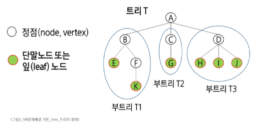
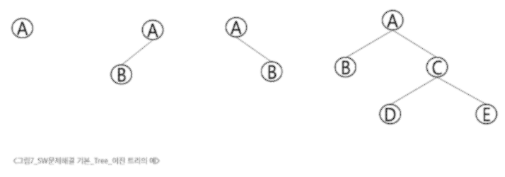
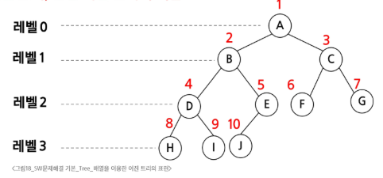
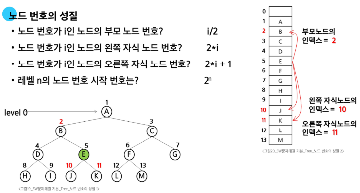
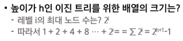

# SW 문제해결 기본 - Tree
# Tree
## 트리
### 트리의 개념
- 비선형 구조
  - Tree, Graph 등
- 원소들 간에 1:n 관계를 가지는 자료 구조
- 원소들 간에 계층관계를 가지는 계층형 자료 구조
- 상위 원소에서 하위 원소로 내려가면서 확장되는 나무 모양의 구조
- 사이클이 없는 무향 연결 그래프의 한 종류
  1. 연결 그래프
      - 모든 노드들이 서로 떨어져 있지 않고, 하나의 덩어리로 연결되어 있다는 의미(어떤 노드에서든 다른 노드로 가는 경로가 존재)
  2. 무향 그래프
      - 노드를 있는 간선에 방향이 없음
      - A와 B가 연결되어 있다면, A에서 B로도, B에서 A로도 갈 수 있음
  3. 사이클이 없는 그래프
      - 특정 노드에서 출발하여 다시 자기 자신으로 돌아오는 순환 경로가 존재하지 않음
### 트리의 정의
- 한 개 이상의 노드로 이루어진 유한 집합이며, 다음 조건을 만족함
  - root: 노드 중 최상위 노드
  - 나머지 노드들은 n(n >= 0)개의 분리 집합 T1, ..., TN으로 분리될 수 있음
- T1, ...,TN은 각각 하나의 트리가 되며(재귀적 정의) 루트의 부트리(subtree)라고 함
  - 전체 트리에서 일부를 잘라도 트리 형태
- #### 
### 용어 정리
- node(노드, vertex): 트리의 원소
- edge(간선): 노드를 연결하는 선. 부모 노드와 자식 노드를 연결
- root node(루트 노드): 트리의 시작노드
- sibling node(형제 노드): 같은 부모 노드의 자식 노드들
- 조상 노드: 간선을 따라 루트 노드까지 이르는 경로에 있는 모든 노드들
- subtree(서브 트리): 부모 노드와 연결된 간선을 끊었을 때 생성되는 트리
- 자손 노드: 서브 트리에 있는 하위 레벨의 노드들
- 노드의 차수: 노드에 연결된 직계 자식 노드의 수
- 트리의 차수: 트리에 있는 노드의 차수 중에서 가장 큰 값
- 단말 노드(리프 노드): 차수가 0인 노드. 자식 노드가 없는 노드
- 깊이와 레벨
  - 루트에서부터 얼마나 아래로 내려왔는가?
  - 노드의 깊이: 루트에서노드에 이르는 간선의 수. 노드의 레벨
  - 트리의 깊이: 트리에 있는 노드의 높이 중에서 가장 큰값. 최대 레벨
- 높이
  - 리프 노드에서부터 위로 얼마나 올라가야 하는가?
  - 노드의 높이: 특정 노드에서 가장 아래에 있는 리프 노드까지의 가장 긴 경로 길이(리프 노드의 높이는 0)
  - 트리의 높이: 루트 노드의 높이. 즉, 트리에서 가장 긴 경로의 길이
#### ※ 일반적으로 0부터 세나 1부터 세는 경우도 있음
## 이진 트리
- 모든 노드들이 2개의 서브트리를 갖는 특별한 형태의 트리
- 각 노드가 자식 노드를 최대한 2개까지만 가질 수 있는 트리
    - left child node
    - right child node
#### 
### 이진 트리의 특성
  - 레벨 i에서의 노드의 최소 개수는 2 ** i개
  - 높이가 h인 이진 트리가 가질 수 있는 노드의 최소 개수는 h + 1, 최대 개수는 2**(h + 1) - 1
### Full Binary Tree(포화 이진 트리)
- 모든 레벨에 노드가 포화 상태로 차 있는 이진 트리
- 높이가 h일 때 최대 노드의 개수인 2**(h + 1)  - 1의 노드를 가진 이진 트리
- 루트를 1번으로 하여 2** (h + 1) -1까지 정해진 위치에 대한 노드 번호를 가짐
### Complete Binary Tree(완전 이진 트리)
- 마지막 레벨을 제외하면 포화상태이고, 마지막 레벨은 왼쪽부터 차곡차곡 채워진 트리(오른쪽 자식만 존재하는 경우는 없음)
- 높이가 h이고 노드 수가 n개일 때(단, 2**h <= n 2**(h + 1) -1), 포화 이진 트리의 노드 번호 1번부터, n번까지 빈자리가 없는 이진 트리
### Skewed Binary Tree(편향 이진 트리)
- 높이가 h에 대한 최소 개수의 노드를 가지면서 한쪽 방향의 자식 노드만을 가진 이진 트리
  - 왼쪽 편향 이진트리
  - 오른쪽 편향 이진 트리
## 순회(traversal)
- 트리의 각 노드를 중복되지 않게 체계적으로 전부 방문하는 것
- 트리는 비선형 구조이기 때문에 선형구조에서와 같이 선후 연결 관계를 알 수 없음
### 세가지의 기본적인 순회 방법
  - 전위 순회(preorder traversal): VLR
    - 부모 노드 방문 후, 자식 노드를 좌, 우 순서로 방문
  - 중위 순회(inorder traversal): LVR
    - 왼쪽 자식 노드, 부모 노드, 오른쪽 자식 노드 순으로 방문
  - 후위 순회(postorder traversal): LRV
    - 자식 노드를 좌, 우 순서로 방문 후, 부모 노드를 방문
## 이진 트리의 표현 1
### 배열을 이용한 이진 트리의 표션
- 이진 트리에 각 노드 번호를 다음과 같이 부여
- 루트의 번호를 1
- 레벨 n에 있는 노드에 대해 왼쪽부터 오른쪽으로 2^n 부터 2^(n + 1) - 1까지 번호를 차례로 부여
- 포화 이진 트리, 완전 이진 트리에 적합
#### 
### 노드 번호의 성질
#### 
### 배열을 이용한 이진 트리의 표현
- 노드 번호를 배열의 인덱스로 사용
#### 