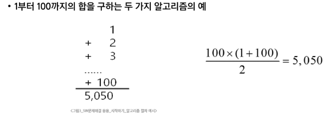
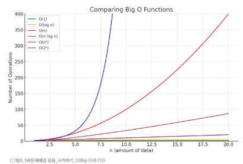

# SW 문제해결 응용 - 시작하기
# 시작하기
## SW 문제해결
### SW 문제해결 역량
- 프로그램을 하기 위한 많은 제약 조건과 요구 사항을 이해하고 최선의 방법을 찾아내는 능력
- 프로그래머가 사용하는 언어나 라이브러리, 자료구조, 알고리즘에 대한 지식을 적재적소에 퍼즐을 배치하듯 이들을 연결하여 큰 그림을 만드는 능력
- 문제 해결 역량은 추상적 기술
  - 프로그래밍 언어, 알고리즘 처럼 명확히 정의된 실체가 없음
  - 무작정 알고리즘을 암기하고 문제를 푼다고 향상되지 않음
- 문제해결 역량을 향상시키기 위한 훈련 필요
### 문제해결 과정
1. 문제를 읽고 이해
2. 문제를 익숙한 용어로 재정의
3. 어떻게 해결할 지 계획 세우기
4. 계획 검증
5. 프로그램으로 구현
6. 어떻게 풀었는지 돌아보고, 개선할 방법이 있는지 찾아봄
#### 자료구조, 알고리즘 확정 후 Pseudo 코드 작성
## 복잡도 분석
### 알고리즘
- 유한한 단계를 통해 문제를 해결하기 위한 절차나 방법
  - 주로 컴퓨터 용어로 쓰이며, 컴퓨터가 어떤 일을 수행하기 위한 단계적 방법
- 어떠한 문제를 해결하기 위한 절차
### 알고리즘의 효율
- 공간적 효율성과 시간적 효율성
  - 공간적 효율성: 알고리즘이 필요로 하는 메모리 공간
    - 시간적 효율성: 알고리즘이 작업을 완료하는 데 걸리는 시간
      - 시간적 효율성은 주로 입력 크기 n에 대한 연산 횟수로 나타냄
  - 효율성을 뒤집어 표현하면 복잡도(Complexity). 복잡도가 높을수록 효율성은 저하
### 복잡도의 점근적 표기
- 시간(또는 공간)복잡도는 입력 크기에 대한 함수로 표기
  - 주로 여러개의 항을 가지는 다항식
  - 이를 단순한 함수로 표현하기 위해 점근적 표기(Asymptotic Notation)를 사용
#### 
- 입력 크기 n이 무한대로 커질 때의 복잡도를 간단히 표현하기 위해 사용하는 표기법
  - O(Big-Oh) - 표기 -> 최악
  - Ω(Big-Omega) - 표기 -> 최선
  - θ(Big-Theta) - 표기 -> 평균
### O(Big-Oh) - 표기
- O-표기는 복잡도의 점근적 상한을 나타냄
- 복잡도가 f(n) = 2n² - 7n + 4라면, f(n)의 O-표기는 O(n²)
- 먼저 f(n)의 단순화된 표현은 n²
- 단순화된 함수 n²에 임의의 상수 c를 곱한 cn²이 n이 증가함에 따라 f(n)의 상한이 됨(단, c > 0)
- 정확한 배수를 강조하고 싶은 경우 O(5n)
### 자주 사용하는 O-표기
- O(1): 상수 시간(Constant time)
- O(logn): 로그(대수) 시간(Logarithmic time) -> 탐색 범위가 반으로 줄어들 때
- O(n): 선형시간(Linear time)
- O(nlogn): 로그 선형 시간(Log-linear time)
- O(n²): 제곱 시간(Quardratic time)
- O(n³): 세제곱 시간(Cubic time)
### 복잡도 비교
- O(logN)은 O(1) 보다는 느리지만, N이 작은 경우 유사한 성능
- O(NlogN)은 O(N) 보다는 느리지만, N이 작은 경우 유사한 성능
#### 
#### 코딩 테스트 Tips
- 코딩 테스트 파이썬 기준 1초당 3000만번 정도 연산 가능
- 59개 테스트케이스 합쳐 파이썬 3초 -> 한테스트 케이스당 170만번 정도 가능
- append() -> 최대한 가능하다면 사용을 피하는 것이 좋음
  - 대신 미리 리스트를 정의해 놓고 인덱스로 접근해서 변경하는 것이 좋음