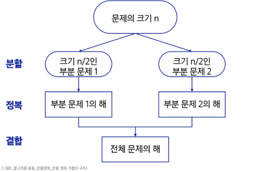
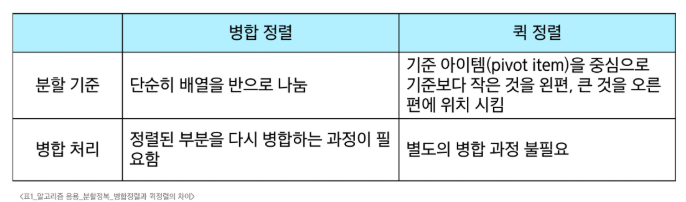

# SW 문제해결 응용 - 분할 정복
# 분할 정복
- 문제를 작은 하위 문제로 나누고(분할) 각각을 해결(정복)한 뒤, 그 결과를 결합(통합)하여 원래 문제를 해결하는 알고리즘 기법
## 분할 정복 기법
### 분할 정복 기법의 설계 전략
- 분할(Divide): 해결할 문제를 여러개의 작은 부분으로 나눔
- 정복(Conquer): 나눈 작은 문제를 각각 해결
- 통합(Combine): (필요하다면)해결된 해답을 모음
### 분할 정복 기법의 구조
- Top-down approach
#### 
### 분할 정복 기법의 예시 - 거듭제곱
- 반복(Iterative) 알고리즘: O(n)
```python
def Iterative_Power(x, n):
  result = 1

  for i in range(n):
    result *= x

  return result
```
- 분할 정복 기반의 알고리즘: O(n log₂ n)
```python
def Recursive_Power(x, n):
  if n == 1:
    return x
  if n
```
## 병합 정렬
- 여러 개의 정렬된 자료의 집합을 병합하여 한 개의 정렬된 집합으로 만드는 방식
- 자료를 최소 단위의 문제까지 나눈 후에 차례대로 정렬하여 최종 결과를 도출
- top-down 방식
- 시간 복잡도: O(n log n)
  - 분할 시 log n
  - 병합 시 n
- 내장함수 sort()는 하이브리드 sort(Tim sort), 대부분의 경우에서 내장함수가 더 효율적이긴 함
- 외부 정렬의 기본이 되는 정렬 알고리즘
- 멀티코어 CPU나 다수의 프로세서에서 정렬 알고리즘을 병렬화하기 위해 병합 정렬 알고리즘이 활용됨
## 퀵 정렬
- 기준값을 중심으로 주어진 배열을 두 개로 분할하고 각각을 정렬하여 전체 배열을 정렬하는 방식
- 시간 복잡도
  - 평균 시간 복잡도: O(n log n)
  - 최악의 경우: O(n²) (Pivot이 극단적이거나 역순 정렬 되어있을때)
  - Partitioning이라는 과정을 반복하며, 빠른 속도로 정렬되는 알고리즘
- 매우 큰 입력 데이터에 대해 좋은 성능을 보이는 알고리즘(데이터가 많을수록 유리)
### Partitioning
1. 작업 영역을 정함
2. 작업 영역 중 가장 왼쪽에 있는 수를 Pivot이라 함(Pivot을 '기준'이라 해석)
   - Pivot은 중간 값, 우측 끝 값으로 설정해도 무관
3. Pivot을 기준으로
   - 왼쪽에는 Pivot 보다 작은 수 배치(정렬 안됨)
   - 오른쪽에는 Pivot 보다 큰 수를 배치(정렬 안됨)
---
- 파티셔닝이 끝나면 Pivot의 위치는 Fix(정렬, 확정)됨
- 즉, 정렬이 다 되었을 때에도 Pivot의 위치는 지금 위치 그대로 배정됨
- 한 번의 파티셔닝 이후, 왼쪽과 오른쪽 부분 배열에 대해 재귀적으로 파티셔닝을 반복하여 정렬 진행
### Hoare-Partition
- 아이디어
  - P(피봇) 값들 보다 큰 값은 오른쪽, 작은 값들은 왼쪽 집합에 위치하도록 함
  - 피봇을 두 집합의 가운데에 위치시킴
  - 왼쪽 끝 / 오른쪽 끝 / 가운데 세 값을 뽑아 비교해 중간 값을 선택하는 것이 비교적 효율적
  - i, j가 교차하면 그 위치와 피복을 교환
```python
arr = [3, 2, 4, 6, 9, 1, 8, 7, 5]
# arr = [11, 45, 23, 81, 28, 34]
# arr = [11, 45, 22, 81, 23, 34, 99, 22, 17, 8]
# arr = [1, 1, 1, 1, 1, 0, 0, 0, 0, 0]


# 피벗: 제일 왼쪽 요소
# 이미 정렬된 배열이나 역순으로 정렬된 배열에서 최악의 성능을 보일 수 있음
def hoare_partition1(left, right):
    pivot = arr[left]  # 피벗을 제일 왼쪽 요소로 설정
    i = left + 1
    j = right

    while i <= j:
        while i <= j and arr[i] <= pivot:     # 같은 수는 교환하지 않고 넘어감
            i += 1

        while i <= j and arr[j] >= pivot:
            j -= 1

        if i < j:
            arr[i], arr[j] = arr[j], arr[i]

    arr[left], arr[j] = arr[j], arr[left]
    return j


# 피벗: 제일 오른쪽 요소
# 이미 정렬된 배열이나 역순으로 정렬된 배열에서 최악의 성능을 보일 수 있음
def hoare_partition2(left, right):
    pivot = arr[right]  # 피벗을 제일 오른쪽 요소로 설정
    i = left
    j = right - 1

    while i <= j:
        while i <= j and arr[i] <= pivot:
            i += 1
        while i <= j and arr[j] >= pivot:
            j -= 1
        if i < j:
            arr[i], arr[j] = arr[j], arr[i]

    arr[i], arr[right] = arr[right], arr[i]
    return i


# 피벗: 중간 요소로 설정
# 일반적으로 더 균형 잡힌 분할이 가능하며, 퀵 정렬의 성능을 최적화할 수 있습니다.
def hoare_partition3(left, right):
    mid = (left + right) // 2
    pivot = arr[mid]  # 피벗을 중간 요소로 설정
    arr[left], arr[mid] = arr[mid], arr[left]  # 중간 요소를 왼쪽으로 이동 (필요 시)
    i = left + 1
    j = right

    while i <= j:
        while i <= j and arr[i] <= pivot:
            i += 1
        while i <= j and arr[j] >= pivot:
            j -= 1
        if i < j:
            arr[i], arr[j] = arr[j], arr[i]

    arr[left], arr[j] = arr[j], arr[left]
    return j


def quick_sort(left, right):
    if left < right:
        pivot = hoare_partition1(left, right)
        # pivot = hoare_partition2(left, right)
        # pivot = hoare_partition3(left, right)
        quick_sort(left, pivot - 1)
        quick_sort(pivot + 1, right)


quick_sort(0, len(arr) - 1)
print(arr)
```
### Lomuto Partition
```python
arr = [3, 2, 4, 6, 9, 1, 8, 7, 5]


def lomuto_partition(left, right):
    pivot = arr[right]

    i = left - 1
    for j in range(left, right):
        if arr[j] <= pivot:
            i += 1
            arr[i], arr[j] = arr[j], arr[i]

    arr[i + 1], arr[right] = arr[right], arr[i + 1]
    return i + 1


def quick_sort(left, right):
    if left < right:
        pivot = lomuto_partition(left, right)
        quick_sort(left, pivot - 1)
        quick_sort(pivot + 1, right)


quick_sort(0, len(arr) - 1)
print(arr)
```
### 병합 정렬과 퀵 정렬의 차이
#### 
## 이진 검색
- 자료의 가운데에 있는 항목의 키 값과 비교하여 다음 검색의 위치를 결정하고 검색을 계속 진행하는 방법
- 목적 키를 찾을 때까지 이진 검색을 순환적으로 반복 수행함으로써 검색 범위를 반으로 줄여가며 보다 빠르게 검색 수행
- Lower Bound, Upper Bound
  - 정렬된 배열에서 특정 값 이상(or 이하)가 처음으로 나타나는 위치를 찾는 알고리즘
  - 특정 데이터의 범위 검색 등에서 활용
### 이진 검색의 과정
1. 자료의 중앙에 있는 원소 선택
2. 중앙 원소의 값과 찾고자 하는 목표값 비교
3. 목표값이 중앙 원소의 값보다 작으면 자료의 왼쪽 반에 대해 새로 검색 수행, 크다면 자료의 오른쪽 반에 대해 새로 검색 수행
4. 찾고자 하는 값을 찾을 때까지 ①~③의 과정 반복
#### ※ 이진 겁색을 하기 위해서는 자료가 정렬된 상태여야 함