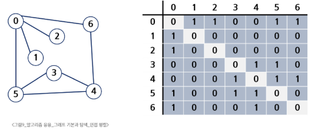
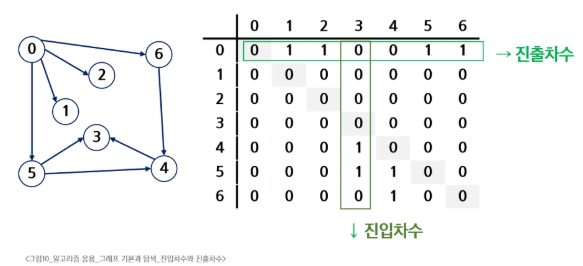
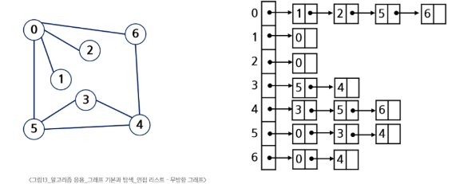
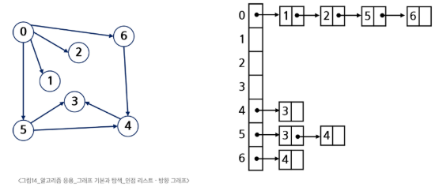

# SW 문제해결 응용 - 그래프의 기본과 탐색
# 그래프의 기본과 탐색
## 그래프 기본
### 그래프
- 아이템(사물 또는 추상적 개념)들과 이들 사이의 연결 관계를 표현
- 선형 자료구조나 트리 자료구조로 표현하기 어려운 N:N 관계를 가지는 원소들을 표현하기에 용이
- 정점들의 집합과 이들을 연결하는 간선들의 집합으로 구성된 자료 구조
- V: 정점의 개수, E: 간선의 개수(최대 V * (V - 1) / 2개의 간선을 가질 수 있음)
### 그래프의 유형
- 무향 그래프(Undirected Graph)
- 유향 그래프(Directed Graph)
- 가중치 그래프(Weighted Graph)
- 사이클 없는 방향 그래프(DAG, Directed Acyclic Graph)
- 완전 그래프: 정접들에 대해 가능한 모든 간선들을 가진 그래프
- 부분 그래프: 원래 그래프에서 일부 정점이나 간선을 제외한 그래프
- 희소 그래프: 간선이 적은 그래프
### 그래프의 특징
- 인접(Adjacency)
  - 두 개의 정점에 간선이 존재하면 서로 인접
  - 완전 그래프에 속한 이므이의 두 정점들을 모두 인접
- 그래프 경로
  - 간선들을 순서대로 나열한 것
  - 단순 경로: 경로 중 한 정접을 최대한 한번만 지나는 경로
  - Cycle: 시작한 정점에서 끝나는 경로
### 그래프의 표현
- 간선의 정보를 저장하는 방식, 메모리나 성능을 고려하여 결정
- 인접 행렬(Adjacent Matrix)
  - V X V 크기의 2차원 배열을 이용해 간선 정보 저장
  - 두 정점을 연결하는 간선의 유무를 행렬로 표현
  - 무향 그래프: i번째 행의 합 = i번째 열의 합 = Vi의 차수
  - 직관적이며, 특정 연결 검색이 빠름
  - 단점: 정점 수에 비해 간선 수가 적은 경우 공간 낭비 심함
#### 
  - 유향 그래프: 행 i의 합 = Vi의 진출 차수, 열 i의 합 = Vi의 진입 차수
#### 
- 인접 리스트(Adjacent List)
  - 각 정점마다 해당 정점과 인접한 정점 정보를 순차적으로 저장
    - 연결 안된 정보는 저장하지 않음
  - 메모리가 효율적이나, 특정 연결 정보 조회가 느림
  - 하나의 정점에 대한 인접 정점들을 각각 노드로 하는 연결리스트로 저장
  - 무향 그래프:노드 수 = 간선의 수 * 2, 각정점의 노드 수 = 정점의 차수
#### 
  - 유향 그래프: 방향 그래프의 노드 수 = 간선의 수, 각 정점의 노드 수 = 정점의 진출 차수
#### 
- 간선의 배열
  - 간선(시작 정점. 끝 정점)을 배열에 연속적으로 저장
## DFS
- 모든 정점을 중복없이 빠짐없이 방문 하는 경우
- 보통 경로를 출력하거나, 갈 수 있는 경로(경우)의 수를 출력할 때 사용
- stack
  - 장점: 빠름, 깊이 제한이 없음
  - 단점: 구현이 어려움
- 재귀
  - 장점: 구현이 쉬움
  - 단점: 느림, 재귀 호출 깊이 제한이 있음
## BFS
- 몇번만에 도달하는가?, 최단거리를 출력할 때 사용
- ex) 지하철 노선도: 1번 역에서 2번 역으로 갈때
- visited
  - queue에 추가할 때 체크를 하면 중복 방문이 없어짐
  - queue에서 꺼낼 때
## Union-find(Disjoint set)
### 서로소 집합(Disjoint-sets)
- 서로 공통 원소가 없는 집합
  - 교집합이 없는 집합들
- 대표자(representative)
  - 각 집합을 대표하는 하나의 원소
- 상호 배타 집합
  - 확률, 논리, 집합론에서 동시에 일어날 수 없는 경우, 공통이 없는 경우
  - 집합론에서는 서로소와 같은 뜻
- 표현 방법
  - 연결리스트
  - 트리
### 서로소 집합 연산
- Make-Set(x)
  - x를 원소로 가진 집합 생성
- Find-Set(x)
  - x가 속한 집합의 대표 원소 반환
- Union(x, y)
  - y가 속한 집합과 x가 속한 집합의 합집합 생성
  - x가 합집합의 대표 원소가 됨
### 상호 배타 집합 표현 - 연결리스트
- 같은 집합의 원소들은 하나의 연결리스트로 관리
- 연결리스트의 맨 앞 원소가 집합의 대표 원소
- 각 원소는 집합의 대표 원소를 가리키는 링크를 가짐
### 상호 배타 집합 표현 - 트리
- 하나의 집합(a disjoint set)을 하나의 트리로 표현
- 자식 노드가 부모 노드를 가리키며 루트 노드가 대표자가 됨
### 상호 배타 집합에 대한 연산 문제점
- 편향 트리가 되는 경우 Find-Set()에 시간이 오래 걸림
- Find-Set()에서 찾아진 대표 원소로 각 원소의 대표 원소를 바꾸면 경로가 단축됨: 경로 압축
#### 
### 연산의 효율 높이는 방법
- Rank를 이용한 Union
  - 각 노드는 자신을 루트로 하는 subtree의 높이를 rank라는 이름으로 저장
  - 두 집합을 합칠 때 rank가 낮은 집합을 rank가 높은 집합에 붙임
- Path compression
  - Find-Set을 행하는 과정에서 만나는 모든 노드들이 직접 root를 가리키도록 포인터를 바꿔줌