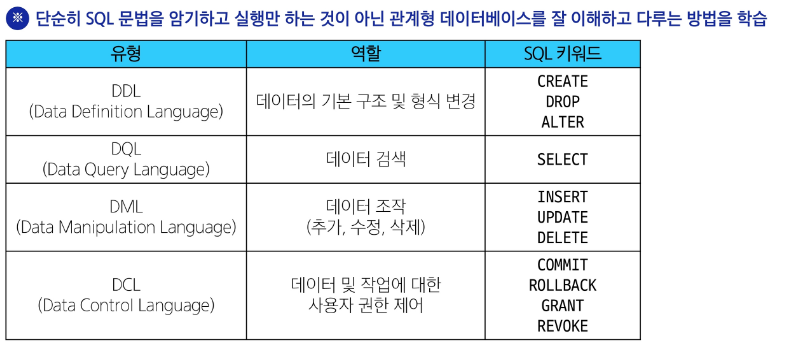
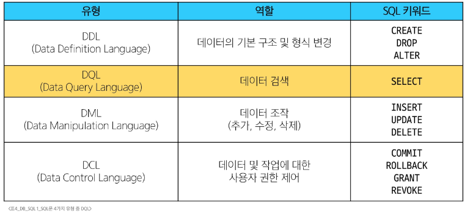
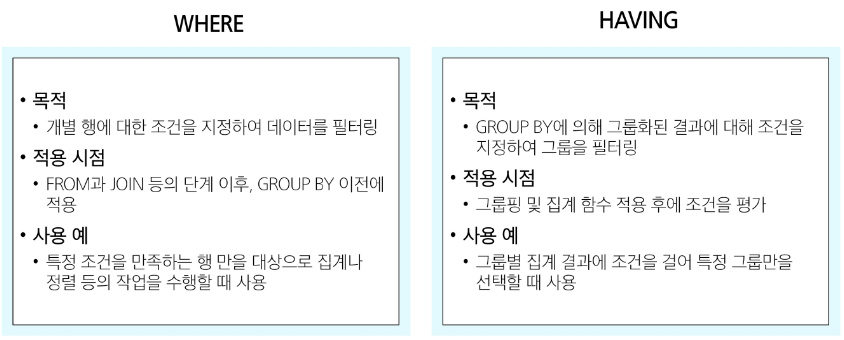

# DB - SQL 01
# Database
- 체계적으로 정리된 데이터의 모음
## 데이터
- 저장이나 처리를 위해 변환된 정보
- 분석, 계산, 저장을 위해 정보를 구체적인 형태로 정리한 것
## 데이터 저장 방식
1. 파일 이용
   - 어디에서나 쉽게 사용 가능
   - 데이터를 구조적으로 관리하기 어려움
2. 스프레드 시트 이용
   - 테이블의 열과 행을 사용해 데이터를 구조적으로 관리 가능
### 스프레드 시트의 한계
- 크기
  - 일반적으로 약 100만 행까지만 저장가능
- 보안
  - 단순히 파일이나 링크 소유 여부에 따른 단순한 접근 권한 기능 제공
- 정확성
  - 데이터 변경이 생기면 테이블의 모든 위치에서 해당값을 업데이트 해야 함
  - 데이터가 여러 시트에 부난되어 있다면 변경에 누락이 생기거나 추가 문제가 발생할 수 있음
# Relational Database
## 데이터베이스 역할
- 데이터를 (구조적으로)저장하고 조작
  - Create
  - Read
  - Update
  - Delete
## 관계형 데이터베이스(Relational Database)
- 데이터 간에 관계가 있는 데이터 항목들의 모음
- 테이블, 행, 열의 정보를 구조화하는 방식
- 서로 관련된 데이터 포인터를 저장하고 이에 대한 액세스를 제공
### 관계
- 여러 테이블 간의 (논리적)연결
- 데이터를 각각의 테이블에 나눠 저장하되, 공통된 키 값을 통해 서로 연결하여 필요할 때 함께 조회하거나 조작할 수 있도록 함
- 두 테이블을 사용하여 데이터를 다양한 형식으로 조회할 수 있음
  - 특정 날짜에 구매한 모든 고객 조회
  - 지난 달에 배송일이 지연된 고객 조회
### 관계형 데이터베이스 예시
- 고객 데이터가 테이블에 저장되어 있다고 가정
  1. 고객 데이터 간 비교를 위해서는 어떤 값을 활용해야 할까?
    - 이름/주소? 만약 동명이인이나 같은 주소지가 있다면?
    - -> 각 데이터에 고유한 식별값을 부여(기본키, Primary Key)
  2. 누가 어떤 주문을 했는지 어떻게 식별할 수 있을까?
    - 고객 이름?
    - -> 주문 정보에 고객의 고유한 식별값을 저장(외래키, Foreign key)
### 관계형 데이터베이스 관련 키워드
1. Table(aka Relation)
   - 데이터를 기록하는 곳
2. Field(aka column, Attribute)
   - 각 필드에는 고유한 데이터 형식이 지정됨
3. Record(aka Row, Tuple)
   - 각 레코드에는 구체적인 데이터 값이 저장됨
4. Database(aka Schema)
   - 테이블의 집합
5. Primary Key(기본키)
   - 각 레코드의 고유한 값
   - 관계형 DB에서 레코드의 식별자로 활용
6. Foreign Key(외래키)
   - 테이블의 필드 중 다른 테이블의 레코드를 식별할 수 있는 키
   - 다른 테이블의 기본키를 참조
   - 각 레코드에서 서로 다른 테이블 간의 관계를 만드는 데 사용
## RDBMS
### DBMS(Database Management System)
- 데이터베이스를 관리하는 소프트웨어 프로그램
- 데이터를 일정한 규칙으로 저장하고, 필요할 때 쉽게 꺼내거나 바꿀 수 있도록 도와주는 도구
- 데이터 저장 및 관리를 용이하게 하는 시스템
- 데이터베이스와 사용자 간의 인터페이스 역할
- 사용자가 데이터 구성, 업데이트, 모니터링, 백업, 복구 등을 할 수 있도록 도움
### RDBMS
- 관계형 데이터베이스 관리 소프트웨어 프로그램
- 데이터를 여러 테이블에 나누어 저장하되, 공통된 키를 통해 서로 관계를 맺고 함께 사용할 수 있게 해주는 시스템
- 종류: SQLite, MySQL, PostgreSQL, Oracle Database 등
#### ※ SQLite
- 경량의 오픈 소스 데이터베이스 관리 시스템
- 설치없이 가볍게 실행 가능해 모바일앱이나 소규모 프로그램에 적합
- 컴퓨터나 모바일 기기에 내장되어 간단하고 효율적인 데이터 저장 및 관리를 제공
# SQL(Structure Query Language)
- 테이블의 형태로 구조화 된 관계형 DB에게 요청을 질의
## SQL Syntax
1. SQL 키워드는 대소문자를 구분하지 않음
   - 하지만 대문자로 작성하는 것을 권장(명시적 구분)
2. 각 SQL Statements의 끝에는 세미콜론(';') 필요
   - 세미콜론은 각 SQL Statements를 구분하는 방법(명령어의 마침표)
### SQL Statements
- SQL을 구성하는 가장 기본적인 코드 블록
- 수행 목적에 따른 유형
  1. DDL - 데이터 정의
  2. DQL - 데이터 검색
  3. DML - 데이터 조작
  4. DCL - 데이터 제어
#### 
## SQL Statements
# Querying data
## 사전 준비
- Database 연결
  - VSCode 확장 툴 Database Client 사용
  - 사전에 제공한 sample.sqlite3 DB 연결
## DQL
- SQL Statements 유형
#### 
## SELECT
### SELECT syntax
```sql
SELECT
  select_list
FROM
  table_name;
```
- SELECT 키워드 이후 데이터를 선택하려는 필드를 하나 이상 지정
- FROM 키워드 이후 데이터를 선택하려는 테이블의 이름을 지정
# Sorting data
## ORDER BY
### ORDER BY syntax
```sql
SELECT
  select_list
FROM
  table_name
ORDER BY
  column1 [ASC|DESC],
  column2 [ASC|DESC],
  ...;
```
- FROM clause 뒤에 위치
- 하나 이상의 컬럼을 기준으로 결과를 오름차순(기본값), 내림차순으로 정렬
#### ※ 정렬에서의 NULL: NULL 값이 존재할 경우 오름차순 정렬시 결과에 NULL이 먼저 출력됨
# Filtering data
## Filtering data 관련 Keywords
- Clause: SQL 문장에서 특정 기능을 수행하도록 지정하는 문장 구성 요소
  - DISTINCT
  - WHERE
  - LIMIT
- Operator: SQL에서 조건을 비교하거나 데이터를 선택하기 위해 사용하는 명령 기호 또는 키워드
  - BETWEEN
  - IN
  - LIKE
  - Comparison
  - Logical
## DISTINCT
### DISTINCT syntax
```sql
SELECT DISTINCT
  select_list
FROM
  table_name;
```
- 조회 결과에서 중복된 레코드를 제거
- SELECT 키워드 바로 뒤에 작성해야 함
- SELECT DISTINCT 키워드 다음에 고유한 값을 선택하려는 하나 이상의 필드를 지정
## WHERE
### WHERE syntax
```sql
SELECT
  select_list
FROM
  table_name;
WHERE
  search_condition;
```
- FROM clause 뒤에 위치
- search_condition은 비교연산자 및 논리연산자(AND, OR, NOT 등)를 사용하는 구문이 사용됨
## Operators
### Comparison Operators(비교 연산자)
- =, >=, <=, !=
- IS, LIKE, IN
  - LIKE: 값이 특정 패턴에 일치하는지 확인(Wildcards와 함께 사용)
  - IN: 값이 특정 목록 안에 있는지 확인
- BETWEEN ... AND
### Logical Operators(논리 연산자)
- AND(&&)
- OR(||)
- NOT(!)
#### ※ Wildcard Characters
- '%': 0개 이상의 문자열과 일치하는지 확인
- '_': 단일 문자와 일치하는지 확인
## LIMIT
### LIMIT syntax
```sql
SELECT
  select_list
FROM
  table_name;
LIMIT
  [offset,] row_count;
```
- 조회하는 레코드 수를 제한
- 하나 또는 두개의 인자를 사용(0 또는 양의 정수)
- row_count는 조회하는 최대 레코드 수를 지정
# Grouping data
## GROUP BY
### GROUP BY syntax
```sql
SELECT
  c1, c2, ..., cn, aggregate_function(ci)
FROM
  table_name;
GROUP BY
  c1, c2, ..., cn;
```
- 레코드를 그룹화하여 요약본 생성(집계 함수와 함께 사용)
- FROM 및 WHERE 절 뒤에 배치
- GROUP BY 절 뒤에 그룹화 할 필드 목록을 작성
#### ※ Aggregate Function(집계 함수)
- 값에 대한 계산을 수행하고 단일한 값을 반환하는 함수
- SUM, AVG, MAX, MIN, COUNT 등
## HAVING
- 집계 항목에 대한 세부 조건을 지정
- 주로 GROUP BY와 함께 사용되며 GROUP BY가 없다면 WHERE 처럼 동작
### WHERE vs. HAVING
#### 
### SELECT statements 실행 순서
1. 테이블에서(FROM)
2. 특정 조건에 맞추어(WHERE)
3. 그룹화하고(GROUP BY)
4. 만약 그룹중에서 조건이 있다면 맞추고(HAVING)
5. 조회하여(SELECT)
6. 정렬하고(ORDER BY)
7. 특정 위치의 값을 가져옴(LIMIT)
# 참고
## Query
- 데이터베이스로부터 정보를 요청하는 것
- 일반적으로 SQL로 작성하는 코드를 쿼리문이라 함
## NULL 비교
### NULL
- SQL에서 NULL은 실제값이 아니라 **값이 없음** 또는 **알 수 없음**을 의미
  - 때문에 일반적인 등호('=') 연산자로 NULL을 비교하면 의도한 대로 작동하지 않음
### SQL의 3값 논리
- SQL은 논리 연산에 대해 세가지 값을 사용
  1. TRUE
  2. FALSE
  3. UNKNOWN(알 수 없음)
- 예를 들어, 'NULL = NULL'의 결과는 TRUE가 아니라 UNKNOWN이 됨
- 아는 두 NULL이 실제로 어떤 값을 가지고 있지 않기 때문
### 값의 부재와 불확실성
- NULL은 값이 존재하지 않음을 나타내므로, 특정 값과 동일하다고 볼 수 없음
- '=' 연산자를 사용하면, NULL은 어떤 값과도 비교할 수 없으므로 결과가 UNKNOWN이 되어 기대한 결과를 얻지 못함
### 명시적 비교: IS와 IS NOT
- SQL 표준은 NULL 값을 비교할 때 명시적으로 IS NULL 또는 IS NOT NULL 구문을 사용하도록 규정
- WHERE column IS NULL은 해당 컬럼에 값이 없음을 정확하게 확인할 수 있도록 해줌
- 반대로 WHRER column IS NOT NULL은 값이 존재하는 행을 찾음
### =와 IS 비교
- '='
  - 일반적인 값의 동등성(같음)을 비교할 때 사용
  - 제한 사항
    - 만약 비교하는 값 중 하나라도 NULL이면, 결과는 UNKNOWN이 됨
    - 예를 들어, NULL = NULL의 결과는 TRUE가 아닌 UNKNOWN
    - SQL의 3값 논리(참, 거짓, 알 수 없음) 체계 때문에 이런 결과가 발생
```sql
SELECT * FROM employees
WHERE department = 'Sales'; 
```
- IS
  - NULL과 같은 특별한 값을 비교할 때 사용
  - 사용처
    1. NULL 비교
    2. Boolean 값 비교
```sql
SELECT * FROM employees
WHERE departments IS NULL;
...
WHERE is_active IS TRUE;
```
## SQL 표준
- SQL은 미국 국립 표준 협회(ANSI)와 국제 표준화 기구(ISO)에 의해 표준 채택됨
- 모든 RDBMS에서 SQL 표준을 지원
- 다만 각 RDBMS마다 독자적인 기능에 따라 표준을 벗어나는 문법이 존재하니 주의