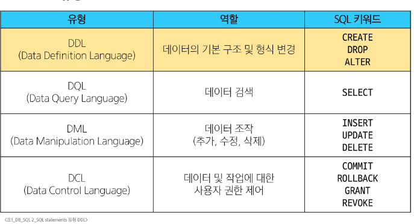
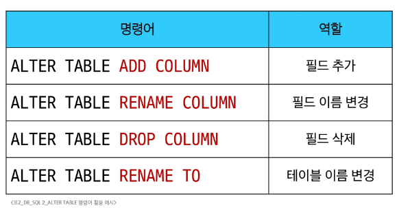
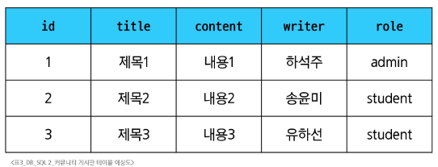
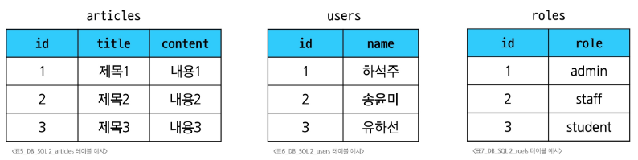
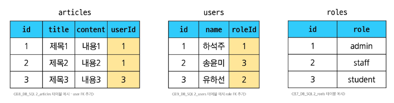

# DB - SQL 02
# Managing Tables
## SQL Statements 유형
#### 
## Create a table
### CREATE TABLE syntax
```sql
CREATE TABLE table_name (
  column_1 data_type constraints,
  column_2 data_type constraints,
  ...,
);
```
- 각 필드에 적용할 데이터 타입 작성
- 테이블 및 필드에 대한 제약조건 작성
#### ※ cid
- Column ID를 의미하며 각 컬럼의 고유한 식별자를 나타내는 정수 값
- 직접 사용하지 않으며 PRAGMA 명령과 같은 메타데이터 조회에서 출력값으로 활용됨
  - ```PRAGMA table_info('examples');```
### CREATE TABLE Statements 구성
1. 데이터 타입
2. 제약 조건
   - 테이블의 필드에 적용되는 규칙 또는 제한 사항
   - 데이터의 무결성을 유지하고 데이터베이스의 일관성을 보장
     - PRIMARY KEY: 해당 키를 기본키로 지정, INTEGER 타입에만 적용되며, INT, BIGINT 등과 같은 다른 정수 유형은 적용되지 않음
     - NOT NULL: 해당 필드에 NULL 값을 허용하지 않도록 지정
     - FOREIGN KEY: 다름 테이블과의 외래키 관계를 정의
3. AUTOINCREMENT 키워드
   - 필드의 자동 증가를 나타내는 특수한 키워드
   - 주로 primary key 필드에 적용
   - INTEGER PRIMARY KEY AUTOINCREMENT가 작성된 필드는 항상 새로운 레코드에 대해 이전 최대값보다 큰 값을 할당
   - 삭제된 값은 무시되며 재사용할 수 없게 됨
#### SQLite 데이터 타입
- NULL
  - 아무런 값도 포함하지 않음을 나타냄
- TEXT
  - 문자열
- INTEGER
  - 정수
- BLOB
  - 이미지, 동영상, 문서 등의 바이너리 데이터
- REAL
  - 부동 소수점
## Modifying table fields
- ALTER TABLE
### ALTER TABLE 역할
#### 
### 1. ALTER TABLE ADD COLUMN syntax
```sql
ALTER TABLE
  table_name
ADD COLUMN
  column_definition;
```
- ADD COLUMN 키워드 이후 추가하고자 하는 새 필드 이름과 데이터 타입 및 제약 조건 작성
- 단, 추가하고자 하는 필드에 NOT NULL 제약조건이 있을 경우 NULL이 아닌 기본값 설정 필요
  - 테이블 생성시 정의한 필드는 기본값이 없어도 NOT NULL 제약조건으로 생성됨
  - 내부적으로 Default value는 NULL로 설정됨
- SQLite는 단일문을 사용하여 한번에 여러 필드를 추가할 수 없음
- sqlite는 컬럼 수정 불가
  - 대신 테이블의 이름을 바꾸고, 새 테이블을 만들고 데이터를 새 테이블에 복사하는 방식을 사용
### 2. ALTER TABLE RENAME COLUMN syntax
```sql
ALTER TABLE
  table_name
RENAME COLUMN
  column_name TO new_name;
```
- RENAME COLUMN 키워드 뒤에 이름을 바꾸려는 필드의 이름을 지정하고 TO 키워드 뒤에 새 이름을 지정
### 3. ALTER TABLE DROP COLUMN syntax
```sql
ALTER TABLE
  table_name
DROP COLUMN
  column_name;
```
- DROP COLUMN 키워드 뒤에 삭제할 필드 이름 지정
### 4. ALTER TABLE RENAME TO syntax
```sql
ALTER TABLE
  table_name
RENAME TO
  new_table_name;
```
- RENAME TO 키워드 뒤에 새로운 테이블 이름 지정
## Delete a table
### DROP TABLE
- DROP TABLE syntax
  - ```DROP TABLE table_name;```
# Modifying Data
## Insert data
### 사전 준비
- 생성하려는 테이블과 동일한 이름을 가진 테이블이 존재하는지 확인
  - ```SELECT * FROM articles;```
- 불필요한 테이블이라면 DROP TABLE 명령어로 테이블 삭제
  - ```DROP TABLE articles;```
- 정상적으로 삭제되었는지 PRAGMA 활용하여 체크
  - ``` PRAGMA table_info('articles');```
- 실습 테이블 생성
```sql
CREATE TABLE articles (
  id INTEGER PRIMARY KEY AUTOINCREMENT,
  title VARCHAR(100) NOT NULL,
  content VARCHAR(200) NOT NULL,
  createAt DATE NOT NULL
);
```
### INSERT syntax
```sql
INSERT INTO table_name (c1, c2, ...)
VALUES (v1, v2, ...);
```
- INSERT INTO 절 다음에 테이블 이름과 괄호 안에 필드 목록 작성
- VALUES 키워드 다음 괄호 안에 해당 필드에 삽입할 값 목록 작성
## Update data
### UPDATE syntax
```sql
UPDATE TABLE table_name
SET column_name = expression,
[WHERE
  condition];
```
- SET 절 다음에 수정할 필드와 새 값을 지정
- WHERE 절에서 수정할 레코드를 지정하는 조건 작성
- WHERE 절을 작성하지 않으면 모든 레코드를 수정
## Delete data
### DELETE syntax
```sql
DELETE FROM table_name
[WHERE
  condition];
```
- DELETE FROM 절 다음에 테이블 이름 작성
- WHERE 절에서 삭제할 레코드를 지정하는 조건 작성
- WHERE 절을 작성하지 않으면 모든 레코드를 삭제
# Multi table queries
## Join
### 관계의 필요성
- 커뮤니티 게시판 예시
#### 
- '하석주'가 작성한 모든 게시글 조회하기
- 여기서 문제점은?
  - 동명이인이 있다면? 혹은 특정 데이터가 수정된다면?
- -> 테이블을 나눠서 분류하자
#### 
- 각 게시글은 누가 작성했는지 알 수 있을까?
- 작성자들의 역할은 무엇일까?
- -> articles와 users 테이블에 각각 userId, roleId 외래키 필드 작성
#### 
- 관리자인 사람만 보고싶다면? -> roleId가 1인 데이터 조회
- 하석주라는 사람이 권미숙으로 개명한다면? -> users에서 한번만 변경하면 자동으로 모두 변경
### JOIN이 필요한 순간
- 테이블을 분리하면 데이터 관리는 용이해질 수 있으나 출력시 문제 발생
- 테이블 한 개 만을 출력할 수 밖에없어 다른 테이블과 결합하여 출력하는 것이 필요
#### ※ 테이블을 나누는 이유
- 중복을 줄이고, 수정/삭제가 쉬워지도록 하기 위해
- 하지만 화면에서는 두 테이블의 내용을 함께 보여줘야 하는 상황 존재
- 이럴 때 JOIN을 사용
### JOIN 종류
1. INNER JOIN
2. LEFT JOIN
### 사전 준비
- 생성하려는 테이블과 동일한 이름을 가진 테이블이 존재하는지 확인
  - ```SELECT * FROM articles;```
  - ```SELECT * FROM users;```
- 불필요한 테이블이라면 DROP TABLE 명령어로 테이블 삭제
  - ```DROP TABLE articles;```
  - ```DROP TABLE users;```
- 정상적으로 삭제되었는지 PRAGMA 활용하여 체크
  - ``` PRAGMA table_info('articles');```
  - ``` PRAGMA table_info('users');```
- 실습 테이블 생성
```sql
CREATE TABLE users (
  id INTEGER PRIMARY KEY AUTOINCREMENT,
  name VARCHAR(50) NOT NULL
);

CREATE TABLE articles (
  id INTEGER PRIMARY KEY AUTOINCREMENT,
  title VARCHAR(50) NOT NULL,
  content VARCHAR(100) NOT NULL,
  userId INTEGER NOT NULL,
  FOREIGN KEY (userId)
    REFERENCES users(id)
);
```
- 각 테이블에 실습 데이터 입력
```sql
INSERT INTO users(name)
VALUES
  ('하석주'),
  ('송윤미'),
  ('유하선');

INSERT INTO articles (title, content, userId)
VALUES
  ('제목1', '내용1', 1),
  ('제목2', '내용2', 2),
  ('제목3', '내용3', 1),
  ('제목4', '내용4', 4),
  ('제목5', '내용5', 1);
```
## Joining tables
### 1. INNER JOIN syntax
```sql
SELECT
  select_list
FROM
  table_a
INNER JOIN table_b
  ON table_b.fk = table_a.pk;
```
- FROM 절 이후 메인 테이블 지정(table_a)
- INNER JOIN 절 이후 메인 테이블과 조인할 테이블을 지정(table_b)
- ON 키워드 이후 조인 조건을 작성
- 조인 조건은 table_a와 table_b 간의 레코드를 일치시키는 규칙을 지정
### 2. LEFT JOIN syntax
```sql
SELECT
  select_list
FROM
  table_a
LEFT JOIN table_b
  ON table_b.fk = table_a.pk;
```
- FROM 절 이후 왼쪽 테이블 지정(table_a)
- LEFT JOIN 절 이후 오른쪽 테이블을 지정(table_b)
- ON 키워드 이후 조인 조건을 작성
  - 왼쪽 테이블의 각 레코드를 오른쪽 테이블의 모든 레코드와 일치시킴
### LEFT JOIN특징
- 왼쪽 테이블의 모든 레코드를 표기
- 오른쪽 테이블과 매칭되는 레코드가 없으면 NULL을 표시
- 어떤 데이터가 없는지 확인하고 싶을 때 유용
# 참고
## 타입 선호도(Type Affinity)
- 컬럼에 데이터 타입이 명시적으로 지정되지 않았거나 지원하지 않을 때 SQLite가 자동으로 데이터 타입을 추론하는 것
### SQLite 타입 선호도의 목적
1. 유연한 데이터 타입 지원
   - 데이터 타입을 명시적으로 지정하지 않고도 데이터를 저장하고 조회할 수 있음
   - 컬럼에 저장되는 값의 특성을 기반으로 데이터 타입을 유추
2. 간편한 데이터 처리
   - INTEGER Type Affinity를 가진 열에 문자열 데이터를 저장해도 SQLite는 자동으로 숫자로 변환하여 처리
3. SQL 호환성
   - 다른 데이터베이스 시스템과 호환성을 유지
## NOT NULL
- 반드시 NOT NULL 제약을 사용해야 하는 건 아님
- 하지만 데이터베이스를 사용하는 프로그램에 따라 NULL을 저장할 필요가 없는 경우가 많으므로 대부분 NOT NULL을 정의
- '값이 없음'을 테이블에 기록하는 것은 0이나 빈 문자열 등을 사용하는 것으로 대체 권장
## 날짜와 시간
- SQLite에는 날찌 및 시간을 저장하기 위한 별도 데이터 타입이 없음
- 대신 날짜 및 시간에 대한 함수를 사용해 표기 형식에 따라 TEXT, REAL, INTEGER 값으로 저장