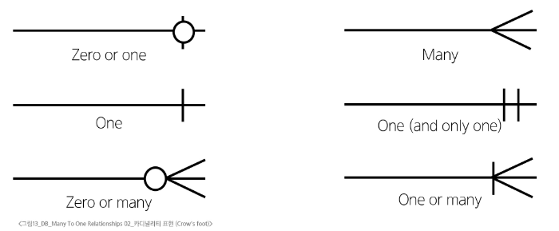

# Database - Many to One Relationships 02
# Article & User
## 모델 관계 설정
### Article - User 모델 관계 설정
```python
# articles/models.py
from django.conf import settings

class Article(models.Model):
    # 
    user = models.ForeignKey(settings.AUTH_USER_MODEL, on_delete=models.CASCADE)
    title = models.CharField(max_length=10)
    content = models.TextField()
    created_at = models.DateTimeField(auto_now_add=True)
    updated_at = models.DateTimeField(auto_now=True)
```
- User 모델을 직접 import하지 않는 이유
  - Article 클래스 생성 시점이 User 클래스 시점보다 빠른 경우 외래키 설정에서 참고할 User 모델을 찾지 못해 에러 발생 가능
  - models.py에서는 안정적인 참조가 필요하기 때문에 settings.AUTH_USER_MODEL의 값을 사용
### User 모델을 참조하는 두가지 방법
- settings.AUTH_USER_MODEL
  - settings.py에서 정의된 AUTH_USER_MODEL 설정값을 가져옴
  - 반환값: 'accounts.User'(문자열)
    - 모델의 경로 형태인 문자열이 ForeignKey의 참조 모델로 설정되면, Django에서 내부적으로 해당 모델이 완전히 로딩된 후 모델 클래스를 가져와 처리하는 지연 평가(lazy evaluation) 방식으로 동작하기 때문에 settings.AUTH_USER_MODEL의 반환값이 문자열이어도 괜찮음
  - models.py에서 User 모델을 참조할 때 주로 사용
- get_user_model()
  - 현재 settings.py에 정의되어 활성화된 User 모델을 가져옴
  - 반환값: User Object(객체)
  - models.py를 제외한 다른 모든 위치에서 사용
### Migration
- 기존에 테이블이 있는 상황에서 필드를 추가하려고 하기 때문에 발생하는 과정
- 기본적으로 모든 필드에는 NOT NULL 제약 조건이 설정되어 있어, 데이터 없이 새로운 필드를 추가할 수 없음
- '1'을 입력하고 Enter 진행(다음 화면에서 직접 기본값 입력)
```cmd
$ python manage.py makemigrations

It is impossible to add a non-nullable field 'user' to article without specifying a default. This is because the database needs something to populate existing rows.
Please select a fix:
 1) Provide a one-off default now (will be set on all existing rows with a null value for this column)
 2) Quit and manually define a default value in models.py.
Select an option:
```
- 추가하는 외래키 필드에 어떤 데이터를 넣을 것인지 직접 입력해야 함
- 마찬가지로 '1'을 입력하고 Enter 진행
  - 기존에 작성된 게시글이 있다면 모두 1번 회원이 작성한 것으로 처리됨
  - 1번 회원이 없는 경우 migrate시 에러 발생할 수 있음
```cmd
Please enter the default value as valid Python.
The datetime and django.utils.timezone modules are available, so it is possible to provide e.g. timezone.now as a value.        
Type 'exit' to exit this prompt
```
- migrations 파일 생성 후 migrate 진행
- articles_article 테이블에 user_id 필드 생성됨
```cmd
$ python manage.py migrate
```
## 게시글 CREATE
### 게시글 CREATE 구현
- 새 게시글 작성 시 ArticleForm 출력 변화 확인
  - 새롭게 추가된 ForeignKey 필드인 User 필드 확인됨
- User 모델에 대한 사용자 입력 창이 나오지만 사용자가 입력하지 않아야 하는 입력
  - 다른 사람을 선택하게 되면 사칭에 대한 문제 발생 가능
- 기존 ArticleForm에서 사용자가 입력할 수 있는 필드를 변경
  - 글 작성자는 사용자가 선택하지 않아도 되는 정보
- 사용자는 게시글 제목과 내용만 입력하도록 수정
```python
# articles/forms/py
class ArticleForm(forms.ModelForm):
    class Meta:
        model = Article
        fields = ('title', 'content', )
```
- 게시글을 작성하면 아래와 같이 에러가 발생
  - NOT NULL constraint failed: articles_article.user_id
  - user_id 필드 데이터가 누락되어 NOT NULL 제약조건에 위배
- 게시글 작성 시 작성자 정보가 함께 저장될 수 있도록 save의 commit 옵션 활용
  - 게시글 작성자는 현재 글을 작성하는 로그인 된 사용자(request.user) 정보를 저장
```python
# articles/views.py
@login_required
def create(request):
    if request.method == 'POST':
        form = ArticleForm(request.POST)
        if form.is_valid():
            article = form.save(commit=False)
            article.user = request.user
            article.save()
            return redirect('articles:detail', article.pk)
    else:
        form = ArticleForm()
    context = {
        'form': form,
    }
    return render(request, 'articles/create.html', context)
```
## 게시글 READ
### 게시글 READ 구현
- index 페이지에 게시글 작성자 정보 출력하도록 수정
- AbstractUser에 아래 매직 메서드가 있어서 User 인스턴스를 출력할때 굳이 username까지 참조하지 않아도 username이 출력됨
```python
def __str__(self):
    return self.username
```
```html
<!-- articles/index.html -->

  <p>작성자: {{ article.user }}</p>
  <p>글 번호: {{ article.pk }}</p>
  <p>
    글 제목: <a href="">{{ article.title }}</a>
  </p>
  <p>글 내용: {{ article.content }}</p>
<hr>

```
- 각 게시글 상세 페이지에도 작성자 정보 출력하도록 수정
```html
<!-- articles/detail.html -->
<h1>Detail</h1>
<h2>{{ article.pk }} 번째 글</h2>
<hr>
<p>작성자: {{ article.user }}</p>
<p>제목: {{ article.title }}</p>
<p>내용: {{ article.content }}</p>
<p>작성일: {{ article.created_at }}</p>
<p>수정일: {{ article.updated_at }}</p>
```
## 게시글 UPDATE
### 게시글 UPDATE 구현
- 게시글 수정 요청 사용자와 게시글 작성 사용자를 비교하여 본인의 게시글만 수정할 수 있도록 하기
```python
@login_required
def update(request, pk):
    article = Article.objects.get(pk=pk)
    if request.user == article.user:
        if request.method == 'POST':
            form = ArticleForm(request.POST, instance=article)
            if form.is_valid():
                form.save()
                return redirect('articles:detail', article.pk)

        else:
            form = ArticleForm(instance=article)
    else:
        return redirect('articles:index')
    context = {
        'article': article,
        'form': form,
    }
    return render(request, 'articles/update.html', context)
```
- 해당 게시글의 작성자가 아니라면, 수정/삭제 버튼을 출력하지 않도록 하기
```html
<!-- articles/detail.html -->

  <a href="">수정하기</a><br>
  <form action="" method="POST">
    
    <input type="submit" value="삭제하기">
  </form>

```
## 게시글 DELETE
### 게시글 DELETE 구현
- 삭제를 요청하려는 사람과 게시글을 작성한 사람을 비교하여 본인의 게시글만 삭제할 수 있도록 하기
- views.py에서 또 사용자를 구분하여 처리하는 이유
  - 요청을 보내는 방법은 브라우저만 있는 것이 아니기 때문에 내부에서도 반드시 처리가 필요
  - requests 패키지 혹은 postman 어플을 이용한 요청은 브라우저를 통하지 않기 때문에 내부에서 사용자 구분을 해야함
```python
# articles/views.py
@login_required
def delete(request, pk):
    article = Article.objects.get(pk=pk)
    if request.user == article.user:
        article.delete()

    return redirect('articles:index')
```
# Comment & User
## 모델 관계 설정
### Comment - User 모델 관계 설정
- User는 여러개의 댓글을 작성
- Comment는 한명의 작성자가 작성
- Comment는 모델 클래스에 User 필드를 참조하도록 외래키 설정
```python
# articles/models.py
class Comment(models.Model):
    article = models.ForeignKey(Article, on_delete=models.CASCADE)
    user = models.ForeignKey(settings.AUTH_USER_MODEL, on_delete=models.CASCADE)
    content = models.CharField(max_length=200)
    created_at = models.DateTimeField(auto_now_add=True)
    updated_at = models.DateTimeField(auto_now=True)
```
### Migration
- 이전에 Article과 User 모델 관계 설정 때와 동일한 상황
- 기존 Comment 테이블에 새로운 필드가 빈 값으로 추가될 수 없기 때문에 기본값 설정 과정 필요
```cmd
$ python manage.py makemigrations
# ... 공통 과정 생략
$ python manage.py migrate
```
## 댓글 CREATE
### 댓글 CREATE 구현
- 댓글 작성시 이전에 게시글 작성할 때와 동일한 에러 발생
  - NOT NULL constraint failed: articles_article.user_id
  - 댓글의 작성자를 저장하는 user_id 필드 데이터가 누락되었지 때문
- 댓글 작성시 작성자 정보가 함께 저장될 수 있도록 작성
```python
# articles/views.py
def comments_create(request, pk):
    # 게시글 조회
    article = Article.objects.get(pk=pk)
    # 댓글 데이터 받기
    comment_form = CommentForm(request.POST)
    # 유효성 검사
    if comment_form.is_valid():
        # commit False는 DB에 저장 요청을 잠시 보류하고,
        # 대신 comment 인스턴스는 반환 해줌
        comment = comment_form.save(commit=False)
        # 외래 키 데이터를 할당
        comment.article = article
        comment.user = request.user
        comment.save()
        return redirect('articles:detail', article.pk)
    context = {
        'article': article,
        'comment_form': comment_form,
    }
    return render(request, 'articles/detail.html', context)
```
## 댓글 READ
### 댓글 READ 구현
- 댓글 출력시 댓글 작성자와 함께 출력
```html
<!-- articles/detail.html -->

  <li>
    {{ comment.user }} - {{ comment.content }}
    <form action="" method="POST">
      
      <input type="submit" value="삭제">
    </form>
  </li>

```
## 댓글 DELETE
### 댓글 DELETE 구현
- 해당 댓글의 작성자가 아니라면, 댓글 삭제 버튼을 출력하지 않도록 함
```html
<!-- articles/detail.html -->

  <li>
    {{ comment.user }} - {{ comment.content }}
    
      <form action="" method="POST">
        
        <input type="submit" value="삭제">
      </form>
    
  </li>

```
- 댓글 삭제 요청 사용자와 댓글 작성 사용자를 비교하여 본인의 댓글만 삭제할 수 있도록 하기
```python
# articles/views.py
def comments_delete(request, article_pk, comment_pk):
    # 삭제할 댓글 조회
    comment = Comment.objects.get(pk=comment_pk)
    if request.user == comment.user:
        # 댓글 삭제
        comment.delete()
    # 삭제 후 게시글 상세 페이지로 리다이렉트
    return redirect('articles:detail', article_pk)
```
# View decorators
- View 함수의 동작을 수정하거나 추가 기능을 제공하는데 사용되는 python 데코레이터
- 일종의 사전 체크리스트처럼 동작해서 사용자 접근을 보다 안전하고 체계적으로 관리할 수 있음
- 뷰함수 위에 붙여서 작동하며, 코드 흐름을 방해하지 않고 깔끔하게 조건을 설정할 수 있음
- 로그인 여부, 권한 검사, HTTP 요청 방식 제한 등을 다룸
## View decorators 종류
- Allowed HTTP methods
  - 뷰가 허용하는 HTTP 요청 방식(GET, POST 등)을 제한
- Conditional view processing
  - 클라이언트가 보낸 조건을 확인한 후, 조건에 따른 응답 처리
- GZip compression
  - 서버에서 응답 데이터를 압축해서 전송
## Allowed HTTP methods
- 특정 HTTP method로만 view 함수에 접근할 수 있도록 제한하는 데코레이터
  - 웹 요청은 GET, POST 등 다양한 요청 방식을 사용하며, 각 방식은 고유한 목적을 갖고 있음
  - 요청 방식을 제한하면 보안이 강화되고, 코드의 역할도 명확히 분리됨
  - 해당 데코레이터를 사용하면 view 로직을 보호하면서 사용자에게도 올바른 인터페이스를 제공할 수 있음
### 주요 Allowed HTTP methods
- require_http_methods(["METHOD1", "METHOD2", ...])
  - 지정된 HTTP method만 허용
- require_safe()
  - GET과 HEAD method만 허용
- require_POST()
  - POST method만 허용
#### ※ 허용되지 않은 method로 요청하는 경우 405(Method Not Allowed) 오류 반환
### Allowed HTTP methods 안내
- require_http_methods(request_method_list)
  - 지정된 HTTP method만 허용
  - 인자는 list이며, 해당 list의 요소는 요청이 허용될 HTTP method를 문자열(대문자)로 작성
- list에 작성된 method 이회의 method로 요청하면 HttpResponseNotAllowed(405)를 반환
```python
from django.views.decorators.http import require_http_method

@require_http_method(['GET', 'POST'])
def func(request):
    pass
```
- require_safe()
  - GET과 HEAD method만 허용
- GET과 HEAD method 이외의 method로 요청하면 HttpResponseNotAllowed(405)를 반환
- require_GET이 있지만 require_safe를 권장
  - GET과 HEAD는 서버 상태를 변경하지 않고 조회를 수행하는 safe method로 정의되어 있음
  - HEAD 요청은 주로 브라우저가 리소스를 받지 않고 메타 데이터 정보를 조회할 때 사용
  - 즉, require_safe가 require_GET보다 더 포괄적이며 표준 HTTP 클라이언트와의 호환성이 높음
```python
from django.views.decorators.http import require_safe

@require_safe
def func(request):
    pass
```
- require_POST()
  - POST method만 허용
- POST method 이외의 method로 요청하면 HttpResponseNotAllowed(405)를 반환
```python
from django.views.decorators.http import require_POST

@require_POST
def func(request):
    pass
```
# ERD
- Entity-Relationship Diagram
- 데이터베이스의 구조를 시각적으로 표현하는 도구
- 개체, 속성, 그리고 엔티티 간의 관계를 그래픽 형태로 나타내어 시스템의 논리적 구조를 모델링 하는 다이어그램
- 각 박스는 테이블을 나타내고, 그 안의 필드는 속성, 화살표나 선은 관계를 나타냄
- 이를 통해 개발자와 디자이너가 데이터 흐름을 쉽게 이해하고, 안정적인 DB 구조를 설계할 수 있음
## ERD 구성 요소
- Entity
  - 데이터베이스에 저장되는 객체나 개념
  - 주로 테이블로 표현됨
- Attribute
  - 엔티티가 가지고 이쓴ㄴ 고유한 데이터 항목
  - 테이블의 컬럼으로 표현됨
- Relationship
  - 엔티티간의 연관성을 나타냄
  - 테이블 간의 연결된 선으로 표현됨
### Cardinality
- 한 엔티티와 다른 엔티티 간의 수적 관계를 나타내는 표현
- 1:1
  - 한 엔티티의 레코드가 다른 엔티티의 하나의 레코드와만 연결되는 관계
- N:1
  - 여러 레코드가 하나의 엔티티와 연결되며, 반대 방향에서는 하나만 연결되는 관계
- N:M
  - 양쪽 모두 여러 레코드와 연결되는 관계
### Cardinality 표현
- 선의 끝부분에 표시되며 일반적으로 숫자나 기호(Crow's foot)로 표현됨
#### 
### ERD의 중요성
- 데이터베이스 설계의 핵심 도구
  - 엔티티, 속성, 관계를 명확히 정의함으로써 논리적 데이터 구조를 시각적으로 표현함
  - 복잡한 비즈니스 로직을 단순하고 직관적인 다이어그램으로 정리됨
  - 중복 데이터를 제거하고, 효율적인 저장 구조를 만들 수 있음
- 시각적 모델링으로 효과적인 의사소통 지원
  - 개발자, 기획자, 디자이너 등 다양한 직군이 ERD를 활용해 협업할 수 있음
  - 요구사항 분석 단계에서 누락된 기능이나 관계를 빠르게 파악 가능
  - 비전문가에게도 시스템 구조를 쉽게 설명할 수 있음
- 실제 시스템 개발 전 데이터 구조 최적화에 중요
  - 사전에 데이터 흐름과 연관 관계를 명확히 분석해 불필요한 관계나 비효율적인 설계를 방지함
  - 시스템 개발 전에 ERD를 작성함으로써, 이후 DB 구축 단계에서 중대한 구조적 오류를 줄이는 데 효과적
  - 변경이나 유지보수 시에도 ERD를 기반으로 안정적으로 수정할 수 있음
## ERD 제작 사이트
- Draw.io(diagrams.net)
  - 별도의 회원가입 없이 바로 사용 가능
  - 다양한 다이어그램 템플릿 제공
- ERDCloud
  - 실시간 협업 기능 지원
# 참고
## 추가 기능 구현
### 인증된 사용자만 댓글 작성 및 삭제
- 로그인된 사용자만 댓글을 작성할 수 있도록 데코레이터 추가
```python
# articles/views.py
@login_required
def comments_create(request, pk):
    pass

@login_required
def comments_delete(request, article_pk, comment_pk):
    pass
```