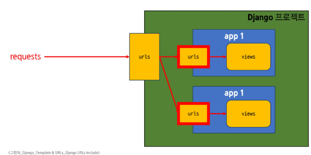

# Django - Template & URLs
# Template System
## Django Template system
- 파이썬 데이터(context)를 HTML 문서(Template)와 결합하여, 로직과 표현을 분리한 채 동적인 웹페이지를 생성하는 도구
- **'페이지 틀'에 '데이터'를 동적으로 결합**하여 수많은 페이지를 효율적으로 만들어 내기 위함
## Django Template Language(DTL)
- Template에서 조건, 반복, 변수 등의 프로그래민적 기능을 제공하는 시스템
### DTL Syntax
1. Variable
   - Django Template에서의 변수
   - render 함수의 세번쨰 인자로 딕셔너리 타입으로 전달됨
   - 해당 딕셔너리 key 에 해당하는 문자열이 template에서 사용 가능한 변수명이 됨
   - dot('.')을 사용하여 변수 속성에 접근할 수 있음
   - {{ 변수 }}
2. Filters
   - 표시할 변수를 수정할 때 사용(변수 + '|' + 필터)
   - chained가 가능하며 일부 필터는 인자를 받기도 함
   - 약 60개의 built-in template filters를 제공
   - {{ 변수|필터 }}
3. Tags
   - 반복 또는 논리를 수행하여 제어 흐름을 만듦
   - 일부 태그는 시작과 종료 태그가 필요
   - 약 24개의 built-in template tags를 제공
   - 
4. Comments
   - 주석
   - Inline
     - {# 주석 #}
   - multiline
     - 
     - ...
     - 
# 템플릿 상속
1. 페이지의 공통요소를 포함
2. 하위 템플릿이 재정의 할 수 있는 공간을 정의
#### ※ 여러 템플릿이 공통요소를 공유할 수 있게 해주는 기능
### 상속 수조 만들기
- skeleton 역할을 하게 되는 상위 템플릿(base.html) 작성(파일명이 반드시 base일 필요 없음)
  - 모든 템플릿이 공유했으면 좋겠는 공통요소 작성
  - 템플릿 별로 재정의 할 부분은 block 태그 활용
- 기존 하위 템플릿들이 상위 템플릿을 상속받도록 변경
  - extends 태그로 상속받을 템플릿 결정
  - block 태그를 활용해 base.html의 같은 이름을 작성된 block 태그의 내용을 대체
## 상속 관련 DTL 태그
- 'extends' tag
  - 
  - 자식 템플릿이 부모 템플릿을 확장한다는 것을 알림
  - 반드시 자식 템플릿 최상단에 작성되어야 함(extends 태그는 2개 이상 사용 불가)
- 'block' tag
  -  
  - 하위 템플릿에서 재정의 할 수 있는 블록을 정의
  - 상위 템플릿에서 작성하며 하위 템플릿이 작성할 수 있는 공간을 지정하는 것
# 요청과 응답
## HTML form
- HTTP 요청을 서버에 보내는 가장 편리한 방법
### 'form' element
- 사용자로부터 할당된 데이터를 서버로 전송하는 HTML 요소
- 웹이서 사용자 정보를 입력하는 여러 방식(text, password, checkbox 등)을 제공
## HTML form 핵심 속성
- action & method
  - 데이터를 어디(action)로 어떤 방식(method)으로 요청할 지
  - action
    - 입력 데이터가 전송될 URl을 지정(목적지)
    - action을 지정하지 않으면 데이터는 현재 페이지의 URl로 설정
  - method
    - 데이터를 어떤 방식으로 보낼 것인지 정의
    - 데이터의 HTTP request method(GET(조회), POST(생성, 수정, 삭제))를 지정
- 'input' element
  - 사용자의 데이터를 입력 받을 수 있는 HTML 요소
  - type 속성 값에 따라 다양한 유형의 입력 데이터를 받음
  - 핵심 속성 - 'name'
- 'name' attribute
  - input 요소의 핵심 속성
  - 사용자가 입력한 데이터에 붙이는 이름(key)
  - 데이터를 제출했을 때 서버는 name 속성에 설정된 값을 통해서만 사용자가 입력한 데이터에 접근할 수 있음
### Query String Parameters
- 사용자의 입력 데이터를 URL 주소에 파라미터를 통해 서버로 보내는 방법
- 문자열은 앰퍼센드('&')로 연결된 key=value 쌍으로 구성되며, 기본 URL과는 물음표('?')로 구분됨
## HTML form 활용
### HTTP request 객체
- form으로 전송한 데이터 뿐만 아니라 Django로 들어오는 모든 요청 관련 데이터가 담겨 있음
- view 함수가 호출될 때 첫번째 인자로 전달됨
- request.GET.get('message')
### 요청과 응답 처리(throw - catch 예시)
#### 
#### 
# Django URLs
- 요청 URL에 따라 실행될 view 함수가 달라짐
- URL dispatcher(운항 관리자, 분배기)
  - URL 패턴을 정의하고 해당 패턴이 일치하는 요청을 처리할 view 함수를 연결(매핑)
## Variable Routing
- 템플릿의 많은 부분이 중복되고, URL의 일부만 변경되는 상황일 때
- URL 일부에 변수를 포함시키는 것
  - 변수는 view 함수의 인자로 전달할 수 있음
- <path_converter:variable_name>
- 요청 URL의 <int:num>, <str:name>의 위치에 들어있는 값이 변수처럼 취급됨
  - 정수 num 변수가 views.detail에, 문자열 name 변수가 views.greeting 키워드 인자로 전달됨
  - 예) 요청 URL이 /articles/10/이면, views.detail(request, num=10)의 형태로 호출
- Path Converter
  - URL 변수의 타입을 지정
  - str, int 등 5가지 타입 지원
#### ※ Path Converter의 변수명과 View 함수의 파라미터 이름은 같아야 함
## App URL 정의
### APP URL mapping
- 각 앱에 URL을 정의하는 것
- 프로젝트와 각 앱이 URL을 나누어 관리를 편하게 하기 위함
- 앱이 늘어나게 됐을 때, URL이 섞이지 않도록 나누어 관리하는 방법
#### 
### include 함수
- include('app.urls')
- 프로젝트 내부 앱들의 URL을 참조할 수 있도록 매핑하는 함수
- URL의 일치하는 부분까지 잘라내고, 남은 문자열 부분은 후속 처리를 위해 include된 URL로 전달
- 각 앱에서 urls.py를 만들고 프로젝트 urls.py에서 include()로 추가
# URL 이름 지정
- URL 구조 변경에 따른 문제점
  - 기존 'articles/' 주소가 'articles/index/'로 변경됨에 따라 해당 URL을 사용하는 모든 위치를 찾아가 변경해야함
## Naming URL patterns
- URL에 이름을 지정하는 것
  - path 함수에 name 인자를 키워드 인자로 정의해서 사용
- 해당 url을 사용했던 곳의 링크 변경
- a 태그의 href 속성 값 뿐만 아니라 form 태그의 action 속성 등도 변경해줘야 함
## DTL URL tag
### 'url' tag
- 
- 주어진 URL 패턴의 이름과 일치하는 절대 경로 주소를 반환
- URL에 이름을 붙였을 경우 url 태그와 이름을 이용해 템플릿 상에서 이름으로 실제 주소를 작성할 수 있게 해줌
- 태그 이름, URL 이름, 인자 등은 콤마로 구분되지 않음
- URL 패턴에 변수가 포함되어 있으면, 'url_name' 이후 추가
- DTL의 for 태그에서 사용한 변수 이름 사용 가능
# URL 이름 공간
- 두 앱의 url 이름이 같다면 단순히 이름만으로는 완벽하게 분리할 수 없음 -> key 사용(app_name 속성 지정)
## app_name 속성
- app_name이 추가 또는 수정되면 url 태그에도 해당 내용이 반영되어야 함
-  -> 
- 98Whrqnxj
# 참고
## 추가 템플릿 경로
- 앱 폴더 내부 templates 폴더(기본 경로) 외에 템플릿을 위치하고 싶을 때
- 약속한 경로 외에 추가 템플릿 경로들을 작성하는 곳: settings.py
- TEMPLATES = [{'DIRS': [BASE_DIR / 'public_templates',],},],
- 프로젝트 최상단에 있는 public_templates 폴더에도 템플릿이 있다는 것을 등록
- 객체 지향적인 파이썬의 경로 표기법
- 원래는 아래처럼 작성
- 폴더1/폴더2/폴더3/파일.py
- 윈도우, mac, 리눅스 등 운영체제 마다 디렉토리 경로 작성 문법이 다르기 때문에
- 각 운영체제 마다 각각 작성하기 어려우므로
- 운영체제에 맞도록 자동으로 해석되는 새로운 문법을 사용하는 것
## DTL 주의사항
- Python 처럼 일부 프로그래밍 구조(if, for 등)를 사용할 수 있지만 명칭을 그렇게 설계했을 뿐
- Python 코드로 실행되는 것이 아니며 Python과는 관련없음
- 프로그래밍적 로직이 아니라 표현을 위한 것임을 명심
- 프로그래밍적 로직은 되도록 view 함수에서 작성 및 처리할 것
- 공식 문서를 참고해 다양한 태그와 필터 사용해보기
## Trailing Slashes
- Django는 URL 끝에 '/'가 없다면 자동으로 붙임
- 기술적인 측면에서, foo.com/bar와 foo.com/bar/는 서로 다른 URL
  - 검색 엔진 로봇이나 웹트래픽 분석 도구에서는 이 두 주소를 서로 다른 페이지로 보기 때문
- 그래서 Django는 검색 엔진이 혼동하지 않게 하기 위해 무조건 붙이는 것을 선택
- 그러나 모든 프레임워크가 이렇게 동작하는 것은 아니니 주의
#### ※ 처음 404 에러 뜨는 이유
- http://127.0.0.1:8000/ 이 주소까지 장고에 요청보냄
- 처음 장고는 url.py
- 해당 페이지가 없음 -> 에러 응답
- 새로고침 -> 다시 요청 보냄