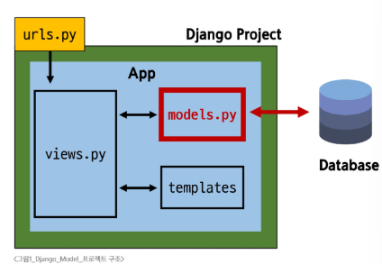
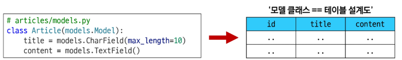
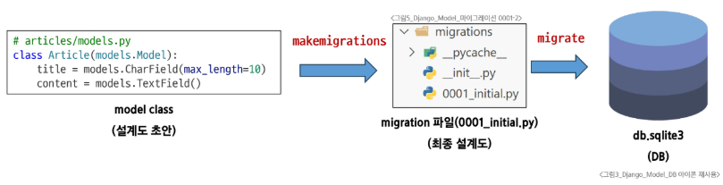
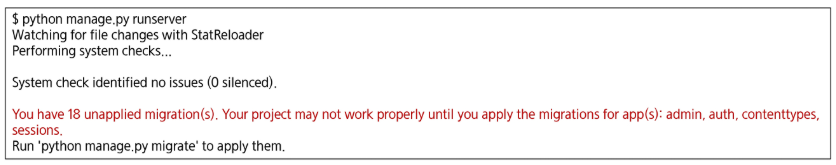
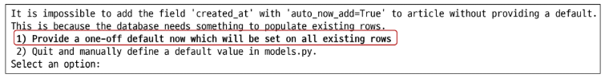
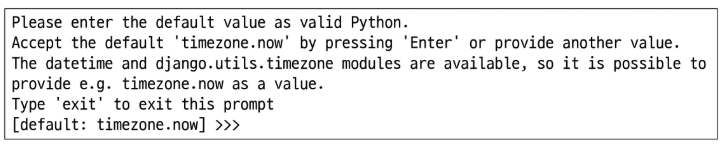
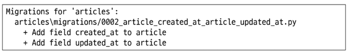

# Django - Model
# Model
- 데이터베이스와 Python 클래스(객체)로 추상화된 형태로 상호작용
- django의 강력한 기능: 개발자가 데이터베이스에 대한 깊은 지식 없이도 쉽게 데이터 관리 가능
- 유지보수 및 확장성 증대: 데이터베이스 변경 시에도 코드 수정 최소화, 재사용 가능한 데이터 모델 개발 효율성 향상
- Model을 통한 DB 관리
  - urls.py: 사용자 요청의 시작점
  - views.py: 요청을 처리하고 models.py를 통해 데이터를 다룸
  - models.py: 데이터베이스를 정의하고, 데이터베이스와 상호작용
  - templates: views.py로부터 받은 데이터를 사용자에게 보여줄 화면을 구성
#### 
## Model class
- DB의 테이블을 정의하고 데이터를 조작할 수 있는 기능들을 제공
- Model class는 DB의 테이블의 구조를 설계하는 blueprint 역할
- 어떤 데이터(컬럼)을 저장할 지, 그 데이터의 형태는 어떠할 지(타입, 길이 등)를 파이썬 코드로 명확히 정의
### Model 클래스 구조
- 작성한 모델 클래스는 최종적으로 DB에 테이블 구조를 만듦
#### 
- id 필드는 Django가 자동 생성
- django.db.models 모듈의 Model이라는 부모 클래스를 상속받음
  - Model은 model에 관련된 모든 코드가 이미 작성 되어있는 class
    - 개발자는 가장 중요한 **테이블 구조를 어떻게 설계할지에 대한 코드만 작성하도록** 하기 위한 것(상속을 활용한 프레임워크의 기능 제공)
- 클래스 변수명
  - 테이블의 각 필드 이름
- Model Field
  - 데이터베이스의 테이블과 열을 나타내는 중요한 구성 요소
  - 데이터의 유형과 제약조건 정의
#### ※ 주의사항
- CharField의 max_length 매개변수를 지정하는 것은 선택사항
- SQLite는 문자열 컬럼의 길이에 대한 엄격한 제한을 강제하지 않기 때문
- 하지만, 유효성 검사 및 컬럼에 들어갈 데이터의 명확성을 위해 명시적으로 설정하는 것은 여전히 매우 권장됨
  - 유효성 검사: 정해진 규칙이나 조건에 따라 데이터의 정확성을 확인하는 과정
# Model Field
- DB 테이블의 필드 정의, 데이터 타입(Field types) 및 제약 조건(Field options) 명시 
- django는 이러한 필드 정의를 바탕으로 데이터베이스 컬럼을 자동 생성하고, 데이터 입력 시 유효성 검사 등 필요한 기능을 제공
- 정확한 필드 정의는 애플리케이션의 안정성을 높이는 데 필수적
## Field types
- 데이터베이스에 저장될 **데이터의 종류**를 정의
- models 모듈의 클래스로 정의되어 있음
### 주요 필드 유형
- 문자열 필드
  - CharField()
    - 제한된 길이의 문자열을 저장
    - 필드의 최대 길이를 결정하는 max_length는 선택 옵션
  - TextField()
    - 길이 제한이 없는 대용량 텍스트를 저장
    - 무한대는 아니며 사용하는 시스템에 따라 달라짐
- 숫자 필드
  - IntegerField, FloatField
- 날짜/시간 필드
  - DateField, TimeField, DateTimeField
- 파일 관련 필드
  - FileField, ImageField
## Field options
- 필드의 **동작**과 **제약 조건**을 정의
- 제약 조건(Constraint)
  - 특정 규칙을 강제하기 위해 테이블의 열이나 행에 적용되는 규칙이나 제한사항
### 주요 필드 옵션
- null
  - 데이터베이스에서 NULL 값을 허용할지 여부를 결정(기본값: False)
- blank
  - form에서 빈 값을 허용할지 여부를 결정(기본값: False)
- default
  - 필드의 기본값을 설정
# Migrations
- model 클래스의 변경사항(필드 생성, 수정 삭제 등)을 DB에 최종 반영하는 방법
- 모든 변경 사항이 코드로 관리되어 협업 시 모델 변경 내역에 대한 추척과 공유가 수월
- 모델 클래스와 Migration 과정
1. 모델 정의 및 마이그레이션 파일 생성($ python manage.py makemigrations)
   - 모델 클래스 작성/수정
     - Django에서는 Python 클래스로 정의
   - 마이그레이션 파일 생성 명령어
     - Python 코드로 된 migration 파일(설계도)를 만드는 방법
     - 모델 변경을 감지하고 migration 파일을 생성하는 명령어
     - migration 파일 == 최종 설계도
2. 생성된 최종 설계도(0001_initial.py) 마이그레이션 파일을 DB에 반영하기($ python manage.py migrate)
   - 마이그레이션 파일(0001_initial.py)
     - 마이그레이션 파일은 모델 변경사항을 기록한 Python 코드
     - DB 테이블 변경 내역을 순차적으로 저장하여 추적 관리
   - SQL 실행(자동 변환)
     - migrate 명령어는 마이그레이션 파일의 Python 코드를 SQL 문으로 자동 변환
     - 변환 과정: Python 코드 -> 번역 -> SQL 쿼리문 -> DB 실행
#### 
### Migrations 핵심 명령어
1. $ python manage.py makemigrations
   - 역할: model class를 기반으로 최종 설계도(migration)를 작성
2. $ python manage.py migrate
   - 역할: 최종 설계도를 DB에 전달하여 반영
   - 테이블 이름: (앱 이름)_(클래스 이름)
#### ※ 마이그레이션 파일은 되도록 직접 건드리지 않음. migrations 폴더에 자동으로 생성된 파일들은 직접 수정하거나 삭제하지 않는 것이 원칙
### Migration 경고 메시지
- Django 서버를 시작할 때 출력되는 migration 관련 경고 메시지
  - 이 메시지는 프로젝트 실행 시 미적용 마이그레이션 파일이 있을 때 나타남
#### 
- 해결방법
  - 경고 메시지에 명시된 대로 python manage.py migrate 명령어를 실행
- 중요한 이유
  - 최신 모델 변경 사항이 DB에 반영되지 않아 프로젝트가 제대로 작동하지 않을 수 있음
## 추가 Migrations
### 이미 생성된 테이블에 필드 추가하기
- 이미 기존 테이블이 존재하는 경우, 새 필드를 추가할 때 문제가 발생할 수 있음
  - 기존에 레코드가 있는 테이블에 새로운 필드를 추가하면 어떤 값으로 채울지 결정해야 함
  - Django의 makemigrations 실행시 기본값 설정을 요구하는 프롬프트가 표시됨
---
1. 새로운 필드 작성
   - 기존 모델 클래스 수정(articles/models.py에 컬럼 추가)
#### ※ DateTimeField의 필드 옵션
- auto_now: 데이터가 저장될 때마다 자동으로 현재 날짜 시간을 저장(수정일 필드에 활용)
- auto_now_add: 데이터가 처음 생성될 때만 자동으로 현재 날짜 시간을 저장(작성일 필드에 적용)
- 시간은 UTC 기준
2. 새로운 필드 추가 후 makemigrations 명령어 입력($ python manage.py makemigrations)
   - 이미 기존 테이블이 존재하기 때문에 필드를 추가할 때 필드의 기본값 설정이 필요
   - 1번은 현재 대화를 유지하면서 직접 기본값을 입력하는 방법
     - 일회성 기본값 제공
       - 현재 대화형 프롬프트에서 기본값을 직접 입력
       - 입력한 기본값은 기존의 모든 데이터 행에 적용
   - 2번은 현재 대화에서 나간 후 models.py에 기본값 관련 설정을 하는 방법
#### 
3. 추가하는 필드의 기본값을 입력해야함
   - 날짜 데이터이기 때문에 직접 입력보다 Django가 제안하는 기본값 사용 권장
   - 아무것도 입력하지 않고 enter를 누르면 django가 제안하는 기본값으로 설정됨
#### 
4. migrations 과정 종료 후 두번째 migration 파일이 생성됨을 확인
   - 이처럼 django는 설계도를 쌓아가면서 추후 문제 발생시 복구하거나 되돌릴 수 있도록 함(git commit과 유사)
#### 
5. migrate 후 테이블 필드 변화 확인
   - $ python manage.py migrate
### Migration이 필요한 때
- model class에 **변경사항(1)**이 생겼다면, 반드시 새로운 **설계도를 생성(2)**하고 이를 **DB에 반영(3)**해야 함
- (1) model class 생성/수정 -> (3) makemigrations -> (3) migrate
# Admin site
## 관리자 인터페이스
- django가 추가 설치 및 설정없이 자동으로 제공하는 관리자 인터페이스
- django 관리자 인터페이스는 추가 설정없이 자동 생성되는 웹 기반 관리 도구
- 주요기능: DB 모델의 CRUD 작업을 간편하게 수행 가능
- 활용: 빠를 프로토타이핑, 비개발자 데이터 관리, 내부 시스템 구축에 이상적
### 1. Django admin 계정 생성
1. 터미널 열기
   - Django 프로젝트 폴더로 이동해서 터미널 열기(manage.py 파일이 있는 위치에서 진행)
2. 관리자 계정 생성 명령어 입력
   - $ python manage.py createsuperuser
3. 정보 입력
   - 사용자 이름(username): 관리자 페이지에 로그인할 때 사용할 아이디를 입력
   - 이메일(email address): 선택 사항이라 입력하지 않고 엔터를 눌러 넘어가도 됨
   - 비밀번호(password): 로그인할 때 사용할 비밀번호 입력(**비밀번호 입력 시 콘솔 창에 아무것도 나타나지 않음**)
   - 비밀번호 확인(password(again)): 비밀번호를 한번 더 입력해서 확인
### 2. DB에 생성된 admin 계정 확인
### 3. 관리자 인터페이스 페이지
- 웹 브라우저를 열고 다음 주소로 이동
  - http://127.0.0.1:8000/admin
  - 생성한 관리자 계정으로 정상 로그인 확인
### 4. 관리자 인터페이스 접속 확인
- 로그인 후 아무것도 보이지 않는 것이 정상
  - 우리가 만든 모델을 관리하려면 추가 설정 필요
### 5. Admin site 모델 클래스 등록 및 확인
- admin.py에 작성한 모델 클래스를 등록해야만 admin site에서 확인 가능
```python
# articles/admin.py
from django.contrib import admin
from .models import Article

admin.site.register(Article)
```
### 6. 데이터 생성, 수정, 삭제 테스트
- Articles 앱에서 article에 대한 CRUD를 위한 페이지로 이동
- 새로운 Article 생성
  - 성공 메시지와 함께 등록된 Article이 모두 조회됨
  - 데이터베이스에서도 확인할 수 있음
- 상세 페이지 내에서 원하는 데이터를 수정 또는 삭제할 수 있음
# 참고
## 데이터 베이스 초기화
1. Migration 파일 삭제
   - makemigrations 명령어로 생성되는 설계도(Migration 파일)
   - ```__init__.py, migration``` 폴더는 삭제 금지
2. db.sqlite3 파일 삭제
## Migrations 관련
### Migrations 기타 명령어
- showmigrations
  - migrations 파일들이 migrate 됐는지 여부를 확인하는 명령어
  - [X] 표시가 있으면 migrate가 완료되었음을 의마
  - $ python manage.py showmigrations
- sqlmigrate
  - 해당 migrations 파일이 SQL 언어(DB에서 사용하는 언어)로 어떻게 번역되어 DB에 전달되는지 확인하는 명령어
  - python manage.try sqlmigrate <앱 이름> <마이그레이션 이름>
  - $ python manage.try sqlmigrate articles 0001
### 최초 migrate 시 출력 내용이 많은 이유
- Django 프로젝트가 동작하기 위해 미리 작성 되어있는 기본 내장 앱들에 대한 migration 파일들이 함께 migrate 되기 때문
## SQLite
- DB 관리 시스템 중 하나이며, Django의 기본 DB로 사용됨
- 파일 기반: DB가 하나의 파일로 저장되어, 설치/설정없이 간편하게 복사/이동/백업 가능
- 가볍고 빠름: 별도 서버없이 파일로 직접 데이터 처리. 소규모 앱이나 모바일 환경에 최적화
- 높은 호환성: 다양한 운영체제와 프로그래밍 언어에서 폭넓게 사용 가능
### SQLite 주의 사항
- db.salite3 파일은 Git 등 버전 관리 시스템에서 관리하지 않는 것이 원칙
  - 데이터가 변경될 때마다 파일 전체가 변경됨
- SQLite 파일은 로컬 컴퓨터에 저장된 데이터 기록
- .gitignore 파일에 db.sqlite3를 추가하여 Git 버전 관리에서 제외해야 함
#### ※ gitignore.io
- gitignore.io는 개발자들이 .gitignore 파일을 쉽게 생성할 수 있도록 도와주는 웹 서비스
- gitignore.io에서 Django를 기술 스택으로 추가한 귀 .gitignore 파일을 자동 생성하면 db.sqlite3rk 자동으로 포함