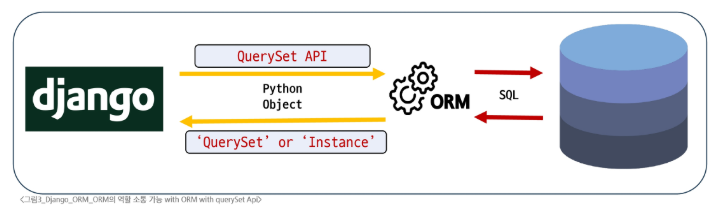
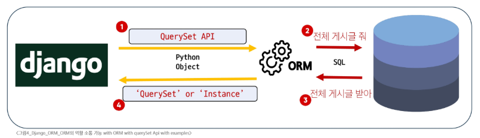
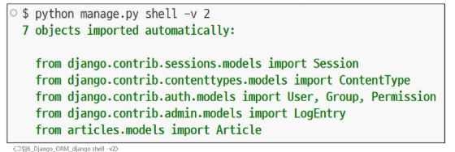
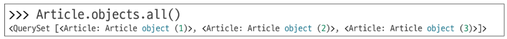
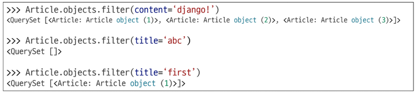
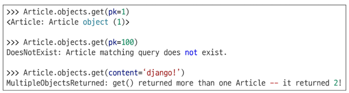
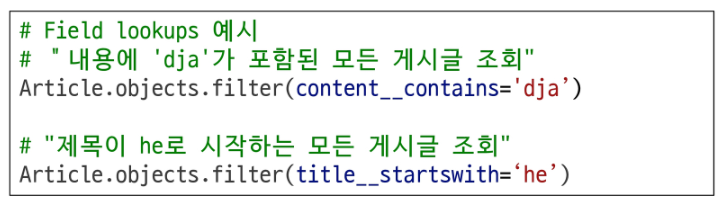

# Django - ORM
# ORM(Object-Relational-Mapping)
- 객체 지향 프로그래밍 언어의 객체와 데이터베이스의 데이터를 매핑하는 기술
  - 개발자 친화적인 데이터베이스 인터페이스
- Django는 Python 언어를 사용하지만 데이터베이스는 SQL 언어를 사용
  - ORM은 Django와 데이터베이스 사이에서 언어 번역자 역할을 수행
  - 개발자는 DB 구조를 잘 몰라도 파이썬 코드로 쉽게 데이터를 다룰 수 있음
  - 코드 작성 시간을 줄이고, 실수를 줄이는 데 큰 도움
- Django의 데이터 상호작용: ORM이 일하는 방법
  - ORM은 Django 개발자를 위해 'QuerySet API'라는 특별한 도구를 제공
  - QuerySet API는 ORM의 기능을 개발자가 Python 코드 안에서 객체지향적이고 직관적인 방식으로 DB를 조작할 수 있도록 제공하는 인터페이스
# QuerySet API
- DB의 복잡한 SQL 쿼리문을, 직관적인 Python 코드로 다룰 수 있게 해주는 강력한 번역기
- 개발자는 SQL을 직접 작성하지 않고도, .filter(), exclude(), .order_by() 등 파이썬 다운 메서드를 사용하여 원하는 데이터를 손쉽게 생성, 조회, 수정, 삭제할 수 있음
- 코드의 가독성을 높이고, 개발 생산성을 극대화하는 Django ORM의 핵심 기능
## QuerySet API와 ORM의 동작 방식
1. Django -> DB: Django(QuerySet API)에서 ORM을 통해 DB로 정보를 요청할 때
   - SQL 쿼리로 변환되어 DB로 전달됨
2. DB -> Django: DB가 요청에 대한 응답을 보낼 때
   - ORM은 이 SQL 결과를 다시 파이썬이 이해할 수 있는 Python Object
   - QuerySet 또는 Instance 형태로 변환하여 Django로 반환
#### 
## QuerySet API 구문 기본 구조
#### 
- Article(모델 클래스)
  - 역할: DB 테이블에 대한 파이썬 클래스 표현
  - articles_article 테이블의 스키마(필드, 데이터 타입 등)를 정의하며, Django ORM이 DB와 상호작용할 때 사용하는 기본적인 구조체
- .objects(매니저)
  - 역할: DB 조회(Query) 작업을 위한 기본 인터페이스
  - 모델 클래스가 DB 쿼리 작업을 수행할 수 있도록 하는 진입점
  - Django는 모든 모델에 objects라는 이름의 매니저를 자동으로 추가하며, 이 매니저를 통해 .all(), .filter() 등의 쿼리 메서드를 호출
- .all()(QuerySet API 메서드)
  - 역할: 특정 DB 작업을 수행하는 명령
  - 매니저를 통해 호출되는 메서드로, 해당 모델과 연결된 테이블의 모든 레코드를 조회하라는 SQL 쿼리를 생성하고 실행
#### 
#### ※ 비어있더리도 빈 querySet을 반환
## Query
- DB에 특정한 데이터를 보여달라는 요청
- "쿼리문을 작성한다."
  - "원하는 데이터를 얻기 위해 DB에 요청을 보낼 코드를 작성한다."
- Django 에서 Query가 처리되는 과정
  1. 파이썬 코드 -> ORM: 개발자의 QuerySet API(파이썬 코드)가 ORM으로 전달
  2. ORM -> SQL 변환: ORM이 이를 DB용 SQL 쿼리로 변환하여 DB에 전달
  3. DB 응답 -> ORM: DB가 SQL 쿼리를 처리하고 결과 데이터를 ORM에 반환
  4. ORM -> QuerySet 변환: ORM이 DB의 결과를 QuerySet(파이썬 객체) 형태로 변환하여 우리에게 전달
## QuerySet
- DB에서 전달받은 객체 목록(데이터 모음)
- 순회 가능한 데이터로 1개 이상 데이터를 불러와 사용 가능
- Django ORM을 통해 만들어진 자료형
- 단, DB가 단일 객체를 반환할 때는 QuerySet가 아닌 모델(Class)의 인스턴스로 반환됨
# QuerySet API 실습
## 실습 사전 준비
- 외부 라이브러리 설치 및 의존성 기록
  - IPython은 일반 파이썬 셸(명령창)보다 자동 완성 등 편리한 파이썬 작업 환경을 만들어 주는 도구
  - $ pip install ipython
  - $ pip freeze > requirements.txt
- Django shell 접속하기(ipython 자동 켜짐)
  - Django 프로젝트의 코드를 명령창에서 바로 실행하고 테스트하는 특별한 파이썬 환경
  - Django 환경 내에서 실행되기 때문에 입력하는 QuerySet API 구문이 Django 프로젝트에 영향을 미침
  - $ python manage.py shell
- Shell "-v" 옵션(기본값: 1)
  - 출력 상세도(verbosity level) 설정: 일반적인 정보 외에 더 많은 디버깅 정보나 진행 상황 메시지를 보여달라는 요청
  - shell 시작 시 Django 프로젝트에 등록된 model이 자동으로 import된 내용이 출력됨
  - $ python manage.py shell -v 2
#### 
## CRUD
- 대부분의 소프트웨어가 가지는 기본적인 데이터 처리 기능ㅇ인 생성, 조회 수정, 삭제를 묶어 이르는 말
- Django에서는 QuerySet API를 통해,, 복잡한 SQL문 없이 파이썬 코드로 이러한 CRUD 작업을 직관적으로 수행할 수 있음
#### ※ save(): 객체를 DB에 저장하는 인스턴스 메서드. 객체를 먼저 생성한 후, DB에 저장하기 전에 추가적인 처리(다른 데이터와 관계 설정, 유효성 검사 등)가 필요할 때 save()를 호출함
#### ※ 1, 2, 3 작성 후 1을 지우고 새로 데이터를 추가하면 4로 추가됨, django는 지워진 pk를 재활용하지 않음
### Create
1. 빈 객체 생성 후 값 할당 및 저장
   - save 메서드를 호출해야 비로소 DB에 데이터가 저장됨
   - 테이블에 한 행이 쓰여진 것
```python
# 특정 테이블에 새로운 행을 추가하여 데이터 추가
In [1]: article = Article()             # Article(class)로 부터 article(instance) 생성
In [2]: article
Out[2]: <Article: Article object (None)>

In [3]: article.title = 'first'         # 인스턴스 변수(title)에 값을 할당
In [4]: article.content = 'django!'     # 인스턴스 변수(content)에 값을 할당

# save를 하지 않으면 아직 DB에 값이 저장되지 않음
In [5]: article
Out[5]: <Article: Article object (None)>
In [6]: Article.objects.all()
Out[6]: <QuerySet []>

# save를 호출하고 확인하면 저장된 것을 확인(save 메서드는 모델 클래스에서 상속 받음)
In [7]: article.save()
In [8]: article
Out[8]: <Article: Article object (1)>

In [9]: article.id
Out[9]: 1

# 데이터의 식별자 역할을 하는 키(primary key): 실제 테이블에 물리적으로 존재하지는 않음
In [10]: article.pk
Out[10]: 1

In [11]: Article.objects.all()
Out[11]: <QuerySet [<Article: Article object (1)>]>

# 인스턴스 article을 활용하여 인스턴스 변수 활용하기
In [12]: article.title
Out[12]: 'first'

In [13]: article.content
Out[13]: 'django!'

In [14]: article.created_at

In [15]: article.created_at
Out[15]: datetime.datetime(2025, 9, 24, 0, 50, 11, 214, tzinfo=datetime.timezone.utc)

```
2. 초기값과 함께 객체 생성 및 저장
   - save 메서드를 호출해야 비로소 DB에 데이터가 저장됨
   - 테이블에 한 행이 쓰여진 것
```python
In [16]: article = Article(title='second', content='django!')
# 아직 저장 되어있지 않음
In [17]: article
Out[17]: <Article: Article object (None)>

# save를 호출해야 저장됨
In [18]: article.save()

In [19]: article
Out[19]: <Article: Article object (2)>

In [20]: article.pk
Out[20]: 2

In [21]: Article.objects.all()
Out[21]: <QuerySet [<Article: Article object (1)>, <Article: Article object (2)>]>
```
3. create() 메서드로 한 번에 생성 및 저장
   - save()를 명시적으로 호출하지 않는 것 처럼 보이는 이유는 create() 메서드 자체가 객체 생성과 DB 저장을 한 번에 처리하는 단축 메서드이기 떄문
```python
# 1, 2번과 달리 바로 저장 이후 바로 생성된 데이터가 반환됨
In [23]: Article.objects.create(title='third', content='django!')
Out[23]: <Article: Article object (3)>

In [24]: Article.objects.all()
Out[24]: <QuerySet [<Article: Article object (1)>, <Article: Article object (2)>, <Article: Article object (3)>]>
```
### Read
- QuerySet 반환 메서드
  - all()
    - 전체 데이터 조회
#### 
  - filter()
    - 주어진 매개변후와 일치하는 객체를 포함하는 QuerySet 반환
#### 
- QuerySet을 반환하지 않는 메서드
  - get()
    - 주어진 매개변수와 일치하는 객체를 반환
    - 객체를 찾을 수 없으면 DoesNotExist예외를 발생시키고, 둘 이상의 객체를 찾으면 MultipleObjectsReturned 예외를 발생시킴
    - primary key와 같이 고유성(uniqueness)을 보장하는 조회에서 사용해야 함
#### 
### Update
- 인스턴스 변수를 변경 후 save 메서드 호출
```python
# 수정할 인스턴스 조회
In [29]: article = Article.objects.get(pk=1)

# 인스턴스 변수 변경
In [30]: article.title = 'byebye'

# 변경은 되나 DB에 반영되지 않음
In [31]: article.title
Out[31]: 'byebye'

# 저장하여 DB에 반영
In [32]: article.save()
```
### Delete
- 삭제하려는 데이터 조회 후 delete 메서드 호출
```python
# 삭제할 인스턴스 조회
n [33]: article = Article.objects.get(pk=1)

# delete 메서드 호출(삭제된 객체가 반환됨)
In [34]: article.delete()
Out[34]: (1, {'articles.Article': 1})

# 삭제한 데이터는 더이상 조회할 수 없음
In [35]: Article.objects.get(pk=1)
DoesNotExist: Article matching query does not exist.
```
# ORM with view
## 전체 게시글 조회
### View 함수에서 QuerySet API 활용하기
- View에서의 QuerySet API
  - 웹 페이지에 보여줄 데이터츷 DB에 가져올 때 사용함
  - 사용자가 입력한 새로운 데이터를 DB에 저장할 때 사용함
- 2가지 Read(조회)
  1. 전체 게시글 조회
    - 요청 정의
  2. 단일 게시글 조회
# 참고
## Field lookups
- 단순 동치비교(=)를 넘어 더 상세한 조건으로 데이터를 조회할 수 있도록 Django ORM이 제공하는 기능
- 예: 특정 단어가 포함된 제몽, 특정 날짜 이후에 작성 된 글 등
- 복잡한 데이터 조회도 파이썬 코드로 간결하고 강력하게 처리할 수 있음
### Field lookups의 간단한 예시
- title 필드가 'second'로 시작하는 Article 데이터를 모두 찾고 싶은 경우
#### 
- Field Lookups는 모델의 필드 이름 뒤에 이중 밑줄(double underscore, __)을 붙이고, 원하는 조회 유형을 명시하는 방시그올 사용
- filter(), exclude() 및 get()에 대한 키워드 인자로 지정, 손쉽게 필터링 로직을 구성
#### 
### 다양한 조건의 Field lookups 조회 조건
- exact / iexact
  - exact: 대소문자를 구분하여 정확이 일치하는 값을 찾음
  - iexact: 대소문자 구분없이 정확히 일치하는 값을 찾음
- contains / icontains
  - contains: 문자열 내에 특정 값이 포함되어 있는지 대소문자 구분하여 확인
  - icontains: 문자열 포함 여부를 대소문자 구분없이 확인
- 비교 연산자(gt, gte, lt, lte)
  - 숫자 또는 날짜 필드에 대해 크거나 작음을 비교
## ORM, QuerySet API를 사용하는 이유
1. 데이터베이스 추상화
   - 개발자는 특정 데이터베이스 시스템에 종속되지 않고 일관된 방식으로 데이터를 다룰 수 있음
2. 생산성 향상
   - 복잡한 SQL 쿼리를 직접 작성하는 대신 Python 코드로 데이터베이스 작업을 수행할 수 있음
3. 객체 지향적 접근
   - 데이터베이스 테이블을 Python 객체로 다룰 수 있어 객체 지향 프로그래밍의 이점을 활용할 수 있음