# Django - ORM with view
# Read
## 전체 게시글 조회
### View 함수에서 QuerySet API 활용하기
- 2가지 Read(조회)
  1. 전체 게시글 조회
  2. 단일 게시글 조회
#### 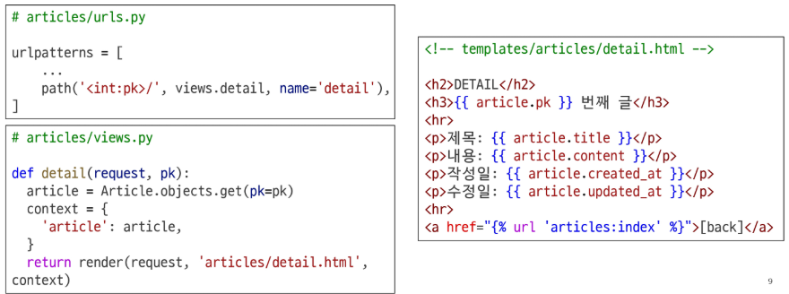
#### 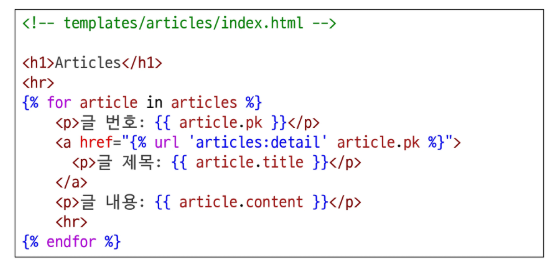
#### ※ NoReverseMatch: url 문제
# Create
- Create 로직 구현에는 두 개의 view 함수가 필요
- new: 사용자 입력 데이터(게시글에 대한 페이지)를 받을 페이지를 렌더링 -> create: 사용자가 입력한 요청 데이터를 받아 DB에 저장
## new - 페이지 렌더링 기능 구현
### 게시글 생성 페이지 구현
#### 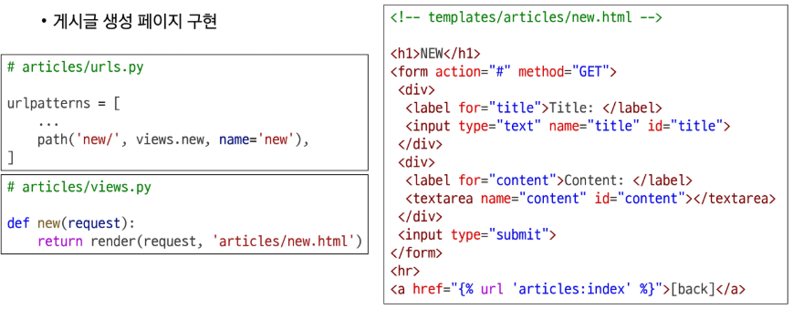
### index 페이지에 new 페이지로 이동할 수 있는 하이퍼링크 작성
#### 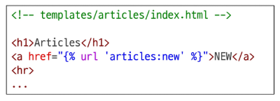
## create - 데이터 저장 기능 구현
#### 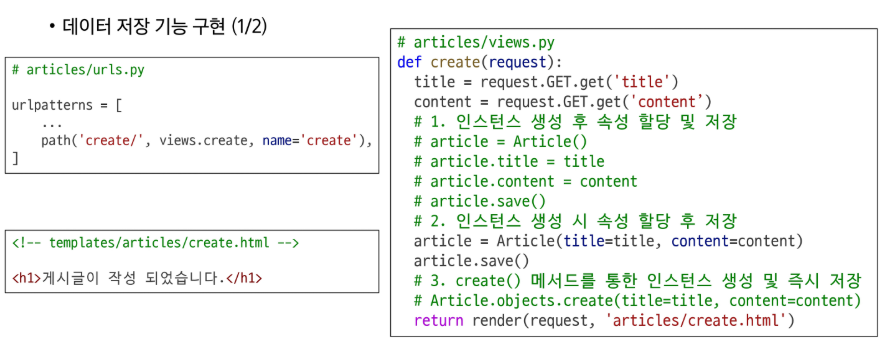
#### 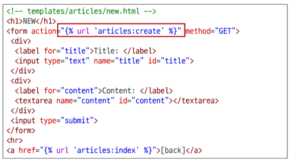
# HTTP request methods
- 데이터에 대해 수행을 원하는 작업(행동)을 나타내는 것
  - 서버에게 원하는 작업의 종류를 알려주는 역할
- 대표적인 메서드
  - GET
    - 리소스 조회
    - URL에 데이터가 노출됨
    - 동영상 등 다양한 데이터를 받아올 수 없음
    - 캐싱 가능
    - 뒤로가기 기능 제공
  - POST
    - 데이터 생성/전송
    - 요청 본문에 데이터
    - 데이터 노출 없음
#### ※ 캐싱: 자주 사용하는 데이터나 결과를 임시로 저장해두고 재활용하여 처리 속도를 높이는 기술
## HTTP
- 네트워크 상에서 데이터(리소스)를 주고 받기 위한 약속
## GET method
- 서버로부터 데이터를 요청하고 받아오는 데(조회) 사용
- 주로 검색 쿼리 전송, 웹 페이지 요청, API에서 데이터를 조회하는 것과 같이 서버로부터 데이터를 요청하고 받아오는 데 사용
### 'GET' Method 특징
1. 데이터 전송
   - URL의 쿼리 문자열(Query String)을 통해 데이터를 전송
   - http://127.0.0.1:8000/articles/create/?title=제목&content=내용
2. 데이터 제한
   - URL 길이에 제한이 있어 대량의 데이터 전송에는 적합하지 않음
3. 브라우저 히스토리
   - 요청 URL이 브라우저 히스토리에 남음
4. 캐싱
   - 브라우저는 GET 요청의 응답을 로컬에 저장할 수 있음
   - 동일한 URL로 다시 요청할 때, 서버에 접속하지 않고 저장된 결과를 사용
   - 페이지 로딩 시간을 크게 단축
## POST method
- 서버에 데이터를 제출하여 리소스를 변경(생성, 수정, 삭제)하는 데 사용
- 주로 로그인 정보 제출, 파일 업로드, 새 데이터 생성(예: 새 게시글 작성), API에서 데이터 변경을 요청하는 것과 같이 클라이언트가 서버로 데이터를 전송하여 서버의 상태를 변경할 때 사용
### 'POST' Method 특징
1. 데이터 전송
   - HTTP Body를 통해 데이터를 전송
2. 데이터 제한
   - GET에 비해 더 많은 양의 데이터를 전송할 수 있음
3. 브라우저 히스토리
   - POST 요청은 브라우저 히스토리에 남지 않음
4. 캐싱
   - POST 요청은 기본적으로 캐시할 수 없음
   - POST 요청이 일반적으로 서버의 상태를 변경하는 작업을 수행하기 때문
## Post method 변경
### Create 로직 수정 - "http method POST로 변경"
- new.html의 form 요청은 새로운 article(새로운 데이터)을 생성하는 요청
  - POST method로 서버에 전달되는 것이 적절함
#### 
- 게시글 생성 후 403 에러 확인
# HTTP response status code
- 서버가 클라이언트의 요청에 대한 처리 결과를 나타내는 3자리 숫자
- 클라이언트는 이 코드를 통해 요청이 성공했는지, 실패했는지, 아니면 추가적인 조치가 필요한지 즉시 파악 가능
- 이를 통해 웹 브라우저는 적절한 메시지를 사용자에게 표시하거나, 개발자는 문제 해결을 위한 단서를 얻게 됨
## 403 Forbidden
- 서버에 요청이 전달되었지만, 권한 때문에 거절되었다는 것을 의미
- 'CSRF token이 누락되었다.'는 응답
## CSRF(Cross-Site-Request-Forgery)
- 사이트 간 요청 위조
- 사용자가 자신의 의지와는 무관하게 공격자가 의도한 행동(글쓰기, 정보, 수정, 송금 등)을 특정 웹 사이트에 요청하게 만드는 해킹 방식
### 예시: 위조된 인감도장
1. 신뢰할 수 있는 관계(로그인)
   - 사용자는 은행(예: bank.com)에 정상적으로 로그인하여, 은행은 사용자를 신뢰하고 있다는 증표(세션 쿠키)를 브라우저에 발급. 이 쿠키가 바로 당신의 **인감도장**
2. 악성 위임장(악성 링크)
   - 해커는 '무료 경품 이벤트!'와 같은 미끼 링크를 사용자에게 보냄. 이 링크의 실제 내용은 '내 돈 100만원을 해커에게 송금하라'는 내용이 담긴, 당신의 인감도장만 찍으면 되는 '위조된 위임장'
3. 나도 모르는 날인(요청 전송)
   - 사용자가 미끼 링크를 클릭하는 순간, 당신의 브라우저는 자기도 모르게 bank.com에 위조된 위임장(송금 요청)을 보냄. 이 때 브라우저는 bank.con에 보낼 때마다 인감도장(세션 쿠키)을 자동으로 찍어서 보냄
4. 은행의 착각(공격 성공)
   - 은행 입장에서는 정상적인 인감도장이 찍힌 위임장이 도착했으므로, 이 요청이 당신의 진짜 의사라고 믿고 송금을 실행
### CSRF 공격의 방어
- Django는 이러한 공격을 막기 위해 CSRF 토큰이라는 안전장치를 사용
- 이는 위임장에 진짜 서명이 있는지 확인하는 것처럼, 모든 중요한 요청에 대해 '내가 직접 보낸 요청이 맞다'는 일회용 비밀 코드를 함께 보내도록 하여 위조된 요청을 막아줌
### CSRF Token 적용
- DTL의 csrf_token 태그를 사용해 손쉽게 사용자에게 토큰 값을 부여
- 요청 시 토큰 값도 함께 서버로 전송될 수 있도록 하는 것
- 새로고침 마다 값이 변경됨
#### 
### 요청 시 CSRF Token을 함께 보내야 하는 이유
- Django 서버는 해당 요청이 DB에 데이터를 하나 생성하는(DB에 영향을 주는) 요청에 대해 'Django가 직접 제공한 페이지에서 데이터를 작성하고 있는 것인지'에 대한 확인 수단이 필요한 것
- 겉모습이 똑같은 위조 사이트나 정상적이지 않은 요청에 대한 방어 수단
- 기존 요청 형태
  - 요청 데이터 -> 게시글 작성
- 변경 요청 형태
  - 요청 데이터 + 인증 토큰 -> 게시글 작성
### POST일 때만 Token을 확인하는 이유
- POST는 단순 조회(GET)와 달리 리소스의 변경(생성, 수정, 삭제)을 요청하는 의미와 기술적 특성을 지님
- DB에 조작을 가하는 요청은 반드시 인증 수단이 필요
- 데이터베이스에 대한 변경사항을 만드는 요청이기 때문에 토큰을 사용해 최소한의 신원 확인을 하는 것
### 게시글 작성 결과
- 더 이상 URL에 Query String 형태로 보냈던 데이터가 표기되지 않음(기존 GET method 방식)
- 게시글 생성 후 개발자 도구를 사용해 Form Data가 전송되는 것 확인

클라이언트: 게시글 생성해줘        (O), POST
           게시글 완료 페이지 줘! (X), GET

# Redirect
- 현재 서비스는 게시글 작성(POST 요청) 이후, '게시글이 성공적으로 작성되었습니다'와 같은 완료 메시지 페이지를 직접 반환
- 게시글 저장 후 페이지를 응답하는 것은 POST 요청에 대한 적절한 응답이 아님
- 이는 후속 행동(예: 새로고침, 뒤로 가기)에서 예기치 않은 동작을 유발할 수 있음
## 게시글 작성 성공 페이지 응답의 문제점
- HTTP 표준 관점
  - POST 요청은 데이터 생성/변경에 사용되며, 동일 요청이 반복되면 안됨
  - 현재 방식에선 사용자가 완료 페이지에서 새로고침 시 중복 게시물 작성의 위험이 있음
- 사용자 경험(UX) 관점
  - 작성 완료 후 완료 페이지를 직접 응답하는 방식은 직관적이지 않고, 사용자가 예상하는 흐름과 다름
  - 브라우저의 페이지 기록 관리와 상태 관리에 혼란을 줄 수 있음
## 게시글 작성 성공 후 적절한 응답 방법
- 서버는 데이터 저장 후 페이지를 응답하는 것이 아닌 사용자를 적절한 기존 페이지로 보내야 함
- **'사용자를 보낸다.' -> '사용자가 GET 요청을 한번 더 보내도록 해야한다.'**
- 실제로 서버가 클라이언트를 직접 다른 페이지로 보내는 것이 아닌 클라이언트가 GET 요청을 한번 더 보내도록 응답하는 것
## redirect()
- 클라이언트가 인자에 작성된 주소로 다시 요청을 보내도록 하는 함수
- redirect() 함수 적용
#### 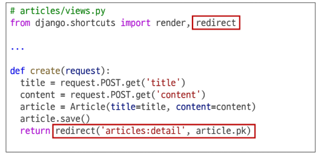
### redirect 동작 원리
1. redirect 응답을 받은 클라이언트는 detail url로 다시 요청을 보내게 됨
2. 결과적으로 detail view 함수가 호출되어 detail view 함수의 반환 결과인 detail 페이지를 응답 받게 되는 것
   - 결국 사용자는 게시글 작성 후 작성된 게시글의 detail 페이지로 이동하는 것으로 느끼게 됨
#### 
#### 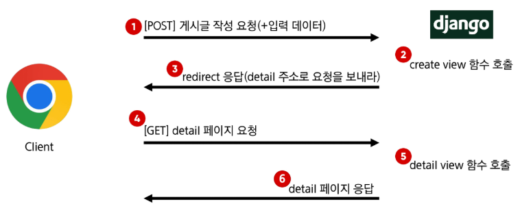
### 게시글 작성 결과
- 게시글 작성 후 생성된 게시글이 detail 페이지로 redirect 되었는지 확인
- create 요청 이후에 detail로 다시 요청을 보냈다는 것을 알 수 있음
# Delete
#### 
# Update
- Update 로직 구현에는 두 개의 view 함수가 필요
- edit: 사용자 입력 데이터를 받을 페이지를 렌더링 -> update: 사용자가 입력한 요청 데이터를 받아 DB에 저장
## edit - 페이지 렌더링 기능 구현
### 기능 구현
#### 
### 기능 구현: 수정 시 이전 데이터가 출력될 수 있도록 작성하기
#### 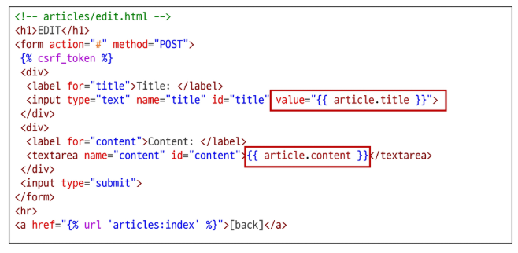
#### 
#### ※ input과 textarea 모두 기존 데이터를 화면에 미리 출력해 사용자가 편리하게 수정할 수 있도록 함
### 기능 구현: edit 페이지로 이동하기 위한 하이퍼링크 작성
#### 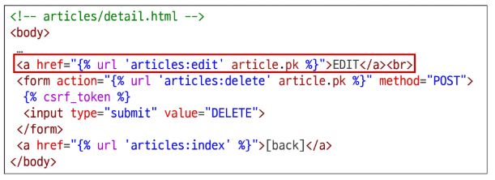
## update - 기능 구현
#### 
### 작성 후 게시글 수정 테스트
#### 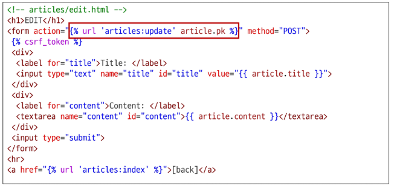
# 참고
## GET & POST 비교
#### 
### GET 요청이 필요한 경우
- 캐싱 및 성능
  - GET 요청은 캐시될 수 있고, 이전에 요청한 정보를 새로 요청하지 않고 사용할 수 있음
  - 특히, 동일한 검색 결과를 여러 번 요청하는 경우 GET 요청은 캐시를 활용하여 더 빠르게 응답할 수 있음
- 가시성 및 공유
  - GET 요청은 URL에 데이터가 노출되어 사용자가 해당 URL을 북마크하거나 다른 사람과 공유하기 용이
- RESTfull API 설계
  - HTTP 메서드의 의미에 따라 동작하도록 디자인된 API의 일관성을 유지할 수 있음
### HTTP request methods를 활용한 효율적인 URL 구성
- 동일한 URL 한 개로 method에 따라 서버에 요구하는 행동을 다르게 요구
- HTTP Methods를 통해 웹 서버와 클라이언트 간의 통신에서 '내가 무엇을 할지'를 명시적으로 전달
- URL이 같아도 사용되는 메서드(GET, POST 등)에 따라 서버의 동작이 달라짐
## Cache
- 데이터나 정보를 임시로 저장하여, 다시 요청할 때 빠르게 제공하는 저장 공간
- 캐시의 장점
  - 빠른 응답 시간: 이미 저장된 데이터를 즉시 제공하여 사용자 경험 향상
  - 서버 부하 감소: 반복적인 데이터 요청을 줄여 서버 자원 절약
#### ※ 주의 사항
- 포스트는 새로고침으로 요청을 보내지 않음
- 그냥 렌더에 메인 페이지로 리턴하면안되나???
- 메인 페이지 내용 없어짐
- 왜???
- 뷰 함수의 인덱스 함수가 동작해야 내용이 조회되는데
- 해당 뷰 함수가 호출 되지 않았기 때문에 내용이 없는 빈 베인 페이지가 응답 됨
- -> 리다이렉트가 올바른 로직임!!!!