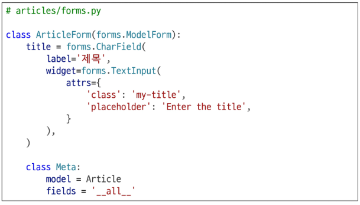

# Django - Form
# Django Form
- 사용자 입력 데이터를 수집하고, 처리 및 유효성 검사를 수행하기 위한 도구
- 유효성 검사를 단순화하고 자동화할 수 있는 기능을 제공
- 사용자가 잘못 입력한 데이터는 자동으로 오류로 처리되어 안정성을 높임
- 개발자는 이를 통해 빠르고 일관된 검증 기능을 구현할 수 있음
## HTML의 한계
### HTML form
- 지금까지 사용자로부터 데이터를 제출 받기 위해 활용한 방법
- 그러나 비정상적 혹은 악의적인 요청을 필터링 할 수 없음
- 유효한 데이터인지에 대한 확인 필요
### 유효성 검사
- 수집한 데이터가 정확하고 유효한지 확인하는 과정
- Django Form의 유효성 검사는 사용자가 입력한 데이터가 올바른 형식인지 자동으로 점검하는 기능 제공
- 예: 필수 입력값이 비어잆거나, 잘못된 이메일 형식을 입력하면 오류를 알려줌
- 이 과정을 통해 서버에 잘못된 데이터가 저장되지 않도록 보호할 수 있음
### 유효성 검사 구현의 어려움
- 유효성 검사를 구현하기 위해서는 입력값, 형식, 중복, 범위, 보안 등 많은 것을 고려해야 함
- 이런 과정과 기능을 직접 개발하는 것이 아닌 Django가 제공하는 Form을 사용
## Form class
### Form Class 정의
- Form Class를 상속받아 내용과 제목에 대한 사용자 입력을 받는 ArticleForm을 정의하는 방법
#### 
### Form Class를 적용한 new logic
1. view 함수 new 변경
#### 
2. new 페이지에서 form 인스턴스 출력
#### 
### Form class가 대체하는 것
#### 
## Widgets
- HTML 'input' element의 표현을 담당
- 폼 필드를 화면에 표시하는 HTML 입력 요소를 정의하는 구성 요소
- Django Form의 widgets은 각 필드가 HTML에서 어떻게 렌더링 될지를 결정
- 예: TestInput, Select, CheckboxInput 등 다양한 위젯 클래스를 사용해 입력 방식과 속성을 세부 조정할 수 있음
### Widget 적용
- Widget은 단순히 input 요소의 속성 및 풀력되는 부분을 변경하는 것
#### 
# Django ModelForm
## Form vs. ModelForm
- Form
  - 사용자 입력 데이터를 DB에 저장하지 않을 때
  - 예: 검색, 로그인
- ModelForm
  - 사용자 입력 데이터를 DB에 저장해야 할 때
  - 예: 게시글 작성, 회원가입
## ModelForm 기능
- Model과 연결된 Form을 자동으로 생성해주는 기능을 제공
- ModelForm은 Form 클래스와 Model 클래스를 결합한 형태로, 모델 필드를 기반으로 입력 폼을 자동 생성해 줌
- 데이터 수집과 저장 과정을 동시에 처리할 수 있도록 도와줌
## ModelForm class 정의
- 기존 ArticleForm 클래스 수정
#### 
## ModelForm class가 대체하는 것
#### 
## Meta class
- ModelForm의 정보를 작성하는 곳
- Meta class는 ModelForm 내부에서 어떤 모델과 연결할지, 어떤 필드를 사용할지 등을 정의하는 설정 공간
- 폼의 동작 방식을 제어하는 핵심 역할
#### ※ 데이터에 대한 데이터, 데이터를 설명하는 데이터. 예: 사진
### 'fields' 및 'exclude' 속성
- exclude 속성을 사용하여 모델에서 포함하지 않도록 필드를 지정할 수도 있음
#### 
### Meta class 주의 사항
- Django 에서 ModelForm에 대한 추가 정보나 속성을 작성하는 클래스 구조를 Meta 클래스로 작성했을 뿐이며, 파이썬의 inner class와 같은 문법적인 관점으로 접근하지 말 것
## ModelForm 적용
### ModelForm을 적용한 create 로직
#### 
- 제목 input에 공백을 입력 후 제출 시 에러메시지 출력 확인 -> 유효성 검사의 결과
#### ※ 공백이 아닌 아무것도 입력하지 않으면 django가 아닌 HTML에서 form을 제출하지 않음
### is_valid() 활용
- 여러 유효성 검사를 실행하고, 데이터가 유효한지 여부를 Boolean으로 반환
### 공백 데이터가 유효하지 않은 이유와 에러메시지가 출력되는 과정
- 별도로 명시하지 않았지만 모델 필드에는 기본적으로 빈 값은 허용하지 않는 제약조건이 설정 되어있음
- 빈 값음 is_valid()에 의해 False로 평가되고 form 객체에는 그에 맞는 에러 메시지가 포함되어 다음 코드로 진행됨
#### 
### ModelForm을 적용한 edit 로직
#### 
### ModelForm을 적용한 update 로직
#### 
## save 메서드
- 데이터베이스 객체를 만들고 저장하는 ModelForm의 인스턴스 메서드
- 폼 데이터가 유효한 경우, save() 메서드를 호출하면 모델 인스턴스를 생성하고 데이터베이스에 저장됨
- instance 인자를 통해 새 객체 생성과 기존 객체 수정도 구분할 수 있음
- 이 과정을 통해 코드 없이 손쉽게 DB 연동이 가능
### save() 메서드가 생성과 수정을 구분하는 법
- 키워드 인자 instance 여부를 통해 생성할 지, 수정할 지를 결정
#### 
### django Form 정리
- 사용자로부터 데이터를 수집하고 처리하기 위한 강력하고 유연한 도구
- HTML form의 생성, 데이터 유효성 검사 및 처리를 쉽게 할 수 있도록 도움
- 폼 모델 폼 차이
# HTTP 요청 다루기
## View 함수 구조 변화
### new & create view 함수간 공통점과 차이점
- 공통점: 데이터 생성을 구현하기 위함
- 차이점: new는 GET method 요청만을, create는 POST method 요청만을 처리
### view 함수 구조화의 목적
- HTTP request method 차이점을 활용해 동일한 목적을 가지는 2개의 view 함수를 하나로 구조화
## new & create 함수 결합
#### 
### 새로운 create view 함수
- new와 create view 함수의 공통점과 차이점을 기반으로 하나의 함수로 결합
- 두 함수의 유일한 차이점이었던 request method에 따른 분기
- POST일 때는 과거 create 함수 구조였던 객체 생성 및 저장 로직 처리
- POST가 아닐 때는 과거 new 함수에서 진행했던 form 인스턴스 생성
- context에 담기는 form은
  1. is_valid()를 통과하지 못해 에러메시지를 담은 form이거나
  2. else문을 통한 form 인스턴스
#### 
### 기존 new 관련 코드 수정
- 사용하지 않게 된 new url 제거
#### 
- new 관련 키워드를 create로 변경
#### 
#### 
### request method에 따른 요청의 변화
- GET: articles/create/ -> 게시글 생성 페이지를 줘!
- POST: articles/create/ -> 게시글을 생성해줘!
## edit & update 함수 결합
### 새로운 update view 함수
- 기존 edit과 update view 함수 결합
#### 
### 기존 edit 관련 코드 수정
- 사용하지 않는 edit url 제거
#### 
- edit 관련 키워드를 update로 변경
#### 
# 참고
## ModelForm의 키워드 인자 구성
### ModelForm 키워드 인자 data와 instance 살펴보기
- data는 첫번째에 위치한 키워드 인자이기 때문에 생략 가능
- instance는 9번째에 위치한 키워드 인자이기 때문에 생략할 수 없음
#### 
## Widgets 응용
#### 
#### 
## 필드를 수동으로 렌더링
#### 