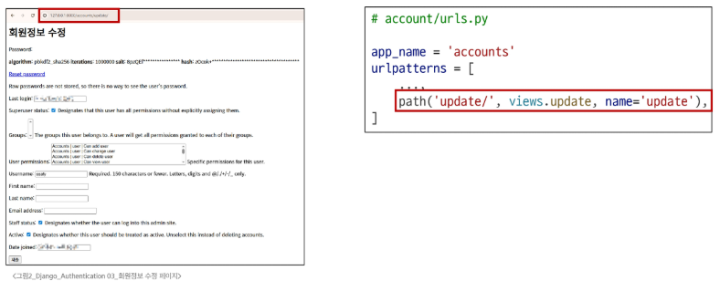
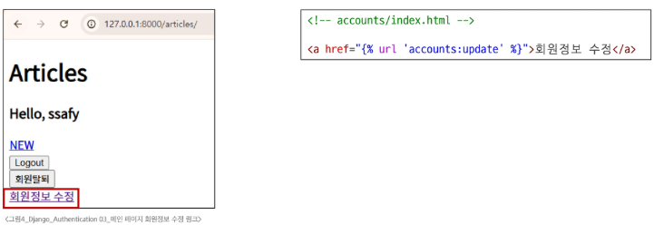
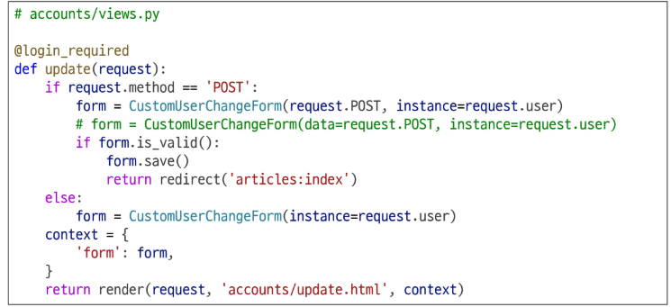
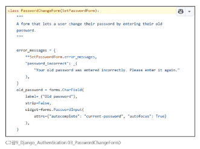
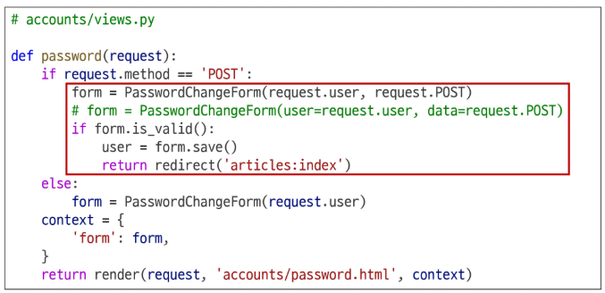
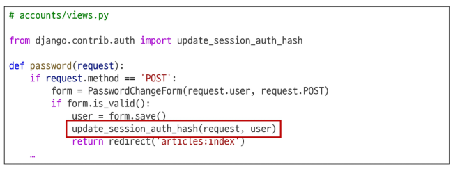
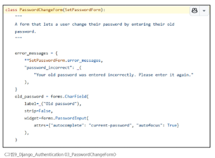

# django - Authentication System 03
# 회원정보 수정
- User 객체를 Update하는 과정
- 수정할 대상 User 객체를 가져오고, 입력받은 새로운 정보로 기존 내용을 갱신
## 회원정보 수정 페이지 작성
- 회원정보 수정 경로 url 생성
#### 
### UserChangeForm()
- 회원정보 수정 시 사용자 입력 데이터를 받는 built-in ModelForm
- ModelForm이기 때문에, 유효성 검사를 통과한 데이터로 기존 User 객체의 내용을 갱신하고 저장(주로 관리자 페이지에서 사용)
#### 
- 커스텀 유저 모델을 사용하기 위해서 Form을 다시 작성
- Custom User model을 사용할 수 있도록 상속 후 일부분만 재작성
#### 
- .../accounts/update/url로 요청이 들어왔을 때 실행할 update 함수 작성
- 회원정보 수정에 사용할 데이터를 입력받는 CustomUserChangeForm built-in form 사용
#### 
- 회원가입을 위해 작성한 정보를 서버에 안전하게 전송하기 위해 'POST 방식'을 사용
- 서버로부터 전달받은 CustomUserChangeForm을 화면에 출력
#### 
- 메인 페이지에서 회원정보 수정 페이지에 접근할 수 있는 태그 생성
#### 
### UserChangeForm 사용 시 문제점
- User 모델의 모든 정보들(fields)까지 모두 출력됨
- 일반 사용자들이 접근하면 아노디는 정보는 출력하지 않아야 함
### CustomUserChangeForm 출력 필드 재정의
- User Model의 필드 목록 확인
#### 
## 회원정보 수정 로직 완성
#### 
# 비밀번호 변경
- 인증된 사용자의 Session 데이터를 Update하는 과정
- 기존 비밀번호를 통해 사용자를 인증하고, 새로운 비밀번호를 암호화하여 갱신
## 비밀번호 변경 페이지 작성
- Django는 비밀번호 변경 페이지를 회원정보 수정 form 하단에서 별도 주소로 안내
- Django에서 안내하는 비밀번호 변경 URL에 맞춰서 작성
#### 
- .../accounts/password/url로 요청이 들어올 때 실행할 password 함수 작성
- 비밀번호 변경에 사용할 데이터를 입력받는 PasswordChangeForm built-in form 사용
#### 
### PasswordChangeForm()
- 비밀번호 변경 시 사용자 입력 데이터를 받는 built-in Form
- 일반 Form이며, 유효성 검사(기존 비밀번호 확인, 새 비밀번호 일치 여부)를 통과한 데이터로 사용자의 비밀번호를 안전하게 암호화하여 갱신하는 역할을 수행
#### 
#### 
#### 
# 세션 무효화 방지
## 암호 변경 시 세션 무효화
- 비밀번호가 변경되면 기존 세션과의 회원 인증 정보가 일치하지 않게 되어버려 로그인 상태가 유지되지 못하고 로그아웃 처리됨
- 비밀번호가 변경되면서 기존 세션과의 회원 인증 정보가 일치하지 않기 때문
### 암호 변경 시 세션 무효화를 막아주는 함수 - update_session_auth_hash(request, user)
- 암호가 변경되면 새로운 password의 Session Data로 기존 session을 자동으로 갱신
- update_session_auth_hash를 password 함수에 적용
#### 
# 비밀번호 암호화
- 암호화의 중요성: 많은 해킹사태가 발생하고 있고, 데이터가 유출되더라도 그 내용을 알 수 없도록 하는 암호화는 특히 중요
## 우리가 사용하는 비밀번호의 저장 방식
1. 사용자가 입력한 비밀번호 그대로 저장하는 방식 -> 보안에 매우 취약하므로 X
   - 데이터베이스가 해킹 당하면, 공격자는 아이디와 비밀번호 목록을 그대로 손에 넣게 되고, 이를 통해 직접 로그인하여 개인정보, 금융 정보, 주소록 등 모든 데이터를 유출하거나 서비스를 악용할 수 있음
   - 악의적인 내부 직원이 데이터베이스에 접근하여 모든 사용자의 비밀번호를 볼 수 있음
   - 대부분의 사람들은 여러 서비스에서 동일한 아이디와 비밀번호를 사용하기에 탈취한 정보를 이용해 다른 사이트에 그대로 대입하여 2차 피해를 발생시킴(Credential Stuffing 공격)
2. 일정한 규칙에 따라 비밀번호를 알아볼 수 없는 문자로 인코딩한 후 저장 -> 보안에 매우 취약하므로 X
   - 데이터베이스에 알아볼 수 없는 문자로 저장되어 있다고 하더라도, 인코딩은 비밀키 없이도 정해진 규칙에 따라 누구나 원래의 값으로 되돌릴 수 있음
   - 공격자는 아주 간단한 디코딩 작업만으로 모든 사용자의 실제 비밀번호를 즉시 알아낼 수 있음
   - 사실상 비밀번호를 평문으로 저장하는 것과 동일한 수준의 위험을 초래
#### ※ 인코딩: 정보를 표현하는 형식을 다른 형식으로 변환하는 과정
3. 비밀번호를 복원이 불가능한 고정된 길이의 문자열로 변환 후 저장 -> 보안에 필수
   - 데이터베이스가 유출되어도 공격자는 복잡하게 얽힌 문자열을 보게 되고, 복원이 불가능하기 때문에 실제 비밀번호를 알 수 없음
   - 악의적인 내부 직원이 비밀번호를 보더라도 암호화된 비밀번호를 보게 되므로, 실제 비밀번호를 유추할 수 없음
   - 비밀번호를 복원이 불가능한 고정된 길이로 바꾸는 과정을 hash라고 함
#### ※ 고정된 길이의 문자열로 변환하는 이유
- 보안성: 변환된 문자열의 길이가 다르다면, 길이만 보고도 원래 비밀번호의 길이를 유추할 수 있음
- 일관성: 길이가 동일하기 떄문에 저장 공간을 예측하고 설계하기 쉬우며, 검색/비교하는 처리 속도도 일정하게 유지할 수 있음
## Hash
- 임의의 크기를 가진 데이터를 고정된 크기의 고유한 값으로 변환하는 것
- 어떤 데이터를 완전히 다른 모습으로 바꾸고, 절대로 원래 모습으로 되돌릴 수 없는 변환 과정
- 작은 변화에도 해시값이 크게 달라지는 특성으로 인해 변조 여부를 쉽게 확인할 수 있음
- 입력값이 들어오더라도 해시함수에 의해 다른 값으로 바뀌며, 동일한 값은 항상 동일한 해시값을 생성
## Hash function
- 임의 길이 데이터를 입력 받아 고정 길이(정수)로 변환해 주는 함수
- 어떤 길이의 데이터든 넣을 수 있고, 항상 고정된 길이의 결과물(해시 값)이 나옴
- 입력값으로 해시값을 만들 수는 있지만, 해시값만 보고 원래 입력값을 알아낼 수 없음(단방향)
- 입력값이 단 한글자만 달라져도 해시값은 완전히 달라짐(눈사태 효과)
- 같은 입력값을 넣으면 언제나 똑같은 해시값이 나옴
### Django는 기본적으로 SHA-256 해시 함수를 사용해서 암호화
- 입력한 비밀번호의 길이와는 상관없이 동일한 길이의 해시값을 생성
- 1글자만 다르더라도 전혀 다른 해시값 생성
## SHA-256(Secure Hash Algorithm - 256)
- 안전한 해시 알고리즘으로, 어떤 데이터를 입력하든 256비트 길이의 결과물을 만들어 냄
- 전 세계적인 표준으로 사용되고 있으며, 비트코인과 같은 블록체인 기술에서도 사용
### Rainbow Table
- 공격자가 자주 사용되는 비밀번호들을 미리 수백, 수십억 개를 해시로 변환해 저장해 둔 겨대한 정답지
- 공격 방식
  1. 공격자가 DB를 탈취해 사용자의 비밀번호 해시 값을 얻음
  2. 해시값을 공격자 자신의 레인보우 테이블에서 검색
  3. 테이블에서 일치되는 값을 찾아내면서, 역방향으로 되돌리지 않고 비밀번호를 알아내는 데 성공
### 레인보우 테이블 공격의 방어
- 공격자가 아무리 거대한 레인보우 테이블을 가지고 있더라도, 사용자의 해시값이 레인보우 테이블에 없도록 해시값을 만들면 됨
- 해시값은 입력값이 단 한 글자만 달라져도 해시값은 완전히 달라지는 눈사태 효과가 있음
- 결국 같은 비밀번호라도 사용자마다 임의의 문자열을 비밀번호에 붙여서 해시 암호화를 진행
  - 임의의 문자열이 추가된 상태로 해시값을 만들기 때문에 눈사태 효과에 의해 같은 비밀번호도 다른 해시 값이 나옴
### Salt
- 각 사용자마다 고유하게 생성된 임의의 문자열(솔트)을 비밀번호에 덧붙여서 해시값을 생성
- 이 솔트는 해시값과 함께 데이터베이스에 저장
- 공격자가 솔트 값을 알아도 상관 없음
  - userA의 솔트와 해시값을 품쳤다면, 공격자는 userA만을 위한 레인보우 테이블을 만들어야 함
  - 이는 하나의 답안지로 수백만명을 공격하는 방식에서 한 명을 공격하기 위해 매번 새로운 답안지를 만드는 방식으로 바꾸면서 공격의 효율성을 극도로 떨어뜨림
### 솔트로 레인보우 테이블 공격을 막았으니 안전할까?
- 공격자는 이제 미리 만들어 둔 답안지를 쓸 수 없어짐
- 그래서 단순하지만 확실한 방법으로써 가능한 모든 비밀번호를 하나씩 직접 대입해보는 방식으로 공격
- 이 방식은 현대 컴퓨터의 엄청난 속도 때문에 생각보다 훨씬 위협적
  - 최신 GPU는 초당 약 1,500억 번이상 추측할 수 있음
### Brute-force Attack(무차멸 대입 공격)
- 가장 원시적이지만 강력한 방법으로써 가능한 모든 비밀번호를 하나씩 대입하는 방식
- 이 공격은 시간과의 싸움이며, 현대 컴퓨터의 빠른 연산 속도가 공격자의 무기가 됨
### Brute-force Attack의 방어
- 공격자는 현대 컴퓨터의 빠른 연산 속도를 무기로 공격을 시도하고 있음
- 결국 해결책은 연산 속도를 늦추는 것이 핵심
- 연산 속도를 늦추기 위해 의도적으로 비밀번호 검증 과정을 느리게 만듦
  - 느리게 만들기 위해서 의도적으로 해시 연산을 수십만 번 반복시켜, 공격 속도를 늦춤
  - 사용자는 실제로 체감하지 못함
  - 해시 연산 속도를 1개당 0.2초로 바꾼다면, 실제로 공격자는 1초에 5번의 공격만 가능함
  - 하지만 사용자에게 0.2초는 느리다고 하기엔 충분히 빠른 시간
### Key Stretching
- 솔트를 적용한 해시 함수를 수만 ~ 수십만 번 반복하여 연산 시간을 늘리는 기법
- 속도가 무기인 무차별 대입 공격을 방어할 수 있음
- Django는 이 키 스트레칭을 구현하기 위해서 PBKDF2라는 검증된 알고리즘을 기본으로 사용
  - 최근에는 더 강력한 보안을 제공하는 Argon2, bcrypt같은 알고리즘도 지원
#### 
## Django에서의 비밀번호 암호화
#### 
1. <algorithm>: 어떤 알고리즘을 쓰는 지
2. <iterations>: 키 스트레칭 횟수
3. <salt>: 생성된 솔트
4. <hash>: 생성된 최종 해시
## 비밀번호 암호화 정리
- 암호화 과정을 이해한 후, 검증된 프레임워크의 보안 기능을 신뢰하고 사용하기
  - 보안은 매우 어렵고 복잡한 분야이며, Django 공식에도 가급적 재발명하지 않을 것을 권장하고 있음
- 단순히 코드를 복사해서 붙여넣는 것을 넘어, 이 기능이 왜 이렇게 만들어졌는지 이해하면, 더 견고하고 안전한 어플리케이션을 만들 수 있음
- 사용자는 우리의 서비스를 믿고 소중한 개인정보를 맡기고, 그들의 데이터를 안전하게 지키는 것은 개발자의 가장 기본적인 책임이자 직업윤리
# 참고
## 비밀번호 초기화
- 비밀번호를 잊어버린 사용자가 이메일을 활용하여 다시 설정하는 과정
- 비밀번호 초기화 과정
  1. 비밀번호를 찾으려고 하는 이메일 입력
    - Django에서 제공하는 비밀번호 관련 기능을 활용하기 위해 django.contrib.auth.url을 crud/urls.py에 포함
#### 
    - .../accounts/만 입력해보고, 제공하는 url 목록을 확인
    - 제공되는 url 목록에서 password_reset 경로를 입력해보고, 비밀번호 초기화 페이지로 접근
#### 
#### ※ 같은 accounts에 2개의 include가 사용되어도 되는 이유
- 같은 prefix로 여러번 include를 해도, 각 include의 내부 URL 패턴을 순차적으로 모두 시도
- 내부 URL이 겹치지 않으면 모두 동작하기 때문에 괜찮음
  2. 이메일로 비밀번호 재설정 링크를 전송
    - 비밀번호를 찾으려고 하는 이메일을 작성하고 Reset my password 버튼을 눌러 이메일 전송
    - 입력한 이메일에 매칭되는 사용자 이메일이 없다면 이메일 기능은 동작하지 않음
      - 에러나 주의 문구가 나타나면 사용자 입장에서는 편리하지만, 임의의 사용자가 이메일의 존재 여부를 확인하는 용도로 악용하는 사례를 막기위해 동작하지 않음
    - 이메일 관련 설정을 따로 하지 않았기 때문에 이메일 전송 실패
    - Django에서는 이메일을 보낸 내용을 콘솔에서 볼 수 있는 기능을 제공
    - settings.py에서 EMAIL_BACKEND 세팅 후 다시 이메일 전송하기
#### 
    - 콘솔창에 비밀번호 초기화 설정 페이지 안내 이메일을 확인하고, 해당 링크 들어가기
  3. 비밀번호 재설정 페이지에서 새로운 비밀번호 설정
    - 새로운 비밀번호 설정 후, 비밀번호 설정 완료 페이지 보여주기
  4. 초기화 후 다시 로그인
    - 변경한 비밀번호로 로그인
## PasswordChangeForm 인자 순서
- PasswordChangeForm이 다른 Form과 달리 user 객체를 첫번째 인자로 받는 이유
  - 부모 클래스인 SetPasswordForm의 생성자 함수 구성을 따르기 때문
#### 
## Auth built-in form 코드