# django - Authentication System 02
# Logout
- Logout
  - 로그아웃은 Session을 Delete하는 과정
  - 서버의 세션 데이터를 비우고, 클라이언트의 세션 쿠키를 삭제
- logout(request)
  - DB에서 현재 요청에 대한 Session Data를 삭제
  - 클라이언트의 쿠키에서도 Session Id를 삭제
## 로그아웃 로직 작성
- 로그아웃 경로 url 생성
#### 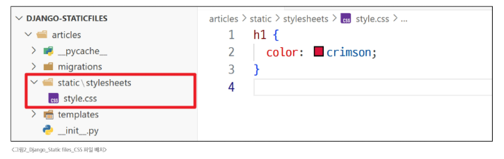
- .../accounts/logout/url로 요청이 들어왔을 때 실행할 logout 함수 작성
- DB에서 현재 요청에 대한 Session Data를 삭제하고, 클라이언트의 쿠키에서도 Session Id를 삭제하는 내장 logout 함수 작성
#### 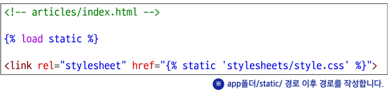
- 로그인한 사용자 정보를 서버에 안전하게 전송하기 위해 'POST 방식'을 사용
- CSRF 공격을 방지하기 위해 csrf_token 작성
#### 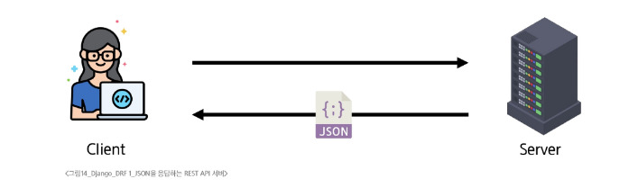
# AbstractUser class
## Abstract base classes(추상 기본 클래스)
- 몇가지 공통 정보를 여러 다른 모델에 넣을 때 사용하는 클래스
- 데이터베이스 테이블을 만드는 데 사용되지 않으며(migrate의 대상이 아님), 대신 다른 모델의 기본 클래스(기본 '틀'로 사용)로 사용되는 경우 해당 필드가 하위 클래스의 필드에 추가 됨
- 인증에 필요한 최소한의 기능만 제공
## **AbstractUser class**
- 관리자 권한과 함께 완전한 기능을 가지고 있는 User model을 수현하는 추상 기본 클래스
- 기본 User 모델이 가진 모든 필드가 이미 구현되어 있음
#### 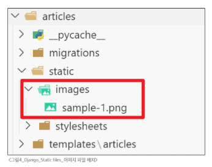
## Abstract base class 정리
#### 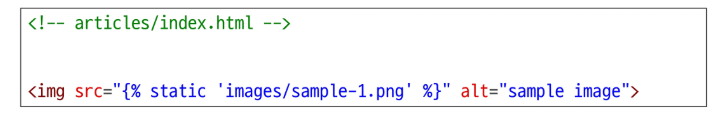
# 회원 가입
- User 객체를 Create하는 과정
- 사용자로부터 아이디, 비밀번호 등의 정보를 입력받아, DB에 새로운 User 객체를 생성하고 저장
## 회원 가입 페이지 작성
- 회원가입 경로 url 생성
#### 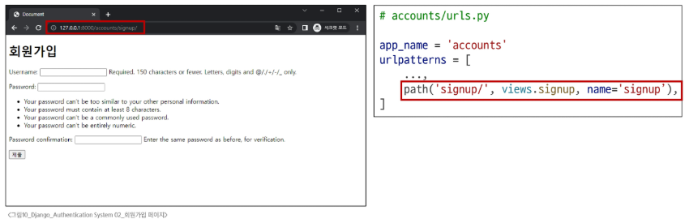
- .../accounts/signup/url로 요청이 들어왔을 때 실행할 signup 함수 작성
- 회원가입에 사용할 데이터를 입력받은 UserCreationForm built-in form 사용
#### 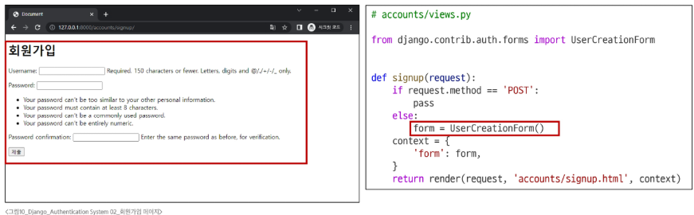
### UserCreationForm()
- 회원 가입시 사용자 입력 데이터를 받는 built-in **ModelForm**
- ModelForm이기 때문에, 유효성 검사를 통과한 데이터로 새로운 User 객체를 생성하고 데이터베이스에 저장하는 역할을 수행(이때 비밀번호는 자동으로 암호화 됨)
#### 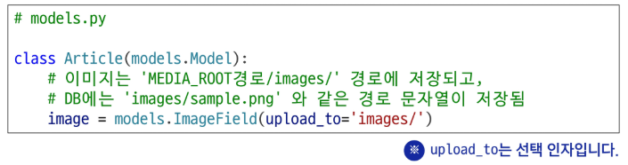
- 회원가입을 위해 작성한 정보를 서버에 안전하게 전송하기 위해 'POST 방식'을 사용
- CSRF 공격을 방지하기 위해 csrf_token 작성
- 서버로부터 전달받은 UserCreationForm을 화면에 출력
#### 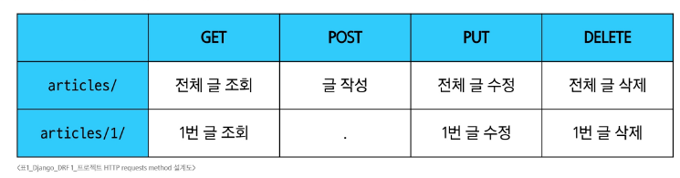
## 회원 가입 로직 에러
- 회원가입 시도 후 에러 페이지 확인
  - Manager isn't available; 'auth.User' has been swapped for 'accounts.User'
- 회원가입에 사용하는 UserCreationForm이 대체한 커스텀 유저 모델이 아닌 과거 Django의 기본 유저 모델로 인해 작성된 클래스이기 때문
  - model에 custom User Model을 연결해야 함
#### 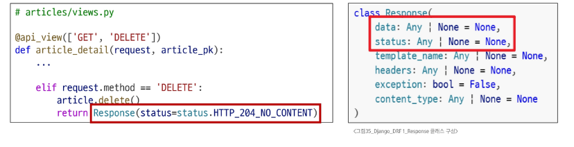
## 커스텀 유저 모델을 사용하기 위해서 Form을 다시 작성
- Custom User model을 사용할 수 있도록 상속 후 일부분만 재작성
#### 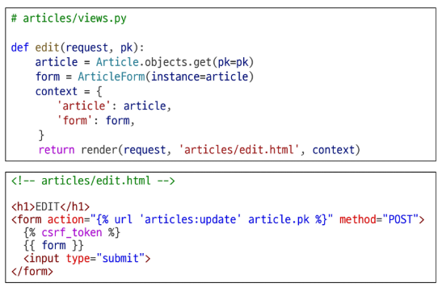
### get_user_model()
- 현재 프로젝트에서 활성화된 사용자 모델(active user model)을 반환하는 함수
- 프로젝트 설정(AUTH_USER_MODEL)에 따라 기본 User 모델일 수도, 우리가 직접 만든 커스텀 User 모델일 수도 있기 때문에 올바른 모델을 동적으로 가져오기 위해 사용
- 모델을 직접 가져오는 대신 get_user_model()을 쓰면, User 모델이 바뀌어도 코드를 수정할 필요가 없어 재사용성과 유연성이 높아짐
### User 모델을 직접 참조하지 않는 이유
- get_user_model()을 사용해 User 모델을 참조하면 커스텀 User 모델을 자동으로 반환해주기 때문
- Django는 필수적으로 User 클래스를 직접 참조하는 대신 get_user_model()을 사용해 참조해야 한다고 강조하고 있음
## 회원 가입 로직 완성
- 내장 폼이었던 UserCreationForm을 CustomUserCreationForm으로 변경
#### 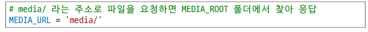
# 회원 탈퇴
- User 객체를 Delete하는 과정
- request.user.delete()를 활용해서 유저 객체 삭제를 진행
- 실제 서비스에서는 사용자를 물리적으로 삭제하는 대신, 게정을 비활성화 처리하는 경우가 더 많음
## 회원 탈퇴 로직 작성
- 회원 탈퇴 경로 url 생성
#### 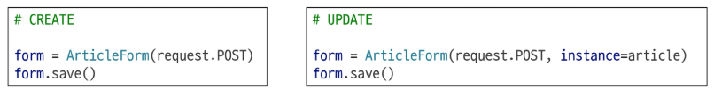
- .../accounts/delete/url로 요청이 들어왔을 때 실행할 delete 메서드 작성
- 현재 로그인한 사용자 정보를 활용해 삭제하고, 메인 페이지로 이동
#### 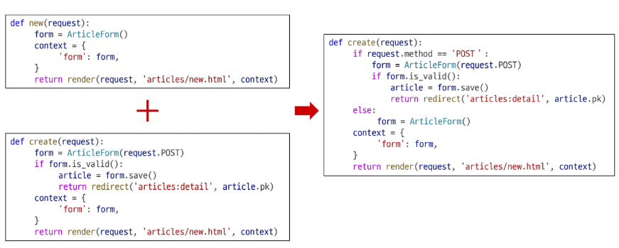
# 인증된 사용자에 대한 접근 제한
1. is_authenticated 속성
2. login_required 데코레이터
## 1. is_authenticated 속성
- 사용자가 인증 되었는지 여부를 알 수 있는 User model의 읽기 전용 속성
- 인증 사용자에 대해서는 항상 **True**, 비인증 사용자에 대해서는 항상 **False**
- 사용되는 경우
  - 사용자의 로그인 상태에 따라 다른 메뉴를 보여줄 때
  - view 함수 내에서 특정 기능을 로그인한 사용자에게만 허용하고 싶을 때
### is_authenticated 적용
- 로그인과 비로그인 상태에서 화면에 출력되는 링크를 다르게 설정하기
#### 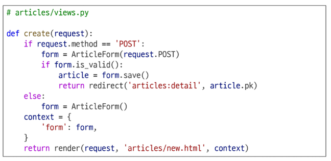
- 인증된 사용자라면 로그인/회원가입 로직을 수행할 수 없도록 하기
#### 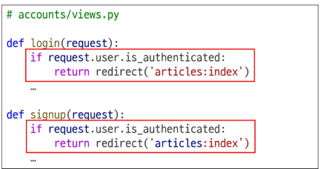
## 2. login_required 데코레이터
- 인증된 사용자에 대해서만 view 함수를 실행시키는 데코레이터
- 비인증 사용자의 경우 /accounts/login/ 주소로 redirect 시킴
- 사용되는 경우
  - 게시글 작성, 댓글 달기 등 누가 작성했는지 중요한 곳에서 사용
#### ※ 데코레이터: 기존 함수를 감싸, 특별한 기능(인증 등)을 추가하는 함수
### login_required 적용
- 인증된 사용자만 게시글을 작성/수정/삭제할 수 있도록 수정
#### 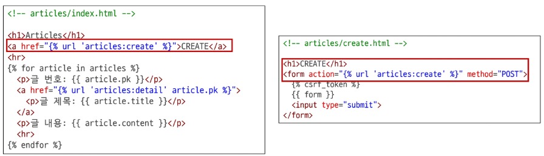
- 인증된 사용자만 로그아웃/탈퇴/수정/비밀번호 변경할 수 있도록 수정
#### 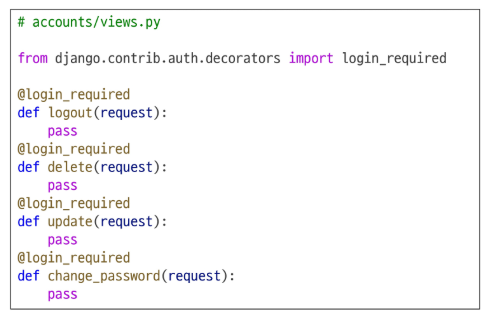
# 참고
## is_authenticated 코드
- 메서드가 아닌 속성 값임을 주의
## 회원가입 후 자동 로그인
- 회원가입 성공한 user 객체를 활용해 login 진행
#### 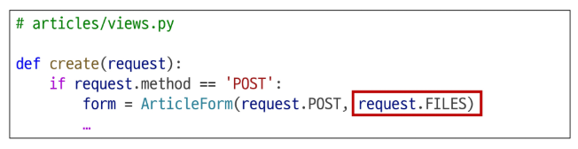
## 회원 탈퇴 개선
- 탈퇴와 함께 기존 사용자의 Session Data 삭제 방법
  - 사용자 객체 삭제 이후 로그아웃 함수를 호출해야 함
  - 단, '탈퇴 후 로그아웃'의 순서가 바뀌면 안됨
    - 먼저 로그아웃이 진행되면 해당 요청 객체 정보가 없어지면서, 탈퇴에 필요한 유저 정보 또한 없어지기 때문
#### 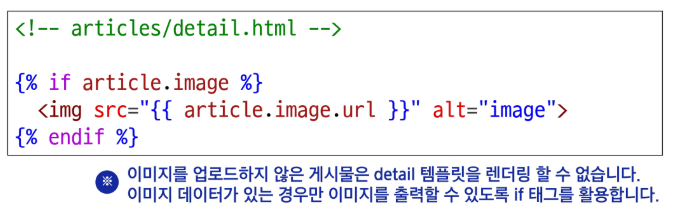
## Auth built-in form 코드
#### ※ 복습
- Form
  - 세션 데이터를 생성하지만 DB에 저장 안함
  - 인증된 사용자인지 검사하기 위함
  - 세션을 만드는 것은 결국 login 함수
- AuthenticationForm
  - 모델 폼
  - 데이터를 생성하고 DB에 넣음
