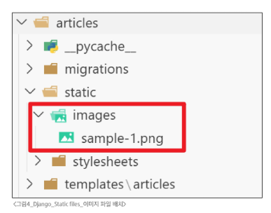
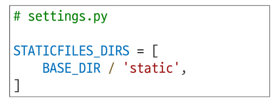
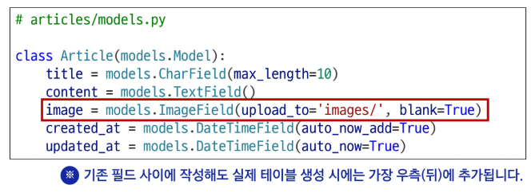
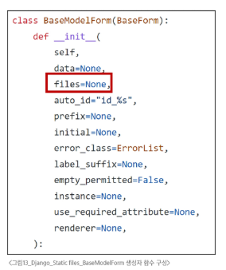

# Django - Static files
# Static files
- 서버 측에서 변경되지 않고 고정적으로 제공되는 파일
- 예: CSS 파일, JacaScript 파일, 이미지 파일, 폰트 파일 등
## 웹 서버와 정적 파일
### 웹 서버의 기본 역할
- 요청 받은 주소(URL)에 해당하는 자원을 찾아 응답해주는 것
### 정적 파일과 URL의 관계
- 웹 서버가 제공하는 가장 기본적인 자원이 바로 정적 파일
- 정적 파일 제공
  - 웹 서버는 요청받은 URL을 보고, 서버 컴퓨터의 특정 폴더에 저장된 CSS. JS, 이미지 같은 정적 파일을 찾아 제공
- URL의 필요성
  - 결국 정적 파일이 사용자에게 보이려면, 그 파일에 접근할 수 있는 고유한 주소(URL)가 반드시 필요하다는 의미
### 처리 과정 요약
1. 사용자: 브라우저에 http://example.com/images/logo.png라는 주소를 입력하며 이미지를 요청
2. 웹 서버: /images/logo.png라는 URL을 확인하고, 서버에 미리 약속된 폴더에서 logo.png 파일을 찾음
3. 웹 서버: 찾은 이미지 파일을 HTTP 응답에 담아 사용자에게 전송
4. 사용자: 브라우저가 응답 받은 이미지 파일을 화면에 보여줌
### Static files 경로의 종류
1. 기본 경로
2. 추가 경로
## Static files 기본 경로
- app 폴더/static/
### 기본 경로 CSS 스타일 제공하기
- articles/static/stylesheets/ 경로에 CSS 파일 배치하기
#### 
- 메인 페이지에서 CSS 파일 불러오기
- static files 경로는 DTL의 static tag를 사용해야 함
- built-in tag가 아니기 때문에 load tag를 사용해 import 후 사용 가능
#### 
### Static files 기본 경로
- 
  - 특정 라이브러리의 태그와 필터를 현재 템플릿에서 사용할 수 있도록 불러오는 역할
  - 은  태그를 사용하기 위해, Django 템플릿 시스템에 '이제부터 static 관련 태그를 사용하겠다.'고 알려주는 선언문
  - load 태그는 템플릿 파일의 가장 상단에 한 번만 작성하면 됨(extends 태그보다는 밑에 위치시킴)
- 
  - settings.py 파일의 STATIC_URL 값을 기준으로, 해당 정적 파일의 전체 URL 경로를 계산하여 생성
  - 예를 들어, STATIC_URL = 'static/'이고 CSS 파일이 static.css.style.css에 위치한다면, 경로가 필요한 위치에 로 작성
### STATIC_URL
- 정적 파일의 웹 주소
- 웹 페이지에서 정적 파일에 접근할 때 사용할 URL의 시작 부분(접두사)을 지정하는 설정
- 서버 컴퓨터에 저장된 실제(물리적) 파일 경로가 아니라, 오직 웹(브라우저)에서만 사용되는 주소
- 마치 서버의 정적 파일 폴더에 'static/'이라는 웹 주소 별명을 붙이는 것과 같음
- 기본값: 'static/'
### 기본 경로 이미지 파일 제공하기
- articles/static/images/ 경로에 파일 배치하기
#### 
- DTL의 static tag를 사용해 이미지 경로 작성하기
#### 
#### ※ URL + STATIC_URL + 정적 파일 경로
## Static files 추가 경로
- STATICFILES_DIRS에 문자열로 추가 경로를 설정
### STATICFILES_DIRS
- 기본 경로 외에 추가적으로 탐색할 경로의 목록을 지정하는 리스트
- 여러 앱에서 공통으로 사용되는 CSS 프레임워크(예: Bootstrap)나 JavaScript 라이브러리처럼 특정 앱에 속하지 않는 정적 파일들을 프로젝트 최상위 폴더(BASE_DIR) 같은 곳에 모아두고 관리할 때 매우 유용
### STATICFILES_DIRS 설정
- Django는 기본 경로인 각 앱의 static/ 폴더를 모두 확인한 후, 프로젝트의 최상위 폴더에 있는 static/ 폴더도 추가로 탐색하게 됨
#### 
### 추가 경로 이미지 파일 제공하기
- 설정한 추가 경로에 이미지 파일 배치하기
#### 
- DTL의 static tag를 사용해 이미지 경로 작성하기
#### 
### 정적 파일의 핵심 원리: 주소(URL)가 있어야 찾아갈 수 있음
- 컴퓨터에 파일이 존재하는 것만으로는 웹 페이지에 보일 수 없음
- 외부의 손님(브라우저)이 파일을 찾아올 수 있도록 반드시 '웹 주소(URL)'라는 문패를 달아줘야 함
#### 
# Media files
- 사용자가 웹 사이트를 통해 직접 업로드하는 파일
- Static Files가 사이트 개발자가 미리 준비해 둔 고정된 파일이라면, Media Files는 사이트 운영 중 사용자에 의해 생성되고 변경되는 동적인 파일
- 쇼핑몰의 기본 로고나 아이콘은 정적 파일이고, 사용자가 상품 후기를 작성하며 올리는 상품 사진은 미디어 파일
## 이미지 업로드
### ImageField()
- 이미지 파일을 업로드하기 위해 사용하는 Django 모델 필드
- 데이터베이스 저장 방식
  - 가장 중요한 특징은 이미지 파일 자체가 데이터베이스에 저장되는 것이 아니라는 점
  - 데이터베이스에는 upload_to 경로를 기준으로 한 이미지 파일의 경로(문자열)만 저장되고, 실제 파일은 서버의 특정 폴더(MEDIA_ROOT)에 저장
#### 
### 미디어 파일을 제공하기 전 준비사항
1. settings.py에 MEDIA_ROOT, MEDIA_URL 설정
2. 작성한 MEDIA_ROOT와 MEDIA_URL에 대한 URL 지정
### MEDIA_ROOT
- 미디어 파일의 실제 창고 주소
- 사용자가 업로드한 미디어 파일들이 서버 컴퓨터 어디에 저장될 지를 지정하는 절대 경로
- 서버 내부에서만 사용하는 물리적인 폴더 주소로, Django는 파일을 저장하거나 읽어올 때 이 경로를 사용
#### 
### MEDIA_URL
- 미디어 파일의 웹 주소 별명
- MEDIA_ROOT에 저장된 파일들을 웹 페이지에서 접근할 때 사용할 URL의 시작 부분 지정
- STATIC_URL과 동일한 역할로, 실제 저장 위치를 숨기고 웹에서 사용할 공개 주소 별명을 만들어주는 것
#### 
### MEDIA_ROOT와 MEDIA_URL 설정
- MEDIA_ROOT는 파일을 저장하고 관리하기 위한 서버의 실제 경로
- MEDIA_URL은 그 파일을 웹에서 보여주기 위한 가상의 주소
#### 
- settings.MEDIA_URL: media/로 시작하는 URL 요청이 오면
- document_root=settings.MEDIA_ROOT: MEDIA_ROOT에 지정된 실제 폴더에서 파일을 찾아라
#### 
#### ※ TIPS
- Django의 개발 서버는 기본적으로 파이썬 코드를 실행하여 동적인 웹페이지를 보여주는 애플리케이션 서버
- 사용자가 올린 이미지 파일 같은 정적 파일을 어떻게 찾아 보여줘야 하는지 스스로 알지 못함
- 따라서 개발자가 직접 URL 경로를 만들어 '이 주소로 요청이 오면, 이 폴더에서 파일을 찾아 보여줘'라는 규칙을 추가해야 함
- 결론적으로, 이 코드는. Django 개발 서버가 미디어 파일을 처리할 수 있도록 임시 웹 주소와 실제 파일 위치를 연결해주는 역할을 함
### 이미지 업로드 구현
- Article 모델 클래스에 image 필드 작성
- blank=True 속성을 작성해 빈 문자열이 저장될 수 있도록 제약 조건 설정
  - 게시글 작성 시 이미지 첨부 없이도 작성할 수 있도록 하기 위함
#### 
- migration 진행 과정 중 에러 발생
#### 
#### ※ Pillow: 파이썬에서 이미지를 열고, 크기 조절이나 필터 적용같은 다양한 편집 작업을 수행한 후 저장할 수 있게 해주는 필수 이미지 처리 라이브러리
- Pillow 설치 후 migrations 재진행
#### 
- form 요소의 enctype 속성 추가
#### 
#### ※ entype 속성: form 데이터가 서버로 제출될 때, 해당 데이터가 어떤 형식으로 인코딩 될지 지정하는 속성
- ModelForm의 2번째 인자로 요청받은 파일 데이터 작성
#### 
#### ※ ModelForm의 두번째 인자로 파일을 작성한 이유: ModelForm의 상위 클래스인 BaseModelForm의 생성자 함수의 2번째 위치 인자로 파일을 받도록 설정되어 있음
- 게시글 작성 페이지에서 새로 추가된 input 태그 확인
- 이미지 업로드 후 이미지 파일 위치 확인
  - MEDIA_ROOT 경로에 업로드 됨
- 이미지 업로드 후 DB 확인
  - 이미지 파일 자체가 데이터베이스에 저장되는 것이 아닌 upload_to 경로를 기준으로 한 이미지 파일의 경로(문자열)만 저장
  - DB 용량을 가볍게 유지하고 성능을 높이는데 매우 효율적
## 업로드 이미지 제공
### 게시글 상세 페이지에 업로드 한 이미지 제공하기
- ImageField의 .url 속성
  - 업로드 파일의 웹 주소
  - ImageField나 FileField에 저장된 파일 객체에서 .url 속성을 사용하면, 해당 파일을 웹에서 접근할 수 있는 전체 URL 주소를 얻을 수 있음
#### 
- 업로드 이미지 출력 확인 및 URL 확인
  - http://127.0.0.1:8000/media/images/python.png
## 업로드 이미지 수정
- 수정 체이지 form 요소에 enctype 속성 추가
#### 
- update view 함수에서 업로드 파일에 대한 추가 코드 작성
#### 
# 참고
## upload_to 활용
- 단순한 문자열 경로 외에도, 업로드 경로를 동적으로 생성하는 두 가지 유용한 방법을 제공
1. 날짜를 이용한 경로 구성
   - strftime()의 형식 코드를 사용하여 파일이 업로드된 날짜를 기준으로 폴더를 자동드오 생성할 수 있음
     - %Y: 4자리 연도 
     - %m: 2자리 월
     - %d:: 2자리 일
#### 
2. 함수를 이용한 동적 경로 생성
   - 더 복잡한 로직으로 경로를 만들고 싶을 때는, upload_to에 함수를 직접 전달할 수 있음
   - 이 함수는 두 가지 인자를 받음
     - instance: 파일이 첨부된 모델의 인스턴스(해당 게시글 객체 등)
     - filename: 업로드 된 파일의 원본 이름
#### 
## AWS 인프라 이해하기
- AWS(Amazon Web Services)
  - 아마존이 제공하는 클라우드 컴퓨팅 플랫폼
  - 서버, 스토리지, 데이터베이스와 같은 IT 인프라를 직접 구매하지 않고, 인터넷을 통해 필요한 만큼 빌려쓰는 서비스
- AWS 핵심 서비스 3가지
#### 
### EC2, S3, RDS를 활용한 웹 서비스 구축
- EC2(서버): 웹 애플리케이션(Django)이 실행되는 컴퓨터의 역할
- S3(파일 저장소): 사용자가 올린 이미지나 사이트
- RDS(데이터베이스): 회원정보, 게시글 등 주요한 데이터를 기록하고 관리하는 장부 역할
### 클라우드 컴퓨팅 플랫폼을 사용하는 이유
- 비용절감
  - 물리 장비를 직접 구매할 필요 없이, 사용한 만큼만 비용을 지불
- 유연성과 확장성
  - 필요에 따라 서버 사양이나 저장 공간 용량을 몇 번의 클릭만으로 자유롭게 조절할 수 있음
- 글로벌 서비스
  - 전 세계에 위치한 데이터 센터를 통해 어떤 국가의 사용자에게도 빠르고 안정적인 서비스를 제공할 수 있음
## BaseModelForm
- ModelForm의 상위 클래스 BaseModelForm의 생성자 함수 키워드 인자 순서 참고
#### 