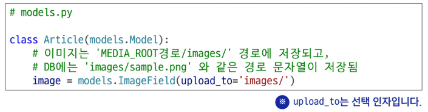
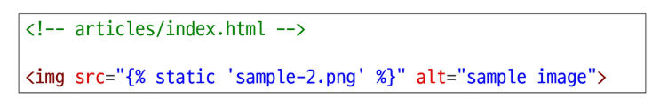
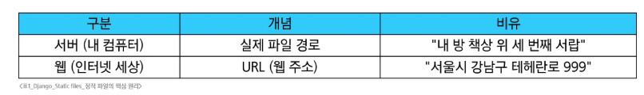

# Django - DRF 1
# REST API
## API(Application Programming Interface)
- 두 소프트웨어가 서로 통신할 수 있게 하는 메커니즘
- 클라이언트-서버처럼 서로 다른 프로그램에서 요청과 응답을 받을 수 있도록 만든 체계
- 하나의 프로그램이 다른 프로그램에게 정보를 보내거나 요청할 때, 서로 이해할 수 있는 공통된 규칙과 형식
### API 예시 - 날씨 데이터 받기
- 기상 데이터가 들어있는 기상청의 서버
- 스마트폰의 날씨 앱, 웹 사이트의 날씨 정보 등 다양한 서비스들이 이 기상청 서버에 데이터를 요청보내고 응답 받음
- 날씨 데이터를 얻으려면?
  - 기상청 서버에는 나맀 정보를 얻고 싶으면 이런식으로 요청해야한다는 지정된 형식들이 작성되어 있음(API 매뉴얼)
  - 지역, 날짜, 조회할 내용들(온도, 바람 등)을 제공하는 매뉴얼
- SW와 SW간 지정된 정의(형식)으로 소통하는 수단 -> API
  - 이렇게 요청을 보내면, 이렇게 정보를 제공해 줄 것이다라는 매뉴얼
- 스마트폰의 날씨 앱은 기상청에서 제공하는 API를 통해 기상청 시스템과 대화하여 최근 날씨 정보를 표시할 수 있음
### API 역할
- 예를 들어, 우리집 냉장고에 전기를 공급해야한다고 가정
- 우리는 그냥 냉장고의 플러그를 소켓에 꽂으면 제품이 작동
- 중요한 것은 우리가 가전 제품에 전기를 공급하기 위해 직접 배선을 하지 않는다는 것
- 이는 매우 위험하면서도 비효율적인 일이기 때문
- 복잡한 코드를 추상화하여 대신 사용할 수 있는 몇가지 더 쉬운 구문을 제공
### Web API
- 웹 서버 또는 웹 브라우저를 위한 API
- 현대 웹 개발은 하나부터 열까지 직접 개발하기보다 여러 Open API들을 홀용
- 대표적인 Third Party Open API 서비스 목록
  - Youtude API
  - Google Map API
  - Naver Papago API
  - Kakao Map API
#### ※ Open API: 누구나 접근할 수 있도록 공개된, 외부 소프트웨어와 통신하기 위한 인터페이스
#### ※ Third Party: 직접 개발하지 않은 외부의 서비스나 소프트웨어를 제공하거나 활용하는 주체
## REST API(Representational State Transfer)
- API Server를 개발하기 위한 일종의 소프트웨어 설계 방법론
- API마다 제각각인 구조를 정리하고, 누구나 예측 가능한 방식으로 통신할 수 있도록 설계 기준을 제안한 것
- REST API는 시스템 간 표준화된 통신 구조를 제공함으로써, 서로 다른 기술 스택 간에도 연동 가능
### RESTful API
- 자원을 정의하고 자원에 대한 주소를 지정하는 전반적인 방법을 서술
- REST 원리를 따르는 시스템을 RESTful하다고 함
- 각각 API 서버 구조를 작성하는 모습이 너무 다르니 어느정도 약속을 만들어 통일해서 사용하자
### REST에서 자원을 정의하고 주소를 지정하는 방법
- 자원의 식별
  - URI
- 자원의 행위
  - HTTP Methods
- 자원의 표현
  - JSON 데이터(궁극적으로 표현되는 데이터 결과물)
#### ※ URL만 보고도 무슨 데이터를, 어떤 방식으로 처리할 지 예측할 수 있어야 하며, 개발시에는 항상 **자원 중심 + 동작 명확화 + 일관된 응답 포맷**을 기준으로 설계해야 함
## 자원의 식별
### URI 정의
- URI(Uniform Resource Identifier, 통합 자원 식별자)
- 인터넷에서 리소스를 식별하는 문자열
- 가장 일반적인 URI는 웹 주소로 알려진 URL
### URL 정의
- URL(Uniform Resource Locator, 통합 자원 위치)
- 웹에서 주어진 리소스의 주소
- 네트워크 상에 리소스가 어디있는지를 알려주기 위한 약속
#### 
### Schema(Protocol)
- 브라우저가 리소스를 요청하는 데 사용해야 하는 규약
- URL의 첫 부분은 브라우저가 어떤 규약을 사용하는지를 나타냄
- 기본적으로 웹은 http(s)를 요구
  - 메일을 열기 위한 mailto:, 파일을 전송하기 위한 ftp: 등 다른 프로토콜도 존재
### Domain Name
- 요청중인 웹 서버를 나타냄
- 어떤 웹 서버가 요구되는 지를 가리키며 직접 IP 주소를 사용하는 것도 가능하지만, 사람이 외우기 어렵기 때문에 주로 Domain Name으로 사용
- 예) 도메인 google.com의 IP 주소는 142.251.42.142
### Port
- 웹 서버의 리소스에 접근하는데 사용되는 기술적인 문(Gate)
- HTTP 프로토콜의 표준 포트
  - HTTP - 80
  - HTTPS - 443
- 표준 포트만 작성 시 생략 가능
### Path
- 웹 서버의 리소스 경로
- 초기에는 실제 파일이 위치한 물리적 위치를 나타냈지만, 오늘날은 실제 위치가 아닌 추상화된 형태의 구조를 표현
- 예) /articles/create/라는 주소가 실제 articles 폴더 안에 create 폴더 안을 나타내는 것은 아님
### Parameters
- 웹 서버에 제공하는 추가적인 데이터
- '&' 기호로 구분되는 key-value 쌍 목록
- 서버는 리소스를 응답하기 전에 이러한 파라미터를 사용하여 추가 작업을 수행할 수 있음
### Anchor
- 일종의 북마크를 나타내며 브라우저에 해당 지점에 있는 콘텐츠를 표시
- '#'(fragment identifier, 부분 식별자) 이후 부분은 서버에 전송되지 않음
- https://docs.djangoproject.com/en/4.2/intro/install/#quick-install-guide 요청에서 #quick-install-guide는 서버에 전달되지 않고 브라우저에게 해당 지점으로 이동할 수 있도록 함
## 자원의 행위
### methods 정의
- HTTP Request Methods
  - 리소스에 대한 행위, 수행하고자 하는 동작을 정의
### HTTP Request Methods 종류
- GET
  - 서버에 리소스의 표현을 요청
  - GET을 사용하는 요청은 데이터만 검색해야 함
- POST
  - 데이터를 지정된 리소스에 제출
  - 서버의 상태를 변경
- PUT
  - 요청한 주소의 리소스를 수정
- DELETE
  - 지정된 리소스를 삭제
### HTTP response status codes
- 특정 HTTP 요청이 성공적으로 완료되었는지 여부를 나타냄
- 클라이언트가 서버에 요청을 보내면, 서버는 요청이 성공했는지 실패했는지를 숫자로 알려줌
- 클라이언트는 이 코드를 보고 어떤 일이 일어났는지 판단 가능
---
- Informational responses(100-199)
  - 요청을 계속 진행 중이라는 중간 응답
- Succerssful responses(200-299)
  - 요청이 정상적으로 처리되었음을 의미
- Redirention messages(300-399)
  - 요청한 리소스가 다른 위치로 옮겨졌을 때 사용
- Client error responses(400-499)
  - 클라이언트 요청에 문제가 있을 때 반환
- Server error responses(500-599)
  - 서버 내부의 문제로 요청을 처리하지 못했을 때 사용
## 자원의 표현
### 그동안 서버가 응담(자원을 표현)했던 것
- 지금까지 Django 서버는 사용자에게 페이지(html)만 응답하고 있었음
- 하지만 서버가 응답할 수 있는 것은 페이지 뿐만 아니라 다양한 데이터 타입을 응답할 수 있음
- REST API는 이 중에서도 JSON 타입으로 응답하는 것을 권장
#### ※ JSON은 데이터만을 전달하기 위한 최소한의 형싱, 어떤 클라이언트와도 언어와 플랫폼에 독립적으로 통신할 수 있게 해줌
### 응답 데이터 타입의 변화
- 페이지(html)만을 응답하는 서버
- 사용자가 웹 브라우저를 통해 요청하면, 서버는 템플릿을 렌더링한 HTML을 반환
#### 
- 이제는 JSON 데이터를 응답하는 REST API 서버로의 변환
- 서버는 HTML 페이지를 만들지 않고, JSON 데이터만 응답하는 방식으로 동작할 수 있음
- HTML 대신 JSON만 전달하므로, 응답 용량이 줄고 처리 속도가 빨라짐
#### 
- Django는 더 이상 Template 부분에 대한 역할을 담당하지 않게 되며, Front-end와 Back-end가 분리되어 구성됨
- 전통적 Django 앱 구조 -> 현대적 분리 구조로의 전환 의미
#### 
- 이제부터 Django를 사용해 RESTful API 서버를 구축할 ㅅ것
#### 
## JSON 데이터 응답 
### 사전 준비
- 사전 제공된 99-json-response-practice 기반 시작
- 가상 환경 생성, 활성화 및 패키지 설치
```cmd
$ python -m venv venv
$ source venv/Scripts/activate
$ pip install -r requirements.txt
```
- migrate 진행(필요 모델이 모두 반영되었는지 반드시 확인)
```cmd
$ python manage.py makemigrations
$ python manage.py migrate
```
- 준비된 fixtures 파일을 load하여 실습용 초기 데이터 입력
  - fixture 관련 작업 진행 시, 데이터가 모두 올바르게 처리되었는지 반드시 확인
```cmd
$ python manage.py loaddata articles.json
Installed 20 object(s) from 1 fixture(s)
```
- 서버 실행
- 터미널 분할(별도의 파이썬 코드를 실행하기 위함)
```cmd
$ python manage.py runserver
```
- http://127.0.0.1:8000/api/v1/articles/ 요청 후 응답 확인
### python으로 json 데이터 처리하기
- 준비된 python-request-sample.py 확인
```python
import requests
from pprint import pprint


response = requests.get('http://127.0.0.1:8000/api/v1/articles/')

# json을 python 타입으로 변환
result = response.json()

print(type(result))
# pprint(result)
# pprint(result[0])
# pprint(result[0].get('title'))
```
### 코드 실행 방법
- 서버가 실행되어 있는 상태에서 2번째 터미널 코드 실행
```cmd
$ python python-request-sample.py
```
# DRF with Single Model
## Django REST Framework
- Django에서 Restful API 서버를 쉽게 구축할 수 있도록 도와주는 오픈소스 라이브러리
- 복잡한 API 서버 개발 과정을 표준화하고, 자동화하여, 초보자도 빠르고 안정적으로 Restful 구조를 구현할 수 있도록 도와주는 개발 도구 세트
### 프로젝트 준비
- 사전 제공된 drf 프로젝트 기반 시작
- 가상환경 생성, 활성화 및 패키지 설치
- migrate 진행
```cmd
$ python manage.py makemigrations
$ python manage.py migrate
```
- 준비된 fixtures 파일을 load하여 ㅣㄹ습용 초기 데이터 입력
```cmd
$ python manage.py loaddata articles.json
Installed 20 object(s) from 1 fixture(s)
```
### Postman 설치 및 안내
- Postman 설치
- Workspaces - My workspace
- Postman 화면 구성
#### 
## Serializer
- Serialization: 직렬화
- 여러 시스템에서 활용하기 위해 데이터 구조나 객체 상태를 재구성할 수 있는 포맷으로 변환하는 과정
### Serialization 예시
- 데이터 구조나 객체 상태를 나중에 재구성할 수 있는 포맷으로 변환하는 과정
- 변화된 데이터는 다른 프로그램, 다른 언어, 다른 컴퓨터에서도 다시 원래의 구조로 복원할 수 있음
- 즉, 직렬화는 데이터를 어디서든 읽고 사용할 수 있게 만드는 공통 언어로의 번역
- 수업에서는 JSON으로의 변환에만 집중
#### 
- serializers.py 파일을 생성하여 작성
#### 
- Serializer: Serialization을 진행하여 Serialized data를 반환해 주는 클래스
  - 단순히 포맷 변환 도구가 아닌, 값 검증, 데이터 구조 정의, 모델 연동까지 담당하는 핵심 계층
  - 폼을 사용하는 Django 웹 개발과 동일하게, API 기반 개발에서는 Serializer가 데이터 입출력의 중심
- ModelSerializer: Django 모델과 연결된 Serializer 클래스
  - 일반 Serializer와 달리 사용자 입력 데이터를 받아 자동으로 모델 필드에 맞추어 Serialization을 진행
### ModelSerializer class  사용 예시
- Article 모델을 토대로 직렬화를 수행하는 ModelSerializer 정의
- 게시글 데이터 목록 제공
```python
# articles/serializers.py

from rest_framework import serializers
from .models import Article

class ArticleSerializer(serializers.MoodelSerializer):
    class Meta:
        medel = Article
        fields = '__all__'
```
#### ※ serializers.py의 위치나 파일명은 자유롭게 작성 가능
# CRUD with ModelSerializer
## URL과 HTTP requests methods 설계
#### 
#### ※ 주의사항
- URL에 동작명(get, create)을 넣지 말고, 자원중심으로 설계
- 복수형/단수형 혼용은 혼란을 주니 일관되게 사용
- 깊은 중첩구조는 피하고, 필요한 경우 관계를 명확히 표현
- 기능이 아닌 자원의 위치만 URL로 표현하고, 동작은 HTTP 메서드로 구분
## GET method - 조회
### GET - List
- 게시글 데이터 목록 조회하기
- 게시글 데이터 목록을 제공하는 ArticleListSerializer 정의
```python
articles/serailizers.py

from rest_framework import serializers
from .models import Article

class ArticleListSerializer(serializers.MoodelSerializer):
    class Meta:
        medel = Article
        fields = ('id', 'title', 'content', )
```
- url 및 view 함수 작성
```python
# articles/views.py

from rest_framework.response import Response
from rest_framework.decorators import api_view

from .models import Article
from .serializers import ArticleListSerializer

# DRF의 모든 뷰 함수는 api_view 데코레이터가 필수
@api_view(['GET'])
def article_list(request):
    # 전체 게시글 데이터 조회
    article = Article.objects.all()
    # Serialization 진행
    serializer = ArticleListSerializer(articles, many=True)
    # serializer 덩어리에서 json만 추출(.data 속성)한 것을 응답
    return Response(serializer.data)
```
#### ※ @api_view: 함수형 뷰에서 사용할 HTTP 메서드를 명시해주는 DRF 전용 데코레이터
```python
# articles/urls.py

urlpatterns = [
    path('articles/', views.article_list),
]
```
- (GET) http://127.0.0.1:8000/api/v1/articles/ 응답 확인
### ModelSerializer의 인자 및 속성
- many 옵션
  - serialize 대상이 QuerySet인 경우 입력
  - ```serializer = ArticleListSerializer(articles, many=True)```
  - many 옵션을 지정하지 않으면 단일 객체로 처리됨
- data 속성
  - serialized data 객체에서 실제 데이터를 추출
  - ```return Response(serializer.data)
### 과거 view 함수와의 응답 데이터 비교
- 똑같은 데이터를 (과거) HTML에 출력되도록 페이지와 함께 응담했던 view 함수
```python
def index(request):
    articles = Article.objects.all()

    context = {
        'articles': articles,
    }
    return render(request, 'articles/index.html', context)
```
- 똑같은 데이터를 (현재) JSON 데이터로 serialization하여 페이지 없이 응답하는 view 함수
```python
@api_view(['GET'])
def article_list(request):
    articles = Article.objects.all()
    serializer = ArticleListSerializer(articles, many=True)
    return Response(serializer.data)
```
### api_view dacorator
- DRF view 함수에서는 필수로 작성되며 view 함수를 실행하기 전 HTTP 메서드를 확인
- 허용하도록 지시한 메서드에 대해서만 올바르게 답변하며,목록에 추가하지 않은 다른 메서드 요청에 대해서는 405 Method Not Allowed로 응답
- DRF view 함수가 응답해야 하는 HTTP 메서드 목록을 작성
- @api_view 데코레이터를 빠뜨리면, 함수가 단순한 Django 뷰로 인식되어 API 요청이 제대로 처리되지 않음
### GET - Detail
- 단일 게시글 데이터 조회하기
  - 각 게시글의 상세 정보를 제공하는 ArticleSerializer 정의
```python
# article/serializers.py

from rest_framework import serializers
from .models import Article

class ArticleSerializer(serializers.ModelSerializer):
    class Meta:
        model = Article
        fields = '__all__'
```
- url 및 view 함수 작성
```python
# articles/urls.py

urlpatterns = [
    ...
    path('articles/<int:article_pk>/', views.article_detail),
]
```
```python
# articles/views.py

from .serializers import ArticleListSerializer, ArticleSerializer

@api_view(['GET'])
def article_detail(request, article_pk):
    article = Article.objects.get(pk=article_pk)
      serializer = ArticleSerializer(article)
      return Response(serializer.data)
```
- (GET) http://127.0.0.1:8000/api/v1/articles/1/ 응답 확인
## POST method - 생성
### POST
- 게시글 데이터 생성하기
  1. 데이터 생성이 성공했을 경우 201 Created 응답
  2. 데이터 생성이 실패했을 경우 400 Bad request 응답
- POST 요청에서 에러가 발생할 경우, Serializer의 is_valid()를 먼저 확인하면 어떤 필드가 누락되었는지, 형식이 잘못괴었는지 정확한 힌트를 얻을 수 있음(400 오류는 대부분 입력 데이터 문제)
- article_list view 함수 구조 변경(method에 따른 분기 처리)
```python
# articles/views.py

from rest_framework import status

# DRF의 모든 뷰 함수는 api_view 데코레이터가 필수
@api_view(['GET', 'POST'])
def article_list(request):
    if request.method == 'GET':
        # 전체 게시글 데이터 조회
        articles = Article.objects.all()
        # Serialization 진행
        serializer = ArticleListSerializer(articles, many=True)
        return Response(serializer.data)
    elif request.method == 'POST':
        # 1. 사용자가 보낸 입력데이터를 직렬화
        serializer = ArticleSerializer(data=request.data)
        # 2. 직렬화된 데이터를 유효성 검사
        if serializer.is_valid():
            # 3. 저장
            serializer.save()
            # 4. 저장이 성공했다는 응답
            return Response(serializer.data, status=status.HTTP_201_CREATED)
        # 5. 저장이 실패했다는 응답
        return Response(serializer.errors, status=status.HTTP_400_BAD_REQUEST)
```
- (POST) http://127.0.0.1:8000/api/v1/articles/ 응답 확인
  - Body -> form-data -> Key-Value: title - 제목1, content - 내용1
- 새로 생성된 게시글 데이터 확인
  - (GET) http://127.0.0.1:8000/api/v1/articles/21
## DELETE method - 삭제
### DELETE
- 게시글 데이터 삭제하기
  - 요청에 대한 데이터 삭제가 성공했을 경우는 204 No Content 응답
```python
# articles/views.py

@api_view(['GET', 'DELETE'])
def article_detail(request, article_pk):
    article = Article.objects.get(pk=article_pk)
    if request.method == 'GET':
        serializer = ArticleSerializer(article)
        return Response(serializer.data)
    elif request.method == 'DELETE':
        article.delete()
        return Response(status=status.HTTP_204_NO_CONTENT)
```
- (DELETE) http://127.0.0.1:8000/api/v1/articles/21/
### DELETE 응답 시 Response 구성 방식
- Response()는 기본적으로 data 인자를 필요로 하지 않음
- 아무런 데이터도 넘기지 않을 경우엔 응답 상태 코드만으로 결과를 전달
  - 첫번째 인자를 비운 상태로 두번째 인자에 값을 전달할 수 없으므로, 키워드 인자형태로 값 전달
#### 
### DELETE 응답 시 데이터를 반환하는 방법
- 일반적으로 DELETE 요청은 204 No Content로 본문없이 응답하는 것이 RESTful한 설계 방식
- 하지만 특정 상황에서는 삭제된 객체의 정보를 함께 반환해야 할 수도 있음
  - 클라이언트에서 삭제 대상 데이터를 확인하거나, UI에서 알림 메시지로 활용할 경우
  - 삭제된 데이터가 실제로 무엇이었는지 사용자에게 피드백을 주기 위해
#### ※ DELETE에서도 응답이 필요한 경우엔 204 대신 200 OK 상태 코드와 함께 데이터를 반환함, 단 REST 원칙상 기본은 응답없음(204)이므로, 목적이 명확할 때만 사용
### DELETE 처리 후, 추가 응답 데이터 반환
- 게시글 데이터를 삭제하고, 삭제된 게시글 정보 반환하기
  - 추가적인 데이터를 제공하므로 200 OK 응답
1. 반환할 데이터를 정의
   - delete() 실행시, 해당 객체는 데이터베이스에서 삭제됨
   - 그러므로 필요한 값은 삭제 전에 미리 변수로 저장해두고, 삭제 이후에는 변수만 사용하는 것이 더 안정적
2. Response의 첫번째 인자로 전달
```python
# articles/views.py

@api_view(['GET', 'DELETE'])
def article_detail(request, article_pk):
    article = Article.objects.get(pk=article_pk)
    if request.method == 'GET':
        serializer = ArticleSerializer(article)
        return Response(serializer.data)
    elif request.method == 'DELETE':
        pk = article.pk
        title = article.title
        article.delete()
        data = {
            'massage': f'{pk}번 게시글 "{title}"이 삭제되었습니다.'
        }
        return Response(data, status=status.HTTP_200_OK)
```
- (DELETE) http://127.0.0.1:8000/api/v1/articles/22/ 응답 확인
## PUT method - 수정
### PUT
- 게시글 데이터 수정하기
  - 요청에 대한 데이터 수정이 성공했을 경우는 200 OK 응답
```python
# articles/views.py
@api_view(['GET', 'DELETE', 'PUT'])
def article_detail(request, article_pk):
    ...
    elif request.method == 'PUT':
        # 1. 사용자가 보낸 새로운 입력데이터를 직렬화 진행(+ 기존 데이터)
        # 과거 코드
        # form = ArticleForm(request.POST, instance=article)
        serializer = ArticleSerializer(article, data=request.data)
        # serializer = ArticleSerializer(instance=article, data=request.data)
        # 2. 직렬화 결과를 유효성 검사
        if serializer.is_valid():
            serializer.save()
            # 수정이 성공했다는 응답
            return Response(serializer.data)
        # 수정이 실패했다는 응답
        return Response(serializer.errors, status=status.HTTP_400_BAD_REQUEST)
```
- (PUT) http://127.0.0.1:8000/api/v1/articles/1/ 응답 확인
  - Body -> form-data -> Key-Value: title - 제목수정, content - 내용수정
- 수정된 게시글 데이터 확인
  - (GET) http://127.0.0.1:8000/api/v1/articles/1/
### partial argument
- 부분 업데이트를 허용하기 위한 인자
- partial 인자의 기본 값은 False
- partial 인자를 False로 설정하면, 게시글의 title만 수정하려고 하더라도 content와 같은 다른 필수 필드들도 함께 전송해야 함
- 이는 serializer가 기본적으로 모든 필수 필드에 대한 값이 전달되었는지 확인하기 떄문
- 따라서 일부 필드만 수정하고 싶다면, partial=True로 설정하여 일부 필드만 전달되도록 허용해야 함
### PATCH 메서드 - 일부 필드만 수정 하기
- PATCH는 리소스의 전체가 아닌, 일부만 수정할 때 사용하는 HTTP 메서드
- Django REST framework에서는 partial=True 설정을 통해 부분 수정을 구현
  - 게시글의 title만 바꾸고 싶을 때, 전체 필드를 다 보낼 필요없이 해당 필드만 전송하면 됨
```python
# articles/views.py

@api_view(['GET', 'DELETE', 'PATCH'])
def article_detail(request, article_pk):
    ...
    elif request.method == 'PATCH':
        # serializer = ArticleSerializer(article, data=request.data)
        serializer = ArticleSerializer(article, data=request.data, partial=True)
        if serializer.is_valid():
            serializer.save()
            return Response(serializer.data)
        return Response(serializer.errors, status=status.HTTP_400_BAD_REQUEST)
```
### PUT vs PATCH
#### 
#### ※ 일부 필드만 수정할 땐 반드시 PATCH를 사용해야 RESTfull한 설계, PUT 요청에서 partial=True를 사용하는 것은 편의상 허용되기도 하지만, REST 원칙에는 어긋남
# 참고
## raise_exception
- is_valid()의 선택 인자
- 유효성 검사를 통과하지 못할 경우 ValidationError 예외를 발생시킴
- DRF에서 제공하는 기본 예외 처리기에 의해 자동으로 처리되며 기본적으로 HTTP 400 응답을 반환
```python
# articles/views.py

@api_view(['GET', 'POST'])
def article_list(request):
    ...
    elif request.method == 'POST':
        serializer = ArticleSerializer(data=request.data)
        if serializer.is_valid(raise_exception=True):
            serializer.save()
            return Response(serializer.data, status=status.HTTP_201_CREATED)
        # 생략 가능해짐
        # return Response(serializer.errors, status=status.HTTP_400_BAD_REQUEST)
```
#### ※