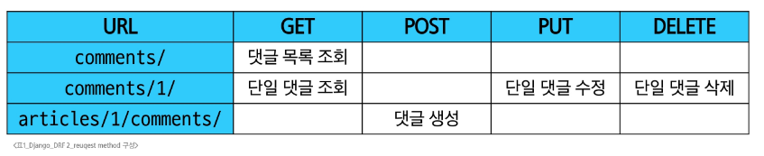

# Django - DRF 2
# DRF with N:1 Relation
## 사전 준비
### 사전 준비
- Comment 모델 클래스 정의
```python
# articles/models.py

from django.db import models

class Comment(models.Model):
    article = models.ForeignKey(Article, on_delete=models.CASCADE)
    content = models.CharField(max_length=200)
    created_at = models.DateTimeField(auto_now_add=True)
    updated_at = models.DateTimeField(auto_now=True)
```
- Articles app에 정의된 모델 정보 makemigration
- 데이터베이스 초기화
- fixtures 데이터 삽입
```cmd
$ python manage.py makemigrations

$ python manage.py migrate

$ python manage.py loaddata articles.json comments.json
Installed 40 object(s) from 2 fixture(s)
```
### URL 및 HTTP request method 구성
#### 
## GET method
### GET - List
- 댓글 목록 조회를 위한 CommentSerializer 정의
```python
# articles/serializers.py

class CommentSerializer(serializers.ModelSerializer):
    class Meta:
        model = Comment
        fields = '__all__'
```
- url 작성
```python
# articles/urls.pu

urlpatterns = [
    ...
    path('comments/', views.comment_list),
]
```
- view 함수 작성
```python
# articles/views.py

from .models import Article, Comment
from .serializers import ArticleListSerializer, ArticleSerializer, CommentSerializer

@api_view(['GET'])
def comment_list(request):
    comments = Comment.objects.all()
    serializer = CommentSerializer(comments, many=True)
    return Response(serializer.data)
```
- (GET) http://127.0.0.1:8000/api/v1/comments/ 응답 확인
### GET - Detail
- 단일 댓글 조회를 위한 url 및 view 함수 작성
```python
# articles/urls.py

urlpatterns = [
    ...
    path('comments/<int:comment_pk>/', views.comment_detail),
]

# aritlcles/views.py

@api_view(['GET'])
def comment_detail(request, comment_pk):
    comment = Comment.objects.get(pk=comment_pk)
    serializer = CommentSerializer(comment)
    return Response(serializer.data)
```
- (GET) http://127.0.0.1:8000/api/v1/comments/1/ 응답 확인
## POST method
### POST
- 단일 댓글 생성을 위한 url 및 view 함수 작성
```python
# articles/urls.py

urlpatterns = [
    ...
    path('articles/<int:article_pk>/comments/', views.comment_create),
]

# articles/views.py

@api_view(['POST'])
def comment_create(request, article_pk):
    article = Article.objects.get(pk=article_pk)
    serializer = CommentSerializer(data=request.data)
    if serializer.is_valid(raise_exception=True):
        # serializer 인스턴스의 save() 메서드는 특정 Serializer 인스턴스를 저장하는 과정에서 추가 데이터를 받을 수 있음(외래키 데이터 추가)
        serializer.save(article=article)
        return Response(serializer.data, status=status.HTTP_201_CREATED)
```
- (POST) http://127.0.0.1:8000/api/v1/articles/1/comments/ 응답 확인
- 상태 코드 400 응답 확인
- CommentSerializer 에서 외래키에 해당하는 article field 또한 사용자로부터 입력받도록 설정되어 있기 때문에 서버 측에서는 누락되었다고 판단
- 유효성 검사 목록에서 제외 필요
- article field를 읽기 전용 필드로 설정하기
- 데이터를 전송받은 시점에 **유효성 검사에서 제외시키고 데이터 조회시에는 출력**하는 필드
```python
# articles/serializers.py

class CommentSerializer(serializers.ModelSerializer):
    class Meta:
        model = Comment
        fields = '__all__'
        read_only_fields = ('article', )
```
- (POST) http://127.0.0.1:8000/api/v1/articles/1/comments/ 재요청 확인
## 읽기 전용 필드
- 서버가 조회 요청에 대한 응답시에만 값을 표시하는 필드
- read_only_fields는 클라이언트가 입력해서는 안 되는 필드를 응답 전용 필드로 지정할 때 사용
  - view에서 값을 직접 주입할 필드는 반드시 read_only_fields로 지정해야 함
  - 그렇지 않으면 DRF는 해당 필드 값이 빠졌다고 판단해 400 에러를 발생시킴
### 읽기 전용 필드 사용 목적
- 클라이언트 측에서 직접 수정하면 안 되는 경우
- 서버 로직에 의해 자동 생성/관리되는 값 활용
- 입력은 받지 않지만 정보를 제공해야 하는 경우
- 새로운 필드값(추가 계산, 가공)을 만들어 제공해야 하는 경우
### 읽기 전용 필드 특징 및 주의사항
- 유효성 검사에서 제외됨
  - 읽기 전용 필드는 클라이언트가 보내는 요청 데이터에서 고려되지 않으므로, 유효성 검사 대상에서 제외됨
  - 즉, 클라이언트가 해당 필드에 값을 넣어도 무시되며 검증 오류를 일으키지 않음
- 생성/수정 요청 모두에서 적용 가능
  - 읽기 전용 필드라 해서 생성(POST) 단계에서만 무의미한 것은 아님
  - 수정(PUT) 요청에서도 해당 필드는 여전히 클라이언트 입력을 받지 않고, 응답시에만 노출됨
## DELETE & PUT method
### DELETE & PUT
- 단일 댓글 삭제 및 수정을 위한 view 함수 작성
```python
# articles/views.py

@api_view(['GET', 'PUT', 'DELETE'])
def comment_detail(request, comment_pk):
    comment = Comment.objects.get(pk=comment_pk)
    if request.method == 'GET':
        serializer = CommentSerializer(comment)
        return Response(serializer.data)
    
    elif request.method == 'PUT':
        serializer = CommentSerializer(comment, data=request.data)
        if serializer.is_valid(raise_exception=True):
            # 외래키 필요 없음
            serializer.save()
            return Response(serializer.data)
    # 명시도를 위해 else를 쓰지 않음
    elif request.method == 'DELETE':
        comment.delete()
        return Response(status=status.HTTP_204_NO_CONTENT)
```
- (PUT) http://127.0.0.1:8000/api/v1/comments/{{ comment_pk }}/ 응답 확인
- (DELETE) http://127.0.0.1:8000/api/v1/comments/{{ comment_pk }}/ 응답 확인
## 응답 데이터 재구성
### 댓글 조회 시 게시글 출력 내역 변경
- 댓글 목록 조회시 게시글 번호만 제공해주는 것이 아닌 게시글의 제목까지 제공하기
- Comment 모델은 Article을 참조하고 있음
  - Comment가 Article과 N:1 관계를 맺고 있고, Django는 기본적으로 이 관계를 통해 숫자(id)값만 응답에 포함
```python
# articles/models.py

class Comment(models.Model):
    article = models.ForeignKey(Article, on_delete=models.CASCADE)
    ...
```
- CommentSerializer는 Comment의 정보를 가지고 있음
  - Comment 모델이 Article을 참조하고 있어, 그 정보를 id로 field에 제공할 수 있는 것
```python
# articles/serializers.py

class CommentSerializer(serializers.ModelSerializer):
    class Meta:
        model = Comment
        ...
```
- Serializer는 DRF에서 응답 구조를 결정하는 주체
  - Serializer를 통해 어떤 필드를 포함할지 직접 지정하여 사용하고 있음
  - ```fields = ('id', 'title', 'content', )```
  - 또한, 특정 필드를 어떤 형식으로 보여줄지도 지정하여 사용할 수 있음
  - 즉, article 필드가 id가 아닌 게시글의 제목을 보여주도록 지정할 수도 있음
- 하지만, CommentSerizlizer는 Comment의 정보만 가지고 있을 뿐, Article에 대한 정보는 없음
  - article의 정보를 포함하고 있고, 그 중 title 필드의 정보만 반환하는 Serializer를 별도로 정의해야 함
```python
# articles.serializers.py

class ArticleTitleSerializer(serializers.ModelSerializer):
    class Meta:
        model = Article
        fields = ('title', )
```
- ArticleTitleSerializer는 어디에 정의해야 할까?
  - CommentSerializer에서만 사용할 용도라면, 굳이 독립적으로 선언할 필요 없음
  - 코드의 응집도를 높이고, 명확한 범위를 지정하기 위해서 CommentSerializer 내부에 정의
- Comment 모델의 article 필드를 ArticleTitleSerializer로 재정의
  - 이제 article 필드는 게시글의 title 필드만 포함한 구조로 응답
```python
# articles/serializers.py

class CommentSerializer(serializers.ModelSerializer):
    # article의 title만 직렬화 해주는 도구 정의
    class ArticleTitleSerializer(serializers.ModelSerializer):
        class Meta:
            model = Article
            fields = ('title', )
    # article 필드에 대한 데이터 재정의
    article = ArticleTitleSerializer(read_only=True)
    
    class Meta:
        model = Comment
        fields = '__all__'
        # read_only_fields = ('article', )
```
- (GET) http://127.0.0.1:8000/api/v1/comments/1/ 응답 확인
## 읽기 전용 필드 주의사항
### 읽기 전용 필드 지정 주의사항
- 특정 필드를 재정의 혹은 추가한 경우 read_only_fields는 동작하지 않음
- 이런 경우 새로운 필드에 read_only 키워드 인자로 작성해야 함
### read_only_fields 속성과 read_only 인자
- read_only_fields
  - 기존 외래키 필드 값을 그대로 응답 데이터에 제공하기 위해 지정하는 경우
- read_only
  - 기존 외래키 필드값의 결과를 다른 값으로 덮어쓰는 경우
  - 새로운 응답 데이터 값을 제공하는 경우
# 역참조 데이터 구성
## Article -> Comment 간 역참조 관계를 활용한 JSON 데이터 재구성
  1. 단일 게시글 조회시 해당 게시글에 작성된 댓글 목록도 함께 붙여서 응답
  2. 단일 게시글 조회시 해당 게시글에 작성된 댓글 개수도 함께 붙여서 응답
### 1. 단일 게시글 + 댓글 목록
- Nested relationships(역참조 매니저 활용)
  - 모델 관계 상으로 참조하는 대상(N)은 참조되는 대상(1)의 표현에도 포함되거나 중첩될 수 있음
  - Comment가 Article에 대한 정보를 article field를 사용하여 표현하였듯, Article은 자신을 참조하고 있는 comment들에 대한 정보를 역참조 매니저를 통해 표현할 수 있음
```python

class ArticleSerializer(serializers.ModelSerializer):
    class CommentDetailSerializer(serializers.ModelSerializer):
        class Meta:
            model = Comment
            fields = ('id', 'content', )
    # 역참조 매니저 이름으로 응답에 제공할 필드를 재정의
    # 주의! 역참조 매니저의 이름이 아니면 동작하지 않음
    # 만약 역참조 이름을 변경하고 싶다면 models.py에서 변경 + 여기서 역참조 매니저 이름 변경
    comment_set = CommentDetailSerializer(many=True, read_only=True)

    class Meta:
        model = Article
        fields = '__all__'
```
- (GET) http://127.0.0.1:8000/api/v1/articles/2/ 응답 확인
### 2. 단일 게시글 + 댓글 개수
- 단일 게시글 조회 시, 댓글 개수도 함께 제공하고 싶다면?
  - 기본적으로 게시글을 조회하면 참조 중인 댓글의 개수는 알 수 없음
    - Comment 모델과의 관계는 Article.comment_set으로 연결되지만, 댓글의 개수를 저장하는 별도 필드는 Article 모델에 정의한 적 없기 때문
  - 따라서, 댓글 수를 응답하려면, 직접 계산해서 응답에 포함시켜야 함
- View 로직 개선: annotate 사용
  - View에서 Article 객체를 조회할 때 annotate를 활용해 num_of_comments 필드를 추가
    - annotate는 Django ORM 함수로, SQL의 집계 함수를 활용하여 쿼리 단계에서 데이터 가공을 수행
  - 다음과 같이 댓글 수를 세어 num_of_comments라는 필드를 추가
    - 이제 serializer.data가 반환하는 article 객체에는 num_of_comments라는 주석(annotate)필드가 포함되어 있음
```python
# articles/views.py

from django.db.models import Count
# Count('comment')에서 comment는 Article을 참조하고 있는 모델 Comment의 소문자 표기

@api_view(['GET', 'DELETE', 'PATCH'])
def article_detail(request, article_pk):
    # article = Article.objects.get(pk=article_pk)
    # 단일 게시글 조회 + 이 게시글에 작성된 댓글 개수 데이터
    article = Article.objects.annotate(num_of_comments=Count('comment')).get(pk=article_pk)
    ...
```
- annotate를 사용하여 추가한 주석 필드를 serializer에 추가하려면?
  - 단순히 fields = '__all__'만으로는 annotate된 필드가 포함되지 않음
    - annotate()는 실제 모델 필드를 생성하지 않기 때문
    - annotate()는 쿼리 시점에만 존재하는 임시 필드를 추가하는 기능
    - 즉, Article 모델 클래스에는 num_of_comments라는 필드가 실제로 존재하지 않음
  - __all__은 모델의 필드 기준으로 작동하기 떄문에, annotate로 만들어진 필드는 여기에 포함되지 않음
  - 이런 동적으로 계산된 필드를 응답에 포함하려면, SerializerMethodField를 사용해야 함
- Serializer 개선: SerializerMethodField 사용
  - SerializerMethodField는 읽기 전용 필드를 커스터마이징 하는데 사용
  - 이 필드를 선언한 뒤 get_<필드명> 메서드를 정의하면, 해당 메서드의 반환값이 직렬화 결과에 포함됨
```python
# articles/serializers.py

class ArticleSerializer(serializers.ModelSerializer):
    ...
    # 댓글 개수를 제공할 새로운 필드 정의
    num_of_comments = serializers.SerializerMethodField()

    class Meta:
        model = Article
        fields = '__all__'

    def get_num_of_comments(self, obj):
        # 여기서 obj는 Serializer가 처리하는 Article 인스턴스
        # view에서 annotate한 필드를 그대로 사용 가능
        # article.num_of_comments가 됨
        return obj.num_of_comments
```
- 이제 serializer.data 호출시, get_num_of_comments 메서드가 실행되어 num_of_comments 값이 자동으로 응답할 데이터 필드에 포함되어 제공됨
- 추가적으로 view에서 data를 딕셔너리로 변환하거나 수정할 필요없이, serializer.data를 바로 반환해도 최종 JSON 응담에 num_of_comments 값이 반영됨
- (GET) http://127.0.0.1:8000/api/v1/articles/2/ 응답 확인
## SerializerMethodField
- Serializer에서 추가적인 데이터 가공을 하고 싶을 때 사용
- 예를 들어, 특정 필드 값을 조합해 새로운 문자열 필드를 만들거나, 부가적인 계산(비율, 합계, 평균)을 하는 경우에 활용할 수 있음
### SerializerMethodField 동작 원리
- SerializerMethodField를 Serializer 클래스 내에서 필드로 선언하면, DRF는 get_<필드명>이라는 이름을 가진 메서드를 자동으로 찾음
- 예를 들어, full_name = serializer.SerializerMethodField()라고 선언하면, DRF는 get_full_name(self, obj) 메서드를 찾아 해당값을 직렬화 결과에 넣어줌
```python
class UserSerializer(serializer.ModelSerializer):
    full_name = serializer.SerializerMethodField()

    class Meta:
        model = User
        fields = ('id', 'username', 'full_name', 'email', )

    def get_full_name(self, obj):
        return f'{obj.first_name} {obj.last_name}'
```
- obj는 현재 직렬화 중인 모델 인스턴스이며, 이메서드에서 obj의 속성이나 annotate된 필드를 활용해 새 값을 만들 수 있음
### SerializerMethodField 주의사항
- 읽기 전용
- 생성(POST), 수정(PUT) 요청시에는 사용되지 않음
- get_ 메서드는 반드시 (self, obj) 형태로 정의해야 하며, obj는 현재 직렬화 중인 모델 인스턴스를 의미
### SerializerMethodField 사용 목적
- 유연성
  - 다양한 계산 로직을 손쉽게 추가 가능
- 가독성
  - 데이터 변환 과정을 Serializer 내부 메서드로 명확히 분리
- 유지보수성
  - view나 model에 비해 Serializer 측 로직 변경이 용이
- 일관성
  - view에서 별도로 data 수정 없이도 직렬화 결과를 제어
## 역참조 데이터 구성 참고
### 역참조 매니저 활용 참고
- 만약 역참조 매니저명을 변경하였다면, Serializer에서도 변경해야 함
```python
# articles/models.py

class Comment(models.Model):
    article = models.ForeignKey(Article, on_delete=models.CASCADE, related_name='comments')
    ...

# articles/serializers.py

class ArticleSerializer(serializers.ModelSerializer):
    class CommentDetailSerializer(serializers.ModelSerializer):
        ...

    comments = CommentDetailSerializer(many=True, read_only=True)
    ...
```
### annotate 활용 참고
- 만약 역참조 매니저명을 변경하였다면, annotate에서도 변경해야 함
```python
# articles/models.py

class Comment(models.Model):
    article = models.ForeignKey(Article, on_delete=models.CASCADE, related_name='comments')
    ...

# articles/views.py

@api_view(['GET', 'DELETE', 'PATCH'])
def article_detail(request, article_pk):

    article = Article.objects.annotate(num_of_comments=Count('comments')).get(pk=article_pk)
    ...
```
# API 문서화
## OpenAPI Specification(OAS)
- RESTful API를 설명하고 시각화하는 표준화된 방법
- API에 대한 세부사항을 기술할 수 있는 공식 표준
- OAS 기반 API에 대한 문서를 생성하는 데 도움을 주는 오픈소스 프레임워크
  - Swagger, Redoc
## 문서화 활용
### drf-spectacular 라이브러리
- DRF를 위한 OpenAPI 3.0 구조 생성을 도와주는 라이브러리
- 설치 및 등록
```cmd
$ pip install drf-spectacular
```
```python
# settings.py

INSTALLED_APPS = [
    ...
    'drf_spectacular',
    ...
]
```
- 관련 설정 코드 입력(OpenAPI 구조 자동 생성 코드)
```python
# settings.py

REST_FRAMEWORK = {
    # YOUR SETTINGS
    'DEFAULT_SCHEMA_CLASS': 'drf_spectacular.openapi.AutoSchema',
}
```
- swagger, redoc 페이지 제공을 위한 url 작성
```python
# drf/urls.py

from drf_spectacular.views import SpectacularAPIView, SpectacularRedocView, SpectacularSwaggerView
urlpatterns = [
    ...
    path('api/schema/', SpectacularAPIView.as_view(), name='schema'),
    # Optional UI:
    path('api/schema/swagger-ui/', SpectacularSwaggerView.as_view(url_name='schema'), name='swagger-ui'),
    path('api/schema/redoc/', SpectacularRedocView.as_view(url_name='schema'), name='redoc'),
]
```
- http://127.0.0.1:8000/api/schema/swagger-ui/ 페이지 확인
- http://127.0.0.1:8000/api/schema/redoc/ 페이지 확인
### 설계 우선 접근법
- OAS의 핵심 이점
- API를 먼저 설계하고 명세를 작성한 후, 이를 기반으로 코드를 구현하는 방식
- API의 일관성을 유지하고, API 사용자는 더 쉽게 API를 이해하고 사용할 수 있음
- 또한, OAS를 사용하면 API가 어떻게 작동하는지를 시각적으로 보여주는 문서를 생성할 수 있으며, 이는 API를 이해하고 테스트하는 데 매우 유용
- 이런 목적으로 사용되는 도구가 Swagger-UI 또는 ReDoc
# 참고
## 올바르게 404 응답하기
### HTTP Response Shortcuts
- django shortcuts functions
  - render(), redirect(), get_object_or_404(), get_list_or_404()
---
- get_object_or_404()
  - 모델 manager objects에서 get()을 호출하지만, 해당 객체가 없을 땐 기존 DoesNotExist 예외 대신 Http404를 raise 함
```python 
# articles/views.py

# 기존 작성 방식: 조회 대상이 없는 경우, 500 Server Error 반환
article = Article.objects.get(pk=article_pk)
comment = Comment.objects.get(pk=comment_pk)
```
```python 
# articles/views.py

# get_object_or_404 적용: 조회 대상이 없는 경우, 404 Not Found 반환
from django.shortscuts import get_object_or_404

article = get_object_or_404(Article, pk=article_pk)
article = get_object_or_404(
    Article.objects.annotate(num_of_comments=Count('comment')),
    pk=article_pk,
)
comment = get_object_or_404(Comment, pk=comment_pk)
```
- get_list_or_404()
  - 모델 manager objects에서 filter()의 결과를 반환하고, 해당 객체 목록이 없을 땐 Http44를 raise 함
```python 
# articles/views.py

# 기존 작성 방식: 조회 대상 목록이 없어도, 500 OK 반환
article = Article.objects.all()
comment = Comment.objects.all()
```
```python 
# articles/views.py

# get_list_or_404 적용: 조회 대상이 없는 경우, 404 Not Found 반환
from django.shortscuts import get_list_or_404

article = get_list_or_404()
comment = get_list_or_404()
```
### 사용해야 하는 이유
- get_object_or_404()를 사용하지 않은 경우
  - 클라이언트에게 '서버에 오류가 발생하여 요청을 수행할 수 없다'라는 원인이 정확하지 않은 에러를 제공한 경우, 클라이언트의 요청이 올바르지 않았음에도 서버의 문제로 오해할 수 있음
- get_list_or_404()를 사용하지 않은 경우
  - 조건에 맞는 데이터가 하나도 없는데도 단순히 '빈 리스트를 반환'하면, 클라이언트는 요청이 올바르지 않았는지, 아니면 진짜 데이터가 없는 건지 명확하게 판단하기 어려움
- 적절한 예외 처리를 통해 클라이언트에게 보다 정확한 에러 현황을 전달하는 것은 매우 중요한 개발 요소임
  - 조건에 맞는 객체가 하나도 없을 경우, 명확하게 404 응답을 반환해야 함
  - 이를 통해, 클라이언트에게 '해당 조건에 맞는 리소스가 존재하지 않는다'는 정확한 상황을 전달할 수 있음
## View와 Serializer의 역할
- view나 queryset 로직에서는 비즈니스 로직(데이터 가공, annotate, 필터링)을 처리
- serializer는 그 결과물을 직렬화하는 역할에 집중하는 것이 일반적인 권장사항
- 복잡한 query나 로직은 View 함수에서 진행
  - 여러 모델을 조인하거나 복잡한 집계가 필요한 경우 View 함수에서 처리
  - 필요한 경우 View 함수에서 select_related()나 prefetch_related()를 사용하여 query를 최적화
## DRF 학습 이유
- 백엔드와 프론트엔드의 분리 경험
  - 기존 Django 템플릿 기반의 서버 렌더링 방식을 벗어나, 백엔드(데이터/로직)와 프론트엔드(UI)를 명확히 분리하는 패턴을 간접적으로 체험
- 표준화된 API 구축 역량 확보
  - DRF를 통해 RESTful API를 손쉽게 만들고 관리하는 방법을 학습했는데, 이는 다양한 클라이언트(웹, 모바일 앱, 외부 서비스)와 연동하는 데 필수적인 능력
- 프론트엔드 기술과의 연결 고리
  - 앞으로 학습할 Javascript 및 Vue는 주로 API를 통해 데이터를 받아와 화면을 구성함
  - DRF로 구축한 일관된 API는 Vue 등 프론트엔드 프레임워크와 매끄럽게 호환됨