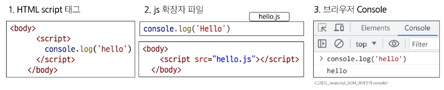
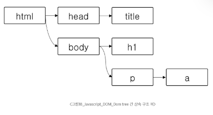

# Javascript - DOM
# History of JavaScript
## 웹 브라우저와 JavaScript
### 웹
- 웹의 탄생(1990)
  - Tim Berners-Lee 경이 WWW, 하이퍼텍스트 시스템 고안하여 개발
  - URL, HTTP 최초 설계 및 구현
  - 초기의 웹은 정적인 텍스트 페이지만을 지원
- 웹 브라우저의 대중화(1993)
  - Netscape사의 최초 상용 웹 브라우저인 Netscape Navigator 출시
  - 당시 약 90% 이상의 시장 점유율을 가짐
  - Netscape사는 웹의 동적인 기능을 만들기 위한 프로젝트를 시작
### JavaScript
- JavaScript의 탄생(1995)
  - 당시 Netscape 소속 개발자 Brendan Eich는 회사의 요구사항이었던 웹의 동적 기능 개발을 넘어, 스크립트 언어 'Mocha'를 개발
  - 이후 LiveScript로 이름을 변경했으나 당시 가장 인기있던 Java의 명성에 기대보고자 JavaScript로 이름을 변경
  - JavaScript는 Netscape Navigator 2.0에 탐재되어 웹 페이지에 동적 기능을 추가하는 데 사용됨
- JavaScript 파편화(1996)
  - 한편, Microsoft가 자체 웹 브라우저인 인터넷 익스플로러(IE) 3.0d애 JavaScript와 유사한 언어인 JScript를 도입
  - 이로 인해 여러 회사가 독자적으로 JavaScript 규격을 변경하여 자체 브라우저에 탑재하기 시작
  - JavaScript 파편화의 시작
### 1차 브라우저 전쟁
- 1차 브라우저 전쟁(1995-2001)
  - Microsoft는 IE를 자사 윈도우 운영체제에 내장하여 무료로 배포
  - 빌 게이츠를 필두로 한 Microsoft의 공격적인 마케팅, 자금력 그리고 압도적인 윈도우 운영체게 점유율 앞에 Netscape는 빠르게 몰락하기 시작
  - 결국 IE 시장 점유율은 2002년 약 96%에 달하며 Microsoft가 승리
  - 훗날 Brendan Eich와 Netscape의 핵심 개발진은 모질라 재단을 설림하여 Firefox 브라우저를 출시(2003)
- 1차 브라우저 전쟁의 영향
  - 웹 표준의 부재로 인해 각 기업에서 자체 표준을 확립하려는 상황 발생
  - 이는 웹 개발자들에게 큰 혼란을 주었고, 결과적으로 웹 표준의 중요성을 인식하는 계기가 됨
#### ※ 웹 표준이 중요한 이유
- 브라우저나 기기에 상관없이 웹 사이트가 동일하게 작동하여, 일관된 사용자 경험을 제공
- 브라우저별 코드를 따로 작성할 필요가 없어 개발 시간과 비용이 줄고, 유지보수가 쉬워짐
### ECMAScript
- ECMAScript 출시(1997)
  - JavaScript의 파편화를 막기 위해 Netscape사는 ECMA 재단에 웹 표준 제작을 요청
  - ECMA에서 ECMAScript라는 표준 언어를 정의하여 발표(1997)
  - 이때부터 JavaScript는 ECMAScript 표준에 기반을 두고 발전하기 시작
### 2차 브라우저 전쟁
- 2차 브라우저 전쟁(2004-2017)
  - 웹 표준이 정의되었지만 당시 가장 높은 점유율을 가진 IE는 웹 표준을 지키지 않았고 독자적인 규격을 유지하며 웹 시장을 주도
  - IE 독주에 대한 Firefox가 대항하기 시작
  - 2008년까지 30% 점유율 차지
- Chrome 브라우저의 등잘(2008)
  - Google의 Chrome 브라우저 출시
  - Chrome은 출시 3년 만에 Firefox의 점유율을 넘어서고 그로부터 반년 뒤 IE의 점유율을 넘어섬
- Chrome이 시장 우위를 점하게 된 이유
  - 빠른 성능, 다양한 플랫폼 지원, 보안, Google 생태계 통합 등 다양한 이유가 있지만, 가장 결정적인 이유는 바로 **적극적안 웹 표준 준수**
  - 호환성
    - 웹 표준을 준수함으로써, 사용자들은 브라우저 간에 일관된 웹 페이지를 볼 수 있게 됨
    - 이는 다양한 플랫폼 및 기기에서 웹 사이트가 일관되게 동작할 수 있음을 의미
  - 강력한 개발자 도구
    - 웹 개발자를 위한 강력한 도구를 제공하여 웹 애플리케이션을 개발하는 데 도움
- 2차 브라우저 전쟁의 영향
  - Chrome이 웹 표준을 준수하고 새로운 웹 기술을 적극적으로 채택함으로써, 다른 브라우저 제조사들도 웹 표준 준수에 대한 중요성을 인식하고 이에 따라 웹 표주을 채택하는 데 더 많은 노력을 기울이게 됨
  - 웹의 기능이 크게 확장되며 웹 애플리케이션의 비약적인 발전을 이끌어 감
  - 2차 브라우저 전쟁이 남긴 웹의 기술적 발전과 웹 표준의 중요성
#### ※ Chrome은 단순히 표준만 잘 기킨 것이 아니라, 자체 개발한 V8 자바스크립트 엔진은 압도적인 성늘을 보여줬음(V8 자바스크립트 엔진: 구글이 개발한 고성능 엔진으로 웹을 문서에서 어플리케이션 플랫폼으로 바꾸는 데 결정적인 역할을 함)
## ECMAScript
- Ecma International이 정의한 표준화된 스크립트 프로그래민 언어 명세
- 스크립트 언어가 준수해야 하는 규칙, 세부사항 등을 정의
#### ※ 프로그래밍 언어 명세
- 언어의 규칙 설명서로써 해당 언어의 문법과 코드가 어떻게 동작해야 하는지를 정의한 설명서
- 기준이 되는 설계도로써 코드가 모든 환경에서 동일하게 동작하도록 보장
### ECMAScript와 JavaScript
- JavaScript는 ECMAScript 표준을 구현한 구체적인 프로그래밍 언어
- ECMAScript의 명세를 기반으로 하여 웹 브라우저나 Node.js와 같은 환경에서 실행 됨
- ECMAScript는 JavaScript의 표준이며, JavaScript는 ECMAScript 표준을 따르는 구체적인 프로그래밍 언어
- ECMAScript는 언어의 핵심을 정의하고, JavaScript는 ECMAScript 표준을 따라 구현된 언어로 사용됨
---
- ECMAScript의 역사
  - ECMAScript 5(ES5)에서 안정성과 생산성을 크게 높임(2009)
  - ECMAScript 2015(ES6)에서 객체지향 프로그래밍 언어로써 많은 발전을 이루서, 역사상 가장 중요한 버전으로 평가됨(2015)
- JavaScript의 현재와 미래
  - 현재는 Chrome, Firefox, Safari, Microsort Edge 등 다양한 웹 브라우저가 경쟁하고 있으며, 모바일 등 시장이 다양화 되어있음
  - 과거에는 JavaScript가 브라우저 내에서 웹 페이지의 동적인 기능을 구현하는 용도로만 사용되었음
    - 예를 들어, 사용자의 입력에 따라 웹 페이지의 내용이 동적으로 변경되거나, 애니메이션 효과가 적용되는 등의 기능
  - 이후 Node.js(2009 출시)로 인해 브라우저 외부에서도 실행 가능해져 서버 사이드 개발에도 사용되기 시작
  - 다양한 프레임워크와 리아브러리들이 개발되면서, 웹 개발 분야에서는 필수적인 언어로 자리잡게 됨
# 변수
## JavaScript 문법 학습
- ECMAScript 2015(ES6) 이후의 문법을 기준함
## 변수 작성 규칙
### 식별자(변수명)
- 작성 규칙
  - 반드시 문자, 달러($) 또는 밑줄(_)로 시작
  - 대소문자 구분
  - 예약어 사용 불가
    - for, if, function 등
  - 의미가 드러나는 이름을 사용하여 데이터의 의미를 명확히 설명
  - '$'나 '_'로 시작하는 변수는 특별한 용도(DOM 선택, 내부용 변수)로 쓰이니, 일반 변수와 구분
- Naming Convention
  - 카멜 케이스(camelCase)
    - 변수, 객체, 함수에 사용
  - 파스칼 케이스(PascalCase)
    - 클래스, 생성자에 사용
  - 대문자 스네이크 케이스(SNAKE_CASE)
    - 상수(constants)에 사용
## 변수 선언 키워드
### 1. let
- 재할당이 필요한 변수를 선언할 때 사용
- block scope를 갖는 지역 변수를 선언
  1. 재할당 가능
  2. 재선언 불가능
  3. ES6에서 추가
```javascript
let number = 10   // 1. 선언 및 초기값 할당
number = 20       // 2. 재할당
```
```javascript
let number = 10   // 1. 선언 및 초기값 할당
let number = 20   // 2. 재선언 불가능
```
### 2. const
- 재할당이 불가능한 상수를 선언할 때 사용
- block scope를 갖는 지역 변수 선언
  1. 재할당 불가능
  2. 재선언 불가능
  3. ES6에서 추가
```javascript
const number = 10   // 1. 선언 및 초기값 할당
number = 20         // 2. 재할당 불가능
```
```javascript
const number = 10   // 1. 선언 및 초기값 할당
const number = 20   // 2. 재선언 불가능
const number =      // 3. const' declarations must be initialized.
```
### block scope
- if, for, 함수 등의 중괄호({}) 내부를 가리킴
- 블록 스코프를 가지는 변수는 블록 바깥에서 접근 불가능
```javascript
let x = 1
if (x === 1) {
  let x = 2
  console.log(x)     // 2
}
console.log(x)       // 1
```
- 스코프 안에서 let으로 선언하면 밖에서 접근할 수 없음
- var는 블록을 무시하고 함수 단위로 작동해 파이썬과 비슷, 가급적 사용하지 않는 것을 권장
#### ※ 3. var
- 재선언/재할당이 가능하고, 현재는 호이스팅(Hoisting) 문제로 사용을 권하지 않음
### 어떤 변수 선언 키워드를 사용해야 할까?
- const를 기본으로 사용할 것
  - 코드의 의도 명확화
    - 해당 변수가 재할당되지 않을 것임을 명확히 표현
    - 개발자들에게 변수의 용도와 동작을 더 쉽게 이해할 수 있게 해줌
  - 버그 예방
    - 의도치 않은 변수값 변경으로 인한 버그 예방
    - 큰 규모의 프로젝트나 팀 작업에서 중요
- 필요한 경우에만 let으로 전환(재할당이 필요한 경우)
  - let을 사용하는 것은 해당 변수가 의도적으로 변경될 수 있음을 명확히 나타냄
  - 코드의 유연성을 확보하면서도 const의 장점을 최대한 활용할 수 있음
# DOM
## 웹 브라우저에서의 JavaScript
- 웹 페이지에서 동적인 기능을 담당
  1. HTML script 태그
  2. js 확장자 파일
  3. 브라우저 Console
#### 
## 문서 구조
### Document structure
- HTML 문서는 여러 상자가 중첩된 구조로 볼 수 있음
```html
<!DOCTYPE html>
<html lang="en">
<head>
  <title>Document</title>
</head>
<body>
  <h1>Heading</h1>
  <p>Hello,
    <a href='https://www.google.com/'>google</a>
  </p>
</body>
</html>
```
- 각 상자는 객체이며 개발자는 이 객체와 상호작용하여 어떤 HTML 태그를 나타내는지, 어떤 콘텐츠가 포함되어 있는지 등을 알아낼 수 있음
- 이 표현을 객체 모델(Document Object Model), 줄여서 DOM이라고 부름
### DOM(The Document Object Model)
- 웹 페이지(Document)를 구조화된 객체로 제공하여 프로그래밍 언어가 페이지 구조에 접근할 수 있는 방법을 제공
- 문서 구조, 스타일, 내용 등을 변경할 수 있도록 함
### DOM API
- 다른 프로그래밍 언어가 웹 페이지에 접근 및 조작할 수 있도록, 페이지 요소들을 객체 형태로 제공하며 관련된 메서드도 함께 제공
- HTML 구조와 내용을 조작하는 명령어 모음
## Document 객체
- 웹 페이지를 나타내는  DOM 트리의 최상위 객체
- HTML 문서의 모든 콘텐츠에 접근하고 조작할 수 있는 진입점
- DOM에서 모든 요소, 속성, 텍스트는 하나의 객체
- 모두 document 객체의 하위 객체로 구성됨
## DOM Tree
- HTML 태그를 나타내는 elements의 node는 문서의 구조를 결정
- 이들은 다시 자식 node를 가질 수 있음(ex. document.body) -> 객체 간 상속 구조가 존재
```html
<!DOCTYPE html>
<html lang="en">
<head>
  <title>Document</title>
</head>
<body>
  <h1>Heading</h1>
  <p>Hello,
    <a href='https://www.google.com/'>google</a>
  </p>
</body>
</html>
```
#### 
### DOM 핵심
- 문서의 요소들을 객체로 제공하여 다른 프로그래밍 언어에서 접근하고 조작할 수 있는 방법을 제공하는 API
- DOM은 문서를 부모-자식 관계의 계층적인 트리 구조로 표현
- DOM 조작은 웹 페이지에 실시간으로 반영되어, 사용자와 상호작용하는 동적 페이지를 만듦
- 사용자의 클릭이나 키보드 입력같은 이벤트를 감지하고, 이에 반응하는 상호작용을 만드는 기반이 됨
# DOM 선택
- DOM 조작시 기억해야 할 것
  - 웹 페이지를 동적으로 만들기 == 웹 페이지를 조작하기
  - 조작 순서
    1. 조작하고자 하는 요소를 선택(또는 탐색)
    2. 선택된 요소의 콘텐츠 또는 속성을 조작
## 선택 메서드
- document.querySelector(selector)
  - 요소 한개 선택
  - 제공한 선택자(selector)와 일치하는 첫번째 요소를 하나 선택
  - 제공한 선택자를 만족하는 첫번째 element 객체를 반환(없다면 null 반환)
- document.querySelectorAll(selector)
  - 요소 여러개 선택
  - 제공한 선택자와 일치하는 여러 element를 선택
  - 제공한 선택자를 만족하는 NodeList를 반환
#### ※ selector: 찾고 싶은 html 요소를 지정하는 검색 조건(ex: 'content', '#id', ...)
### DOM 선택 실습
```html
<!-- select.html -->

<!DOCTYPE html>
<html lang="en">

<head>
  <meta charset="UTF-8">
  <meta name="viewport" content="width=device-width, initial-scale=1.0">
  <title>Document</title>
</head>

<body>
  <h1 class="heading">DOM 선택</h1>
  <a href="https://www.google.com/">google</a>
  <p class="content">content1</p>
  <p class="content">content2</p>
  <p class="content">content3</p>
  <ul>
    <li>list1</li>
    <li>list2</li>
  </ul>
  <script>
    console.log(document.querySelector('.heading'))
    console.log(document.querySelector('.content'))
    console.log(document.querySelectorAll('.content'))
    console.log(document.querySelectorAll('ul > li'))
  </script>
</body>
</html>
```
# DOM 조작
1. 속성 조작
   - **클래스 속성 조작**
   - 일반 속성 조작
2. **HTML 콘텐츠 조작**
3. DOM 요소 조작
4. 스타일 조작
## 속성 조작
1. 클래스 속성 조작
   - 스타일링 밑 상태 제어를 위한 클래스 목록을 동적으로 추가/제거
2. 일반 속성 조작
   - id, href 등 요소의 모든 HTML 속성 값을 직접 설정/조회
### 클래스 속성 조작(classList property)
- 요소의 클래스 목록을 DOMTokenList(유사 배열) 형태로 반환
- HTML 요소의 클래스 목록을 쉽게 제어(추가/제거)하는 도구
### 1. classList 메서드
- element.classList.add()
  - 지정한 클래스 값을 추가
- element.classList.remove()
  - 지정한 클래스 값을 제거
- element.classList.toggle()
  - 클래스가 존재한다면 제거하고 false를 반환(존재하지 않으면 클래스를 추가하고 true를 반환)
### 클래스 속성 조작 실습
- add()와 remove() 메서드를 사용해 지정한 클래스의 값을 추가 혹은 제거
```javascript
<!-- element-manipulation.html -->

  <style>
    .red {
      color: crimson;
    }
  </style>
```
```javascript
<!-- element-manipulation.html -->

    const h1Tag = document.querySelector('.heading')
    console.log(h1Tag.classList)

    h1Tag.classList.add('red')
    console.log(h1Tag.classList)

    h1Tag.classList.remove('red')
    console.log(h1Tag.classList)

    h1Tag.classList.toggle('red')
    console.log(h1Tag.classList)
```
### 2. 일반 속성 조작 메서드
- Element.getAttrubute()
  - 해당 요소에 지정된 값을 반환(조회)
- Element.setAttribute(name, value)
  - 지정된 요소의 속성값을 설정
  - 속성이 이미 있으면 기존값을 갱신(그렇지 않으면 지정된 이름과 값으로 새 속성이 추가)
- Element.removeArrtibute()
  - 요소에서 지정된 이름을 가진 속성 제거
#### ※ getAttribute는 HTML 초기값을, .value와 같은 프로퍼티는 현재 상태 값을 반환 / setAttribute()는 숫자나 boolean 값을 넣ㅇ도 모두 문자열로 반환하여 저장
### 일반 속성 조작 실습
```javascript
<!-- element-manipulation.html -->

  // 일반 속성 조작
  const aTag = document.querySelector('a')
  console.log(aTag.getAttribute('href'))

  aTag.setAttribute('href', 'https://www.naver.com/')
  console.log(aTag.getAttribute('href'))

  aTag.removeAttribute('href')
  console.log(aTag.getAttribute('href'))
```
## HTML 콘텐츠 조작
- textContent property
- 요소의 텍스트 콘텐츠를 표현
- HTML 태그를 완전히 제거하고 순수한 텍스트 데이터만 얻고 싶을 때 가장 유용
- 예: ```<P>lorem</P>``` 
### HTML 콘텐츠 조작 실습
```javascript
<!-- contents-manipulation.html -->

  // HTML 콘텐츠 조작
  const h1Tag = document.querySelector('.heading')
  console.log(h1Tag.textContent)

  h1Tag.textContent = '내용 수정'
  console.log(h1Tag.textContent)
```
## DOM 요소 조작
### DOM 요소 조작 메서드
- document.createElement(tagName)
  - 작성한 tagName의 HTML 요소를 생성하여 반환
- Node.appendChild()
  - 한 Node를 특정 부모 Node의 자식 NodeList 중 마지막 자식으로 삽입
  - 추가된 Node 객체를 반환
- Node.removeChild()
  - DOM에서 자식 Node를 제거
  - 제거된 Node를 반환
#### ※ createElement는 메모리에만 요소를 만들고, 실제로는 appendChild로 문서에 삽입해야 화면에 보임 / removeChild로 제거된 노드는 메모리에 남아있어 변수에 담아두면 언제든 가능
### DOM 요소 조작 실습
```javascript
<!-- dom-manipulation.html -->

  // 생성
  const h1Tag = document.createElement('h1')
  h1Tag.textContent = '제목'
  console.log(h1Tag)

  // 추가
  const divTag = document.querySelector('div')
  divTag.appendChild(h1Tag)
  console.log(divTag)

  // 삭제
  const pTag = document.querySelector('p')
  divTag.removeChild(pTag)
```
## Style property
- 해당 요소의 모든 style 속성 목록을 포함하는 속성
- style property는 HTML 태그에 style='...' 속성을 직접 추가/수정하는 것과 같음
- 여러 스타일 변경은 가급적 클래스를 활용하는 것을 추천
### style 조작 실습
```javascript
<!-- style-property.html -->

  const pTag = document.querySelector('p')

  pTag.style.color = 'crimson'
  pTag.style.fontSize = '2rem'
  pTag.style.border = '1px solid black'

  console.log(pTag.style)
```
# 참고
## DOM 속성 확인 Tip
- 개발자도구 - Elements - Properties
- 선택한 해당 요소의 모든 DOM 속성 확인 가능
## 용어 정리
- Node: DOM의 기본 구성 단위, DOM 트리의 각 부분은 Node라는 객체로 표현됨
  - Document Node -> HTML 문서 전체를 나타내는 노드
  - Element Node -> HTML 요소를 나타내는 노드(예를 들어 <p>)
  - Text Node -> HTML 텍스트(Element Node 내의 텍스트 컨텐츠를 나타냄)
  - Attribute Node -> HTML 요소의 속성을 나타내는 노드
- NodeList: DOM 메서드를 사용해 선택한 Node의 목록
  - 배열과 유사한 구조
  - Index로만 각 항목에 접근 가능
  - JavaScript의 배열 메서드 사용 가능
  - querySelectorAll()에 의해 반환되는 NodeList는 DOM의 변경사항을 실시간으로 반영하지 않음
    - DOM이 나중에 변경되더라도 이전에 이미 선택한 NodeList 값은 변하지 않음
- Element: DOM 트리에서 HTML 요소를 나타내는 특별한 유형의 Node
  - Node의 하위 유형
  - 예를 들어, <p>, <div>, <span>, <body> 등의 HTML 태그들이 Element 노드를 생성
  - Node의 속성과 메서드를 모두 가지고 있으며 추가적으로 요소 특화된 기능(예: className, innerHTML, id 등)을 가지고 있음
  - 모든 Element는 Node이지만, 모든 Node가 Element인 것은 아님
- Parsing: 브라우저가 문자열을 해석하여 DOM Tree로 만드는 과정(구문 분석, 해석)
## 세미콜론(semicolon)
- 자바스크립ㅌ트는 문장 마지막 세미콜론을 선택적으로 사용 가능
- 세미콜론이 없으면 ASI에 의해 자동으로 세미콜론이 삽입됨
  - ASI(Automatic Semicolon Insertion, 자동 세미콜론 삽입 규칙)
- JavaScript를 만든 Brendan Eich 또한 세미콜론이 선택적이어야 한다고 생각(세미콜론을 강제하지 않는 스타일을 선호)
- 세미콜론의 사용 여부보다 중요한 것은 일관성(팀의 스타일 가이드를 따르는 것이 우선)
## var
- ES6 이전에 변수 선언에 사용했던 키워드
- 재할당, 재선언 가능
- 함수 스코프를 가짐
- 호이스팅되는 특성으로 인해 예기치 못한 문제 발생 가능(선언 전 사용 가능)
- 변수 선언 시 var, const, let 키워드 중 하나를 사용하지 않으면 자동으로 var로 선언됨
### 함수 스코프(function scope)
- 함수의 중괄호 내부를 가리키고, 함수 스코프를 가지는 변수는 함수 바깥에서 접근 불가
```javascript
function foo() {
  var x = 1
  console.log(x)    // 1
}
console.log(x)      // ReferenceError: x is not defined
```
## 호이스팅(hoisting)
- 변수 선언문이 코드의 최상단으로 끌어올려지는 듯한 현상
- var로 선언된 변수는 선언 위치와 관계없이 스코프 최상단에서 선언된 것처럼 동작하며, 할당 전까지는 undefined 값을 가짐
```javascript
console.log(name)     // undefined
var name = '홍길동'    // 선언 및 할당
```
```javascript
// 위 코드와 동일하게 동작
var name
console.log(name)     // undefined
var name = '홍길동'
```
- let과 const로 선언된 변수도 기술적으로는 호이스팅 되지만, 변수가 만들어지는 내부 과정이 다르기 때문에 이 문제를 방지할 수 있음(TDZ로 인해 초기화 전에 접근할 수 없음)
```javascript
console.log(age)      // ReferenceError: Cannot access 'age' before initialization
var age = 30

console.log(height)
const height = 170    // ReferenceError: Cannot access 'height' before initialization
```