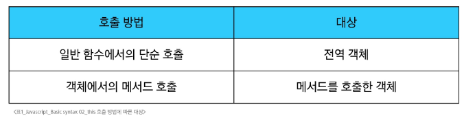
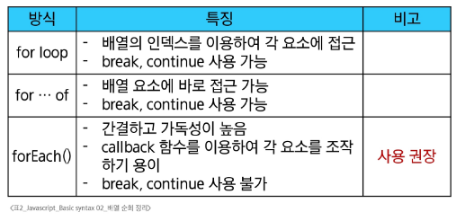
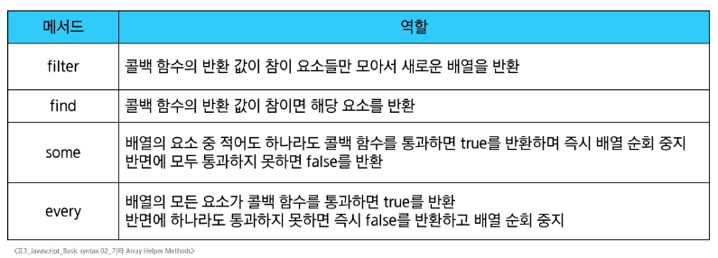

# Javascript - Basic syntax 02
# 객체
- Object: 키로 구분된 데이터 집합을 저장하는 자료형(data collection)
## 구조 및 속성
### 객체 구조
- 중괄호('{}')를 이용해 작성
- 중괄호 안에는 key: value 쌍으로 구성된 속성을 여러개 작성 가능
- key는 문자형만 허용
- value는 모든 자료형 허용
```javascript
const user = {
  name: 'Alice',
  'key with space': true,
  greeting: function () {
    return 'hello'
  }
}
```
### 속성 참조
- 점('.') 표기법 또는 대괄호('[]') 표기법으로 객체 속성에 접근
- key 이름에 띄어쓰기 같은 구분자가 있으면 대괄호 접근만 가능
```javascript
// 조회
console.log(user.name) // Alice
// console.log(user.'key with space')
console.log(user['key with space']) // true

// 추가
user.address = 'korea'
console.log(user) // {name: 'Alice', key with space: true, address: 'korea', greeting: ƒ}

// 수정
user.name = 'Bella'
console.log(user.name) // Bella

// 삭제
delete user.name
console.log(user) // {key with space: true, address: 'korea', greeting: ƒ}
```
### in 연산자
- 속성이 객체에 존재하는지 여부를 확인
- 객체의 키나 배열의 인덱스 존재 여부를 확인하는 연산자
```javascript
console.log('greeting' in user) // true
console.log('country' in user) // false
```
#### ※ 주의사항
- 객체에서 값의 포함 여부를 확인하려면, in 연산자 대신 hasOwnPropoerty() 메서드를 사용하는 것이 올바름
- 프로토타입 체인을 따라 상속된 속성까지 확인하므로, 의도치 않게 ture가 나올 수 있어 주의
  - 프로토타입: 객체들이 기능을 물려받는 원본, 즉 부모 역할을 하는 객체
  - 프로토타입 체인: 자신에게 없는 속성이나 기능을 부모, 조상 순으로 찾아가는 것
## 메서드
- 객체 속성에 정의된 함수
- object.method() 방식으로 호출
- 메서드는 객체가 행동할 수 있게 함
- this 키워드를 사용해 객체 자신의 속성이나 메서드에 접근하여 특정 작업을 수행할 수 있음(미서드와 일반 함수의 차이)
```javascript
console.log(user.greeting()) // hello
```
### Method 기본 문법
- 메서드도 값이 함수인 속성
```javascript
const myObj2 = {
  numbers: [1, 2, 3],
  myFunc: function () {
    this.numbers.forEach(function (number) {
      console.log(this) // window
    })
  }
}
console.log(myObj2.myFunc())
```
## this
- 함수나 메서드를 호출한 객체를 가리키는 키워드
- this 키워드를 사용해 객체에 대한 특정한 작업을 수행할 수 있음
### Method & this 사용 예시
```javascript
const person = {
  name: 'Alice',
  greeting: function () {
    return `Hello my name is ${this.name}`
  },
}

console.log(person.greeting()) // Hello my name is Alice
```
### 호출 방법에 따른 this가 가리키는 대상의 차이
- JavaScript에서 this는 함수를 호출하는 방법에 따라 가리키는 대상이 달라짐
#### 
- 단순 호출 this
  - 가리키는 대상: 전역 객체(최상위 객체)
```javascript
const myFunc = function () {
  return this
}
console.log(myFunc()) // window
```
- 메서드 호출시 this
  - 가리키는 대상: 베서드를 호출한 객체
```javascript
const myObj = {
  data: 1,
  myFunc: function () {
    return this
  }
}
console.log(myObj.myFunc()) // myObj
```
- 중첩된 함수에서의 this 문제점
  - forEach의 인자로 작성된 콜백 함수는 일반 함수로 호출되므로 this가 전역 객체를 가리킴
```javascript
const myObj2 = {
  numbers: [1, 2, 3],
  myFunc: function () {
    this.numbers.forEach(function (number) {
      console.log(this) // window
    })
  }
}
console.log(myObj2.myFunc())
```
- 해결책
  - 화살표 함수는 자신만의 this를 가지지 않음
  - 따라서 외부 함수(myFunc)에서의 this 값을 가져옴
```javascript
const myObj3 = {
  numbers: [1, 2, 3],
  myFunc: function () {
    this.numbers.forEach((number) => {
      console.log(this) // myObj3
    })
  }
}
console.log(myObj3.myFunc())
```
### JavaScript this 정리
- JavaScript의 함수는 호출될 때 this를 암묵적으로 전달 받음
- JavaScript에서 this는 함수가 호출되는 방식에 따라 결정되는 현재 객체를 나타냄
- Python의 self와 Java의 this가 선언 시점에 이미 값이 정해지는 것과 달리 JavaScript의 this는 함수가 호출될 때 동적으로 결정
- 장점
  - 함수(메서드)를 하나만 만들어 여러 객체가 공유하여 각자 자신의 데이터로 동작하게 할 수 있음
- 단점
  - 이런 유연함이 실수로 이어질 수 있음
- this가 헷갈릴 땐 누가 점을 찍어 호출했나에 집중, 점앞의 객체가 this가 됨
## 추가 객체 문법
1. 단축 속성
2. 단축 메서드
3. 계산된 속성(computed property name)
4. 구조 분해 할당(destructing assignment)
5. 객체와 전개 구문(Spread Syntax)
6. Object keys() / values() / entries()
7. Optional chaining('?.')
### 1. 단축 속성
- 키 이름과 값으로 쓰이는 변수의 이름이 같은 경우 단축 구문을 사용할 수 있음
```javascript
const name = 'Alice'
const age = 30

// 단축 속성 전
const user = {
  name: name,
  age: age
}

// 단축 속성 후
const user = {
  name, age
}
```
### 2. 단축 메서드
- 메서드 선언시 function 키워드 생략 가능
```javascript
// 단축 메서드 전 
const myObj1 = {
  myFunc: function () {
    return 'Hello'
  }
}

// 단축 메서드 후 
const myObj1 = {
  myFunc() {
    return 'Hello'
  }
}
```
### 3. 계산된 속성(computed property name)
- 키가 대괄호([])로 둘러싸여 있는 속성
- 고정된 값이 아닌 변수 값을 사용할 수 있음
- 대괄호 안의 표현식이 너무 복잡해지면, 어떤 키가 생성될 지 파악하기 어려워 가독성이 떨어질 수 있음
- 동적으로 키를 만들다 보면 의도치 않게 같은 이름의 키가 생성되어, 기존 값이 덮어써질 위험이 있음
```javascript
const product = prompt('물건 이름을 입력해주세요')
const prefix = 'my'
const suffix = 'property'

const bag = {
  [product]: 5,
  [prefix + suffix]: 'value'
}

console.log(bag) // {연필: 5, myproperty: 'value'}
```
### 4. 구조 분해 할당(destructing assignment)
- 배열 또는 객체를 분해하여 객체 속성을 변수에 쉽게 할당할 수 있는 문법
```javascript
// 4. 구조 분해 할당
const userInfo = {
  firstName: 'Alice',
  userId: 'alice123',
  email: 'alice123@gmail.com'
}

// 구조 분해 할당 전 
const firstName = userInfo.firstName
const userId = userInfo.userId
const email = userInfo.email

// 구조 분해 할당 후 
const { firstName } = userInfo
const { firstName, userId } = userInfo
const { firstName, userId, email } = userInfo

// Alice alice123 alice123@gmail.com
console.log(firstName, userId, email)
```
- 함수의 매개변수로 객체 구조 분해 할당 활용 가능
```javascript
// 구조 분해 할당 활용 전 
function printInfo(userInfo) {
  console.log(`이름: ${userInfo.firstName}, 나이: ${userInfo.age}, 도시: ${userInfo.city}`)
}
printInfo(userInfo)

// 구조 분해 할당 활용 후
function printInfo({ firstName, email }) {
  console.log(`이름: ${firstName}, 이메일: ${email}`)
}
printInfo(userInfo)
```
### 5. 객체와 전개 구문(Spread Syntax)
- 객체 복사
  - 객체 내부에서 객체 전개
- 얕은 복사에 활용 가능
  - 최상위 속성(겉)만 복사하고 중첩 객체(속)은 공유하는 복사
```javascript
const obj = { a: 2, c: 3, d: 4 }
const newObj = {...obj, a: 1,  e: 5 }
console.log(newObj) // {a: 1, b: 2, c: 3, d: 4, e: 5}
```
### 6. 유용한 객체 메서드
- Object.keys()
  - Object의 Key 값들을 리스트로 반환
- Object.values()
  - Object의 Value 값들을 리스트로 반환
- Object.entries()
  - Object의 Key와 Value 값들을 한 쌍으로 묶은 리스트로 반환
```javascript
const profile = {
  name: 'Alice',
  age: 30
}

console.log(Object.keys(profile)) // ['name', 'age']
console.log(Object.values(profile)) // ['Alice', 30]
console.log(Object.entries(profile)) // [['name', 'Alice'], ['age', 30]]
```
### 7. Optional chaining('?.')
- 속성이 없는 중첩 객체에 접근하려 할 때 에러 발생없이 안전하게 접근하는 방법
- 만약 참조 대상이 null 또는 undefined라면 에러가 발생하는 것 대신 평가를 멈추고 undefined를 반환
```javascript
const userData = {
  name: 'Alice',
  greeting: function () {
    return 'hello'
  }
}

// 변수 옵셔널 체이닝 
console.log(userData.address.street) // Uncaught TypeError: Cannot read properties of undefined (reading 'street')
console.log(userData.address?.street) // undefined

// 함수 옵셔널 체이닝 
console.log(userData.nonMethod()) // Uncaught TypeError: user.nonMethod is not a function
console.log(userData.nonMethod?.()) // undefined
```
- 장점
  - 참조가 누락될 가능성이 있는 경우 연결된 속성으로 접근할 때 더 짧고 간단한 표현식을 작성할 수 있음
  - 어떤 속성이 필요한지에 대한 보증이 확실하지 않는 경우에 객체의 내용을 보다 편리하게 탐색할 수 있음
  - 만약 Optional chaining을 사용하지 않는다면 다음과 같이 '&&' 연산자를 사용해야 함
```javascript
const userData = {
  name: 'Alice',
  greeting: function () {
    return 'hello'
  }
}

// 예전 방식 
console.log(userData.address && userData.address.street) // undefined
```
- 주의사항
  1. Optional chaining은 존재하지 않아도 괜찮은 대상에만 사용해야 함(남용 X)
    - 왼쪽 평가대상이 없어도 괜찮은 경우에만 선택적으로 사용
    - 중첩 객체를 에러 없이 접근하는 것이 사용 목적이기 때문
```javascript
// 이전 예시 코드 논리상 user는 반드시 있어야 하지만 address는 필수 값이 아님
// user에 값을 할당하지 않은 문제가 있을 때 바로 알아낼 수 있어야 하기 때문

// Bad
userData?.address?.street

// Good 
userData.address?.street
```
  2. Optional chaining 앞의 변수는 반드시 선언되어 있어야 함
```javascript
console.log(myObj?.address)   // Uncaught ReferenceError: myobj is not defind
```
- 정리
  1. obj?.prop
    - obj가 존재하면 obj.prop을 반환하고, 그렇지 않으면 undefined를 반환
  2. obj?.[prop]
    - obj가 존재하면 obj[prop]을 반환하고, 그렇지 않으면 undefined를 반환
  3. obj?.method()
    - obj가 존재하면 obj.method()를 호출하고, 그렇지 않으면undefined를 반환
#### ※ 주의사항
- null과 undefined일 때만 동작
- 체인 중간이 null인 경우, 그 뒤의 코드는 실행되지 않음(단락 평가)
## JSON
- JavaScript Object Notation
- key-Value 형태로 이루어진 자료 표기법
- JavaScript의 Object와 유사한 구조를 가지고 있지만 JSON은 일정한 형식을 가진 문자열
- JavaScript에서 JSON을 사용하기 위해서는 Object 자료형으로 변경해야 함
- 특정 언어에 종속되지 않는 데이터 형식으로, API 통신 등에서 널리 사용됨
### Object -> JSON
- JSON.stringfy()를 사용해 객체를 문자열로 변환
```javascript
const jsObject = {
  coffee: 'Americano',
  iceCream: 'Cookie and cream'
}

// Object -> JSON
const objToJson = JSON.stringify(jsObject)
console.log(objToJson)  // {"coffee":"Americano","iceCream":"Cookie and cream"}
console.log(typeof objToJson)  // string
```
### JSON -> Object
- JSON.parse()를 사용해 문자열을 객체로 변환
```javascript
const jsObject = {
  coffee: 'Americano',
  iceCream: 'Cookie and cream'
}

// JSON -> Object
const jsonToObj = JSON.parse(objToJson)
console.log(jsonToObj)  // { coffee: 'Americano', iceCream: 'Cookie and cream' }
console.log(typeof jsonToObj)  // object
```
# 배열(Array)
- 순서가 있는 데이터 집합을 저장하는 자료구조
- 객체는 키로 데이터를 관리하지만, 순서가 중요하지 않음
- 순서가 중요한 데이터 묶음이 필요할 때 사용하는 것이 바로 순서가 있는 컬렉션, 배열임
- 하지만 배열의 인덱스는 숫자로만 이루어져 있어, 키자체가 데이터의 의미를 설명해주지 못하고, 특정 값을 찾기 위해서는 배열의 모든 요소를 처음부터 순서대로 확인해야 하는 단점이 있음
## 배열 구조
- 대괄호('[]')를 이용해 작성
- 요소의 자료형은 제약 없음
- length 속성을 사용해 배열에 담긴 요소 개수 확인 가능
```javascript
const names = ['Alice', 'Bella', 'Cathy']

console.log(names[0]) // Alice
console.log(names[1]) // Bella
console.log(names[2]) // Cathy

// 길이
console.log(names.length) // 3

// 수정
names[1] = 'Dan'
console.log(names)
```
## 배열 메서드
### push()
- 배열 끝에 요소를 추가
- 원본 배열을 직접 수정
- 반환값: 추가된 후의 새로운 배열의 길이
```javascript
const names = ['Alice', 'Bella', 'Cathy']

// push
names.push('Dan')
console.log(names) // ['Alice', 'Bella', 'Dan']
```
### pop()
- 배열 끝 요소를 제거
- 원본 배열을 직접 수정
- 반환값: 제거한 요소
```javascript
const names = ['Alice', 'Bella', 'Cathy']

// pop
console.log(names.pop()) // Cathy
console.log(names) // ['Alice', 'Bella']
```
### unshift()
- 배열 앞에 요소를 추가
- 원본 배열을 직접 수정
- 반환값: 추가된 후의 새로운 배열의 길이
- 배열의 모든 요소를 뒤로 한 칸씩 밀어야 하므로, 배열이 클수록 성능이 저하(가급적 사용 X)
```javascript
const names = ['Alice', 'Bella', 'Cathy']

// unshift
names.unshift('Eric')
console.log(names) // ['Eric', 'Bella', 'Dan']
```
### shift()
- 배열 앞 요소를 제거하고, 제거한 요소를 반환
- 원본 배열을 직접 수정
- 반환값: 제거한 요소
- 배열의 모든 요소를 당겨와야 하므로, 배열이 클수록 성능이 저하(가급적 사용 X)
```javascript
const names = ['Alice', 'Bella', 'Cathy']

// shift
console.log(names.shift()) // Alice
console.log(names) // ['Bella', 'Dan']
```
# Array helper method
- 배열 조작을 보다 쉽게 수행할 수 있는 특별한 메서드 모듬
- ES6에 도입
- 배열의 각 요소를 순회하며 각 요소에 대해 함수(콜백함수)를 호출
- 대표 메서드
  - forEach(), map()
  - filter()
  - every()
  - some()
  - reduce() 등
- 메서드 호출 시 인자로 함수(콜백함수)를 받는 것이 특징
## 콜백 함수
- Callback function
- 다른 함수에 인자로 전달되는 함수
- 외부 함수 내에서 호출되어 일종의 루틴이나 특정 작업을 진행
- 특정 작업이 완료된 후, 시스템에 의해 나중에 호출(call back)되는 함수
### 콜백 함수 예시
```javascript
// 콜백함수 예시 1
const numbers = [1, 2, 3]
numbers.forEach(function (num) {
  console.log(num)
})
// 1
// 2
// 3

// 콜백함수 예시 2
const callBackFunction = function (num) {
  console.log(num)
}
numbers.forEach(callBackFunction)

// 1
// 2
// 3
```
### 주요 Array Helper Methods
- forEach
  - 배열 내의 모든 요소 각각에 대해 함수(콜백함수)를 호출
  - 반환값 없음
  - 탐색 목표
- map
  - 배열 내의 모든 요소 각각에 대해 함수(콜백함수)를 호출
  - 함수 호출 결과를 모아 새로운 배열을 반환
  - 탐색한 후 재가공 목표
## forEach
- 배열의 각 요소를 반복하며 모든 요소에 대해 함수(콜백함수)를 호출
- 구조
```javascript
// forEach 구문
arr.forEach(callback(item[, index[, array]]))

// forEach 예
array.forEach(function (item, index, array)) {
  // do something
}
```
- 콜백함수는 3가지 매개변수로 구성
  - item: 처리할 배열의 요소
  - index: 처리할 배열 요소의 인덱스(선택 인자)
  - array: forEach를 호출한 배열(선택 인자)
- 반환값
  - undefined
### forEach 예시
- 동일한 결과를 만들어 냄
- 간단한 콜백 함수의 경우, 화살표 함수를 사용하는 것이 가독성, this를 다루는 방식의 차이가 있으므로 가능한 화살표 함수 사용이 권장
```javascript
const names = ['Alice', 'Bella', 'Cathy']

// 일반 함수 표기
names.forEach(function (name) {
  console.log(name)
})

// 화살표 함수 표기
names.forEach((name) => {
  console.log(name)
})
```
### forEach 활용
- forEach는 항상 undefined를 반환
- break 문으로 반복을 중단할 수 없음
- 간결한 코드를 위해서 필요한 매개변수만 활용
```javascript
const names = ['Alice', 'Bella', 'Cathy']

const result = names.forEach(function (name, index, array) {
  console.log(`${name} / ${index} / ${array}`)
  return 'aaa'
})
console.log(result)

// 출력 결과
Alice / 0 / Alice, Bella, Cathy
Bella / 1 / Alice, Bella, Cathy
Cathy / 2 / Alice, Bella, Cathy
```
## map
- 배열의 모든 요소에 대해 함수(콜백함수)를 호출하고, 반환된 호출 결과 값을 모아 새로운 배열을 반환
- 구조
```javascript
// map 구문
arr.map(callback(itme[, index[, array]]))

// map 예시
const newArr = array.map(function (item, index, array) {
  // do something
})
```
- forEach의 매개변수와 동일
- 반환값
  - 배열의 각 요소에 대해 실행한 callback의 결과를 모은 새로운 배열
  - forEach 동작 원리와 같지만 forEach와 달리 새로운 배열을 반환함
### map 예시
- 배열을 순회하며 각 객체의 name 속성값을 추출하기(for ... of와 비교)
- map()은 배열 반환이라는 의도가 명확히 나타나, for 문보다 코드가 간결하고 직관적
- map()은 새로운 배열을 반환하므로, 다른 메서드를 체이닝할 수 있음
```javascript
// 1. for...of 와 비교
const persons = [
  { name: 'Alice', age: 20 },
  { name: 'Bella', age: 21 }
]

// 1.1 for...of
let result1 = []
for (const person of persons) {
  result1.push(person.name)
}
console.log(result1)

// 1.2 map
const result2 = persons.map(function (person) {
  return person.name
})
console.log(result2)
```
### map 활용
- 화살표 함수를 활용해 간결하게 활용할 수 있음
- 원본 배열(names)를 변경하지 않고, 항상 새로운 배열을 반환(불변성)
```javascript
const names = ['Alice', 'Bella', 'Cathy']

const result3 = names.map(function (name) {
  return name.length
})

const result4 = names.map((name) => {
  return name.length
})

console.log(names) // ['Alice', 'Bella', 'Cathy']
console.log(result3) // [5, 5, 5]
console.log(result4) // [5, 5, 5]
```
- 커스텀 콜백 함수 활용
  - 콜백 함수를 변수에 담아두면, map 외 다른 곳에서도 같은 로직을 활용할 수 있어 유용
- myCallbackFunc()가 아닌 myCallbackFunc를 전달
```javascript
const numbers = [1, 2, 3]

const myCallbackFunc = function (number) {
  return number * 2
}
const doubleNumber = numbers.map(myCallbackFunc)
console.log(doubleNumber) // [2, 4, 6]
```
### Javascript - map
- map 메서드에 callBackFunc 함수를 인자로 넘겨 numbers 배열의 각 요소를 callBackFunc 함수의 인자로 사용
```javascript
const numbers = [1, 2, 3]
const callBackFunction = function (number) {
  return number ** 2
}

const newNumbers = numbers.map(callBackFunction)
```
### Python - map
- python의 map에 square 함수를 인자로 넘겨 numbers 배열의 각 요소를 square 함수의 인자로 사용
```python
numbers = [1, 2, 3]

def square(num):
  return num ** 2

new_numbers = list(map(square, numbers))
```
## 배열 순회 종합
### 배열 순회 정리
#### 
```javascript
const names = ['Alice', 'Bella', 'Cathy']

// for loop
for (let idx = 0; idx < names.length; idx++) {
  console.log(names[idx])
}

// for...of
for (const name of names) {
  console.log(name)
}

// forEach
names.forEach((name) => {
  console.log(name)
})
```
### 기타 Array Helper Methods
- MDN 문서를 참고해 사용해보기
#### 
## 배열 with 전개 구문
- '...'은 배열의 괄호를 없애고 내용물만 꺼내기 때문에, 배열을 합치거나 중간에 삽입할 때 유용
- 전개 구문은 항상 새로운 배열을 만듦, 원본 배열은 전혀 변경되지 않음
- 배열 안의 객체는 데이터가 아닌, 주소값만 복사됨, 복사본의 객체를 수정하면 원본도 바뀜
```javascript
let parts = ['어깨', '무릎']
let lyrics = ['머리', ...parts, '발']

console.log(lyrics) // [ '머리', '어깨', '무릎', '발' ]
```
# 참고
## 클래스
- 객체를 생성하기 위한 템플릿
- 객체의 속성, 메서드를 정의하는 청사진 역할
### 클래스 기본 문법
1. class 키워드
   - 객체의 설계도인 클래스를 정의하기 위해 사용하는 예약어
   - 호이스팅되지만, 선언 전에 접근하면 에러 발생(TDZ)
     - TDZ(Temporal Dead Zone): let, const 선언 전, 변수 접근을 막는 일시적 사각 지대
2. 클래스 이름
   - 일반적으로 파스칼 케이스로 작성
   - 함수처럼 이름을 생략한 익명 클래스 표현식으로 작성하는 것도 가능
3. 생성자 메서드(constructor())
   - new로 객체 생성 시 자동으로 호출되며, 속성값의 초기 설정을 담당
   - constructor라는 이름을 가진 메서드가 단 하난만 존재할 수 있음
```javascript
class MyClass {
  // 여러 메서드를 정의할 수 있음
  constructor() { ... }
  method1() { ... }
  method2() { ... }
  method3() { ... }
  ...
}
```
### 클래스 특징
- ES6에서 도입
- 생성자 함수를 사용하던 기존의 객체 생성 방식을 더 명확하고 객체 지향적으로 표현하기 위해 도입
- 그래서 클래스는 내부적으로 생성자 함수를 기반으로 동작
```javascript
// 클래스
class Member {
  constructor(name, age) {
    this.name = name
    this.age = age
  }
  sayHi() {
    console.log(`Hi, I am ${this.name}`)
  }
}

const member1 = new Member('Alice', 20)

console.log(member1) // Member { name: 'Alice', age: 20 }
console.log(member1.name) // Alice
member1.sayHi() // Hi I am Alice

// [참고] : 생성자 함수 표현 방식 (과거)
function Member(name, age) {
  this.name = name
  this.age = age
  this.sayHi = function () {
    console.log(`Hi, I am ${this.name}`)
  }
}
```
### 클래스 활용
- new 키워드는 새 객체를 만들고, constructor를 호출하여 초기 속성 값을 설정
- 메서드 안의 this는 메서드를 호출한 member3 자신을 가리킴
### new 연산자
- ```const instance = new ClassName(arg1, arg2)```
- 클래스나 생성자 함수를 사용하여 새로운 객체를 생성
- 클래스의 constructor()는 new 연산자에 의해 자동으로 호출되며 특별한 절차 없이 객체를 초기화할 수 있음
- new 없이 클래스를 호출하면 TypeError 발생
## 콜백 함수의 이점
### 콜백 함수 구조를 사용하는 이유
- 함수 유연성 측면
  - 함수를 호출하는 코드에서 콜백 함수의 동작을 자유롭게 변경할 수 있음
  - map 함수는 동일하지만, 어떤 콜백 함수를 전달하느냐에 따라 결과가 달라짐
```javascript
const numbers = [1, 2, 3, 4];

// 콜백 함수 1: 각 요소를 두 배로 만드는 함수
const double = function (number) {
return number * 2;
};

// 콜백 함수 2: 각 요소를 제곱하는 함수
const square = function (number) {
return number * number;
};

// 1. double 콜백을 사용
const doubledNumbers = numbers.map(double);
console.log(doubledNumbers); // 출력: [2, 4, 6, 8]

// 2. square 콜백을 사용
const squaredNumbers = numbers.map(square);
console.log(squaredNumbers); // 출력: [1, 4, 9, 16]
```
- 비동기적 측면
  - setTimeout 함수는 콜백 함수를 인자로 받아 일정 시간이 지난 후에 실행됨
  - 이때, setTimeout 함수는 비동기적으로 콜백 함수를 실행하므로, 다른 코드의 실행을 방해하지 않음
```javascript
console.log('a')

setTimeout(() => {
  console.log('b')
}, 3000)

console.log('c')

// 출력 결과
// a
// c
// b
```
## forEach에서 break 사용하기
- forEach에서는 break 키워드를 사용할 수 없음
- 대신 some과 every의 특징을 활용해 마치 break를 사용하는 것처럼 활용할 수 있음
```javascript
// some
// - 배열의 요소 중 적어도 하나라도 콜백 함수를 통과하는지 테스트
// - 콜백 함수가 배열 요소 적어도 하나라도 참이면 true를 반환하고 순회 중지
// - 그렇지 않으면 false를 반환
const isEvenNumber = array.some(function (element) {
  return element % 2 === 0
})

console.log(isEvenNumber) // true

// every
// - 배열의 모든 요소가 콜백 함수를 통과하는지 테스트
// - 콜백 함수가 모든 배열 요소에 대해 참이면 true를 반환
// - 그렇지 않으면 false를 반환하고 순회 중지

const isAllEvenNumber = array.every(function (element) {
  return element % 2 === 0
})

console.log(isAllEvenNumber) // false
```
### forEach에서 break하는 대안
- some을 활용한 예시
  - 콜백 함수가 true를 반환하면 즉시 순회를 중단하는 특징을 활용
```javascript
const names = ['Alice', 'Bella', 'Cathy']

// - 콜백 함수가 true를 반환하면 some 메서드는 즉시 중단하고 true를 반환
names.some(function (name) {
  console.log(name) // Alice, Bella
  if (name === 'Bella') {
    return true
  }
  return false
})
```
- every를 활용한 예시
  - 콜백 함수가 false를 반환하면 즉시 순회를 중단하는 특징을 활용
```javascript
const names = ['Alice', 'Bella', 'Cathy']

// - 콜백 함수가 false를 반환하면 every 메서드는 즉시 중단하고 false를 반환
names.every(function (name) {
  console.log(name) // Alice, Bella
  if (name === 'Bella') {
    return false
  }
  return true
})
```
## 배열은 객체다
- 배열도 키와 속성들을 담고 있는 참조 타입의 객체
- 배열의 요소를 대괄호 접근법을 사용해 접근하는 건 객체 문법과 같음
  - 배열의 키는 숫자
- 숫자형 키를 사용해 객체의 기본 기능 외로 순서가 있는 컬렉션을 제어하는 특별한 메서드를 제공
- 배열은 인덱스를 키로 가지며 length 속성을 갖는 특수한 객체
```javascript
const numbers = [1, 2, 3]
console.log(Object.getOwnPropertyDescriptors(numbers))
```
```
{0: {…}, 1: {…}, 2: {…}, length: {…}}
  0: {value: 1, writable: true, enumerable: true, configurable: true}
  1: {value: 2, writable: true, enumerable: true, configurable: true}
  2: {value: 3, writable: true, enumerable: true, configurable: true}
  length: {value: 3, writable: true, enumerable: false, configurable: false}
  [[Prototype]]: Object
```
#### ※ reduce 메서드
- https://developer.mozilla.org/ko/docs/Web/JavaScript/Reference/Global_Objects/Array/reduce
- 배열의 각 요소에 대해서 콜백 함수를 실행하고, 하나의 결과값을 반환 
   배열을 원하는 특정 형태의 값으로 변환(숫자, 문자열, 객체, 배열)
```javascript
/*
  array.reduce(callBackFunction, initialValue)
  - callBackFunction: 배열을 처리할 콜백함수
    - accumulator(acc, 필수): 누적값이며, 이전 콜백 함수가 return한 값이 다음 순회의 accumulator로 전달 
    - currentValue(cur, 필수): 현재 순회에서 처리중인 요소 
    - currentIndex(idx, 선택): 현재 처리 중인 currentValue의 인덱스 
    - array(arr, 선택): reduce를 호출한 원본 배열 
  - initialValue: 누적을 시작할 초기값
*/

// 예시1. 숫자 합계 구하기 
const numbers = [1, 2, 3, 4, 5];

const sum = numbers.reduce((accumulator, current) => {
  console.log(`누적값(acc): ${accumulator}, 현재값(cur): ${current}`);
  return accumulator + current;
}, 0);

console.log('최종 결과:', sum);

// 예시2. 배열 -> 객체로 변환 
// '이름'을 key로, '등장 횟수'를 value로 하는 객체를 만들자!
const names = ['Alice', 'Bob', 'Alice', 'Charlie', 'Bob', 'Alice'];

const nameCounts = names.reduce((countMap, name) => {
  countMap[name] = (countMap[name] ?? 0) + 1;

  return countMap;  // 수정된 객체를 다음 순회에 반환 
}, {});  // 초기값은 빈 객체({})

console.log(nameCounts);

// 예시3. 배열 -> 배열 (map과 filter 한 번에 reduce로 적용하기)
// 체이닝으로 한다면? 
//   - const result = nums.filter(n => n % 2 === 0).map(n => n * 2);

const nums = [1, 2, 3, 4, 5];
const result = nums.reduce((newArray, current) => {
  // 짝수인지 검사 (filter 역할)
  if (current % 2 === 0) {
    // 2배를 해서 newArray에 추가 (map 역할)
    newArray.push(current * 2);
  }

  // 다음 순회에 수정된 배열을 반환 
  return newArray;
}, []); // 초기값은 빈 배열([])

console.log(result); // [4, 8]
```