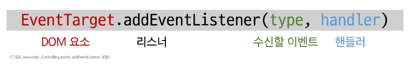
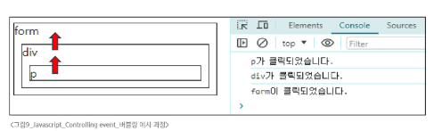
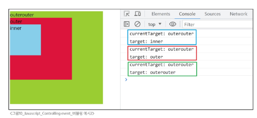

# Javascript - Controlling event
# 이벤트
- 일상속의 이벤트
  - 컴퓨터 키보드를 눌러 텍스트를 입력
  - 전화벨이 울려 전화가 왔음을 알림
  - 손을 흔들어 인사
  - 전화기 버튼을 눌러 통화 시작
  - 리모컨을 사용하여 채널 변경
- 웹에서의 이벤트
  - 화면을 스크롤
  - 버튼을 클릭했을 때 팝업 창 출력
  - 마우스 커서의 위치에 따라 드래그 앤 드롭
  - 사용자의 키보드 입력 값에 따라 새로운 요소를 생성
  - 웹에서의 거의 모든 상호작용은 이벤트와 함께 함
## event
- 웹 페이지 상에서 무언가 일어났다는 신호 또는 사건
- 우리가 한 요소에 마우스를 올리면(이벤트), 시스템은 마우스의 움직임을 감지(리스너)하고, 작은 미리보기 영상이나 설명을 보여주는(핸들러) 반응을 보임
- 마우스 움직임 하나하나가 이벤트가 될 수 있고, 이러한 다양한 클릭, 입력, 변경하는 행위가 이벤트에 해당
### DOM 요소와 이벤트
- 모든 DOM 요소는 다양한 형태의 이벤트를 발생시킬 수 있음
  - DOM 요소: HTML 문서의 각 태그를 하나의 객체로 변환한 것
- 예) button을 클릭하면 click 이벤트, input 값 변경시 input 이벤트
## event object
- DOM에서 이벤트가 발생하면, 브라우저는 해당 이벤트에 관한 정보를 담은 event object를 자동으로 생성
- 이벤트 종류
  - mouse
  - input
  - keyboard 등
- DOM 요소에서 event가 발생하면, 해당 event는 연결된 이벤트 처리기(event handler)에 의해 처리됨
#### ※ 이벤트 객레
- 이벤트 객체는 이벤트 발생 순간의 상황(어떤 요소에서 이벤트가 발생했는지, 마우스 좌표는 어디인지, 눌린 키는 무엇인지 등)과 관련된 상세 정보를 담고 있음
- 이를 통해 이벤트와 관련된 구체적인 정보를 참조할 수 있음
## event handler
- 특정 이벤트가 발생했을 때 실행되는 (콜백)함수
- 보통 addEventListener를 통해 DOM 요소에 event handler를 등록
### .addEventListener()
- 특정 DOM 요소에 지정한 이벤트가 발생했을 때 실행할 이벤트 핸들러를 등록하는 메서드
- 이벤트 핸들러(콜백 함수)를 DOM 요소에 연결하는 역할을 담당
### .addEventListener() 예시
- handleClick 함수가 이벤트 핸들러이며, button.addEventListener()는 그 핸들러를 click 이벤트에 연결해주는 역할
```javascript
const button = document.querySelector('button')

// 이벤트 핸들러
const handleClick = function () {
  window.alert('버튼이 클릭 되었습니다!')
}

// addEventListener 메서드를 이용해 버튼에 이벤트 핸들러를 등록
button.addEventListener('click', handleClick)
```
### 이벤트 등록(addEventListener)
- DOM 요소: HTML 문서의 각 태그를 하나의 객체로 변환한 것
- 수신할 이벤트: 무언가 일어났다는 신호 또는 사건
- 핸들러: 특정 이벤트가 발생했을 때 실행되는 (콜백)함수
#### 
### addEventListener 구조
- 메서드 구문
  - .addEventListener(type, handler)
- type
  - 수신할 이벤트 유형
  - 문자열로 작성(ex. 'click', 'mouseover' 등)
- handler
  - 이벤트 발생 시 호출되는 콜백 함수
  - 자동으로 event 객체를 첫번째 매개변수로 받음
  - 반환값 없음
```javascript
element.addEventListener('click', function (event) {
  // 이벤트 처리 로직
})
```
### 이벤트 객체 전달
- 이벤트 발생 시, 이벤트 객체는 자동으로 이벤트 핸들러 함수에 인자로 전달됨
- 핸들러 함수는 이 인자를 통해 이벤트에 대한 상세 정보(이벤트 발생 요소, 이벤트 타입, 추가 데이터 등)에 접근하고 적절한 동작을 수행
```html
<button id="btn">버튼</button>
```
```javascript
// 1. 버튼 선택
const btn = document.querySelector('#btn')

// 2. 이벤트 핸들러
const detectClick = function (event) {
  console.log(event) // PointerEvent
  console.log(event.type) // click
  console.log(event.currentTarget) // <button id="btn">버튼</button>
  console.log(this) // <button id="btn">버튼</button>
}

// 3. 버튼에 이벤트 핸들러를 등록
btn.addEventListener('click', detectClick)
```
- 이벤트 핸들러에서의 this
  - 일반 함수를 핸들러로 사용 시, this는 이벤트 리스너가 연결된 요소를 가리킴(event 객체의 currentTarget 속성값과 동일)
# 버블링
## 버블링 개요
- form > div > p 형태의 중첩된 구조에 각각 이벤트 핸들러가 연결되어 있을 때, 만약 '\<p>' 요소를 클릭하면 어떻게 될까?
```html
<form id="form">
  form
  <div id="div">
    div
    <p id="p">p</p>
  </div>
</form>
```
```javascript
const formElement = document.querySelector('#form')
const divElement = document.querySelector('#div')
const pElement = document.querySelector('#p')

const clickHandler1 = function (event) {
  console.log('form이 클릭되었습니다.')
}
const clickHandler2 = function (event) {
  console.log('div가 클릭되었습니다.')
}
const clickHandler3 = function (event) {
  console.log('p가 클릭되었습니다.')
}

formElement.addEventListener('click', clickHandler1)
divElement.addEventListener('click', clickHandler2)
pElement.addEventListener('click', clickHandler3)
```
- '\<p>' 요소만 클릭했는데도 불구하고 모든 핸들러가 동작함
- 왜 p만을 클릭했는데 부모 요소 '\<div>'와 '\<form>'에 할당된 핸들러까지 동작할까?
## 버블링(Bubbling)
#### 
- 한 요소에 이벤트가 발생하면, 해당 요소의 핸들러가 동작한 후 이어서 부모 요소의 핸들러가 동작하는 현상
- 가장 최상단의 조상 요소(document)를 만날 때까지 이 과정이 반복되면서 요소 각각에 할당된 핸들러가 동작
- 최하위의 '\<p>' 요소를 클릭하면 p -> div -> form 순서로 3개의 이벤트 핸들러가 모두 순차적으로 동작했던것
- 이벤트가 제일 깊은 곳에 있는 요소에서 시작해 부모 요소를 거슬러 올라가며 발생하는 것이 마치 물속 거품과 닮았기 때문에 버블링이라고 함
### 이벤트가 정확히 어디서 발생했는지 접근할 수 있는 방법
1. event.currentTarget
   - 현재 요소
   - 항상 이벤트 핸들러가 연결된 요소만을 참조하는 속성
   - this와 같음
2. event.target
   - 이벤트가 발생한 가장 안쪽의 요소(target)를 참조하는 속성
   - 실제 이벤트가 시작된 요소
   - 버블링이 진행 되어도 변하지 않음
### target & currentTarget 예시
- 세 요소 중 가장 최상위 요소인 outerouter 요소에만 핸들러가 연결
- 각 요소를 클릭했을 때 event의 target과 currentTarget 차이 비교
#### 
- 핸들러는 outerouter에만 연결되어 있지만, 하위 요소 outer와 inner를 클릭해도 해당 핸들러가 동작
- 클릭 이벤트가 어디서 발생했든 상관없이 outerouter까지 이벤트가 버블링 되어 핸들러를 실행시키기 때문
```css
#outerouter {
  width: 300px;
  height: 300px;
  background-color: yellowgreen;
}

#outer {
  width: 200px;
  height: 200px;
  background-color: crimson;
}

#inner {
  width: 100px;
  height: 100px;
  background-color: skyblue;
}
```
```javascript
<div id="outerouter">
  outerouter 
  <div id="outer">
    outer
    <div id="inner">inner</div>
  </div>
</div>

<script>
  const outerOuterElement = document.querySelector('#outerouter')

  const clickHandler = function (event) {
    console.log('currentTarget:', event.currentTarget.id)
    console.log('target:', event.target.id)
  }

  outerOuterElement.addEventListener('click', clickHandler)
```
## 캡처링과 버블링
### capturing
- 이벤트가 최상위 조상에서 타겟 요소까지 하위로 전파되는 단계(버블링과 반대)
- table의 하위 요소 td를 클릭하면, 이벤트는 먼저 최상위 요소부터 아래로 전파됨(캡처링)
- 실제 이벤트가 발생한 지점(event.target)에서 실행된 후 다시 위로 전파(버블링)
```html
<form id="form">
  form
  <div id="div">
    div
    <p id="p">p</p>
  </div>
</form>
```
```javascript
const formElement = document.querySelector('#form')
const divElement = document.querySelector('#div')
const pElement = document.querySelector('#p')

const clickHandler1 = function (event) {
  console.log('form이 클릭되었습니다.')
}
const clickHandler2 = function (event) {
  console.log('div가 클릭되었습니다.')
}
const clickHandler3 = function (event) {
  console.log('p가 클릭되었습니다.')
}

// 캡처링 : 세 번째 인자로 true를 전달
// 사용하는 경우: 자식 요소들이 이벤트를 처리하기도 전에 부모 선에서 먼저 검사하거나 막아야 할 때
// 근데 거의 사용 안 함!
formElement.addEventListener('click', clickHandler1, true)
divElement.addEventListener('click', clickHandler2, true)
pElement.addEventListener('click', clickHandler3, true)
```
## 버블링의 필요성
- 만약 다음과 같이 각자 다른 동작을 수행하는 버튼이 여러개가 있다고 가정하면, 각 버튼마다 서로 다른 이벤트 핸들러를 등록해야 할까?
- 각 버튼의 공통 조상인 div 요소에 이벤트 핸들러 단 하나만 할당하기
```html
<div>
  <button>버튼1</button>
  <button>버튼2</button>
  <button>버튼3</button>
  <button>버튼4</button>
  <button>버튼5</button>
</div>
```
```javascript
const divTag = document.querySelector('div')

const clickHandler = function (event) {
  console.log(event.target)
}

divTag.addEventListener('click', clickHandler)
```
- 요소들의 공통 조상에 이벤트 핸들러를 하나만 등록하면, 여러 자식 요소에서 발생하는 이벤트를 한곳에서 효율적으로 다룰 수 있음
- 공통 조상(div)에 할당한 핸들러에서 event.target을 이용하면 실제 어떤 버튼에서 이벤트가 발생했는지 알 수 있기 때문
# event handler 활용
## event handler 활용 실습 목록
1. 버튼을 클릭하면 숫자를 1씩 증가해서 출력하기
2. 사용자 입력값을 실시간으로 출력하기
3. 사용자 입력값을 실시간으로 출력하기 + 버튼을 클릭하면 출력된 값의 CSS 스타일을 변경하기
4. todo 프로그램 구현
5. 로또 번호 생성기 구현
### 1. click 이벤트 실습
- 버튼을 클릭하면 숫자를 1씩 증가
```html
<button id="btn">버튼</button>
<p>
  클릭횟수 :
  <span id="counter">0</span>
</p>
```
```javascript
// 1. 초기값 할당
let initialValue = 0

// 2. 버튼 요소 선택
const btn = document.querySelector("#btn")

// 3. 콜백 함수 (버튼에 클릭 이벤트가 발생할때마다 실행할 코드)
const clickHandler = function () {
  // 3.1 초기값 += 1
  initialValue += 1
  // 3.2 p 요소를 선택
  const pTag = document.querySelector("p")
  // 3.3 p 요소의 컨텐츠를 1 증가한 초기값으로 설정
  pTag.textContent = initialValue
}

// 4. 버튼에 이벤트 핸들러 등록 (클릭 이벤트)
btn.addEventListener("click", clickHandler)
```
### 2. input 이벤트 실습
- 사용자의 입력값을 실시간으로 출력하기
```html
<input type="text" id="text-input" />
<p></p>
```
```javascript
// 1. input 요소 선택
const inputTag = document.querySelector("#text-input")
// 2. p 요소 선택
const pTag = document.querySelector("p")
// 3. 콜백 함수 (input 요소에 input 이벤트가 발생할때마다 실행할 코드)
const inputHandler = function (event) {
  console.log(event.currentTarget.value)
  // 3.1 작성하는 데이터가 어디에 누적되고 있는지 찾기
  // console.log(event)
  // console.log(event.currentTarget)
  // console.log(event.currentTarget.value)
  // 3.2 p요소의 컨텐츠에 작성하는 데이터를 추가
  pTag.textContent = event.currentTarget.value
}

// 4. input 요소에 이벤트 핸들러 등록 (input 이벤트)
inputTag.addEventListener("input", inputHandler)
```
#### ※ currentTarget 주의사항
- console.log()로 event 객체를 출력할 경우, currentTarget 키의 값은 null을 가짐
- currentTarget은 이벤트가 처리되는 동안에만 사용할 수 있기 때문
- 대신 console.log(event.currentTarget)로 확인 가능
- currentTarget 이후의 속성 값들은 target을 참고해서 사용하기
### 3. click & input 이벤트 실습
- 입력값을 실시간으로 출력하고 클릭 버튼을 클릭 시 출력 값의 CSS 변경하기
```html
<h1></h1>
<button id="btn">클릭</button>
<input type="text" id="text-input">
```
```javascript
// input 구현
const inputTag = document.querySelector('#text-input')
const h1Tag = document.querySelector('h1')

const inputHandler = function (event) {
  h1Tag.textContent = event.currentTarget.value
}

inputTag.addEventListener('input', inputHandler)


// click 구현
const btn = document.querySelector('#btn')

const clickHandler = function () {
  // 1. add 방법
  h1Tag.classList.add('blue')

  // 2. toggle 방법
  h1Tag.classList.toggle('blue')

  // 3. if 방법
  if (h1Tag.classList.value) {
    h1Tag.classList.remove('blue')
  } else {
    h1Tag.classList.add('blue')
  }
}

btn.addEventListener('click', clickHandler)
```
### 4. todo 실습
- 입력후 '+' 버튼 클릭 시, 실시간으로 리스트에 출력
```html
<input type="text" class="input-text">
<button id="btn">+</button>
<ul></ul>
```
```javascript
// 1. 필요한 요소 선택
const inputTag = document.querySelector('.input-text')
const btn = document.querySelector('#btn')
const ulTag = document.querySelector('ul')

const addTodo = function (event) {
  // 2.1 사용자 입력 데이터 저장
  const inputData = inputTag.value

  // 2.2 데이터를 저장할 li 요소를 생성
  const liTag = document.createElement('li')

  // 2.3 li 요소 컨텐츠에 데이터 입력
  liTag.textContent = inputData

  // 2.4 li 요소를 부모 ul 요소의 자식 요소로 추가
  ulTag.appendChild(liTag)

  // 2.5 todo 추가 후 input의 입력 데이터는 초기화
  inputTag.value = ''
}

// 2. 버튼에 이벤트 핸들러를 등록
btn.addEventListener('click', addTodo)
```
- 추가 기능 구현
  1. 빈 문자열 입력 방지
  2. 입력이 없을 경우 경고 대화상자를 띄움
```javascript
const addTodo = function (event) {
  const inputData = inputTag.value
  if (inputData.trim()) {
    const liTag = document.createElement('li')
    liTag.textContent = inputData
    ulTag.appendChild(liTag)
    inputTag.value = ''
  } else {
    alert('할 일을 입력하세요..')
  }
}
```
### 5. 로또 번호 생성기 실습
- '행운 번호 받기' 버튼 클릭 시, 6자리 랜덤 숫자가 실시간으로 리스트에 출력
```html
<h1>로또 추천 번호</h1>
<button id="btn">행운 번호 받기</button>
<div></div>
```
```javascript
<script src="https://cdn.jsdelivr.net/npm/lodash@4.17.21/lodash.min.js"></script>
<script>
  // 1. 필요한 요소 선택
  const btn = document.querySelector("#btn")
  const divTag = document.querySelector("div")

  // 2. 로또 번호를 화면에 출력하는 함수 (이벤트 핸들러)
  const getLottery = function (event) {
    // 2.1 1부터 45까지의 배열 생성
    const numbers = _.range(1, 46)
    // 2.2 45개의 요소가 있는 배열에서 6개 번호 추출
    const sixNumbers = _.sampleSize(numbers, 6)
    
    // 2.3 6개의 li 요소를 담을 ul 요소 생성
    const ulTag = document.createElement("ul")
    // 2.4 추출한 번호 배열을 "반복하면서 li 요소를 생성
    sixNumbers.forEach((number) => {
      // 2.5 번호를 담을 li 요소 생성 후 입력
      const liTag = document.createElement("li")
      // 2.6 번호를 li 요소에 입력
      liTag.textContent = number
      // 2.7 만들어진 li를 ul 요소에 추가
      ulTag.appendChild(liTag)
    })
    // 2.8 완성한 ul 요소를 div 요소에 추가
    divTag.appendChild(ulTag)
  }

  // 3. 버튼 요소에 이벤트 핸들러를 등록
  btn.addEventListener("click", getLottery)
</script>
```
#### ※ lodash
- 모듈성, 성능 및 추가 기능을 제공하는 JavaScript 유틸리티 라이브러리
- array/object 등 자료 구조를 다룰 떄 간편하고 유용한 함수들을 제공
## 이벤트 기본 동작 취소하기
- HTML의 각 요소가 기본적으로 가지고 있는 이벤트가 때로는 방해가 되는 경우가 있어 이벤트의 기본 동작을 취소할 필요가 있음
- 예시
  - form 요소의 제출 이벤트를 취소하여 페이지 새로고침을 막을 수 있음
  - '\<a>' 태그를 클릭했을 때 페이지 이동을 막고, 대신 다른 로직을 수행하게 할 수 있음
### .preventDefault()
- 해당 이벤트에 대한 기본 동작을 실행하지 않도록 지정
- 입력한 정보가 초기화되는 실수를 막아주기 위해 사용한 기능
### 이벤트 동작 취소 실습 목록
1. copy 이벤트 동작 취소
2. form 제출 시 페이지 새로고침 동작 취소
### 1. copy 이벤트 동작 취소
- 복사 이벤트를 실행하지 못하도록 하기(콘텐츠 복사 방지)
```html
  <h1>중요한 내용</h1>
```
```javascript
// 복사 이벤트 금지 
const h1Tag = document.querySelector('h1')

h1Tag.addEventListener('copy', function (event) {
  console.log(event)
  event.preventDefault()
  alert('복사 할 수 없습니다.')
})
```
### 2. form 제출 시 페이지 새로고침 동작 취소
- form 요소의 submit 동작(action 값으로 요청)을 취소시킴
- 실습 시 submit 버튼을 눌러도 새로고침이 안되는 것을 확인할 수 있음
```html
<form id="my-form">
  <input type="text" name="username">
  <button type="submit">Submit</button>
</form>
```
```javascript
// 폼 제출 시 페이지 새로고침 동작 취소 
const formTag = document.querySelector('#my-form')

const handleSubmit = function (event) {
  event.preventDefault()
}

formTag.addEventListener('submit', handleSubmit)
```
# 참고
## addEventListener와 화살표 함수 관계
### addEventListener의 화살표 함수 주의사항
- 화살표 함수는 자신만의 this를 가지지 않음
- 대신, 자신이 선언된 상위 스코프의 this를 그대로 물려받아 사용
- 따라서 이벤트 핸들러로 화살표 함수를 사용하면, this는 대부분 전역 객체(window)를 가리키게 됨
- 해결책
  - 일반 함수로 사용하기
  - 화살표 함수일 경우 event.currentTarger을 사용하기
```html
<button id="function">function</button>
<button id="arrow">arrow function</button>
```
```javascript
// 일반적인 this 바인딩 규칙
// 1. 일반 함수 호출: window
// 2. 메서드 호출: 메서드를 소유한 객체

// addEventListener는 위의 일반적인 규칙과 다르게 동작하는데, 
// 이는 JavaScript 엔진이 addEventListener 메서드를 특별하게 처리하기 때문
// 내부 구현 (https://developer.mozilla.org/en-US/docs/Web/API/EventTarget/addEventListener)

const functionButton = document.querySelector('#function')
const arrowButton = document.querySelector('#arrow')

// 1. 일반 함수 사용
functionButton.addEventListener('click', function () {
  console.log(this) // <button id="function">function</button>
})

// 2. 화살표 함수 사용
arrowButton.addEventListener('click', () => {
  console.log(this) // window
})

// 3. 화살표 함수에서는 event 객체 사용으로 대체 가능
arrowButton.addEventListener('click', (event) => {
  console.log(event.currentTarget) // <button id="arrow">arrow function</button>
})
```
#### ※ lodash 추가 실습
```html
<head>
  <meta charset="UTF-8">
  <meta name="viewport" content="width=device-width, initial-scale=1.0">
  <title>Document</title>
  <script src="https://cdn.jsdelivr.net/npm/lodash@4.17.21/lodash.min.js"></script>
  <input type="text" id="searchInput" placeholder="검색어 난타해보기">
</head>
```
```javascript
// 1. _uniqBy: 객체 배열에서의 특정 키를 기준으로 중복 제거 
const users = [
  { id: 1, name: '철수' },
  { id: 2, name: '영희' },
  { id: 1, name: '철수' },
];

// 먼저 나온 Key 값이 생존 
const uniqueUsersLodash = _.uniqBy(users, 'id');
console.log(uniqueUsersLodash);  // [{ id: 1, name: '철수' }, { id: 2, name: '영희' }]

// 2. _.orderBy: 다중 조건 정렬
const posts = [
  { user: 'A', age: 20 },
  { user: 'B', age: 30 },
  { user: 'C', age: 20 },
];

const sorted = _.orderBy(posts, ['age', 'user'], ['desc', 'asc']);
console.log(sorted)  // [{user: 'B', age: 30}, {user: 'A', age: 20}, {user: 'C', age:20}]

// 3. _.cloneDeep: 깊은 복사 
const original = { 
    profile: { name: 'Kim', skills: ['JS', 'Vue'] } 
};

const deep = _.cloneDeep(original);
deep.profile.skills.push('Lodash'); // 원본은 안전함
console.log("오리지널", original)
console.log("깊은 복사", deep)

// 4. 깊은 비교 
const objA = { a: 1, b: { c: 2 } };
const objB = { a: 1, b: { c: 2 } };

console.log(objA === objB); // false (참조가 다름)
console.log(_.isEqual(objA, objB)); // true

// 5. _.debounce: 마지막 호출만 실행 (사용자 입력이 끝나고, x초 뒤에 한 번 요청하도록 할 때 유용 )
// NodeJS(Redis, RabbitMQ) // 프론트 프레임워크(커스텀 훅으로 가능)

// 사용자가 입력을 멈춘 지 1000ms가 지나면 함수 실행
const handleSearch = _.debounce((keyword) => {
  console.log(`1초 뒤 호출: `, keyword);
}, 1000);

// input 이벤트 핸들러에 연결
// 기존 이벤트 리스너와 다른 형태인데, 이벤트 객체(e)가 꼬이지 않게 하기 위해서 
// 이벤트 객체를 받은 다음에 해당 객체에서 필요한 정보를 핸들러 함수에 전달하도록 사용 
const inputElement = document.querySelector('#searchInput')
inputElement.addEventListener('input', (e) => handleSearch(e.target.value));


// 6. _.throttle: 일정 주기마다 실행 
// 프론트 프레임워크에서는 다른 기능과 합쳐져서 자주 사용 됨 
// Node.Js 에서는 실시간 채팅/게임 이나 로그 파일 저장 시 활용 됨(가벼운 용도로)

// 200ms마다 한 번씩만 실행됨
let mouseNum = 0
const handleScroll = _.throttle(() => {
  mouseNum++;
  console.log('마우스 이동 횟수: ', mouseNum);
}, 1000);

window.addEventListener('mousemove', handleScroll);

// 7. _.isEmpty: 객체가 비었는 지 확인 (단, 숫자는 비었다고 판단하니 주의 필요)
// 프론트: 백엔드에서 받은 데이터가 비었는 지 확인 
// 백엔드: API 요청에서 파라미터가 비었는 지 확인 
console.log(_.isEmpty(null));      // true
console.log(_.isEmpty(undefined)); // true
console.log(_.isEmpty(''));        // true 
console.log(_.isEmpty([]));        // true
console.log(_.isEmpty({}));        // true
console.log(_.isEmpty(0)) // false
console.log(_.isEmpty(100)) // false
```