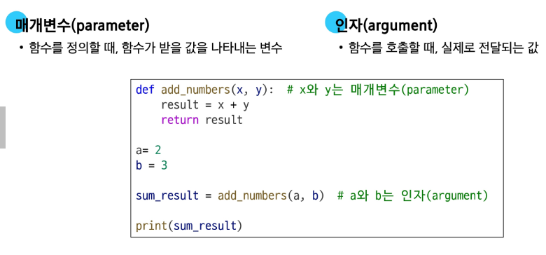
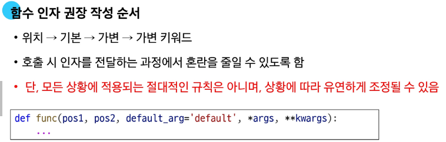
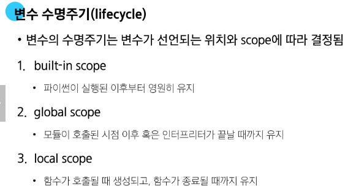
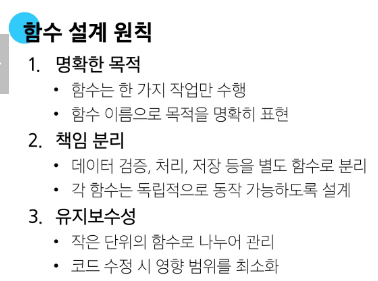

# 함수
- 특정 작업을 수행하기 위한 재사용 가능한 코드 묶음
- 재사용성, 가독성, 유지보수성 향상
### return >>> 함수의 종료, return 이후의 코드는 무시됨
### print() 함수는 반환값이 없어 None을 반환
# 매개변수와 인자

1. Positional Artguments(위치 인자)
- 함수 호출 시 인자의 위치에 따라 전달, 호출시 반드시 값 전달해야 함
2. Default Argument Values(기본 인자값)
- 함수 정의에서 매개변수에 기본값 할당, 호출시 인자 전달하지 않으면 기본값이 매개변수에 할당됨
3. Keyword Arguments(키워드 인자)
- 호출시 인자 이름과 함께 값 전달, 인자의 순서는 중요하지 않으며, 인자 이름을 명시하여 전달
### ※ 단, 호출 시 키워드 인자는 위치 인자 뒤에 위치해야 함
4. Arbitrary Argument Lists(임의의 인자 목록)
- 정해지지 않은 개수의 인자를 처리
- 정의 시 매개변수 앞에 '*'
- 여러 인자를 tuple로 처리
5. Arbitrary Keyword Argument Lists(임의의 키워드 인자 목록)
- 정해지지 않은 개수의 키워드 인자를 처리
- 정의 시 매개변수 앞에 '**'
- 여러 인자를 dictionary로 묶어 처리
### ※ Python에서 인자의 타입을 강제할 수 없다.(가이드는 제공 가능)
### 
# 재귀 함수
- 함수 내부에서 자기 자신을 호출하는 함수
- 끝없이 호출하지 않도록 종료 조건 설정 필요

# 내장 함수
- 파이썬이 기본적으로 제공하는 함수(import 필요없음)
# 함수와 Scope
- local scope: 함수가 만든 scope(함수 내부에서만 참조 가능)
- global scope: 코드 어디에서든 참조할 수 있는 공간
### - global variable: global scope에 정의된 변수
### - local variable: local scope에 정의된 변수
### 
#### LEGB Rule
1. Local scope
2. Enclosed scope
3. Global scope
4. Built-in scope
# 함수 스타일 가이드
1. 기본규칙
- 소문자, 언더스코어(snake_case)
- 동사로 시작, 함수 동작 설명
- 약어 사용 지양
2. 단일 책임 원칙: 모든 객체는 하나의 명확한 목적과 책임만을 가져야함
### 
# Packing & UnPacking
1. Packing: 여러 개의 데이터를 하나의 컬렉션으로 모아 담는 과정
2. UnPacking: 컬렉션에 담겨있는 데이터들을 개별 요소로 펼쳐놓는 과정
# 참고
1. 함수의 반환
- 파이썬은 언제나 하나의 값만 반환 가능
2. 람다 표현식
- 간단한 익명 함수를 만드는데 사용
3. 