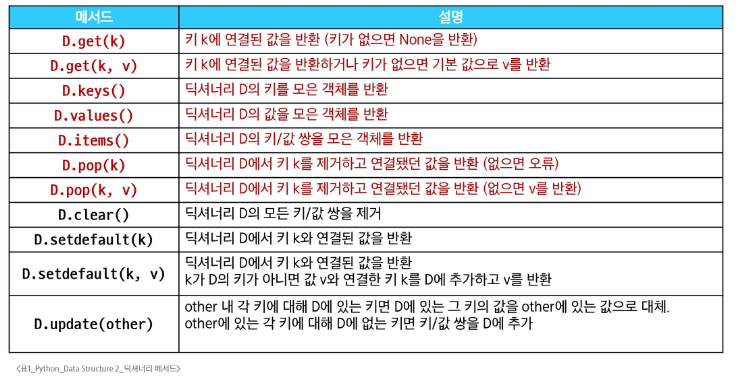
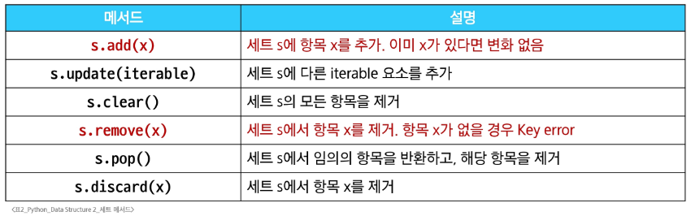
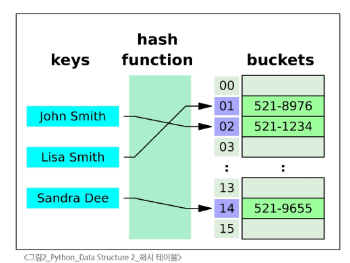

# 비시퀀스 데이터 구조
## 딕셔너리
### 딕셔너리 메서드

#### ※ other: 키/값 쌍으로 된 데이터 타입
#### print(person.keys())  # dict_keys(['name', 'age']) > 실시간으로 동기화되는 확인창(view) > 순회는 가능하나, 인덱스로 접근은 불가능
- API > json("키-값") > 파이썬에서 딕셔너리로 변환(requests) + 리스트
## 세트
- 내부적으로 해시 테이블을 사용하여 데이터 저장
- 고유성 보장, 추가/삭제/존재 여부 확인(in 연산)이 데이터 크기에 상관없이 매우 빠름
- 집합 연산에 유리
- 리스트에서 중복제거가 필요할 때 
  - 리스트 > 세트 > 리스트 (형변환) >>> 중복제거'만' 할때 사용가능, But, 순서가 유지되어야 할때는 사용 불가!(set은 순서가 없기 때문)
### 세트 메서드

#### ※ .pop(): 임의의 요소를 제거하고 반환 >>> random의 개념은 아니다. but, 순서는 없어 우리가 예상할 수 없다.
### 세트의 집합 메서드
- 교재에 표 업데이트 될것.
# 참고
## 해시 테이블
- 'Key'와 'Value'를 짝지어 저장하는 자료구조
### 해시 테이블의 원리
1. 키를 해시 함수를 통해 해시 값으로 변환
2. 변환된 해시 값을 인덱스로 삼아 데이터를 저장하거나 찾음
3. 이로 인해 검색, 삽입, 삭제를 매우 빠르게 수행

#### ※ Hash: 임의의 크기를 가진 데이터를 고정된 크기의 고유한 값으로 변환하는 것
#### ※ Hash function: 임의 길이 데이터를 입력 받아 고정 길이의 정수로 변환해 주는 함수(여기서 이 '정수'가 바로 해시값)
### set의 요소 & dict의 키와 해시 테이블 관계
- set의 pop()은 "임의의 요소"를 제거하고 반환함
  - 실행할 때마다 다른 요소를 얻는다는 의미에서의 "무작위"가 아니라 "임의"라는 의미에서의 "무작위"(By "arbitrary" the docs don't mean "random")
#### set
- 각 요소를 해시 함수로 변환해 나온 해시 값에 맞춰 해시 테이블 내부 bucket에 위치시킴
- 그래서 '순서'라기보다 '버킷 위치(인덱스)'가 요소의 위치를 결정
- 따라서 set은 순서를 보장하지 않음
#### dict
- key > 해시 함수 > 해시 값 > 해시 테이블에 저장
- 단, set와 달리 '삽입 순서'는 유지한다는 것이 보장 됨(python 3.7이상부터, 개발을 위함)
  - 즉, 키를 추가한 순서대로 반복문 순회할 때 나오게 됨
  - 사용자에게 보여지는 키 순서는 삽입 순서가 유지되도록 설계된 것
#### ※ .pop()은 버킷 순서대로 실행됨
## 파이썬에서의 해시 함수
### 정수
- 같은 정수는 항상 같은 해시 값을 가짐
- ex) hash(1)은 여러 번 호출해도 결과가 동일
- 정수는 해시 값이 항상 동일하기 때문에, 파이썬을 동일 프로세스에서 연속 실행할 때는 결과가 어느정도 일정해 보이기도 하지만, 여전히 set은 순서가 없으므로 pop되는 순서는 예측 불가능
- 정수 값은 해시 값이 숫자 자기 자신과 동일하거나 단순 계산으로 고정됨
### 문자열
- 문자열 해시 시, 파이썬 인터프리터 시작 때 설정되는 난수 시드가 달라질 수 있음
- 보안상 이유로 해시 난수화 도입
- 각 실행마다 달라질 수 있어 'a'의 해시값도 매번 바뀔 수 있음
- 내부적으로 해시 테이블(버킷)을 참조하기 때문에, 실행 때마다 다른 요소가 먼저 나올 수 있음
  - 해시 난수화로 인해 문자열 같은 해시 값이 실행마다 달라질 수 있고, 따라서 set 내부 요소의 배치가 달라질 수 있음
### 해시 난수화와 난수 시드
- 파이썬 프로세스가 새로 시작될 때마다 해시를 계산할 때 사용하는 난수 시드가 달라집
  - 해시 함수가 매번 바뀌는 것이 아니라, 해시 계산에 쓰이는 시드 값이 실행마다 달라지는 것
- 이로 인해 동일한 데이터라도 매번 해시 값이 달라져 결과적으로 버킷 배치가 달라집
### hashable
- hash() 함수에 넣어 해시 값을 구할 수 있는 객체
- 대부분의 불변 타입은 해시 가능
  - int, float, str, tuple(단, 내부에 불변만 있을 경우)
- 가변형 객체(list, dict, set)는 기본적으로해시 불가능
  - 이유: 값이 변하면 해시 값도 달라질 수 있어 해시 테이블 무결성이 깨짐
#### hashable과 불변성 간의 관계
- 해시 테이블에는 hashable만 저장 가능
- 불변 객체는 생성 후 값 변경이 불가능하므로, 항상 같은 해시 값을 유지 > 해시 테이블이 안정적으로 동작
- 다만, "hash 가능하다 != 불변이다"가 절대적이지는 않지만 일반적으로 내장 자료형 기준에서는 불변이어야 해시 가능

## 파이썬 문법 규격
### EBNF