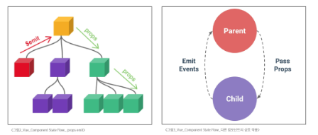
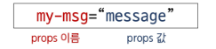
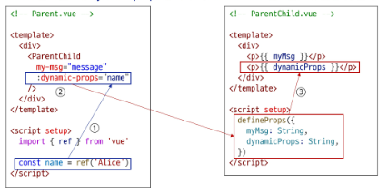
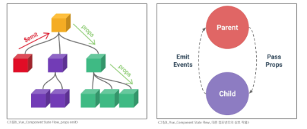
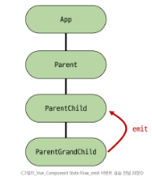
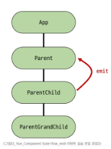

# Vue - Component State Flow
# Passing Props
## Props
### 동일한 데이터, 하지만 다른 컴포넌트
- 동일한 사진 데이터가 한 화면에 다양한 위에서 여러번 출력되고 있음
- 하지만 해당 페이지를 구성하는 컴포넌트가 여러개라면 각 컴포넌트가 개별적으로 동일한 데이터를 관리해야 할까?
- 그렇다면 사진을 변경해야 할 때 모든 컴포넌트에 대해 변경 요청을 해야 함
- 공통된 부모 컴포넌트에서 관리하자
- 부모는 자식에게 데이터를 전달(Pass Props)
- 자식은 자신에게 일어난 일을 부모에게 알림(Emit event)
#### 
### Props
- 부모 컴포넌트로부터 자식 컴포넌트로 데이터를 전달하는데 사용되는 사용자 지정 특성
- 데이터는 부모에서 자식으로 한 방향으로만 흐르며, 자식 컴포넌트는 전달받은 props를 직접 수정해서는 안됨(읽기 전용)
- 이 방식을 통해 가능한 컴포넌트를 만들고, 부모가 어떤 데이터를 전달하느냐에 따라 자식의 내용과 모습을 다르게 설정할 수 있음
### Props 특징
- 부모의 데이터가 업데이트되면 자식에게 전달되지만, 그 반대는 불가능
- 즉, 자식 컴포넌트 내부에서 props를 변경하려고 시도해서는 안되며 불가능
- 또한 부모 컴포넌트가 업데이트될 때마다 이를 사용하는 자식 컴포넌트의 모든 props가 최신값으로 업데이트 됨
- 부모 컴포넌트에서만 변경하고 이를 내려 받는 자식 컴포넌트는 자연스럽게 갱신
- 자식이 부모 속성을 바꾸려면, props를 수정하지 말고 emit을 이용해서 부모에게 알려야 함
- 객체/배열 props는 자식에서 내부 값을 바꾸면 부모의 원본도 바뀌니, 매우 주의해야 함
### One-Way Data Flow
- 모든 props는 자식 속성과 부모 속성 사이에 하향식 단방향 바인딩을 형성(one-way-down binding)
- 단방향인 이유
  - 하위 컴포넌트가 실수로 상위 컴포넌트의 상태를 변경하여 앱에서의 데이터 흐름을 이해하기 어렵게 만드는 것을 방지하기 위함(무한 루프, 디버깅 난이도 상승 등)
  - 데이터 흐름의 일관성 및 예측 가능성을 높이는 것이 목표
## Props 선언
### 사전 준비
1. vue 프로젝트 생성
2. 초기 생성된 컴포넌트 모두 삭제(App.vue 제외)
3. src/assets 내부 파일 모두 삭제
4. main.js 해당 코드 삭제
```javascript
import './assets/main/css'
```
5. App > Parent > ParentChild 컴포넌트 작성
- App 컴포넌트 작성
```vue
<!-- App.vue -->

<template>
  <div>
    <Parent />
  </div>
</template>

<script setup>
  import Parent from '@/components/Parent.vue';
</script>
```
- Parent 컴포넌트 작성
```vue
<!-- Parent -->

<template>
  <div>
    Parent
    <ParentChild />
  </div>
</template>

<script setup>
  import ParentChild from '@/components/ParentChild.vue';
</script>
```
- ParentChild 컴포넌트 작성
```vue
<!-- ParentChild.vue -->

<template>
  <div>
    ParentChild
  </div>
</template>

<script setup>

</script>
```
### Props 작성
- 부모 컴포넌트 Parent에서 자식 컴포넌트 ParentChild에 보낼 props 작성
#### 
```vue
<!-- Parent.vue -->

<template>
  <div>
    Parent
    <ParentChild my-msg="message"/>
  </div>
</template>
```
### Props 선언
- 부모 컴포넌트에서 내려보낸 props를 사용하기 위해서는 자식 컴포넌트에서 명시적인 props 선언이 필요
- defineProps()를 사용하여 props를 선언
- defindProps()에 전달하는 인자의 형태에 따라 선언 방식이 나뉨
  1. 문자열 배열을 사용한 선언
  2. 객체를 사용한 선언
```vue
<!-- ParentChild.vue -->

<script setup>
  defineProps()
</script>
```
1. 문자열 배열을 사용한 선언
    - 배열의 문자열 요소로 props 선언
    - 문자열 요소의 이름은 전달된 props의 이름
```vue
<!-- ParentChild.vue -->

<script setup>
  defineProps(['myMsg'])
</script>
```
2. 객체를 사용한 선언
    - 각 객체 속성의 키가 전달받은 props 이름이 됨
    - 객체 속성의 값은 해당 데이터의 타입에 맞는 생성자 함수(String, Number 등)이어야 함
#### ※ 가급적 객체를 사용한 선언을 사용하는 것을 권장
- 각 prop에 대해 상세한 규칙(유효성 검사)를 설정하여 컴포넌트의 안정성을 높여줌
- 객체 구문은 그 자체로 컴포넌트의 설명서 역할을 하므로, 코드를 통해 명확하게 의사소통 가능
```vue
<!-- ParentChild.vue -->

<script setup>
  defineProps({
    myMsg: String
  })
</script>
```
### props 데이터 사용
- props 선언 후 템플릿에서 반응형 변수와 같은 방식이나 JS에서 props를 객체로 접근 가능
```vue
<!-- ParentChild.vue -->

<template>
  <div>
    <!-- 템플릿에서 활용해야 하는 경우 -->
    {{  myMsg  }}
  </div>
</template>

<script setup>
  // JS에서 props 데이터를 활용해야 하는 경우
  const props = defineProps({
    myMsg: String
  })
  console.log(props)
  console.log(props.myMsg)
</script>
```
```vue
<!-- Parent.vue -->

<template>
  <div>
    Parent
    <ParentChild my-msg="messageTest"/>
  </div>
</template>
```
### 한 단계 더 prop 내려 보내기
- ParentChild 컴포넌트를 부모로 갖는 ParentGrandChild 컴포넌트 생성
```vue
<!-- ParentGrandChild.vue -->

<template>
  <div>
  </div>
</template>

<script setup>
</script>
```
- ParentGrandChild 컴포넌트를 ParentChild 컴포넌트에 등록
```vue
<!-- ParentChild.vue -->

<template>
  <div>
    ParentChild
    {{  myMsg  }}
    <ParentGrandChild />
  </div>
</template>

<script setup>
  import ParentGrandChild from '@/components/ParentGrandChild.vue';
  defineProps({
    myMsg: String
  })

</script>
```
- ParentChild 컴포넌트에서 Parent로 부터 받은 props인 myMsg를 ParentGrandChild에게 전달(v-bind를 사용한 동적 props)
```vue
<!-- ParentChild.vue -->

<template>
  <div>
    ParentChild
    {{  myMsg  }}
    <ParentGrandChild :my-msg="myMsg"/>
  </div>
</template>

<script setup>
  import ParentGrandChild from '@/components/ParentGrandChild.vue';
  defineProps({
    myMsg: String
  })

</script>
```
- ParentChild 컴포넌트에서 ParentGrandChild로 전달한 my-msg를 props 선언 후 접근
```vue
<!-- ParentGrandChild.vue -->

<template>
  <div>
    ParentGrantChild
    {{ myMsg }}
  </div>
</template>

<script setup>
defineProps({
    myMsg: String
  })
</script>
```
- 출력 결과 확인
  - ParentGrantChild가 받아서 출력하는 props는 Parent에 정의되어있는 props이며, Parent가 props를 변경할 경우 이를 전달받고 있는 ParentChild, ParentGrantChild에서도 모두 업데이트 됨
## Props 세부사항
1. Props Name Casing(Props 이름 컨벤션)
2. Static Props와 Dynamic Props
### 1. Props Name Casing
- 부모 템플릿에서 전달시(HTML 속성) -> kebab-case(my-msg)
```vue
<ParentChild my-msg="messageTest"/>
```
- 자식 스크립트에서 선언 시(JavaScript) -> camelCase(myMsg)
```vue
<template>
  <div>
    ParentChild
    {{  myMsg  }}
  </div>
</template>

<script setup>
  defineProps({
    myMsg: String
  })

</script>
```
### 2. Static Props & Dynamic Props
- 지금까지 작성한 것은 Static(정적) props
- v-bind를 사용하여 동적으로 할당된 props를 사용할 수 있음
- Parent 컴포넌트에 Dynamic props 정의하고, ParentChild 컴포넌트에 선언 및 출력
#### 
#### ※ 동적 할당
- 고정된 값을 전달하는 것이 아닌, 바뀌는 데이터를 연결하는 것
- 이는 곧 부모의 데이터와 자식의 속성을 실시간으로 연결하는 것을 의미
## Props 활용
### v-for와 함께 사용하여 반복되는 요소를 props로 전달하기
- ParentItem 컴포넌트 생성 및 Parent의 하위 컴포넌트로 등록
```vue
<!-- ParentItem.vue -->

<template>
  <div>
    ParentItem
  </div>
</template>

<script setup>

</script>

<style scoped>

</style>
```
```vue
<!-- Parent.vue -->

<template>
  <div>
    <ParentItem />
  </div>
</template>

<script setup>
import ParentItem from '@/components/ParentItem.vue';
</script>
```
- 데이터 정의 및 v-for 디렉티브의 반복 요소로 활용
- 각 반복 요소를 props로 내려 보내기
```vue
<!-- Parent.vue -->

<script setup>
import {ref} from 'vue'
import ParentItem from '@/components/ParentItem.vue';

const items = ref([
  { id: 1, name: '사과' },
  { id: 2, name: '바나나' },
  { id: 3, name: '딸기'},
])
</script>
```
```vue
<!-- Parent.vue -->

<template>
  <div>
    <ParentItem
      v-for="item in items"
      :key="item.id"
      :my-prop="item"
    />
  </div>
</template>
```
```vue
<!-- ParentItem.vue -->

<template>
  <div>
    <p>{{ myProp.id }}</p>
    <p>{{ myProp.name }}</p>
  </div>
</template>

<script setup>
defineProps({
  myProp: Object
})
</script>
```
# Component Events
## Emit
### 동일한 데이터, 하지만 다른 컴포넌트
- 부모는 자식에게 데이터를 전달(Pass Props)
- 자식은 자신에게 일어난 일을 부모에게 알림(Emit event)
#### 
### Emit
- $emit()
- 자식 컴포넌트가 이벤트를 발생시켜 부모 컴포넌트로 데이터를 전달하는 메서드
- 내려가는 데이터 흐름인 Props와 반대로 올라가는 이벤트를 만들어, 컴포넌트 간의 완전한 상호작용을 가능하게 함
### emit 메서드
- ```$emit(event, ...args)```
- 자식 컴포넌트가 이벤트를 발생시켜 부모 컴포넌트에게 신호를 보내고 데이터를 전달하는 기능
- event
  - 커스텀 이벤트 이름
- args
  - 추가 인자
- $ 표기
  - Vue 인스턴스의 내부 변수들을 가리킴
  - Life cycle hooks, 인스턴스 메서드 등 내부 특정 속성에 접근할 때 사용
## 이벤트 발신 및 수신(Emitting and Listening to Events)
1. $emit을 사용하여 템플릿 표현식에서 직접 사용자 정의 이벤트를 발신
```vue
<!-- 자식 컴포넌트 -->

<button @click="$emit('someEvent')">클릭</button>
```
2. 부모 컴포넌트에서는 v-on(또는 @)을 사용하여 이벤트를 수신할 수 있음
```vue
<!-- 부모 컴포넌트 -->

<ParentComp @some-event="someCallback" />
```
### 이벤트 발신 및 수신하기
- ParentChild에서 someEvent라는 이름의 사용자 정의 이벤트를 발신
```vue
<!-- ParentChild.vue -->

<template>
  <div>
    <button @click="$emit('someEvent')">클릭</button>
  </div>
</template>
```
- ParentChild의 부모 Parent는 v-on을 사용하여 발신된 이벤트를 수신
- 수신 후 처리할 콜백함수 호출
```vue
<!-- Parent.vue -->

<template>
  <div>
    <ParentChild
      @some-event="someCallback"
      my-msg="message"
      :dynamic-props="name"
    />
  </div>
</template>

<script setup>
import ParentChild from '@/components/ParentChild.vue';

const someCallback = function () {
  console.log("ParentChild의 이벤트 수신함")
}
</script>
```
## emit 이벤트 선언
- defineEmits()를 사용하여 발신할 이벤트를 선언
- props와 마찬가지로 defineEmits()에 작성하는 인자의 데이터 타입에 따라 선언 방식이 나뉨
  - 배열
  - 객체(가급적 객체를 활용한 선언을 추천)
- defineEmits()는 '\<script setup>' 내에서 이벤트를 발신하기 위한 emit 함수를 반환(템플릿의 $emit과 달리 '\<script setup>'에서는 직접 접근할 수 없기 때문)
### emit 이벤트 선언 활용
- 이벤트 선언 방식으로 추가 버튼 작성 및 결과 확인
```vue
<!-- ParentChild.vue -->

<template>
  <div>
    <button @click="buttonClick">클릭</button>
  </div>
</template>

<script setup>
const emit = defineEmits(['someEvent'])

const buttonClick = function () {
  emit('someEvent')
}
</script>
```
```vue
<!-- Parent.vue -->

<template>
  <div>
    <ParentChild
      @some-event="someCallback"
      my-msg="message"
      :dynamic-props="name"
    />
  </div>
</template>

<script setup>
import ParentChild from '@/components/ParentChild.vue';

const someCallback = function () {
  console.log("ParentChild의 이벤트 수신함")
}
</script>
```
## emit 이벤트 전달
### 이벤트 인자(Event Arguments)
1. ParentChild에서 이벤트를 발신하여 Parent로 추가 인자 전달하기
```vue
<!-- 자식 컴포넌트 -->

const emit = defineEmits(['emitArgs'])

const emitArgs = function () {
  emit('emitArgs', 1, 2, 3)
}
```
2. ParentChild에서 발신한 이벤트를 Parent에서 수신
```vue
<!-- 부모 컴포넌트 -->

const getNumbers = functions(...args) {
  console.log(args)
  console.log(`ParentChild가 전달한 추가 인자 ${args} 수신`)
}
```
### 이벤트 인자 전달 활용
1. ParentChild에서 이벤트를 발신하여 Parent로 추가 인자 전달하기
```vue
<!-- ParentChild.vue -->

<template>
  <div>
    <button @click="emitArgs">추가 인자 전달</button>
  </div>
</template>

<script setup>
const emit = defineEmits(['emitArgs'])

const emitArgs = function () {
  emit('emitArgs', 1, 2, 3)
}
</script>
```
2. ParentChild에서 이벤트를 발신하여 Parent로 추가 인자 전달하기
```vue
<!-- Parent.vue -->

<template>
  <div>
    <ParentChild
      @emit-args="getNumbers"
    />

  </div>
</template>

<script setup>
import ParentChild from '@/components/ParentChild.vue';

const getNumbers = function (...args) {
  console.log(args)
  console.log(`ParentChild가 전달한 추가인자 ${args} 수신함`)
}
</script>
```
## 이벤트 세부사항
### Event Name Casing
- 선언 및 발신시(camelCase)
- 부모 컴포넌트에서 수신시(kebab-case)
## emit 이벤트 활용
### emit 이벤트 실습
- 목표: 최하단 컴포넌트 ParentGrandChild에서 Parent 컴포넌트의 name 변수 변경 요청하기
1. ParentGrandChild에서 이름 변경을 요청하는 이벤트 발신
```vue
<!-- ParentGrandChild.vue -->

<template>
  <div>
    <button @click="updateName">이름 변경</button>
  </div>
</template>

<script setup>
const emit = defineEmits(["updateName"])

const updateName = function () {
  emit('updateName')
}
</script>
```
#### 
2. 이벤트 수신 후 이름 변경을 요청하는 이벤트 발신
```vue
<!-- ParentChild.vue -->

<template>
  <div>
    <ParentGrandChild
      :my-msg="myMsg"
      @update-name="updateName"/>
  </div>
</template>

<script setup>
  import ParentGrandChild from '@/components/ParentGrandChild.vue';

const emit = defineEmits(['someEvent', 'emitArgs', 'updateName'])

const updateName = function () {
  emit('updateName')
}
</script>
```
#### 
3. 이벤트 수신 후 이름 변수 변경 메서드 호출(해당 변수를 props로 받는 모든 곳에서 자동 업데이트)
```vue
<!-- Parent.vue -->

<template>
  <div>
    {{ name }}
    <ParentChild
      @update-name="updateName"
    />
  </div>
</template>

<script setup>
import {ref} from 'vue'
import ParentChild from '@/components/ParentChild.vue';

const name = ref("Alice")

const updateName = function () {
  name.value = 'Bella'
}
</script>
```
# 참고
## 정적 & 동적 props 주의사항
- 첫번째는 정적 props로 문자열 "1"을 전달
- 두번째는 동적 props로 숫자 1을 전달
```vue
<!-- 1 -->

<SomeComponent num-props="1" />

<!-- 2 -->

<SomeComponent :num-props="1" />
```
## Props & Emit 객체 선언 문법
### Props 선언시 객체 선언 문법을 권장하는 이유
- 컴포넌트의 의도를 명확히 하여 가독성을 높이고, 다른 개발자가 잘못된 타입의 데이터를 전달했을 때 콘솔에 경고를 출력하여 실수를 방지
- 추가로 props에 대한 유효성 검사로써 활용 가능
```vue
defineProps({
  // 여러 타입 활용
  propB: [String, Number],
  // 문자열 함수
  propC: {
    type: String,
    required: true
  },
  // 기본값을 가지는 숫자열
  propD: {
    type: Number,
    default: 10
  }, ...
})
```
### emit 이벤트도 객체 선언 문법으로 작성 가능
- emit 이벤트 또한 객체 구문으로 선언된 경우 유효성을 검사할 수 있음
```vue
const emit = defineEmits({
  // 유효성 검사 없음
  click: null,      // submit 이벤트 유효성 검사
  submit: ({ email, password }) => {
    if (email && password) {
      return true
    } else {
      console.warn('submit 이벤트가 옳지 않음')
      return false
    }
  }
})

const submitForm = function (email, password) {
  emit('submit', { email, password })
}
```