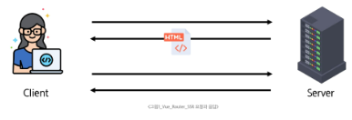
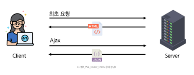
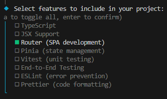
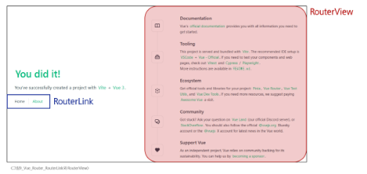
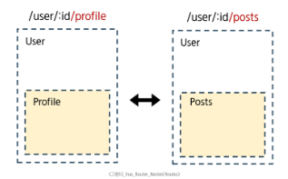
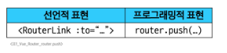
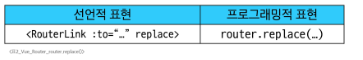
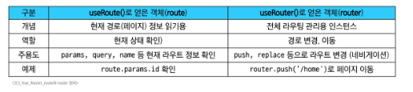

# Vue - Router
# Routing
## Routing
- 네트워크에서 경로를 선택하는 프로세스
- 사용자가 접속한 URL 주소에 따라 적절한 페이지(컴포넌트)를 보여주는 기능
- /home 주소는 Home 컴포넌트로, /about 주소는 About 컴포넌트로 연결하는 등 미리 정의된 경로에 따라 어떤 내용을 보여줄지 결정
### SSR에서의 Routing
- SSR에서 routing은 서버 측에서 수행
- 서버가 사용자가 방문한 URL 경로를 기반으로 응답을 전송
- 링크를 클릭하면 브라우저는 서버로부터 HTML 응답을 수신하고 새 HTML로 전체 페이지를 다시 로드
#### 
### CSR에서의 Routing
- CSR에서의 routing은 클라이언트 측(브라우저)에서 수행
- 클라이언트 측 JavaScript가 새 데이터를 동적으로 가져와 전체 페이지를 다시 로드하지 않음
#### 
### SPA에서 Routing이 없다면
- 유저가 URL을 통한 페이지의 변화를 감지할 수 없음
- 페이지가 무엇을 렌더링 중인지에 대한 상태를 알 수 없음
  - URL이 1개이기 때문에 새로고침 시 처음 페이지로 되돌아감
  - 링크를 공유할 시 첫 페이지만 공유 가능
- 브라우저의 뒤로가기 기능을 사용할 수 없음
- 페이지는 1개이지만, 주소에 따라 여러 컴포넌트를 새로 렌더링하여 마치 여러 페이지를 사용하는 것처럼 보이도록 해야 함
# Vue Router
- Vue 공식 라우터(The official Router for Vue.js)
- Vue.js의 공식 라우팅 라이브러리로, Vue로 만든 SPA에서 페이지 이동 기능을 구현할 때 사용됨
- 페이지를 새로고침하지 않는 링크를 만드는 '\<router-view>'라는 핵심 컴포넌트를 제공
- 어떤 URL 경로에 어떤 컴포넌트를 보여줄지 정의하기만 하면, Vue Router가 연결해 줌
## 사전 준비
- Vite로 프로젝트 생성시 Router 추가
#### 
- 서버 실행 후 Router로 인한 프로젝트 변화 확인
- Home, About 링크에 따라 변경되는 URL과 새로 렌더링되는 화면
## Vue 프로젝트 구조 변화
1. App.vue 코드 변화
2. router 폴더 신규 생성
3. views 폴더 신규 생성
### 1. App.vue 코드 변화: RouterLink
- 페이지를 다시 로드하지 않고 URL을 변경하여 URL 생성 및 관련 로직을 처리
- HTML의 '\<a>' 태그를 렌더링
```vue
<template>
  <header>
    <div class="wrapper">
      <HelloWorld msg="You did it!" />

      <nav>
        <RouterLink to="/">Home</RouterLink>
        <RouterLink to="/about">About</RouterLink>
      </nav>
    </div>
  </header>

  <RouterView />
</template>
```
#### 
- RouterLink URL에 해당하는 컴포넌트를 표시
- 원하는 곳에 배치하여 컴포넌트를 레이아웃에 표시할 수 있음
### 2. router/index.js
- 라우팅에 관련된 정보 및 설정이 작성되는 곳
- 웹 사이트 여러 페이지들의 주소 목록을 작성('/', 'home', ...)
- 각 주소로 접속했을 때, 어떤 Vue 컴포넌트(페이지 화면)를 보여줄 지 연결
- 프로젝트 규모가 작을 때는 index.js 하나로 관리해도 충분
- 프로젝트 규모가 커질 때는 기능별로 경로 관리를 하고, index.js에서 합치는 방식으로 운영
### 3. views
- RouterView 위치에 렌더링할 컴푸넌트를 배치
- 기존 components 폴더와 기능적으로 다른 것은 없으며 단순 분류의 의미로 구성됨
- 일반 컴포넌트와 구분하기 위해 컴포넌트 이름을 View로 끝나도록 작성하는 것을 권장
## Basic Routing
### 라우팅 기본 동작 순서
1. index.js에 라우터 관련 설정 작성
2. RouterLink에 index에 정의한 주소값 작성
3. RouterLink 클릭 시 경로와 일치하는 컴포넌트가 RouterView에서 렌더링
### 라우팅 기본 동작 살펴보기
1. index.js에 라우터 관련 설정 작성(주소, 이름, 컴포넌트)
```javascript
// index.js

const router = createRouter({
  history: createWebHistory(import.meta.env.BASE_URL),
  routes: [
    {
      path: '/',
      name: 'home',
      component: HomeView,
    }, ...
  ],
})
```
2. RouterLink의 to 속성으로 index.js에서 정의한 주소값(path)을 사용
```vue
<!-- App.vue -->

<template>
  <header>
    <div class="wrapper">
      <HelloWorld msg="You did it!" />

      <nav>
        <RouterLink to="/">Home</RouterLink>
        <RouterLink to="/about">About</RouterLink>
      </nav>
    </div>
  </header>

  <RouterView />
</template>
```
3. RouterLink 클릭 시 경로와 일치하는 컴포넌트가 RouterView에서 렌더링 됨
## Named Routes
### path 경로를 그대로 사용하기
- 현재는 index.js에서 입력한 path 경로를 그대로 RouterLink에 사용하고 있음
- 이 방식은 URL 경로를 변경할 때, 해당 경로를 사용한 모든 파일을 일일이 찾아다니며 사용해야 하는 단점이 있음(유지보수 난이도 증가)
- name 속성 값에 경로에 대한 이름을 지정
- 경로에 연결하려면 RouterLink에 v-bind를 사용해 to props 객체로 전달 가능
- 하드 코딩된 URL을 사용하지 않아도 되며, 오타를 방지할 수 있음
```javascript
// index.js

```
```vue
<!-- App.vue -->

<RouterLink :to="{ name:'home' }">Home</RouterLink>
<RouterLink :to="{ name: 'about' }">About</RouterLink>
```


## Dynamic Route Matching
### 일정한 패턴의 URL 작성을 반복해야 하는 경우
- 주어진 패턴의 여러 경로를 하나의 컴포넌트에 매핑해야 하는 경우는 어떻게 할까?
- 예) 모든 사용자의 ID를 활용하여 프로필 페이지 URL을 설계
  - user/1
  - user/2
  - user/3
  - 일정한 패턴의 URL 작성을 반복해야 함
- 이럴 때 사용하는 것이 바로 Dynamic Route Matching
### Dynamic Route Matching
- URL의 일부를 변수로 사용하여 경로를 동적으로 매칭
- 동적 라우트 매칭은 패턴은 같지만 ID 값만 다른 여러 URL을 하나의 라우트 설정으로 처리하는 기능
- 이를 통해 수백 개의 상품 상세 페이지나 사용자 프로필 페이지를 각각 만들 필요없이, 하나의 컴포넌트를 재사용하여 효율적으로 개발할 수 있음
### 매개변수를 사용한 동적 경로 매칭 활용
- 프로필 페이지로 활용하기 위한 컴포넌트 작성하기
- views 폴더 내 UserView 컴포넌트 작성
```vue
<!-- UserView.vue -->

<template>
  <div>
    <h1>User View</h1>
  </div>
</template>
```
- 라우터 관련 설정을 하는 router/index.js 파일에 코드 작성
- 매개변수는 콜론(:)으로 표기하고, UserView 컴포넌트 라우터를 등록
```javascript
// index.js

import UserView from '@/views/UserView.vue'

const router = createRouter({
  ...
  routes: [
    {
      path: '/user/:id',
      name: 'user',
      component: UserView,
    },
  ],
})
```
- 매개변수는 객체의 params 속성의 객체 타입으로 전달
- 단, 객체의 key 이름과 index.js에서 지정한 매개변수 이름이 같아야 함
- UserView 컴포넌트로 이동하기 위한 RouterLink 작성
```vue
<!-- App.vue -->
<script setup>
import { ref } from 'vue'

const userId = ref(1)
</script>

<RouterLink :to="{ name: 'user', params: { 'id': userId } }">User</RouterLink>
```
- 경로가 일치하면 라우트 매개변수는 컴포넌트에서 $route.params로 참조가능
- 현재 사용자의 id를 출력하기
```vue
<!-- UserView.vue -->

<template>
  <div>
    <h1>User View</h1>
    <h2>{{ $route.params }}번 User 페이지</h2>
    <h2>{{ $route.params.id }}번 User 페이지</h2>
  </div>
</template>
```
- $route.params로 template에 바로 작성하는 것 보다는 useRoute() 함수를 사용해 스크립트 내에서 반응형 변수에 할당 후 템플릿에 출력하는 것을 권장
- 템플릿에서 $route를 사용하는 것과 동일
```vue
<!-- UserView.vue -->

<template>
  <div>
    <h1>User View</h1>
    <h2>{{ userId }}번 User 페이지</h2>
  </div>
</template>

<script setup>
import { ref } from 'vue'
import { useRoute } from 'vue-router'

const route = useRoute()
const userId = ref(route.params.id)
</script>
```
## Nested Routes
### 애플리케이션의 UI는 여러 레벨 깊이로 중첩된 컴포넌트로 구성되기도 함
- 이 경우, URL 또한 중첩된 컴포넌트 구조에 맞춰 표현할 수 있음
- Nested Routes
#### 
### Nested Routes
- 중첩된 라우팅
- 특정 페이지(부모)의 레이아웃은 유지한 채, 그 안의 일부 영역만 다른 내용으로 교체하는 라우팅 방식
- 사용자 페이지의 사이드바는 그대로 두고, 주된 내용 영역만, 프로필, 게시글 목록 등으로 바꿔 보여주는 대시보드 형태의 UI를 만들 때 매우 유용
### 중첩된 라우팅 활용
- 유저 프로필 내부에 중첩으로 사용할 컴포넌트 생성
- components 폴더에 UserProfile, UserPosts 컴포넌트 작성 후 라우터 등록
```vue
<!-- UserProfile.vue -->

<template>
  <div>
    <h1>User Profile</h1>
  </div>
</template>
```
```vue
<!-- UserPosts.vue -->

<template>
  <div>
    <h1>User Posts</h1>
  </div>
</template>

```
```javascript
// index.js

import UserProfile from '@/components/UserProfile.vue'
import UserPosts from '@/components/UserPosts.vue'
```
- children 옵션을 사용해 중첩된 라우터에 컴포넌트 등록
  - children 옵션은 배열 형태로 필요한 만큼 중첩 관계를 표현할 수 있음
```javascript
// index.js

{
  path: '/user/:id',
  name: 'user',
  component: UserView,
  children: [
    { path: 'profile', name: 'userProfile', component: UserProfile },
    { path: 'posts', name: 'userPosts', component: UserPosts }
  ]
},
```
- 두 컴포넌트(userProfile, userPosts)에 대한 RouterLink, RouterView 작성
- Profile과 Posts 링크를 클릭해서 렌더링 결과 확인
```vue
<!-- UserView.vue -->

<template>
  <div>
    <h1>{{ userId }} User View</h1>
    <RouterLink :to="{ name: 'userProfile' }">Profile</RouterLink>
    <RouterLink :to="{ name: 'userPosts' }">Posts</RouterLink>
    <hr>
    <RouterView />
  </div>
</template>

<script setup>
import { useRoute, RouterLink, RouterView } from 'vue-router'
</script>
```
- 중첩된 Named Routes를 다룰 때는 일반적으로 하위 경로에만 이름을 지정
- 이렇게 하면 /user/:id로 이동했을 때 항상 중첩된 경로를 바로 렌더링 가능
  - /user/:id 접속 시 바로 중첩된 경로가 표기(UserProfile)
  - 단, 이전처럼 상위 경로의 이름을 유지하는 구조로 작성해도 무관
```javascript
// index.js

{
  path: '/user/:id',
  // name: 'user',
  component: UserView,
  children: [
    { path: '', name: 'user', component: UserProfile },
    { path: 'profile', name: 'userProfile', component: UserProfile },
    { path: 'posts', name: 'userPosts', component: UserPosts }
  ]
},
```
### 중첩된 라우팅 주의사항
- 컴포넌트 간 부모-자식 관계 관점이 아닌 URL에서의 중첩된 관계를 표현하는 관점으로 바라보기
- 자식 라우트의 path는 '/' 없이 작성해야, 부모 경로 뒤에 자동으로 연결됨
- 부모 라우트 파라미터(:id)는 자식 컴포넌트에서도 바로 접근해서 사용할 수 있음


슬래시 있없 있으면 루트 없으며 ㄴ현재
## Programmatic Navigation
- '\<RouterLink>'를 사용하는 대신, JavaScript 코드를 사용해 페이지를 이동시키는 것
- router.push()와 같은 메서드를 호출하여, 원하는 경로로 강제 이동시킬 수 있음
- 프로그래밍으로 URL 이동하기
- router의 인스턴스 메서드를 사용해 RouterLink로 '\<a>' 태그를 만드는 것처럼 프로그래밍으로 네비게이션 관련 작업을 수행할 수 있음
- router의 메서드
    1. router.push(): 다른 위치로 이동하기
    2. router.replace(): 현재 위치 바꾸기
### 1. router.push()
- 다른 URL로 이동하는 메서드
- 새 항목을 history stack에 push하므로 사용자가 브라우저 뒤로가기 버튼을 클릭하면 이전 URL로 이동할 수 있음
- RouterLink를 클릭했을 때 내부적으로 호출되는 메서드이므로 RouterLink를 클릭하는 것은 router.push()를 호출하는 것과 같음
#### 
### router.push() 활용
- UserView 컴포넌트에서 HomeView 컴포넌트로 이동하는 버튼 만들기
```vue
<!-- UserView.vue -->

<template>
  <div>
    <button @click="goHome">홈으로</button>
  </div>
</template>

<script setup>
import { useRoute, useRouter } from 'vue-router'

const router = useRouter()

const goHome = function () {
  router.push({ name:'home' })
}
</script>
```
### 2. router.replace()
- 현재 위치를 바꾸는 메서드
- push 메서드와 달리 history stack에 새로운 항목을 push하지 않고 다른 URL로 이동(=== 이동 전 URL로 뒤로가기 불가)
#### 
### router.replace() 활용
- UserView 컴포넌트에서 HomeView 컴포넌트로 이동하는 버튼 만들기
```vue
<!-- UserView.vue -->

<template>
  <div>
    <button @click="goHome">홈으로</button>
  </div>
</template>

<script setup>
import { useRoute, useRouter } from 'vue-router'

const router = useRouter()

const goHome = function () {
  router.replace({ name:'home' })
}
</script>
```
### [참고] router.push의 인자 활용
- https://router.vuejs.org/guide/essentials/navigation.html
```javascript
// index.js

// literal string path
router.push('/users/alice')

// object with path
router.push({ path: '/users/alice' })

// named route with params to let the router build the url
router.push({ name: 'user', params: { username: 'alice' } })

// with query, resulting in /register?plan=private
router.push({ path: '/register', query: { plan: 'private' } })
```
# route와 router
## route
### useRoute()
- 현재 활성화된 경로 정보(route)를 담은 route 객체를 반환
- useRoute()는 컴포넌트의 setup 함수나 '\<script setup>' 최상단에서만 호출해야 함
```javascript
// UserView.vue

import { ref } from 'vue'
import { useRoute } from 'vue-router'

const route = useRoute()
const userId = ref(route.params.id)
```
### route 객체
- 현재 URL 상태를 보여주는 역할
  - route 객체 자체를 통해 페이지 이동(네비게이션)을 직접 제어할 수는 없음
- 읽기 전용이며, 현재 URL/파라미터쿼리/namd/matched 된 라우트 정보 등을 담고 있음
  - 경로 파라미터(route.params), 쿼리(route.query), name(route.name) 등을 통해 현재 페이지 상태를 알 수 있음
- 반응형이며, URL이 변경되면 route 객체도 자동으로 변경됨
  - 예) route.params.id를 참조하고 있다면, URL이 바뀌어 id가 변경될 때 해당 값이 자동으로 반영됨
## router
### useRouter()
- 라우터 인스턴스 router 객체를 반환
- useRouter는 페이지 이동 등 액션용, useRoute는 경로 정보 읽기용으로 역할이 다름
```javascript
// UserView.vue

import { useRoute, useRouter } from 'vue-router'

const router = useRouter()

const goHome = function () {
  router.push({ name:'home' })
}
```
### router 객체
- 애플리케이션 전체 라우팅 로직을 제어할 수 있는 핵심 객체
- 페이지 이동, 내비게이션 관련 메서드 제공
  - router.push('~'), router.replace('~') 등을 통해 프로그래밍적으로 라우트를 변경할 수 있음
- 내비게이션 가드 등록, 히스토리 제어 같은 기능 사용 가능
### route와 router 정리
- useRoute()
  - 현재 라우트 상태를 읽어오는 전용 객체
- useRouter()
  - 라우팅 로직 제어 및 페이지 이동을 담당하는 인스턴스
#### 
# Navigation Guard
- Vue router를 통해 특정 URL에 접근할 때 다른 URL로 redirect를 하거나 취소하여 내비게이션을 보호
- 특정 URL로 이동하기 전이나 후에 실행되는 기능
- 라우트 전환 전/후에 자동으로 실행되며 사용자의 로그인 상태나 권한을 확인하여, 내비게이션을 허용하거나, 취소하거나, 다른 페이지로 리다이렉트 시킬 수 있음
- 주로 로그인하지 않은 사용자가 마이페이지에 접근하는 것을 막고 로그인 페이지로 보내는 등, 인증 기반의 라우팅 로직을 구현할 때 사용됨
## Navigation Guard 종류
1. Globally(전역 가드)
    - 애플리케이션 전역에서 모든 라우트 전환에 적용되는 가드
2. Per-route(라우터 가드)
    - 특정 라우트에만 적용되는 가드
3. in-component(컴포넌트 가드)
    - 컴포넌트 내에서만 적용되는 가드
## 1. Globally Guard(전역 가드)
- 애플리케이션 전역에서 동작하는 가드(작성 위치: index.js)
- Globally Guard 종류
  1. beforeEach()
  2. beforeResolve()
  3. afterEach()
### 1.1 Globally Guard: beforeEach() 구조
- 다른 URL로 이동하기 직전에 실행되는 함수(Global Before Guards)
- 모든 가드의 콜백 함수는 2개의 인자를 받음
  - to: 이동할 URL 정보가 담긴 Route 객체
  - from: 현재 URL 정보가 담긴 Route 객체
- 선택적으로 다음 값 중 하나를 반환
  1. false
      - 현재 내비게이션을 취소
      - 브라우저 URL이 변경된 경우(사용자가 수동으로 또는 뒤로가기 버튼을 통해) from 경로의 URL로 재설정
  2. Route Location
      - router.push()를 호출하는 것처럼 경로 위치를 전달하여 다른 위치로 redirect
      - return이 없다면 자동으로 to URL Route 객체로 이동
```javascript
router.beforeEach((to, from) => {
  ...
  return false 또는 return { name: 'About' }
}
```
### 1.1 Globally Guard: beforeEach() 예시
- 전역 가드 beforeEach 작성
- HomeView에서 UserView로 이동했을 때 각 인자 값 출력 확인하기
- to에는 이동할 URL인 user 라우트에 대한 정보가, from에는 현재 URL인 home 라우트에 대한 정보가 들어있음
```javascript
// index.js

router.beforeEach((to, from) => {
  consol

})
```
```text
to -> {fullPath: '/user/1', hash: '', query: {…}, name: 'user', path: '/user/1', …}
from -> {fullPath: '/', hash: '', query: {…}, name: 'home', path: '/', …}
```
### 1.1 Globally Guard: beforeEach() 활용
- Login이 되어있지 않다면 페이지 진입을 막고 Login 페이지로 이동시키기
- 만약 로그인이 되어있지 않고, 이동하는 주소 이름이 login이 아니라면 login 페이지로 redirect
```vue
<!-- LoginView.vue -->

<template>
  <div>
    <h1>LoginView</h1>
  </div>
</template>
```
```javascript
// index.js

router.beforeEach((to, from) => {
  const isAuthenticated  = false

  // 로그인이 되어있지 않고, 이동하고자하는 페이지가 login이 아니라면
  if (!isAuthenticated && to.name !== 'login') {
    console.log('로그인이 필요합니다.')
    return { name: 'login' }
  }
})
```
```vue
<!-- App.vue -->

<RouterLink :to="{ name: 'login' }">Login</RouterLink>
```
### 1.2 Globally Guard: befoResolve()
- beforeEach와 모든 컴포넌트 단위 가드가 실행된 후, 내비게이션이 확정되기 직전에 호출
- 모든 비동기 컴포넌트가 로드되고, 모든 가드가 통과된 상태에서 마지막으로 무언가를 확인하고 싶을 때 사용
- 주로 사용하는 예시
  - 페이지에 진입하기 전에, 사용자의 권한과 관련된 데이터를 미리 가져오는 등의 작업에 사용
- 비교적 사용 빈도가 beforeEach보다 낮음
### 1.3 Globally Guard: afterEach()
- 내비게이션이 완전히 확정된 후, 즉 URL이 변경되고 화면 렌더링이 끝난 뒤에 호출
- 이미 이동이 완료된 상태이므로, 내비게이션을 중단시키거나 변경할 수 없음
- 주로 사용하는 예시
  - 페이지 이동 기록을 logging하거나, 이동한 페이지에 맞춰 문서의 제목(document.title)을 변경하는 등 후처리 작업에 적합
## 2. Per-route Guard(라우터 가드)
- 특정 라우트(경로)에 진입할 때만 실행되도록 라우트 설정 객체에 직접 정의하는 가드(작성 위치: index.js의 각 routes)
- 주로 beforeEnter 가드를 많이 사용
- 단순히 URL의 매개변수나 쿼리 값이 변경될 때는 실행되지 않고, 다른 URL에서 탐색해 올 때만 실행됨
```javascript
routes: [
  {
    path: '/user/:id',
    name: 'user',
    component: UserView,
    beforeEnter: (to, from) => {
      if (isAuthenticated === true) {
        ..., 
        return false
      }
    }
  }, ...],
```
### 2. Per-route Guard: beforeEnter() 예시
- 라우터 가드 beforeEnter 작성
- HomeView에서 LoginView로 이동 후 각 인자 값 출력 확인하기
- to에는 이동할 URL인 login 라우트에 대한 정보, from에는 현재 URL인 home 라우트에 대한 정보가 있음
- 다른 경로에서 login 라우트를 탐색했을 때 실행된 것
```javascript
// index.js

routes: [
  {
    path: '/login',
    name: 'login',
    component: LoginView,
    beforeEnter: (to, from) => {
      if (isAuthenticated === true) {
        console.log('이미 로그인 상태입니다.')
        return { name: 'home' }
      }
    }
  }
],
```
### 2. Per-route Guard: beforeEnter() 활용
- 이미 로그인한 상태라면 LoginView 진입을 막고 HomeView로 이동시키기
- 로그인 상태라면 HoneView로 이동, 로그인 상태가 아니라면 LoginView로 이동
```javascript
// index.js

const isAuthenticated = true

const router = createRouter({
  routes: [
    {
      path: '/login',
      name: 'login',
      component: LoginView,
      beforeEnter: (to, from) => {
        if (isAuthenticated === true) {
          console.log('이미 로그인 상태입니다.')
          return { name: 'home' }
        }
      }
    }, ... ]})

```
## 3. In-component Guard(컴포넌트 가드)
- 특정 컴포넌트 내에서만 동작하는 가드(작성 위치: 각 컴포넌트의 '\<script>' 내부)
- In-component Guard 종류
  - onBeforeRouteLeave()
    - 현재 라우트에서 다른 라우트로 이동하기 전에 실행
    - 사용자가 현재 페이지를 떠나는 동작에 대한 로직을 처리
  - onBeforeRouteUpdate()
    - 이미 렌더링 된 컴포넌트가 같은 라우트 내에서 업데이트 되기 전에 실행
    - 라우트 업데이트 시 추가적인 로직을 처리
### 3.1 In-component Guard: onBeforeRouteLeave 활용
- 사용자가 UserView를 떠날 시 팝업 창 출력하기
```vue
<!-- UserView.vue -->

<script setup>
import { onBeforeRouteLeave } from 'vue-router'

onBeforeRouteLeave((to, from) => {
  const answer = window.confirm('정말 떠나실 건가요?')
  if (answer === false) {
    return false
  }
})
</script>
```
### 3.2 In-component Guard: onBeforeRouteUpdate 활용
- UserView 페이지에서 다른 id를 가진 User의 UserView 페이지로 이동하기
- 같은 라우트 내에서 업데이트되는 경우(/user/1/user/100)
```vue
<!-- UserView.vue -->

<template>
  <div>
    <h1>UserView</h1>
    <button @click="routeUpdate">100번 유저 페이지</button>
  </div>
</template>

<script setup>
import { onBeforeRouteUpdate } from 'vue-router'

const routeUpdate = function () {
  router.push({ name: 'user', params: { id: 100 } }) 
}

onBeforeRouteUpdate((to, from) => {
  userId.value = to.params.id
})
</script>
```
- 만약 onBeforeRouteUpdate를 사용하지 않았다면?
- onBeforeRouteUpdate에서 userId를 변경하지 않으면 userId는 갱신되지 않음(컴포넌트가 되었기 때문)
```vue
<!-- UserView.vue -->
<script setup>
onBeforeRouteLeave((to, from) => {
  userId.value = to.params.id
})
</script>
```
### Navigation Guard 정리
1. Globally(전역 가드)
  - 애플리케이션 전역에서 동작
  - 작성 위치: index.js
2. Per-route(라우터 가드)
  - 특정 route에서만 동작
  - 작성 위치: index.js의 각 routes
3. In-component(컴포넌트 가드)
  - 특정 컴포넌트 내에서만 동작
  - 작성 위치: 각 컴포넌트의 script
# 참고
## Lazy Loading Routes
- Vue 애플리케이션 첫 빌드 시 해당 컴포넌트를 로드하지 않고, 해당 경로를 처음으로 방문할 때 컴포넌트를 로드하는 것
  - 빌드할 때 처음부터 모든 컴포넌트를 준비하면 컴포넌트의 크기에 따라 페이지 로드 시간이 길어질 수 있기 때문
```javascript
// index.js

{
  path: '/about',
  name: 'about',
  // route level code-splitting
  // this generates a separate chunk (About.[hash].js) for this route
  // which is lazy-loaded when the route is visited.
  component: () => import('../views/AboutView.vue'),
},
```